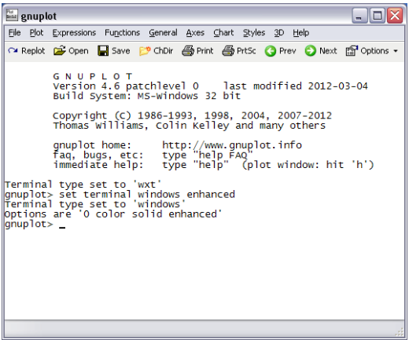
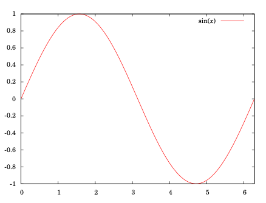
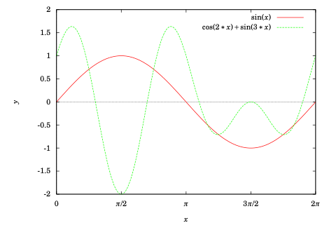

.. _appendix b:

Appendix B
===============

Graphing with Gnuplot
-----------------------

Gnuplot is a free, open-source software package for producing a variety of graphs. Versions are
available for many operating systems. Below is a very brief tutorial on how to use Gnuplot to graph
trigonometric functions.

INSTALLATION
~~~~~~~~~~~~~~~~

#. Go to http://www.gnuplot.info/download.html and follow the links to download the latest version for your operating system. For Windows, you should download the setup file with a name such as ``gp460-win32-setup.exe``, which is version 4.6.0. All the examples discussed here will assume at least version 4.6.0, though they should work with earlier 4.x versions.
#. Install the downloaded file. For example, in Windows you would run the setup file you downloaded in Step 1, which installs Gnuplot in the ``C:\symbol{92}Program Files\gnuplot`` folder by default. You can accept the defaults during installation, though you should select the  "Create a desktop icon" option in the **Select Additional Tasks** screen.
#. (Optional) Read the documentation at http://gnuplot.info/documentation.html.

RUNNING GNUPLOT
~~~~~~~~~~~~~~~~~~

#. In Windows, run ``wgnuplot.exe`` from the ``bin`` folder where you installed Gnuplot (the default location is ``C:\Program Files\gnuplot\bin\wgnuplot.exe`` ), or double-click the desktop icon if you selected that option during the installation. In Linux, just type ``gnuplot`` in a terminal window.
#. You should now get a Gnuplot terminal with a ``gnuplot>`` command prompt. In Windows this will appear in a new window, as shown in the picture on the next page. In Linux it will appear in the terminal window where the ``gnuplot`` command was run. For Windows, if the font is unreadable you can change it by right-clicking on the text part of the Gnuplot window and selecting the "Choose Font.." option. For example, the font "Courier", style "Regular", size "12" is usually a good choice (that choice can be saved for future sessions by right-clicking in the Gnuplot window again and selecting the option to update wgnuplot.ini).
#. At the ``gnuplot>`` command prompt you can now run graphing commands, which we will now describe.

**GRAPHING FUNCTIONS**

The usual way to create graphs in Gnuplot is with the **plot** command:

.. math::

 \texttt{plot <range> <comma-separated list of functions>}

For a function :math:`y=f(x)`, *<range>* is the range of :math:`x` values (and optionally the range of :math:`y` values) over which to plot. To specify an :math:`x` range, use an expression of the form :math:`[a:b]`, for some numbers :math:`a<b`. This will cause the graph to be plotted for :math:`a\le x\le b`.

To specify an :math:`x` range and a :math:`y` range, use an expression of the form :math:`[a:b]` :math:`[c:d]`, for some numbers :math:`a<b` and :math:`c<d`. This will cause the graph to be plotted for :math:`a\le x\le b` and :math:`c\le y \le d`.

Function definitions use the :math:`x` variable in combination with mathematical operators, listed below:

.. list-table::

    * - **Symbol**
      - **Operation**
      - **Example**
      - **Result**
    * - :math:`+`
      - Addition
      - :math:`2 + 3`
      - :math:`5`
    * - :math:`-`
      - Subtraction
      - :math:`3 - 2`
      - :math:`1`
    * - \*
      - Multiplication
      - :math:`2`*`3`
      - :math:`6`
    * - :math:`/`
      - Division
      - :math:`4/2`
      - :math:`2`
    * - \*\*
      - Power
      - :math:`2` \*\* :math:`3`
      - :math:`2^3 = 8`
    * - exp(:math:`x`)
      - :math:`e^x`
      - exp(:math:`2`)
      - :math:`e^2`
    * - log(:math:`x`)
      - :math:`\ln x`
      - log(:math:`2`)
      - :math:`\ln 2`
    * - sin(:math:`x`)
      - :math:`\sin x`
      - sin(pi/:math:`2`)
      - :math:`1`
    * - cos(:math:`x`)
      - :math:`\cos x`
      - cos(pi)
      - :math:`-1`
    * - tan(:math:`x`)
      - :math:`\tan x`
      - tan(pi/:math:`4`)
      - :math:`1`
  

Note that we use the special keyword "pi" to denote the value of :math:`\pi`.

.. admonition:: Example B.1.

To graph the function :math:`y=\sin\;x` from :math:`x=0` to :math:`x=2\pi`, type this at the **gnuplot** prompt:

.. math::

    \texttt{plot [0:2*pi] sin(x)}

The result is shown below:

Notice that the :math:`x`-axis is labeled with integers. To get the :math:`x`-axis labels with fractions of :math:`\pi`, you need to modify the *terminal* setting. In Windows, you would do this:

.. math::

    \texttt{set terminal windows enhanced}

In Linux you would do this:

.. math::

    \texttt{set terminal wxt enhanced}

You can then (provided the Symbol font is installed, which it usually is) set the :math:`x`-axis to have multiples of :math:`\pi/2` from :math:`0` to :math:`2\pi` as labels with this command (all on one line):

.. math::

    \begin{gather*}
    \texttt{set xtics ('0' 0,'\{/Symbol p\}/2' pi/2,'\{/Symbol p\}' pi,'3\{/Symbol p\}/2' 3*pi/2,}\\
    \texttt{'2\{/Symbol p\}' 2*pi)}
    \end{gather*}

In the above example, to also plot the function :math:`y=\cos\;2x + \sin\;3x` on the same graph, put a comma after the first function then append the new function:

.. math::

    \texttt{plot [0:2*pi] sin(x), cos(2*x) + sin(3*x)}

By default, the `x`-axis is not shown in the graph. To display it, use this command *before* the **plot** command:

.. math::

    \texttt{set zeroaxis}

Also, to label the axes, use these commands:

.. math::

    \begin{gather*}
    \texttt{set xlabel "x"}\\\texttt{set ylabel "y"}
    \end{gather*}

The default sample size for plots is :math:`100` units, which can result in jagged edges if the curve is complicated. To get a smoother curve, increase the sample size (to, say, :math:`1000`) like this:

.. math::

    \texttt{set samples 1000}

Putting all this together, we get the following graph:

**PRINTING AND SAVING**
---------------------------

In Windows, if you are using the *windows enhanced* terminal then to print a graph from Gnuplot click on the printer icon in the menubar of the graph's window. If you are using the default *wxt* terminal then select **Print** near the top of the main Gnuplot window and enter ``png`` in the ``Terminal type?`` textfield, then hit OK to get the Print Setup dialog.

In Windows, to save a graph, say, as a PNG file, go to the File menu on the main Gnuplot menubar, select "Output Device ...", and enter ``png`` in the *Terminal type?* textfield, hit OK. Then, in the File menu again, select the "Output ..." option and enter a filename (say, graph.png) in the *Output filename?* textfield, hit OK. Now run your plot command again and the file will be saved in the current directory, usually in your *My Documents* folder (it can also be found by selecting the "show Current Directory" option in the File menu).

In Linux, to save the graph as a file called graph.png run the following commands:

.. math::
    
    \begin{align}
    &\texttt{set terminal png}\\
    &\texttt{set output 'graph.png'}
    \end{align}

and then run your plot command. There are many terminal types (which determine the output format). Run
the command `set terminal` to see all the possible types. In Linux, the \textbf{postscript} terminal type is
popular, since the print quality is high and there are many PostScript viewers available.

To quit Gnuplot, type ``quit`` at the ``gnuplot`` command prompt.
