.. _c1:

第 1 章 直角三角形
==============================
Chapter 1 Right Triangle Trigonometry

三角学是研究三角形边和角之间关系的学科。单词 "trigonometry" 源自希腊语 *trigono*
（:math:`\tau \rho \acute{\iota} \gamma \omega \nu o`），意为“三角形”，和 *metro*
（:math:`\mu \epsilon \tau \rho \acute{\omega}`），意为“测量”。虽然古希腊人，
如 *希帕克斯* 和 *托勒密*，在大约公元前 150 年至公元 200 年之间将三角学用于
天文学的研究中，但三角学的历史要更为久远。
例如，埃及文士 *艾赫姆斯* 在著名的 *莱因德纸草书* 中记录了一些初步的
三角学计算（关于金字塔边长的比率），时间大约在公元前 1650 年左右 [1]_。

三角学与初等几何的不同之一在于它大量使用某些角度的函数，
这些函数被称为 *三角函数*。在讨论这些函数之前，
我们将回顾一些关于角度的基本术语。

.. [1] 艾赫姆斯声称，他是从可能可以追溯到公元前 3000 年的著作中抄录该纸草书的。

.. toggle::

    Trigonometry is the study of the relations between the sides and angles of triangles. The word
    "trigonometry" is derived from the Greek words *trigono*
    ( :math:`\tau \rho \acute{\iota} \gamma \omega \nu o` ), meaning "triangle", and *metro*
    ( :math:`\mu \epsilon \tau \rho \acute{\omega}` ), meaning "measure". Though the ancient Greeks,
    such as *Hipparchus* and *Ptolemy*, used trigonometry in their study of
    astronomy between roughly 150 B.C. - A.D. 200, its history is much older.
    For example, the Egyptian scribe *Ahmes* recorded some rudimentary
    trigonometric calculations (concerning ratios of sides of pyramids) in the famous *Rhind Papyrus* sometime around 1650 B.C. [1]_

    Trigonometry is distinguished from elementary geometry in part by its extensive use of certain
    functions of angles, known as the *trigonometric functions*. Before discussing those functions,
    we will review some basic terminology about angles.

    .. [1] Ahmes claimed that he copied the papyrus from a work that may date as far back as 3000 B.C.

1.1 角
----------
1.1 Angles

回顾初等几何中的以下定义：

(a) 如果一个角介于 :math:`0^{\circ}` 和 :math:`90^{\circ}` 之间，则称其为 **锐角**。

(b) 如果一个角等于 :math:`90^{\circ}`，则称其为 **直角**。

(c) 如果一个角介于 :math:`90^{\circ}` 和 :math:`180^{\circ}` 之间，则称其为 **钝角**。

(d) 如果一个角等于 :math:`180^{\circ}`，则称其为 **平角** 。

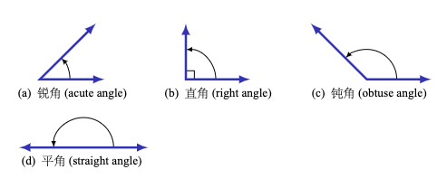

    **图 1.1.1 角的类型**

在初等几何中，角通常被视为正角，且不大于 :math:`360^{\circ}`。我们目前只考虑这类角。[2]_
以下定义将在全文中使用：

.. [2] 在后文中我们将讨论负角以及大于 :math:`360^{\circ}` 的角。

(a) 两个锐角如果它们的和等于 :math:`90^{\circ}`，则称它们是 **余角**。
换句话说，如果 :math:`0^{\circ} \le \angle\,A \,,\, \angle\,B \le 90^{\circ}`，
那么当 :math:`\angle\,A + \angle\,B = 90^{\circ}` 时，:math:`\angle\,A` 和 :math:`\angle\,B` 是余角。

(b) 两个介于 :math:`0^{\circ}` 和 :math:`180^{\circ}` 之间的角如果它们的和等于 :math:`180^{\circ}`，则称它们是 **补角**。
换句话说，如果 :math:`0^{\circ} \le \angle\,A \,,\, \angle\,B \le 180^{\circ}`，
那么当 :math:`\angle\,A + \angle\,B = 180^{\circ}` 时，:math:`\angle\,A` 和 :math:`\angle\,B` 是补角。

(c) 两个介于 :math:`0^{\circ}` 和 :math:`360^{\circ}` 之间的角如果它们的和等于 :math:`360^{\circ}`，
则称它们是 **共轭角** （或 **余周角** ）。
换句话说，如果 :math:`0^{\circ} \le \angle\,A \,,\, \angle\,B \le 360^{\circ}`，
那么当 :math:`\angle\,A + \angle\,B = 360^{\circ}` 时，:math:`\angle\,A` 和 :math:`\angle\,B` 是共轭角。

.. toggle::

    Recall the following definitions from elementary geometry:

    (a) An angle is **acute** if it is between :math:`0^{\circ}` and :math:`90^{\circ}`.

    (b) An angle is a **right angle** if it equals :math:`90^{\circ}`.

    (c) An angle is **obtuse** if it is between :math:`90^{\circ}` and :math:`180^{\circ}`.

    (d) An angle is a **straight angle** if it equals :math:`180^{\circ}`.

    .. _Figure 1.1.1:

    .. figure:: ./img/f1.1.1.png
        :align: center 

        **Figure 1.1.1 Types of angles**

    In elementary geometry, angles are always considered to be positive and not larger than
    :math:`360^{\circ}`. For now we will only consider such angles. [2]_ The following definitions will be used throughout the text:

    .. [2] Later in the text we will discuss negative angles and angles larger than :math:`360^{\circ}`.

    (a) Two acute angles are **complementary** if their sum equals :math:`90^{\circ}`. In other words, if :math:`0^{\circ} \le \angle\,A \,,\, \angle\,B \le 90^{\circ}` then :math:`\angle\,A` and :math:`\angle\,B` are complementary if :math:`\angle\,A + \angle\,B = 90^{\circ}`.

    (b) Two angles between :math:`0^{\circ}` and :math:`180^{\circ}` are **supplementary** if their sum equals :math:`180^{\circ}`. In other words, if :math:`0^{\circ} \le \angle\,A \,,\, \angle\,B \le 180^{\circ}` then :math:`\angle\,A` and :math:`\angle\,B` are supplementary if :math:`\angle\,A + \angle\,B = 180^{\circ}`.

    (c) Two angles between :math:`0^{\circ}` and :math:`360^{\circ}` are **conjugate** (or **explementary** ) if their sum equals :math:`360^{\circ}`. In other words, if :math:`0^{\circ} \le \angle\,A \,,\, \angle\,B \le 360^{\circ}` then :math:`\angle\,A` and :math:`\angle\,B` are conjugate if :math:`\angle\,A + \angle\,B = 360^{\circ}`.


.. _Figure 1.1.2:

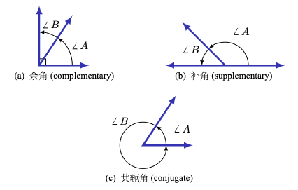

    **图 1.1.2 成对角的类型**

我们有时不会使用角度符号 :math:`\angle\,A` 来表示一个角，而是直接使用一个大写字母（例如：:math:`A`、:math:`B`、:math:`C`）或一个小写变量名（例如：:math:`x`、:math:`y`、:math:`t`）来表示角。也常见使用下面表格中所示的希腊字母（大写或小写）来表示角度：

.. _Table 1.1:

**表 1.1 希腊字母表**

.. list-table::

    * - **字母**
      - **名称**
      - **字母**
      - **名称**
      - **字母**
      - **名称**
    * - A :math:`\quad \alpha`
      - alpha
      - I  :math:`\quad \iota`
      - iota
      - P :math:`\quad \rho`
      - rho
    * - B :math:`\quad \beta` 
      - beta 
      - K :math:`\quad \kappa`
      - kappa  
      - :math:`\Sigma` :math:`\quad \sigma` 
      - sigma
    * - :math:`\Gamma` :math:`\quad \gamma`
      - gamma 
      - :math:`\Lambda` :math:`\quad \lambda` 
      - lambda 
      - T :math:`\quad \tau` 
      - tau
    * - :math:`\Delta` :math:`\quad \delta` 
      - delta 
      - M :math:`\quad \mu` 
      - mu 
      - :math:`\Upsilon` :math:`\quad \upsilon` 
      - upsilon
    * - E  :math:`\quad \epsilon`
      - epsilon
      - N  :math:`\quad \nu`
      - nu
      - :math:`\Phi` :math:`\quad \phi`
      - phi
    * - Z  :math:`\quad \zeta`
      - zeta
      - :math:`\Xi` :math:`\quad \xi`
      - xi
      - X :math:`\quad \chi`
      - chi
    * - H  :math:`\quad \eta`
      - eta
      - O  :math:`\quad o`
      - omicron
      - :math:`\Psi`  :math:`\quad \psi`
      - psi
    * - :math:`\Theta`  :math:`\quad \theta` 
      - theta 
      - :math:`\Pi` :math:`\quad \pi` 
      - pi 
      - :math:`\Omega` :math:`\quad \omega` 
      - omega

在初等几何中你学过，一个三角形内角的总和为 :math:`180^{\circ}`，并且一个 **等腰三角形** 是指有两条边长度相等的三角形。回忆一下， **直角三角形** 中有一个角是直角，因此，在直角三角形中，有一个角是 :math:`90^{\circ}` ，其余两个角是锐角，并且它们的和是 :math:`90^{\circ}` （也就是说这两个角互为余角）。

.. _例题 1.1:

.. admonition:: 例题 1.1

    对于下面的每个三角形，求出未知角的度数：

    .. figure:: ./img/e1.1.png
        :align: center

    注意：我们有时会根据三角形的顶点来表示角。例如，在上面第一个三角形中，我们会将角 :math:`\angle\,BAC` 简称为角 :math:`A`。

    **解答：** 对于三角形 :math:`\triangle\,ABC`，:math:`A = 35^{\circ}` 且 :math:`C = 20^{\circ}`，我们知道 :math:`A + B + C = 180^{\circ}`，所以：

    .. math::

        35^{\circ} ~+~ B ~+~ 20^{\circ} ~=~ 180^{\circ} \quad\Rightarrow\quad B ~=~ 180^{\circ} ~-~
        35^{\circ} ~-~ 20^{\circ} \quad\Rightarrow\quad \boxed{B ~=~ 125^{\circ}} ~.

    对于直角三角形 :math:`\triangle\,DEF`，:math:`E = 53^{\circ}` 且 :math:`F = 90^{\circ}`，我们知道两个锐角 ``D`` 和 ``E`` 是互余的，因此：

    .. math::

      D ~+~ E ~=~ 90^{\circ} \quad\Rightarrow\quad D ~=~ 90^{\circ} ~-~
      53^{\circ} \quad\Rightarrow\quad \boxed{D ~=~ 37^{\circ}} ~.

    对于三角形 :math:`\triangle\,XYZ`，各角的度数都用未知数 :math:`\alpha` 表示，但我们知道 :math:`X + Y + Z = 180^{\circ}`，可以用此关系来求出 :math:`\alpha`，进而求出 :math:`x`、:math:`y` 和 ``Z``：

    .. math::

      \alpha ~+~ 3\alpha ~+~ \alpha ~=~ 180^{\circ} \quad\Rightarrow\quad 5\alpha ~=~ 180^{\circ}
      \quad\Rightarrow\quad \alpha ~=~ 36^{\circ} \quad\Rightarrow\quad \boxed{X = 36^{\circ} ~,~
      Y = 3 \times 36^{\circ} = 108^{\circ} ~,~ Z = 36^{\circ}}

.. toggle::

    .. figure:: ./img/f1.1.2.png
        :align: center 

        **Figure 1.1.2 Types of pairs of angles**

    Instead of using the angle notation :math:`\angle\,A` to denote an angle, we will sometimes use just a
    capital letter by itself (e.g. :math:`A`, :math:`B`, :math:`C`) or a lowercase variable name (e.g. :math:`x`, :math:`y`, :math:`t`).
    It is also common to use letters (either uppercase or lowercase) from the Greek alphabet, shown
    in the table below, to represent angles:

    .. _Table 1.1:

    **Table 1.1 The Greek alphabet**

    .. list-table::

        * - **字母**
        - **名称**
        - **字母**
        - **名称**
        - **字母**
        - **名称**
        * - A :math:`\quad \alpha`
        - alpha
        - I  :math:`\quad \iota`
        - iota
        - P :math:`\quad \rho`
        - rho
        * - B :math:`\quad \beta` 
        - beta 
        - K :math:`\quad \kappa`
        - kappa  
        - :math:`\Sigma` :math:`\quad \sigma` 
        - sigma
        * - :math:`\Gamma` :math:`\quad \gamma`
        - gamma 
        - :math:`\Lambda` :math:`\quad \lambda` 
        - lambda 
        - T :math:`\quad \tau` 
        - tau
        * - :math:`\Delta` :math:`\quad \delta` 
        - delta 
        - M :math:`\quad \mu` 
        - mu 
        - :math:`\Upsilon` :math:`\quad \upsilon` 
        - upsilon
        * - E  :math:`\quad \epsilon`
        - epsilon
        - N  :math:`\quad \nu`
        - nu
        - :math:`\Phi` :math:`\quad \phi`
        - phi
        * - Z  :math:`\quad \zeta`
        - zeta
        - :math:`\Xi` :math:`\quad \xi`
        - xi
        - X :math:`\quad \chi`
        - chi
        * - H  :math:`\quad \eta`
        - eta
        - O  :math:`\quad o`
        - omicron
        - :math:`\Psi`  :math:`\quad \psi`
        - psi
        * - :math:`\Theta`  :math:`\quad \theta` 
        - theta 
        - :math:`\Pi` :math:`\quad \pi` 
        - pi 
        - :math:`\Omega` :math:`\quad \omega` 
        - omega

    In elementary geometry you learned that the sum of the angles in a triangle equals :math:`180^{\circ}`, and that an **isosceles triangle** is a triangle with two sides of equal length.
    Recall that in a **right triangle** one of the angles is a right angle. Thus, in a right triangle one of the angles is
    :math:`90^{\circ}` and the other two angles are acute angles whose sum is :math:`90^{\circ}` (i.e. the other two angles are complementary angles).

    .. _Example 1.1:

    .. admonition:: Example 1.1

        For each triangle below, determine the unknown angle(s):

        .. figure:: ./img/e1.1.png
            :align: center

        Note: We will sometimes refer to the angles of a triangle by their vertex points. For example, in the first triangle above we will simply refer to the angle :math:`\angle\,BAC` as angle :math:`A`.

        **Solution:** For triangle :math:`\triangle\,ABC`, :math:`A = 35^{\circ}` and :math:`C = 20^{\circ}`,
        and we know that :math:`A + B + C = 180^{\circ}`, so

        .. math::

            35^{\circ} ~+~ B ~+~ 20^{\circ} ~=~ 180^{\circ} \quad\Rightarrow\quad B ~=~ 180^{\circ} ~-~
            35^{\circ} ~-~ 20^{\circ} \quad\Rightarrow\quad \boxed{B ~=~ 125^{\circ}} ~.

        For the right triangle :math:`\triangle\,DEF`, :math:`E = 53^{\circ}` and :math:`F = 90^{\circ}`, and we know that
        the two acute angles ``D`` and ``E`` are complementary, so

        .. math::

        D ~+~ E ~=~ 90^{\circ} \quad\Rightarrow\quad D ~=~ 90^{\circ} ~-~
        53^{\circ} \quad\Rightarrow\quad \boxed{D ~=~ 37^{\circ}} ~.


        For triangle :math:`\triangle\,XYZ`, the angles are in terms of an unknown number :math:`\alpha`, but we do
        know that :math:`X + Y + Z = 180^{\circ}`, which we can use to solve for :math:`\alpha` and then use that to
        solve for :math:`x`, :math:`y`, and ``Z``:
        
        .. math::

        \alpha ~+~ 3\alpha ~+~ \alpha ~=~ 180^{\circ} \quad\Rightarrow\quad 5\alpha ~=~ 180^{\circ}
        \quad\Rightarrow\quad \alpha ~=~ 36^{\circ} \quad\Rightarrow\quad \boxed{X = 36^{\circ} ~,~
        Y = 3 \times 36^{\circ} = 108^{\circ} ~,~ Z = 36^{\circ}}

.. _Example 1.2:

.. admonition:: Example 1.2

    *泰勒斯定理(Thales' Theorem)* 指出，如果 :math:`A`、:math:`B` 和 :math:`C` 是同一圆上的（不同的）三点，且线段 :math:`\overline{AB}` 是该圆的直径，则角 :math:`\angle\,ACB` 是一个直角（见图 :ref:`图 1.1.3(a) <Figure 1.1.3>`）。换句话说，三角形 :math:`\triangle\,ABC` 是一个直角三角形。

    .. _Figure 1.1.3:

    .. figure:: ./img/f1.1.3.png
        :align: center 

        **图 1.1.3 泰勒斯定理：** :math:`\angle\,ACB = 90^{\circ}`

    为证明该定理，设 ``O`` 为圆心，并作线段 :math:`\overline{OC}`，如图 :ref:`图 1.1.3(b) <Figure 1.1.3>` 所示。设 :math:`\alpha = \angle\,BAC`，:math:`\beta = \angle\,ABC`。由于 :math:`\overline{AB}` 是该圆的直径，:math:`\overline{OA}` 与 :math:`\overline{OC}` 长度相同（即圆的半径）。因此三角形 :math:`\triangle\,OAC` 是等腰三角形，所以 :math:`\angle\,OCA = \angle\,OAC = \alpha`。同理，三角形 :math:`\triangle\,OBC` 也是等腰三角形，有 :math:`\angle\,OCB = \angle\,OBC = \beta`。因此可知角 :math:`\angle\,ACB = \alpha + \beta`。

    又因为三角形 :math:`\triangle\,ABC` 的内角和为 :math:`180^{\circ}`，所以：

    :math:`180^{\circ} = \alpha + ( \alpha + \beta ) + \beta = 2\,( \alpha + \beta )`，由此得出：:math:`\alpha + \beta = 90^{\circ}`。

    因此，:math:`\angle\,ACB = 90^{\circ}`。【证毕】
    
    .. toggle::

        *Thales' Theorem* states that if :math:`A`, :math:`B`, and :math:`C` are (distinct) points on a circle such that
        the line segment :math:`\overline{AB}` is a diameter of the circle, then the angle :math:`\angle\,ACB` is a
        right angle (see Figure :ref:`Figure 1.1.3(a) <Figure 1.1.3>` ). In other words, the triangle :math:`\triangle\,ABC` is a
        right triangle.

        .. figure:: ./img/f1.1.3.png
            :align: center 

            **Figure 1.1.3 Thales' Theorem:** :math:`\angle\,ACB = 90^{\circ}`
        
        To prove this, let ``O`` be the center of the circle and draw the line segment :math:`\overline{OC}`, as in
        Figure :ref:`Figure 1.1.3(b) <Figure 1.1.3>`. Let :math:`\alpha = \angle\,BAC` and :math:`\beta = \angle\,ABC`. Since
        :math:`\overline{AB}` is a diameter of the circle, :math:`\overline{OA}` and :math:`\overline{OC}` have the same
        length (namely, the circle's radius). This means that :math:`\triangle\,OAC` is an isosceles triangle,
        and so :math:`\angle\,OCA = \angle\,OAC = \alpha`. Likewise, :math:`\triangle\,OBC` is an
        isosceles triangle and :math:`\angle\,OCB = \angle\,OBC = \beta`. So we see that :math:`\angle\,ACB = \alpha + \beta`. 
        And since the angles of :math:`\triangle\,ABC` must add up to :math:`180^{\circ}`, we see that
        :math:`180^{\circ} = \alpha + ( \alpha + \beta ) + \beta = 2\,( \alpha + \beta )`, so :math:`\alpha + \beta = 90^{\circ}`. Thus, :math:`\angle\,ACB = 90^{\circ}`. 【QED】


.. _Figure 1.1.4:

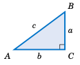

    **图 1.1.4**

在一个直角三角形中，与直角相对的边称为 **斜边** ，其余两条边称为 **直角边** 。例如，在 :ref:`图 1.1.4 <Figure 1.1.4>` 中，直角为 :math:`C`，斜边是线段 :math:`\overline{AB}`，其长度为 :math:`C`，而 :math:`\overline{BC}` 与 :math:`\overline{AC}` 是直角边，长度分别为 :math:`A` 和 :math:`B`。斜边总是直角三角形中最长的一边（参见 :ref:`练习 11 <Exercise 11>`）。

当已知直角三角形中的两条边长度时，可以通过 **毕达哥拉斯定理** 求出第三边的长度：

  **毕达哥拉斯定理：** 直角三角形斜边的平方等于两条直角边的平方和。

因此，如果一个直角三角形的斜边长为 :math:`C`，两条直角边长为 :math:`A` 和 :math:`B`，如图 :ref:`图 1.1.4 <Figure 1.1.4>` 所示，那么毕达哥拉斯定理表明：

.. math::
   :label: equation 1.1

    \boxed{a^2 ~+~ b^2 ~=~ c^2}

我们来证明这个定理。如下图 :ref:`图 1.1.5 (a) <Figure 1.1.5>` 中的直角三角形 :math:`\triangle\,ABC`，若从顶点 :math:`C` 向斜边上的一点 ``d`` 作线段 :math:`\overline{CD}`，使得 :math:`\overline{CD}` **垂直于** :math:`\overline{AB}` （即 :math:`\overline{CD}` 与 :math:`\overline{AB}` 成直角），那么该线段将三角形 :math:`\triangle\,ABC` 分成两个较小的三角形 :math:`\triangle\,CBD` 和 :math:`\triangle\,ACD`，它们都与 :math:`\triangle\,ABC` 相似。

.. _Figure 1.1.5:

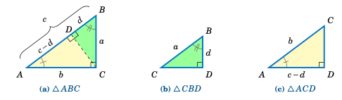

    **图 1.1.5 相似三角形** :math:`\triangle\,ABC`、:math:`\triangle\,CBD`、:math:`\triangle\,ACD`

回顾一下，如果两个三角形的对应角相等，则称它们 **相似** ，而相似三角形的对应边成比例。因此，由于 :math:`\triangle\,ABC` 与 :math:`\triangle\,CBD` 相似，根据对应边成比例可得：

.. math::

    \overline{AB}~\text{对应}~\overline{CB}~\text{（斜边）} \space \text{就如同} \space
    \overline{BC}~\text{对应}~\overline{BD}~\text{（垂直边）}
    \quad\Rightarrow\quad \frac{c}{a} ~=~ \frac{a}{d} \quad\Rightarrow\quad cd ~=~ a^2 ~.

又因为 :math:`\triangle\,ABC` 与 :math:`\triangle\,ACD` 相似，比较水平边和斜边可得：

.. math::

    \frac{b}{c-d} ~=~ \frac{c}{b} \quad\Rightarrow\quad b^2 ~=~ c^2 ~-~ cd ~=~ c ^2 ~-~ a^2
    \quad\Rightarrow\quad a^2 ~+~ b^2 ~=~ c^2 ~.  \text{【证毕】}

注：符号 :math:`\perp` 和 :math:`\sim` 分别表示垂直与相似。例如，在上述证明中我们有 :math:`\,\overline{CD} \perp \overline{AB}\,` 且  
:math:`\,\triangle\,ABC \sim \triangle\,CBD \sim \triangle\,ACD`。


.. toggle::

    .. figure:: ./img/f1.1.4.png
        :align: right 

        **Figure 1.1.4**

    In a right triangle, the side opposite the right angle is called the
    **hypotenuse**, and the other two sides are called its
    **legs**. For example, in :ref:`Figure 1.1.4 <Figure 1.1.4>` the right angle
    is :math:`C`, the hypotenuse is the line segment :math:`\overline{AB}`, which has length :math:`C`, and
    :math:`\overline{BC}` and :math:`\overline{AC}` are the legs, with lengths :math:`A` and :math:`B`, respectively. The
    hypotenuse is always the longest side of a right triangle (see :ref:`Exercise 11 <Exercise 11>` ).

    By knowing the lengths of two sides of a right triangle, the length of the third side can be
    determined by using the **Pythagorean Theorem**:

    **Pythagorean Theorem:** The square of the length of the hypotenuse of a right triangle is
    equal to the sum of the squares of the lengths of its legs.

    Thus, if a right triangle has a hypotenuse of length :math:`C` and legs of lengths :math:`A` and :math:`B`, as in
    Figure :ref:`Figure 1.1.4 <Figure 1.1.4>`, then the Pythagorean Theorem says:

    .. math::
    :label: equation 1.1

        \boxed{a^2 ~+~ b^2 ~=~ c^2}

    Let us prove this. In the right triangle :math:`\triangle\,ABC` in :ref:`Figure 1.1.5 (a) <Figure 1.1.5>` below, if we draw a line segment from the vertex :math:`C` to the point ``d`` on the hypotenuse such that :math:`\overline{CD}` is **perpendicular** to :math:`\overline{AB}` (that is, :math:`\overline{CD}` forms a right angle with :math:`\overline{AB}`), then this divides :math:`\triangle\,ABC` into two smaller triangles :math:`\triangle\,CBD` and :math:`\triangle\,ACD`, which are both similar to :math:`\triangle\,ABC`.

    .. figure:: ./img/f1.1.5.png
        :align: center 

        **Figure 1.1.5 Similar triangles** :math:`\triangle\,ABC`, :math:`\triangle\,CBD`, :math:`\triangle\,ACD`

    Recall that triangles are **similar** if their
    corresponding angles are equal, and that similarity implies that corresponding sides are
    proportional. Thus, since :math:`\triangle\,ABC` is similar to :math:`\triangle\,CBD`, by proportionality of
    corresponding sides we see that

    .. math::

        \overline{AB}~\text{is to}~\overline{CB}~\text{(hypotenuses)} \space \text{as} \space
        \overline{BC}~\text{is to}~\overline{BD}~\text{(vertical legs)}
        \quad\Rightarrow\quad \frac{c}{a} ~=~ \frac{a}{d} \quad\Rightarrow\quad cd ~=~ a^2 ~.

    Since :math:`\triangle\,ABC` is similar to :math:`\triangle\,ACD`, comparing horizontal legs and hypotenuses
    gives

    .. math::

        \frac{b}{c-d} ~=~ \frac{c}{b} \quad\Rightarrow\quad b^2 ~=~ c^2 ~-~ cd ~=~ c ^2 ~-~ a^2
        \quad\Rightarrow\quad a^2 ~+~ b^2 ~=~ c^2 ~.  \text{【QED】}

    Note: The symbols :math:`\perp`  and :math:`\sim` denote
    perpendicularity and similarity, respectively. For example, in the above
    proof we had :math:`\,\overline{CD} \perp \overline{AB}\,` and
    :math:`\,\triangle\,ABC \sim \triangle\,CBD \sim \triangle\,ACD`.

--------------

.. _Example 1.3:

.. admonition:: Example 1.3

    对于下列每一个直角三角形，求出未知边的长度：

    .. figure:: ./img/e1.3.png
        :align: center

    **解答：** 对于三角形 :math:`\triangle\,ABC`，根据毕达哥拉斯定理可得：

    .. math::

        a^2 ~+~ 4^2 ~=~ 5^2 \quad\Rightarrow\quad a^2 ~=~ 25 ~-~ 16 ~=~ 9 \quad\Rightarrow\quad
        \boxed{a ~=~ 3} ~.

    对于三角形 :math:`\triangle\,DEF`，根据毕达哥拉斯定理可得：

    .. math::

        e^2 ~+~ 1^2 ~=~ 2^2 \quad\Rightarrow\quad e^2 ~=~ 4 ~-~ 1 ~=~ 3 \quad\Rightarrow\quad
        \boxed{e ~=~ \sqrt{3}} ~.

    对于三角形 :math:`\triangle\,XYZ`，根据毕达哥拉斯定理可得：

    .. math::
        
        1^2 ~+~ 1^2 ~=~ z^2 \quad\Rightarrow\quad z^2 ~=~ 2 \quad\Rightarrow\quad
        \boxed{z ~=~ \sqrt{2}} ~.


    .. toggle::

        For each right triangle below, determine the length of the unknown side:

        .. figure:: ./img/e1.3.png
            :align: center
            
        **Solution:** For triangle :math:`\triangle\,ABC`, the Pythagorean Theorem says that

        .. math::

            a^2 ~+~ 4^2 ~=~ 5^2 \quad\Rightarrow\quad a^2 ~=~ 25 ~-~ 16 ~=~ 9 \quad\Rightarrow\quad
            \boxed{a ~=~ 3} ~.

        For triangle :math:`\triangle\,DEF`, the Pythagorean Theorem says that

        .. math::

            e^2 ~+~ 1^2 ~=~ 2^2 \quad\Rightarrow\quad e^2 ~=~ 4 ~-~ 1 ~=~ 3 \quad\Rightarrow\quad
            \boxed{e ~=~ \sqrt{3}} ~.

        For triangle :math:`\triangle\,XYZ`, the Pythagorean Theorem says that

        .. math::
            
            1^2 ~+~ 1^2 ~=~ z^2 \quad\Rightarrow\quad z^2 ~=~ 2 \quad\Rightarrow\quad
            \boxed{z ~=~ \sqrt{2}} ~.

.. _Example 1.4:

.. admonition:: Example 1.4

    .. figure:: ./img/e1.4.png
        :align: right

    一架 17 英尺长的梯子倚靠在墙上，梯子的底端距离墙基 8 英尺。梯子的顶端接触墙面的高度是多少？

    **解答：** 设 ``h`` 为梯子接触墙面的高度。我们可以假设地面与墙壁成直角，如右图所示。那么我们可以看到，梯子、地面和墙壁构成了一个直角三角形，其斜边长为 17 英尺（即梯子的长度），两条直角边分别为 8 英尺和 ``h`` 英尺。因此，根据毕达哥拉斯定理，有：

    .. math::

        h^2 ~+~ 8^2 ~=~ 17^2 \quad\Rightarrow\quad h^2 ~=~ 289 ~-~ 64 ~=~ 225 \quad\Rightarrow\quad
        \boxed{h ~=~ 15 ~\text{英尺}} ~.

    .. toggle::

        .. figure:: ./img/e1.4.png
            :align: right

        A 17 ft ladder leaning against a wall has its foot 8 ft from the base of the wall. At what height
        is the top of the ladder touching the wall?

        **Solution:** Let ``h`` be the height at which the ladder touches the wall. We can
        assume that the ground makes a right angle with the wall, as in the picture on the right. Then we
        see that the ladder, ground, and wall form a right triangle with a hypotenuse of length 17 ft (the
        length of the ladder) and legs with lengths 8 ft and ``h`` ft. So by the Pythagorean Theorem, we have

        .. math::

            h^2 ~+~ 8^2 ~=~ 17^2 \quad\Rightarrow\quad h^2 ~=~ 289 ~-~ 64 ~=~ 225 \quad\Rightarrow\quad
            \boxed{h ~=~ 15 ~\text{ft}} ~.

------------

练习
~~~~~~~~~~~~
Exercises

对于练习 1–4，求出三角形 :math:`\triangle\,ABC` 中所标角的数值：

1. 若 :math:`A = 15^{\circ}` 且 :math:`C = 50^{\circ}`，求 :math:`B`。
2. 若 :math:`A = 110^{\circ}` 且 :math:`B = 31^{\circ}`，求 :math:`C`。
3. 若 :math:`C = 24^{\circ}`、:math:`A = \alpha` 且 :math:`B = 2\alpha`，求 :math:`A` 和 :math:`B`。
4. 若 :math:`A = \beta` 且 :math:`B = C = 4\beta`，求 :math:`A`、:math:`B` 和 :math:`C`。

.. toggle::

    For Exercises 1-4, find the numeric value of the indicated angle(s) for the
    triangle :math:`\triangle\,ABC`.

    1. Find :math:`B` if :math:`A = 15^{\circ}` and :math:`C = 50^{\circ}`.
    2. Find :math:`C` if :math:`A = 110^{\circ}` and :math:`B = 31^{\circ}`.
    3. Find :math:`A` and :math:`B` if :math:`C = 24^{\circ}`, :math:`A = \alpha`, and :math:`B = 2\alpha`.
    4. Find :math:`A`, :math:`B`, and :math:`C` if :math:`A = \beta` and :math:`B = C = 4\beta`.


对于练习 5–8，求出直角三角形 :math:`\triangle\,ABC` 中所标角的数值，设 :math:`C` 为直角。

5. 若 :math:`A = 45^{\circ}`，求 :math:`B`。
6. 若 :math:`A = \alpha` 且 :math:`B = 2\alpha`，求 :math:`A` 和 :math:`B`。
7. 若 :math:`A = \phi` 且 :math:`B = \phi^2`，求 :math:`A` 和 :math:`B`。
8. 若 :math:`A = \theta` 且 :math:`B = 1/\theta`，求 :math:`A` 和 :math:`B`。

9. 一辆车先向正北行驶 24 英里，再向正东方向行驶 7 英里。问这辆车从起点到终点的直线距离是多少？

10. 一端固定在 100 英尺高的杆顶的绳索，如果绳长为 150 英尺，那么它在地面上从杆底最多可以延伸到多远的距离？可以假设杆与地面垂直。

.. toggle::

    For Exercises 5-8, find the numeric value of the indicated angle(s) for the right
    triangle :math:`\triangle\,ABC`, with :math:`C` being the right angle.

    5. Find :math:`B` if :math:`A = 45^{\circ}`.
    6. Find :math:`A` and :math:`B` if :math:`A = \alpha` and :math:`B = 2\alpha`.
    7. Find :math:`A` and :math:`B` if :math:`A = \phi` and :math:`B = \phi^2`.
    8. Find :math:`A` and :math:`B` if :math:`A = \theta` and :math:`B = 1/\theta`.
    
    9. A car goes 24 miles due north then 7 miles due east. What is the straight distance between the car's starting point and end point?
    10. One end of a rope is attached to the top of a pole 100 ft high. If the rope is 150 ft long, what is the maximum distance along the ground from the base of the pole to where the other end can be attached? You may assume that the pole is perpendicular to the ground.


.. _exercises 11:

11. 证明在每个直角三角形中，斜边是最长的一边。（*提示：是否有* :math:`a^2 + b^2 > a^2`？）

12. 一个直角三角形能否具有边长为 2、5 和 6 的三边？解释你的答案。

13. 如果直角三角形的三边长度 :math:`A`、:math:`B` 和 :math:`C` 是正整数，且满足 :math:`a^2 + b^2 = c^2`，那么它们构成所谓的 **勾股数（三元组）** 。这个三元组通常写作 (:math:`A`, :math:`B`, :math:`C`)。例如，(3,4,5) 和 (5,12,13) 是著名的勾股三元组。

    (a) 说明 (6,8,10) 是一个勾股三元组。  
    (b) 说明如果 (:math:`A`, :math:`B`, :math:`C`) 是一个勾股三元组，那么对于任意整数 :math:`k > 0`，:math:`(ka, kb, kc)` 也是勾股三元组。你如何从几何角度理解这一点？  
    (c) 说明对任意满足 ``m > n > 0`` 的整数 ``m`` 与 ``n``，三元组 (``2mn``, :math:`m^2 - n^2`, :math:`m^2 + n^2`) 是勾股三元组。  
    (d) 第 (c) 小题中的三元组是由 **欧几里得公式** 生成的勾股三元组。写出由该公式生成的前十组勾股三元组，即使用：``m=2`` 且 ``n=1``；``m=3`` 且 ``n=1``、``2``；``m=4`` 且 ``n=1``、``2``、``3``；``m=5`` 且 ``n=1``、``2``、``3``、``4``。

.. _exer:tanline:

14. 本练习将说明如何从圆外的一点作一条直线，使其仅与圆相交于一点。这种线称为该圆的 *切线* （ **tangent line** ，见 :ref:`图 1.1.6 <Figure 1.1.6>` 中左图），本书后续内容中将反复用到这一概念。

    .. _图 1.1.6:

    .. figure:: ./img/f1.1.6.png
        :align: center 

        **图 1.1.6**
 
    在一张纸上画一个半径为 1 英寸的圆，设该圆心为 ``O``。选取一点 ``P``，其与 ``O`` 的距离为 ``2.5`` 英寸。画以 :math:`\overline{OP}` 为直径的圆，如 :ref:`图 1.1.6 <Figure 1.1.6>` 右图所示。设 :math:`A` 为这个新圆与第一个圆的交点之一。作一条通过 ``P`` 和 :math:`A` 的直线。一般而言，圆上一点处的切线与该点到圆心的连线垂直（为什么？）。利用这个事实解释你所作的线为何是通过 :math:`A` 的切线，并计算线段 :math:`\overline{PA}` 的长度。它是否与物理测量值一致？

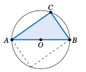

15. 假设三角形 :math:`\triangle\,ABC` 中的边 :math:`\overline{AB}` 是某个圆的直径，圆心为 ``O``，如右图所示，且顶点 :math:`C` 位于圆上。现在设想将圆绕其圆心旋转 :math:`180^{\circ}`，使三角形 :math:`\triangle\,ABC` 到达图中虚线所示的新位置。解释该图如何证明了泰勒斯定理。

.. toggle::

    11.  Prove that the hypotenuse is the longest side in every right triangle. (*Hint: Is* :math:`a^2 + b^2 > a^2` ? )
    12.  Can a right triangle have sides with lengths 2, 5, and 6? Explain your answer. 
    13.  If the lengths :math:`A`,  :math:`B` , and :math:`C` of the sides of a right triangle are positive integers, with :math:`a^2 + b^2 = c^2`, then they form what is called a **Pythagorean triple**. The triple is normally written as (:math:`A`, :math:`B`, :math:`C`). For example, (3,4,5) and (5,12,13) are well-known Pythagorean triples.

        (a) Show that (6,8,10) is a Pythagorean triple.
        (b) Show that if (:math:`A`, :math:`B`, :math:`C`) is a Pythagorean triple then so is :math:`(ka, kb, kc)` for any integer :math:`k >0`. How would you interpret this geometrically?
        (c) Show that (``2mn``, :math:`m^2 - n^2` , :math:`m^2 + n^2`) is a Pythagorean triple for all integers ``m > n > 0``.
        (d) The triple in part(c) is known as **Euclid's formula** for generating Pythagorean triples. Write down the first ten Pythagorean triples generated by this formula, i.e. use: ``m=2`` and ``n=1``; ``m=3`` and ``n=1``, ``2``; ``m=4`` and ``n=1``, ``2``, ``3``; ``m=5`` and ``n=1``, ``2``, ``3``, ``4``.


    14. This exercise will describe how to draw a line through any point outside a circle such that the line intersects the circle at only one point. This is called a *tangent line* **tangent line** to the circle (see the picture on the left in :ref:`Figure 1.1.6 <Figure 1.1.6>`), a notion which we will use throughout the text.


        .. figure:: ./img/f1.1.6.png
            :align: center 

            **Figure 1.1.6**
    
        On a sheet of paper draw a circle of radius 1 inch, and call the center of that circle ``O``. Pick a point ``P`` which is ``2.5`` inches away from ``O``. Draw the circle which has :math:`\overline{OP}` as a diameter, as in the picture on the right in :ref:`Figure 1.1.6 <Figure 1.1.6>`. Let :math:`A` be one of the points where this circle intersects the first circle. Draw the line through ``P`` and :math:`A`. In general the tangent line through a point on a circle is perpendicular to the line joining that point to the center of the circle (why?). Use this fact to explain why the line you drew is the tangent line through :math:`A` and to calculate the length of :math:`\overline{PA}`. Does it match the physical measurement of :math:`\overline{PA}`?


    .. figure:: ./img/e1.1.15.png
        :align: right

    15. Suppose that :math:`\triangle\,ABC` is a triangle with side :math:`\overline{AB}` a diameter of a circle with center ``O``, as in the picture on the right, and suppose that the vertex :math:`C` lies on the circle. Now imagine that you rotate the circle :math:`180^{\circ}` around its center, so that :math:`\triangle\,ABC` is in a new position, as indicated by the dashed lines in the picture. Explain how this picture proves Thales' Theorem.

----------------

1.2 锐角的三角函数
------------------------------------------------
1.2 Trigonometric Functions of an Acute Angle

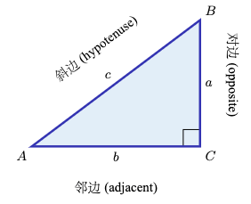

设有一个直角三角形 :math:`\triangle\,ABC`，其中直角在 :math:`C`，边长为 :math:`A`、:math:`B` 和 :math:`C`，如右图所示。对于锐角 :math:`A`，将边 :math:`\overline{BC}` 称为它的 **对边**，将边 :math:`\overline{AC}` 称为它的 **邻边**。回忆一下，三角形的斜边是边 :math:`\overline{AB}`。在实际应用中，直角三角形的边长比值经常出现，因此我们为这些比值定义六个 **三角函数** 如下：

.. _Table 1.2:

.. _tbl:funcs:

**表 1.2** :math:`A` **的六个三角函数**

.. list-table::

    * - **函数名称**
      - **缩写**
      - **定义**
    * - 正弦 :math:`A`
      - :math:`\sin A`
      - :math:`= \dfrac{\text{对边}}{\text{斜边}} = \dfrac{a}{c}`
    * - 余弦 :math:`A` 
      - :math:`\cos A`
      - :math:`= \dfrac{\text{邻边}}{\text{斜边}} = \dfrac{b}{c}`
    * - 正切 :math:`A` 
      - :math:`\tan A`
      - :math:`= \dfrac{\text{对边}}{\text{邻边}} = \dfrac{a}{b}`
    * - 余割 :math:`A`
      - :math:`\csc A` 
      - :math:`= \dfrac{\text{斜边}}{\text{对边}} = \dfrac{c}{a}`
    * - 正割 :math:`A`
      - :math:`\sec A`
      - :math:`= \dfrac{\text{斜边}}{\text{邻边}} = \dfrac{c}{b}`
    * - 余切 :math:`A`
      - :math:`\cot A`
      - :math:`= \dfrac{\text{邻边}}{\text{对边}} = \dfrac{b}{a}`

我们通常使用这些函数的缩写形式。从表 :ref:`1.2 <tbl:funcs>` 中可以看出，:math:`\sin A` 与 :math:`\csc A`、:math:`\cos A` 与 :math:`\sec A`、:math:`\tan A` 与 :math:`\cot A` 是互为倒数的关系：

.. math::

    \csc A ~=~ \dfrac{1}{\sin A} \qquad\qquad
    \sec A ~=~ \dfrac{1}{\cos A} \qquad\qquad
    \cot A ~=~ \dfrac{1}{\tan A} \\ 
    \\
    \sin A ~=~ \dfrac{1}{\csc A} \qquad\qquad
    \cos A ~=~ \dfrac{1}{\sec A} \qquad\qquad
    \tan A ~=~ \dfrac{1}{\cot A}

.. toggle::

    Consider a right triangle :math:`\triangle\,ABC`, with the right angle at :math:`C` and with lengths :math:`A`, :math:`B`,
    and :math:`C`, as in the figure on the right. For the acute angle :math:`A`, call the leg :math:`\overline{BC}` its
    **opposite side**, and call the leg :math:`\overline{AC}` its **adjacent side**. Recall
    that the hypotenuse of the triangle is the side :math:`\overline{AB}`. The ratios of sides of a right
    triangle occur often enough in practical applications to warrant their own names, so we define the
    six **trigonometric functions** of :math:`A` as follows:

    **Table 1.2 The six trigonometric functions of** :math:`A`

    .. list-table::

        * - **Name of function**
        - **Abbreviation**
        - **Definition**
        * - sine :math:`A`
        - :math:`\sin A`
        - :math:`= \dfrac{\text{opposite side}}{\text{hypotenuse}} = \dfrac{a}{c}`
        * - cosine :math:`A` 
        - :math:`\cos A`
        - :math:`= \dfrac{\text{adjacent side}}{\text{hypotenuse}} = \dfrac{b}{c}`
        * - tangent :math:`A` 
        - :math:`\tan A`
        - :math:`= \dfrac{\text{opposite side}}{\text{adjacent side}} = \dfrac{a}{b}`
        * - cosecant :math:`A`
        - :math:`\csc A` 
        - :math:`= \dfrac{\text{hypotenuse}}{\text{opposite side}} = \dfrac{c}{a}`
        * - secant :math:`A`
        - :math:`\sec A`
        - :math:`= \dfrac{\text{hypotenuse}}{\text{adjacent side}} = \dfrac{c}{b}`
        * - cotangent :math:`A`
        - :math:`\cot A`
        - :math:`= \dfrac{\text{adjacent side}}{\text{opposite side}} = \dfrac{b}{a}`

    We will usually use the abbreviated names of the functions. Notice from Table :ref:`1.2 <tbl:funcs>` that the pairs :math:`\sin A` and :math:`\csc A`, :math:`\cos A` and :math:`\sec A`, and :math:`\tan A` and :math:`\cot A` are reciprocals:

    .. math::

        \csc A ~=~ \dfrac{1}{\sin A} \qquad\qquad
        \sec A ~=~ \dfrac{1}{\cos A} \qquad\qquad
        \cot A ~=~ \dfrac{1}{\tan A} \\ 
        \\
        \sin A ~=~ \dfrac{1}{\csc A} \qquad\qquad
        \cos A ~=~ \dfrac{1}{\sec A} \qquad\qquad
        \tan A ~=~ \dfrac{1}{\cot A}

.. _Example 1.5:

.. _exmp:funcs345:

.. admonition:: Example 1.5

    .. figure:: ./img/e1.5.png
        :align: right

    对于右图所示的直角三角形 :math:`\triangle\,ABC`，求锐角 :math:`A` 和 :math:`B` 的所有六个三角函数值。

    **解答：** 三角形 :math:`\triangle\,ABC` 的斜边长度为 ``5``。对于角 :math:`A`，其对边 :math:`\overline{BC}` 长度为 ``3``，邻边 :math:`\overline{AC}` 长度为 ``4``。因此：

    .. math::

        \sin A ~=~ \dfrac{\text{对边}}{\text{斜边}} ~=~ \dfrac{3}{5} \qquad\qquad
        \cos A ~=~ \dfrac{\text{邻边}}{\text{斜边}} ~=~ \dfrac{4}{5} \qquad\qquad
        \tan A ~=~ \dfrac{\text{对边}}{\text{邻边}} ~=~ \dfrac{3}{4}\\
        \\
        \csc A ~=~ \dfrac{\text{斜边}}{\text{对边}} ~=~ \dfrac{5}{3} \qquad\qquad
        \sec A ~=~ \dfrac{\text{斜边}}{\text{邻边}} ~=~ \dfrac{5}{4} \qquad\qquad
        \cot A ~=~ \dfrac{\text{邻边}}{\text{对边}} ~=~ \dfrac{4}{3}

    对于角 :math:`B`，其对边 :math:`\overline{AC}` 长度为 ``4``，邻边 :math:`\overline{BC}` 长度为 ``3``。因此：

    .. math::

        \sin B ~=~ \dfrac{\text{对边}}{\text{斜边}} ~=~ \dfrac{4}{5} \qquad\qquad
        \cos B ~=~ \dfrac{\text{邻边}}{\text{斜边}} ~=~ \dfrac{3}{5} \qquad\qquad
        \tan B ~=~ \dfrac{\text{对边}}{\text{邻边}} ~=~ \dfrac{4}{3}\\
        \\
        \csc B ~=~ \dfrac{\text{斜边}}{\text{对边}} ~=~ \dfrac{5}{4} \qquad\qquad
        \sec B ~=~ \dfrac{\text{斜边}}{\text{邻边}} ~=~ \dfrac{5}{3} \qquad\qquad
        \cot B ~=~ \dfrac{\text{邻边}}{\text{对边}} ~=~ \dfrac{3}{4}


    .. toggle::

        For the right triangle :math:`\triangle\,ABC` shown on the right, find the values of all six trigonometric functions of the acute angles :math:`A` and :math:`B`.

        **Solution:** The hypotenuse of :math:`\triangle\,ABC` has length ``5``. For angle :math:`A`, the opposite side :math:`\overline{BC}` has length ``3`` and the adjacent side :math:`\overline{AC}` has length ``4``. Thus:

        .. math::

            \sin A ~=~ \dfrac{\text{opposite}}{\text{hypotenuse}} ~=~ \dfrac{3}{5} \qquad\qquad
            \cos A ~=~ \dfrac{\text{adjacent}}{\text{hypotenuse}} ~=~ \dfrac{4}{5} \qquad\qquad
            \tan A ~=~ \dfrac{\text{opposite}}{\text{adjacent}} ~=~ \dfrac{3}{4}\\
            \\
            \csc A ~=~ \dfrac{\text{hypotenuse}}{\text{opposite}} ~=~ \dfrac{5}{3} \qquad\qquad
            \sec A ~=~ \dfrac{\text{hypotenuse}}{\text{adjacent}} ~=~ \dfrac{5}{4} \qquad\qquad
            \cot A ~=~ \dfrac{\text{adjacent}}{\text{opposite}} ~=~ \dfrac{4}{3}

        For angle :math:`B`, the opposite side :math:`\overline{AC}` has length ``4`` and the adjacent side :math:`\overline{BC}` has length ``3``. Thus:
        
        .. math::

            \sin B ~=~ \dfrac{\text{opposite}}{\text{hypotenuse}} ~=~ \dfrac{4}{5} \qquad\qquad
            \cos B ~=~ \dfrac{\text{adjacent}}{\text{hypotenuse}} ~=~ \dfrac{3}{5} \qquad\qquad
            \tan B ~=~ \dfrac{\text{opposite}}{\text{adjacent}} ~=~ \dfrac{4}{3}\\
            \\
            \csc B ~=~ \dfrac{\text{hypotenuse}}{\text{opposite}} ~=~ \dfrac{5}{4} \qquad\qquad
            \sec B ~=~ \dfrac{\text{hypotenuse}}{\text{adjacent}} ~=~ \dfrac{5}{3} \qquad\qquad
            \cot B ~=~ \dfrac{\text{adjacent}}{\text{opposite}} ~=~ \dfrac{3}{4}

请注意，在示例 :ref:`1.5 <exmp:funcs345>` 中我们并未指定长度的单位。这就引出了一个问题：我们的答案是否依赖于一个具有特定物理尺寸的三角形。

例如，假设有两个不同的学生在阅读本教材：一个在美国，一个在德国。美国学生认为示例 :ref:`1.5 <exmp:funcs345>` 中的长度 ``3``、``4`` 和 ``5`` 是以英寸为单位，而德国学生认为它们是以厘米为单位。由于 ``1`` 英寸 :math:`\approx 2.54 \text{ cm}`，两个学生使用的是不同物理尺寸的三角形（见下方图 :ref:`1.2.1 <fig:similar>`，图未按比例绘制）。

.. _Figure 1.2.1:

.. _fig:similar:

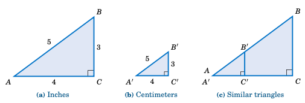

    **图 1.2.1** :math:`\triangle\,ABC ~\sim~ \triangle\,A'B'C'`

如果美国学生使用的三角形是 :math:`\triangle\,ABC`，德国学生使用的是 :math:`\triangle\,A'B'C'`，那么我们从图 :ref:`1.2.1 <fig:similar>` 中可以看出，:math:`\triangle\,ABC` 与 :math:`\triangle\,A'B'C'` 是相似三角形，因此对应角相等，对应边的比值相等。事实上，我们知道一个公比：:math:`\triangle\,ABC` 的边大约是 :math:`\triangle\,A'B'C'` 的边的 ``2.54`` 倍。因此，当美国学生计算 :math:`\sin A`，德国学生计算 :math:`\sin A'` 时，他们会得到相同的答案： [3]_

.. math::

    \triangle\,ABC ~\sim~ \triangle\,A'B'C' \quad\Rightarrow\quad
    \dfrac{BC}{B'C'} ~=~ \dfrac{AB}{A'B'} \quad\Rightarrow\quad
    \dfrac{BC}{AB} ~=~ \dfrac{B'C'}{A'B'} \quad\Rightarrow\quad \sin A ~=~ \sin A'

同样，角 :math:`A` 与角 :math:`A'` 的其他三角函数值也是相同的。事实上，我们的论证足够一般，适用于任何相似的直角三角形。这引出了以下结论：

  当你计算一个锐角 :math:`A` 的三角函数时，可以使用任何一个以 :math:`A` 为角的直角三角形。

由于我们是通过边长的比值来定义三角函数的，你可以认为这些边的度量单位在这些比值中被约掉了。这意味着 *三角函数的值是无单位的纯数*。因此，当美国学生在示例 :ref:`1.5 <exmp:funcs345>` 中计算 :math:`\sin A` 的值为 ``3/5`` 时，这与德国学生计算出来的 :math:`3/5` 是相同的，尽管边长的单位不同。


.. toggle::

    Notice in Example :ref:`1.5 <exmp:funcs345>` that we did not specify the units for the lengths. This raises the possibility that our answers depended on a triangle of a specific physical size.

    For example, suppose that two different students are reading this textbook: one in the United States and one in Germany. The American student thinks that the lengths ``3``, ``4``, and ``5`` in Example :ref:`1.5 <exmp:funcs345>` are measured in inches, while the German student thinks that they are measured in centimeters. Since ``1`` in :math:`\approx 2.54 \text{ cm}`, the students are using triangles of different physical sizes (see Figure :ref:`1.2.1 <fig:similar>` below, not drawn to scale).

    .. figure:: ./img/f1.2.1.png
        :align: center

        **Figure 1.2.1** :math:`\triangle\,ABC ~\sim~ \triangle\,A'B'C'`

    If the American triangle is :math:`\triangle\,ABC` and the German triangle is :math:`\triangle\,A'B'C'`, then
    we see from Figure :ref:`1.2.1 <fig:similar>` that :math:`\triangle\,ABC` is similar to :math:`\triangle\,A'B'C'`, and
    hence the corresponding angles are equal and the ratios of the corresponding sides are equal. In
    fact, we know that common ratio: the sides of :math:`\triangle\,ABC` are approximately ``2.54`` times longer
    than the corresponding sides of :math:`\triangle\,A'B'C'`. So when the American student calculates
    :math:`\sin A` and the German student calculates :math:`\sin A'`, they get the same answer: [3]_

    .. math::

        \triangle\,ABC ~\sim~ \triangle\,A'B'C' \quad\Rightarrow\quad
        \dfrac{BC}{B'C'} ~=~ \dfrac{AB}{A'B'} \quad\Rightarrow\quad
        \dfrac{BC}{AB} ~=~ \dfrac{B'C'}{A'B'} \quad\Rightarrow\quad \sin A ~=~ \sin A'

    Likewise, the other values of the trigonometric functions of :math:`A` and :math:`A'` are the same. In fact, our argument was general enough to work with any similar right triangles. This leads us to the following conclusion:

    When calculating the trigonometric functions of an acute angle :math:`A`, you may use *any* right triangle which has :math:`A` as one of the angles.

    Since we defined the trigonometric functions in terms of ratios of sides, you can think of the units of measurement for those sides as canceling out in those ratios. This means that *the values of the trigonometric functions are unitless numbers* . So when the American student calculated ``3/5`` as the value of :math:`\sin A` in Example :ref:`1.5 <exmp:funcs345>`, that is the same as the :math:`3/5` that the German student calculated, despite the different units for the lengths of the sides.

.. [3] 我们将使用 ``AB`` 表示线段 :math:`\overline{AB}` 的长度。
       
       We will use the notation ``AB`` to denote the length of a line segment :math:`\overline{AB}`.


.. _Example 1.6:

.. _exmp:funcs45:

.. admonition:: Example 1.6

    .. figure:: ./img/e1.6.png
        :align: right

    求 :math:`45^{\circ}` 的所有六个三角函数值。

    **解：** 由于我们可以使用任何一个包含 :math:`45^{\circ}` 的直角三角形，因此使用最简单的一个：取一个边长为 ``1`` 的正方形，并沿对角线将其对半分，如右图所示。由于三角形 :math:`\triangle\,ABC` 的两条直角边长度相同，:math:`\triangle\,ABC` 是等腰三角形，这意味着角 :math:`A` 与角 :math:`B` 相等。所以，由于 :math:`A + B = 90^{\circ}`，我们得出 :math:`A = B = 45^{\circ}`。根据勾股定理，斜边 :math:`C` 的长度为：

    .. math::

        c^2 ~=~ 1^2 ~+~ 1^2 ~=~ 2 \quad\Rightarrow\quad c ~=~ \sqrt{2} ~.

    因此，使用角 :math:`A`，我们得到：

    .. math::

        & \sin45^{\circ} ~=~ \dfrac{\text{对边}}{\text{斜边}} ~=~ \dfrac{1}{\sqrt{2}} \quad\quad
        \cos45^{\circ} ~=~ \dfrac{\text{邻边}}{\text{斜边}} ~=~ \dfrac{1}{\sqrt{2}} \quad\quad
        \tan45^{\circ} ~=~ \dfrac{\text{对边}}{\text{邻边}} ~=~ \dfrac{1}{1} ~=~ 1 \\
        \\
        & \csc45^{\circ} ~=~ \dfrac{\text{斜边}}{\text{对边}} ~=~ \sqrt{2} \quad\quad
        \sec45^{\circ} ~=~ \dfrac{\text{斜边}}{\text{邻边}} ~=~ \sqrt{2} \quad\quad
        \cot45^{\circ} ~=~ \dfrac{\text{邻边}}{\text{对边}} ~=~ \dfrac{1}{1} ~=~ 1

    请注意，如果我们使用任何一个与 :math:`\triangle\,ABC` 相似的直角三角形，也会得到相同的答案。例如，如果将 :math:`\triangle\,ABC` 的每条边都乘以 :math:`\sqrt{2}`，那么我们将得到一个边长为 :math:`\sqrt{2}`，斜边为 :math:`2` 的相似三角形。这将得出 :math:`\sin45^{\circ} = \frac{\sqrt{2}}{2}`，这与之前的 :math:`\frac{\sqrt{2}}{\sqrt{2} \cdot \sqrt{2}} = \frac{1}{\sqrt{2}}` 是相等的。其他函数同理。

    .. toggle::

        Find the values of all six trigonometric functions of :math:`45^{\circ}`.

        **Solution:** Since we may use any right triangle which has :math:`45^{\circ}` as one of the angles, use the simplest one: take a square whose sides are all ``1`` unit long and divide it in half diagonally, as in the figure on the right. Since the two legs of the triangle :math:`\triangle\,ABC` have the same length, :math:`\triangle\,ABC` is an isosceles triangle, which means that the angles :math:`A` and :math:`B` are equal. So since :math:`A + B = 90^{\circ}`, this means that we must have :math:`A = B = 45^{\circ}`. By the Pythagorean Theorem, the length :math:`C` of the hypotenuse is given by
        
        .. math::

            c^2 ~=~ 1^2 ~+~ 1^2 ~=~ 2 \quad\Rightarrow\quad c ~=~ \sqrt{2} ~.

        Thus, using the angle :math:`A` we get:
        
        .. math::

            & \sin45^{\circ} ~=~ \dfrac{\text{opposite}}{\text{hypotenuse}} ~=~ \dfrac{1}{\sqrt{2}} \quad\quad
            \cos45^{\circ} ~=~ \dfrac{\text{adjacent}}{\text{hypotenuse}} ~=~ \dfrac{1}{\sqrt{2}} \quad\quad
            \tan45^{\circ} ~=~ \dfrac{\text{opposite}}{\text{adjacent}} ~=~ \dfrac{1}{1} ~=~ 1 \\
            \\
            & \csc45^{\circ} ~=~ \dfrac{\text{hypotenuse}}{\text{opposite}} ~=~ \sqrt{2} \quad\quad
            \sec45^{\circ} ~=~ \dfrac{\text{hypotenuse}}{\text{adjacent}} ~=~ \sqrt{2} \quad\quad
            \cot45^{\circ} ~=~ \dfrac{\text{adjacent}}{\text{opposite}} ~=~ \dfrac{1}{1} ~=~ 1

        Note that we would have obtained the same answers if we had used any right triangle similar to :math:`\triangle\,ABC`. For example, if we multiply each side of :math:`\triangle\,ABC` by :math:`\sqrt{2}`, then we would have a similar triangle with legs of length :math:`\sqrt{2}` and hypotenuse of length :math:`2`. This would give us :math:`\sin45^{\circ} = \frac{\sqrt{2}}{2}`, which equals :math:`\frac{\sqrt{2}}{\sqrt{2} \cdot \sqrt{2}} = \frac{1}{\sqrt{2}}` as before. The same goes for the other functions.


----------

.. _Example 1.7:

.. _exmp:funcs60:

.. admonition:: Example 1.7

    .. figure:: ./img/e1.7.png
        :align: right

    求 :math:`60^{\circ}` 的所有六个三角函数值。

    **解：** 由于我们可以使用任何一个包含 :math:`60^{\circ}` 的直角三角形，这里选用一个简单的：取一个边长都为 ``2`` 单位的三角形，并通过从一个顶点向对边作角平分线将其对半分割，如右图所示。原三角形是一个 *等边三角形* （即三边长度都相同），其三个角都为 :math:`60^{\circ}`。根据基础几何知识，等边三角形的顶角的角平分线会同时平分顶角和其对边。因此，如右图所示，三角形 :math:`\triangle\,ABC` 中，角 :math:`A = 60^{\circ}`，角 :math:`B = 30^{\circ}`，这使得角 :math:`C` 为 :math:`90^{\circ}`。因此，:math:`\triangle\,ABC` 是直角三角形。斜边长度为 ``c = AB = 2``，直角边 :math:`\overline{AC}` 长度为 :math:`b = AC = 1`。根据勾股定理，另一条直角边 :math:`\overline{BC}` 长度 :math:`a` 为：

    .. math::

        a^2 ~+~ b^2 ~=~ c^2 \quad\Rightarrow\quad a^2 ~=~ 2^2 ~-~ 1^2 ~=~ 3
        \quad\Rightarrow\quad a ~=~ \sqrt{3} ~.

    因此，使用角 :math:`A`，我们得到：

    .. math::

        & \sin60^{\circ} = \dfrac{\text{对边}}{\text{斜边}} = \dfrac{\sqrt{3}}{2} \qquad
        \cos60^{\circ} = \dfrac{\text{邻边}}{\text{斜边}} = \dfrac{1}{2} \qquad
        \tan60^{\circ} = \dfrac{\text{对边}}{\text{邻边}} = \dfrac{\sqrt{3}}{1} \,=\, \sqrt{3} \\
        \\
        & \csc60^{\circ} = \dfrac{\text{斜边}}{\text{对边}} = \dfrac{2}{\sqrt{3}} \qquad
        \sec60^{\circ} = \dfrac{\text{斜边}}{\text{邻边}} = 2 \qquad
        \cot60^{\circ} = \dfrac{\text{邻边}}{\text{对边}} =
            \dfrac{1}{\sqrt{3}}~

    注意，作为额外收获，我们还可以通过上面三角形 :math:`\triangle\,ABC` 中角 :math:`B = 30^{\circ}`，得到 :math:`30^{\circ}` 的所有六个三角函数值：

    .. math::

        & \sin30^{\circ} = \dfrac{\text{对边}}{\text{斜边}} = \dfrac{1}{2} \qquad
        \cos30^{\circ} = \dfrac{\text{邻边}}{\text{斜边}} = \dfrac{\sqrt{3}}{2} \qquad
        \tan30^{\circ} = \dfrac{\text{对边}}{\text{邻边}} =
            \dfrac{1}{\sqrt{3}}\quad\quad
        \\
        & \csc30^{\circ} = \dfrac{\text{斜边}}{\text{对边}} = 2 \qquad
        \sec30^{\circ} = \dfrac{\text{斜边}}{\text{邻边}} = \dfrac{2}{\sqrt{3}} \qquad
        \cot30^{\circ} = \dfrac{\text{邻边}}{\text{对边}} =
            \dfrac{\sqrt{3}}{1} = \sqrt{3}


    .. toggle::

        Find the values of all six trigonometric functions of :math:`60^{\circ}`.

        **Solution:** Since we may use any right triangle which has :math:`60^{\circ}` as one of the angles, we will use a simple one: take a triangle whose sides are all ``2`` units long and divide it in half by drawing the bisector from one vertex to the opposite side, as in the figure on the right. Since the original triangle was an *equilateral triangle* (i.e. all three sides had the same length), its three angles were all the same, namely :math:`60^{\circ}`. Recall from elementary geometry that the bisector from the vertex angle of an equilateral triangle to its opposite side bisects both the vertex angle and the opposite side. So as in the figure on the right, the triangle :math:`\triangle\,ABC` has angle :math:`A = 60^{\circ}` and angle :math:`B = 30^{\circ}`, which forces the angle :math:`C` to be :math:`90^{\circ}`. Thus, :math:`\triangle\,ABC` is a right triangle. We see that the hypotenuse has length ``c = AB = 2`` and the leg :math:`\overline{AC}` has length :math:`b = AC = 1`. By the Pythagorean Theorem, the length :math:`A` of the leg :math:`\overline{BC}` is given by 

        .. math::

            a^2 ~+~ b^2 ~=~ c^2 \quad\Rightarrow\quad a^2 ~=~ 2^2 ~-~ 1^2 ~=~ 3
            \quad\Rightarrow\quad a ~=~ \sqrt{3} ~.
    
        Thus, using the angle :math:`A` we get:

        .. math::

            & \sin60^{\circ} = \dfrac{\text{opposite}}{\text{hypotenuse}} = \dfrac{\sqrt{3}}{2} \qquad
            \cos60^{\circ} = \dfrac{\text{adjacent}}{\text{hypotenuse}} = \dfrac{1}{2} \qquad
            \tan60^{\circ} = \dfrac{\text{opposite}}{\text{adjacent}} = \dfrac{\sqrt{3}}{1} \,=\, \sqrt{3} \\
            \\
            & \csc60^{\circ} = \dfrac{\text{hypotenuse}}{\text{opposite}} = \dfrac{2}{\sqrt{3}} \qquad
            \sec60^{\circ} = \dfrac{\text{hypotenuse}}{\text{adjacent}} = 2 \qquad
            \cot60^{\circ} = \dfrac{\text{adjacent}}{\text{opposite}} =
            \dfrac{1}{\sqrt{3}}~

        Notice that, as a bonus, we get the values of all six trigonometric functions of :math:`30^{\circ}`, by using angle :math:`B = 30^{\circ}` in the same triangle :math:`\triangle\,ABC` above:

        .. math::

            & \sin30^{\circ} = \dfrac{\text{opposite}}{\text{hypotenuse}} = \dfrac{1}{2} \qquad
            \cos30^{\circ} = \dfrac{\text{adjacent}}{\text{hypotenuse}} = \dfrac{\sqrt{3}}{2} \qquad
            \tan30^{\circ} = \dfrac{\text{opposite}}{\text{adjacent}} =
            \dfrac{1}{\sqrt{3}}\quad\quad
            \\
            & \csc30^{\circ} = \dfrac{\text{hypotenuse}}{\text{opposite}} = 2 \qquad
            \sec30^{\circ} = \dfrac{\text{hypotenuse}}{\text{adjacent}} = \dfrac{2}{\sqrt{3}} \qquad
            \cot30^{\circ} = \dfrac{\text{adjacent}}{\text{opposite}} =
            \dfrac{\sqrt{3}}{1} = \sqrt{3}

.. _Example 1.8:

.. _exmp:ex1.8:

.. admonition:: Example 1.8

    .. figure:: ./img/e1.8.png
        :align: right
    
    :math:`A` 是一个锐角，且满足 :math:`\sin A = \frac{2}{3}`。求 :math:`A` 的其他三角函数值。

    **解：** 通常，画一个直角三角形有助于解决这类问题。原因是三角函数是以直角三角形边长比定义的，题中已给出一个三角函数（这里是正弦）作为比值：:math:`\sin A = \frac{2}{3}`。因为 :math:`\sin A` 定义为 :math:`\frac{\text{对边}}{\text{斜边}}`，所以在直角三角形 :math:`\triangle\,ABC` 中（见上图），取对边长度为 ``2``，斜边长度为 ``3``，使得 :math:`\sin A = \frac{2}{3}`。

    与角 :math:`A` 相邻的边长未知，设为 :math:`B`，可以用勾股定理求出：

    .. math::

        2^2 ~+~ b^2 ~=~ 3^2 \quad\Rightarrow\quad b^2 ~=~ 9 ~-~ 4 ~=~ 5 \quad\Rightarrow\quad b ~=~ \sqrt{5}

    现在我们知道了三角形 :math:`\triangle\,ABC` 的所有边长，因此有：

    .. math::

        & \cos A = \dfrac{\text{邻边}}{\text{斜边}} = \dfrac{\sqrt{5}}{3} \qquad
        \tan A = \dfrac{\text{对边}}{\text{邻边}} =
            \dfrac{2}{\sqrt{5}}\quad\quad
        \\
        & \csc A = \dfrac{\text{斜边}}{\text{对边}} = \dfrac{3}{2} \qquad
        \sec A = \dfrac{\text{斜边}}{\text{邻边}} = \dfrac{3}{\sqrt{5}} \qquad
        \cot A = \dfrac{\text{邻边}}{\text{对边}} = \dfrac{\sqrt{5}}{2}

    .. toggle::

        :math:`A` is an acute angle such that :math:`\sin A = \frac{2}{3}`. Find the values of the other trigonometric functions of :math:`A`.

        **Solution:** In general it helps to draw a right triangle to solve problems of this type. The reason is that the trigonometric functions were defined in terms of ratios of sides of a right triangle, and you are given one such function (the sine, in this case) already in terms of a ratio: :math:`\sin A = \frac{2}{3}`. Since :math:`\sin A` is defined as :math:`\frac{\text{opposite}}{\text{hypotenuse}}`, use ``2`` as the length of the side opposite :math:`A` and use ``3`` as the length of the hypotenuse in a right triangle :math:`\triangle\,ABC` (see the figure above), so that :math:`\sin A = \frac{2}{3}`.

        The adjacent side to :math:`A` has unknown length :math:`B`, but we can use the Pythagorean Theorem to find it:

        .. math::

            2^2 ~+~ b^2 ~=~ 3^2 \quad\Rightarrow\quad b^2 ~=~ 9 ~-~ 4 ~=~ 5 \quad\Rightarrow\quad b ~=~ \sqrt{5}

        We now know the lengths of all sides of the triangle :math:`\triangle\,ABC`, so we have:

        .. math::

            & \cos A = \dfrac{\text{adjacent}}{\text{hypotenuse}} = \dfrac{\sqrt{5}}{3} \qquad
            \tan A = \dfrac{\text{opposite}}{\text{adjacent}} =
                \dfrac{2}{\sqrt{5}}\quad\quad
            \\
            & \csc A = \dfrac{\text{hypotenuse}}{\text{opposite}} = \dfrac{3}{2} \qquad
            \sec A = \dfrac{\text{hypotenuse}}{\text{adjacent}} = \dfrac{3}{\sqrt{5}} \qquad
            \cot A = \dfrac{\text{adjacent}}{\text{opposite}} = \dfrac{\sqrt{5}}{2}


----------------

你可能已经注意到，在例子 :ref:`1.5 <exmp:funcs345>` 和 :ref:`1.7 <exmp:funcs60>` 中，余角的正弦与余弦、正割与余割、正切与余切之间的联系。推广这些例子，得出如下定理：

.. _thm:cofunction:

**定理 1.2. 余函数定理：** 若 :math:`A` 和 :math:`B` 是直角三角形 :math:`\triangle\,ABC` 中的互余锐角，则满足以下关系：

.. math::

    & \sin A ~=~ \cos B \qquad\qquad \sec A ~=~ \csc B \qquad\qquad \tan A ~=~ \cot B \\
    \\
    & \sin B ~=~ \cos A \qquad\qquad \sec B ~=~ \csc A \qquad\qquad \tan B ~=~ \cot A

我们称函数对 :math:`\lbrace\sin, \cos\rbrace`，:math:`\lbrace\sec, \csc\rbrace` 和 :math:`\lbrace\tan, \cot\rbrace` 为 **余函数** 。

因此，正弦和余弦是余函数，正割和余割是余函数，正切和余切是余函数。这也是余弦、余割和余切名字中带“co”的原因。余函数定理说明，锐角的任意三角函数值等于其余角的对应余函数值。

.. toggle::

    You may have noticed the connections between the sine and cosine, secant and cosecant, and tangent
    and cotangent of the complementary angles in Examples :ref:`1.5 <exmp:funcs345>` and :ref:`1.7 <exmp:funcs60>`.
    Generalizing those examples gives us the following theorem:

        **Theorem 1.2. Cofunction Theorem:** If :math:`A` and :math:`B` are the complementary acute angles in a right triangle
        :math:`\triangle\,ABC`, then the following relations hold:

        .. math::

            & \sin A ~=~ \cos B \qquad\qquad \sec A ~=~ \csc B \qquad\qquad \tan A ~=~ \cot B \\
            \\
            & \sin B ~=~ \cos A \qquad\qquad \sec B ~=~ \csc A \qquad\qquad \tan B ~=~ \cot A

        We say that the pairs of functions :math:`\lbrace\sin, \cos\rbrace`, :math:`\lbrace\sec, \csc\rbrace`, and :math:`\lbrace\tan, \cot\rbrace` are **cofunctions**.

    So sine and cosine are cofunctions, secant and cosecant are cofunctions, and tangent and cotangent are cofunctions. That is how the functions cosine, cosecant, and cotangent got the "co" in their names. The Cofunction Theorem says that any trigonometric function of an acute angle is equal to its cofunction of the complementary angle.


.. _Example 1.9:

.. _exmp:ex1.9:

.. admonition:: Example 1.9

    将以下各数写成小于 :math:`45^{\circ}` 角的三角函数形式：
    
    **(a)** :math:`\sin65^{\circ}`；**(b)** :math:`\cos78^{\circ}`；**(c)** :math:`\tan59^{\circ}`。

    **解答：**

    **(a)** :math:`65^{\circ}` 的余角是 :math:`90^{\circ} - 65^{\circ} = 25^{\circ}`，而 :math:`\sin` 的余函数是 :math:`\cos`，所以根据余函数定理，有 :math:`\sin65^{\circ} = \cos25^{\circ}`。

    **(b)** :math:`78^{\circ}` 的余角是 :math:`90^{\circ} - 78^{\circ} = 12^{\circ}`，而 :math:`\cos` 的余函数是 :math:`\sin`，所以 :math:`\cos78^{\circ} = \sin12^{\circ}`。

    **(c)** :math:`59^{\circ}` 的余角是 :math:`90^{\circ} - 59^{\circ} = 31^{\circ}`，而 :math:`\tan` 的余函数是 :math:`\cot`，所以 :math:`\tan59^{\circ} = \cot31^{\circ}`。


    .. toggle::

        Write each of the following numbers as trigonometric functions of an angle less than :math:`45^{\circ}`:
        **(a)** :math:`\sin65^{\circ}`; **(b)** :math:`\cos78^{\circ}`; **(c)** :math:`\tan59^{\circ}`.

        **Solution:** 

        **(a)** The complement of :math:`65^{\circ}` is :math:`90^{\circ} - 65^{\circ} = 25^{\circ}` and the cofunction of :math:`\sin` is :math:`\cos`, so by the Cofunction Theorem we know that :math:`\sin65^{\circ} = \cos25^{\circ}`.

        **(b)** The complement of :math:`78^{\circ}` is :math:`90^{\circ} - 78^{\circ} = 12^{\circ}` and the cofunction of :math:`\cos` is :math:`\sin`, so :math:`\cos78^{\circ} = \sin12^{\circ}`.

        **(c)** The complement of :math:`59^{\circ}` is :math:`90^{\circ} - 59^{\circ} = 31^{\circ}` and the cofunction of :math:`\tan` is :math:`\cot`, so :math:`\tan59^{\circ} = \cot31^{\circ}`.


------------------

.. _Figure 1.2.2:

.. _fig:gen45:

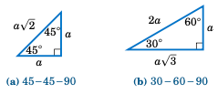

    **图 1.2.2 两个通用的直角三角形（任意 a > 0）**

角 :math:`30^{\circ}`、:math:`45^{\circ}` 和 :math:`60^{\circ}` 在应用中经常出现。我们可以利用勾股定理对示例 :ref:`1.6 <exmp:funcs45>` 和 :ref:`1.7 <exmp:funcs60>` 中的直角三角形进行推广，从而了解 *任意* ``45-45-90`` 和 ``30-60-90`` 直角三角形的形式，如上图所示（图 :ref:`1.2.2 <fig:gen45>`）。

.. toggle::

    .. figure:: ./img/f1.2.2.png
        :align: center

        **Figure 1.2.2 Two general right triangles (any a >0)**

    The angles :math:`30^{\circ}`, :math:`45^{\circ}`, and :math:`60^{\circ}` arise often in applications. We can use the Pythagorean Theorem to generalize the right triangles in Examples :ref:`1.6 <exmp:funcs45>` and :ref:`1.7 <exmp:funcs60>` and see what *any* ``45-45-90`` and ``30-60-90`` right triangles look like, as in Figure :ref:`1.2.2 <fig:gen45>` above.

-----------

.. _Example 1.10:

.. _exmp:funcs75:

.. admonition:: Example 1.10

    .. figure:: ./img/e1.10.png 
        :align: right

    求 :math:`75^{\circ}` 的正弦、余弦和正切值。

    **解：** 由于 :math:`75^{\circ} = 45^{\circ} + 30^{\circ}`，将一个 ``30-60-90`` 的直角三角形 :math:`\triangle\,ADB` （其两条直角边长分别为 :math:`\sqrt{3}` 和 :math:`1` ）放置在一个 ``45-45-90`` 的直角三角形 :math:`\triangle\,ABC` 的斜边上，其中斜边长为 :math:`\sqrt{3}`，如右图所示。

    根据图 :ref:`1.2.2(a) <fig:gen45>`，我们知道 :math:`\triangle\,ABC` 的每条直角边的长度为斜边除以 :math:`\sqrt{2}`。所以有 :math:`AC = BC = \frac{\sqrt{3}}{\sqrt{2}} = \sqrt{\frac{3}{2}}`。作 :math:`\overline{DE}` 垂直于 :math:`\overline{AC}`，从而 :math:`\triangle\,ADE` 为直角三角形。由于 :math:`\angle\,BAC = 45^{\circ}` 且 :math:`\angle\,DAB = 30^{\circ}`，我们可知 :math:`\angle\,DAE = 75^{\circ}`，因为它是这两个角的和。因此我们需要求出 :math:`\angle\,DAE` 的正弦、余弦和正切值。

    注意到 :math:`\angle\,ADE = 15^{\circ}`，因为它是 :math:`\angle\,DAE` 的余角。而 :math:`\angle\,ADB = 60^{\circ}`，因为它是 :math:`\angle\,DAB` 的余角。作 :math:`\overline{BF}` 垂直于 :math:`\overline{DE}`，使得 :math:`\triangle\,DFB` 为直角三角形。于是有 :math:`\angle\,BDF = 45^{\circ}`，因为它是 :math:`\angle\,ADB = 60^{\circ}` 与 :math:`\angle\,ADE = 15^{\circ}` 的差。另外，:math:`\angle\,DBF = 45^{\circ}`，因为它是 :math:`\angle\,BDF` 的余角。直角三角形 :math:`\triangle\,DFB` 的斜边 :math:`\overline{BD}` 长为 :math:`1`，且该三角形是一个 :math:`45-45-90` 直角三角形，所以我们知道 :math:`DF = FB = \frac{1}{\sqrt{2}}`。

    现在我们知道 :math:`\overline{DE} \perp \overline{AC}` 且 :math:`\overline{BC} \perp \overline{AC}`，因此 :math:`\overline{FE}` 与 :math:`\overline{BC}` 平行。同样地，:math:`\overline{FB}` 和 :math:`\overline{EC}` 都垂直于 :math:`\overline{DE}`，因此 :math:`\overline{FB}` 平行于 :math:`\overline{EC}`。所以，:math:`FBCE` 是一个矩形，因为 :math:`\angle\,BCE` 是直角。因此有 :math:`EC = FB = \frac{1}{\sqrt{2}}` 且 :math:`FE = BC = \sqrt{\frac{3}{2}}`。由此可得：

    :math:`DE ~=~ DF ~+~ FE ~=~ \tfrac{1}{\sqrt{2}} ~+~ \sqrt{\tfrac{3}{2}} ~=~ \tfrac{\sqrt{3} ~+~ 1}{\sqrt{2}}`，

    :math:`AE ~=~ AC ~-~ EC ~=~ \sqrt{\tfrac{3}{2}} ~-~ \tfrac{1}{\sqrt{2}} ~=~ \tfrac{\sqrt{3} ~-~ 1}{\sqrt{2}}`。因此，

    :math:`\sin75^{\circ} = \tfrac{DE}{AD} = \tfrac{\frac{\sqrt{3} + 1}{\sqrt{2}}}{2} = \tfrac{\sqrt{6} + \sqrt{2}}{4} ~,~ \cos75^{\circ} = \tfrac{AE}{AD} = \tfrac{\frac{\sqrt{3} - 1}{\sqrt{2}}}{2} = \tfrac{\sqrt{6} - \sqrt{2}}{4}`，

    :math:`\tan75^{\circ} = \tfrac{DE}{AE} = \tfrac{\frac{\sqrt{3} + 1}{\sqrt{2}}}{\frac{\sqrt{3} - 1}{\sqrt{2}}} = \tfrac{\sqrt{6} + \sqrt{2}}{\sqrt{6} - \sqrt{2}} ~.`

    注：取倒数可得：:math:`\csc75^{\circ} = \frac{4}{\sqrt{6} + \sqrt{2}}`，:math:`\sec75^{\circ} = \frac{4}{\sqrt{6} - \sqrt{2}}`，以及  
    :math:`\cot75^{\circ} = \frac{\sqrt{6} - \sqrt{2}}{\sqrt{6} + \sqrt{2}}`。


    .. toggle::

        Find the sine, cosine, and tangent of :math:`75^{\circ}`.

        **Solution:** Since :math:`75^{\circ} = 45^{\circ} + 30^{\circ}`, place a ``30-60-90`` right triangle :math:`\triangle\,ADB` with
        legs of length :math:`\sqrt{3}` and :math:`1` on top of the hypotenuse of a ``45-45-90`` right triangle
        :math:`\triangle\,ABC` whose hypotenuse has length :math:`\sqrt{3}`, as in the figure on the right.
        From Figure :ref:`1.2.2(a) <fig:gen45>` we know that the length of each leg of :math:`\triangle\,ABC`
        is the length of the hypotenuse divided by :math:`\sqrt{2}`. So :math:`AC = BC = \frac{\sqrt{3}}{\sqrt{2}} =
        \sqrt{\frac{3}{2}}`. Draw :math:`\overline{DE}` perpendicular to :math:`\overline{AC}`, so that :math:`\triangle\,ADE`
        is a right triangle. Since :math:`\angle\,BAC = 45^{\circ}` and :math:`ngle\,DAB = 30^{\circ}`, we see that
        :math:`\angle\,DAE = 75^{\circ}` since it is the sum of those two angles. Thus, we need to find the sine,
        cosine, and tangent of :math:`\angle\,DAE`.

        Notice that :math:`\angle\,ADE = 15^{\circ}`, since it is the complement of :math:`\angle\,DAE`. And
        :math:`\angle\,ADB = 60^{\circ}`, since it is the complement of :math:`\angle\,DAB`. Draw
        :math:`\overline{BF}` perpendicular to :math:`\overline{DE}`, so that :math:`\triangle\,DFB` is a right triangle. Then
        :math:`\angle\,BDF = 45^{\circ}`, since it is the difference of :math:`\angle\,ADB = 60^{\circ}` and
        :math:`\angle\,ADE = 15^{\circ}`. Also, :math:`\angle\,DBF = 45^{\circ}` since it is the complement of
        :math:`\angle\,BDF`. The hypotenuse :math:`\overline{BD}` of :math:`\triangle\,DFB` has length :math:`1` and
        :math:`\triangle\,DFB` is a :math:`45-45-90` right triangle, so we know that :math:`DF = FB = \frac{1}{\sqrt{2}}`.

        Now, we know that :math:`\overline{DE} \perp \overline{AC}` and :math:`\overline{BC} \perp \overline{AC}`, so
        :math:`\overline{FE}` and :math:`\overline{BC}` are parallel. Likewise, :math:`\overline{FB}` and :math:`\overline{EC}` are
        both perpendicular to :math:`\overline{DE}` and hence :math:`\overline{FB}` is parallel to :math:`\overline{EC}`.
        Thus, :math:`FBCE` is a rectangle, since :math:`\angle\,BCE` is a right angle. So :math:`EC = FB = \frac{1}{\sqrt{2}}`
        and :math:`FE = BC = \sqrt{\frac{3}{2}}`. Hence, 

        :math:`DE ~=~ DF ~+~ FE ~=~ \tfrac{1}{\sqrt{2}} ~+~ \sqrt{\tfrac{3}{2}} ~=~ \tfrac{\sqrt{3} ~+~ 1}{\sqrt{2}}` and 
        :math:`AE ~=~ AC ~-~ EC ~=~ \sqrt{\tfrac{3}{2}} ~-~ \tfrac{1}{\sqrt{2}} ~=~ \tfrac{\sqrt{3} ~-~ 1}{\sqrt{2}}` Thus,

        :math:`\sin75^{\circ} = \tfrac{DE}{AD} = \tfrac{\frac{\sqrt{3} + 1}{\sqrt{2}}}{2} = \tfrac{\sqrt{6} + \sqrt{2}}{4} ~,~ \cos75^{\circ} = \tfrac{AE}{AD} = \tfrac{\frac{\sqrt{3} - 1}{\sqrt{2}}}{2} = \tfrac{\sqrt{6} - \sqrt{2}}{4}`, and :math:`\tan75^{\circ} = \tfrac{DE}{AE} = \tfrac{\frac{\sqrt{3} + 1}{\sqrt{2}}}{\frac{\sqrt{3} - 1}{\sqrt{2}}} = \tfrac{\sqrt{6} + \sqrt{2}}{\sqrt{6} - \sqrt{2}} ~.`

        Note: Taking reciprocals, we get :math:`\csc75^{\circ} = \frac{4}{\sqrt{6} + \sqrt{2}}`, :math:`\sec75^{\circ} = \frac{4}{\sqrt{6} - \sqrt{2}}`, and 
        :math:`\cot75^{\circ} = \frac{\sqrt{6} - \sqrt{2}}{\sqrt{6} + \sqrt{2}}`.

练习
~~~~~~~~~~~~~~
Exercises

.. _Figure 1.2.3:

.. _fig:exer1.2.1:

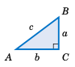

    **Figure 1.2.3**

习题 1-10：在图 :ref:`1.2.3 <fig:exer1.2.1>` 中的直角三角形 :math:`\triangle\,ABC` 中，求角 :math:`A` 和 :math:`B` 的全部六个三角函数的值。

1. :math:`a = 5`，:math:`b = 12`，:math:`c = 13`
2. :math:`a = 8`，:math:`b = 15`，:math:`c = 17`
3. :math:`a = 7`，:math:`b = 24`，:math:`c = 25`
4. :math:`a = 20`，:math:`b = 21`，:math:`c = 29`
5. :math:`a = 9`，:math:`b = 40`，:math:`c = 41`
6. :math:`a = 1`，:math:`b = 2`，:math:`c = \sqrt{5}`
7. :math:`a = 1`，:math:`b = 3`
8. :math:`a = 2`，:math:`b = 5`
9. :math:`a = 5`，:math:`c = 6`
10. :math:`b = 7`，:math:`c = 8`

习题 11-18：已知锐角 :math:`A` 的一个三角函数值，求其余五个三角函数值。

11. :math:`\sin A = \frac{3}{4}`
12. :math:`\cos A = \frac{2}{3}`
13. :math:`\cos A = \frac{2}{\sqrt{10}}`
14. :math:`\sin A = \frac{2}{4}`
15. :math:`\tan A = \frac{5}{9}`
16. :math:`\tan A = 3`
17. :math:`\sec A = \frac{7}{3}`
18. :math:`\csc A = 3`

习题 19-23：将所给的数写成小于 :math:`45^{\circ}` 的锐角的某个三角函数。

19. :math:`\sin87^{\circ}`
20. :math:`\sin53^{\circ}`
21. :math:`\cos46^{\circ}`
22. :math:`\tan66^{\circ}`
23. :math:`\sec77^{\circ}`

习题 24-28：将所给的数写成大于 :math:`45^{\circ}` 的锐角的某个三角函数。

24. :math:`\sin1^{\circ}`
25. :math:`\cos13^{\circ}`
26. :math:`\tan26^{\circ}`
27. :math:`\cot10^{\circ}`
28. :math:`\csc43^{\circ}`

29. 在例子 :ref:`1.7 <exmp:funcs60>` 中，我们求出了 :math:`60^{\circ}` 和 :math:`30^{\circ}` 的全部六个三角函数值。

    a. 是否有 :math:`\sin30^{\circ} ~+~ \sin30^{\circ} ~=~ \sin60^{\circ}`？
    
    b. 是否有 :math:`\cos30^{\circ} ~+~ \cos30^{\circ} ~=~ \cos60^{\circ}`？
    
    c. 是否有 :math:`\tan30^{\circ} ~+~ \tan30^{\circ} ~=~ \tan60^{\circ}`？
    
    d. 是否有 :math:`2\,\sin30^{\circ}\,\cos30^{\circ} ~=~ \sin60^{\circ}`？

30. 对于一个锐角 :math:`A`，:math:`\sin A` 可以大于 ``1`` 吗？请解释你的答案。
31. 对于一个锐角 :math:`A`，:math:`\cos A` 可以大于 ``1`` 吗？请解释你的答案。
32. 对于一个锐角 :math:`A`，:math:`\sin A` 可以大于 :math:`\tan A` 吗？请解释你的答案。
33. 若 :math:`A` 和 :math:`B` 是锐角，且 :math:`A < B`，请解释为何 :math:`\sin A < \sin B`。
34. 若 :math:`A` 和 :math:`B` 是锐角，且 :math:`A < B`，请解释为何 :math:`\cos A > \cos B`。
35. 证明余角定理（定理 :ref:`1.2 <thm:cofunction>`）。（*提示：画一个直角三角形并标注角和边。*）
36. 使用例子 :ref:`1.10 <exmp:funcs75>`，求 :math:`15^{\circ}` 的全部六个三角函数值。

.. toggle::

    For Exercises 1-10, find the values of all six trigonometric functions of angles :math:`A` and :math:`B` in the right triangle :math:`\triangle\,ABC` in Figure :ref:`1.2.3 <fig:exer1.2.1>`.
    
    1. :math:`a = 5`, :math:`b = 12`, :math:`c = 13`
    2. :math:`a = 8`, :math:`b = 15`, :math:`c = 17`
    3. :math:`a = 7`, :math:`b = 24`, :math:`c = 25`
    4. :math:`a = 20`, :math:`b = 21`, :math:`c = 29`
    5. :math:`a = 9`, :math:`b = 40`, :math:`c = 41`
    6. :math:`a = 1`, :math:`b = 2`, :math:`c = \sqrt{5}`
    7. :math:`a = 1`, :math:`b = 3`
    8. :math:`a = 2`, :math:`b = 5`
    9. :math:`a = 5`, :math:`c = 6`
    10. :math:`b = 7`, :math:`c = 8`
    
    For Exercises 11-18, find the values of the other five trigonometric functions of the acute angle :math:`A` given the indicated value of one of the functions.
    
    11. :math:`\sin A = \frac{3}{4}`
    12. :math:`\cos A = \frac{2}{3}`
    13. :math:`\cos A = \frac{2}{\sqrt{10}}`
    14. :math:`\sin A = \frac{2}{4}`
    15. :math:`\tan A = \frac{5}{9}`
    16. :math:`\tan A = 3`
    17. :math:`\sec A = \frac{7}{3}`
    18. :math:`\csc A = 3`
    
    For Exercises 19-23, write the given number as a trigonometric function of an acute angle less than :math:`45^{\circ}`.
    
    19. :math:`\sin87^{\circ}`
    20. :math:`\sin53^{\circ}`
    21. :math:`\cos46^{\circ}`
    22. :math:`\tan66^{\circ}`
    23. :math:`\sec77^{\circ}`
    
    For Exercises 24-28, write the given number as a trigonometric function of an acute angle greater than :math:`45^{\circ}`.
    
    24. :math:`\sin1^{\circ}`
    25. :math:`\cos13^{\circ}`
    26. :math:`\tan26^{\circ}`
    27. :math:`\cot10^{\circ}`
    28. :math:`\csc43^{\circ}`
    
    29. In Example :ref:`1.7 <exmp:funcs60>` we found the values of all six trigonometric functions of :math:`60^{\circ}` and :math:`30^{\circ}`.
    
        a. Does :math:`\sin30^{\circ} ~+~ \sin30^{\circ} ~=~ \sin60^{\circ}`?
        b. Does :math:`\cos30^{\circ} ~+~ \cos30^{\circ} ~=~ \cos60^{\circ}`?
        c. Does :math:`\tan30^{\circ} ~+~ \tan30^{\circ} ~=~ \tan60^{\circ}`?
        d. Does :math:`2\,\sin30^{\circ}\,\cos30^{\circ} ~=~ \sin60^{\circ}`?
    
    30. For an acute angle :math:`A`, can :math:`\sin A` be larger than ``1`` ? Explain your answer.
    31. For an acute angle :math:`A`, can :math:`\cos A` be larger than ``1`` ? Explain your answer.
    32. For an acute angle :math:`A`, can :math:`\sin A` be larger than :math:`\tan A`? Explain your answer.
    33. If :math:`A` and :math:`B` are acute angles and :math:`A < B`, explain why :math:`\sin A < \sin B`.
    34. If :math:`A` and :math:`B` are acute angles and :math:`A < B`, explain why :math:`\cos A > \cos B`.
    35. Prove the Cofunction Theorem (Theorem :ref:`1.2 <thm:cofunction>`). (*Hint: Draw a right triangle and label the angles and sides.*)
    36. Use Example :ref:`1.10 <exmp:funcs75>` to find all six trigonometric functions of :math:`15^{\circ}`.

.. _Figure 1.2.4:

.. _fig:exer1.2.35:

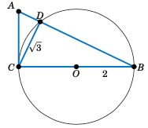

    **Figure 1.2.4**

.. _exer:circle1237:

37. 在图 :ref:`1.2.4 <fig:exer1.2.35>` 中，线段 :math:`\overline{CB}` 是一个圆的直径，该圆半径为 ``2`` 厘米，圆心为 ``O``，三角形 :math:`\triangle\,ABC` 是一个直角三角形，且线段 :math:`\overline{CD}` 的长度为 :math:`\sqrt{3}` 厘米。

    a. 求 :math:`\sin A`。（*提示：使用泰勒斯定理。*）  
    b. 求 :math:`\overline{AC}` 的长度。  
    c. 求 :math:`\overline{AD}` 的长度。  
    d. 图 :ref:`1.2.4 <fig:exer1.2.35>` 是按比例绘制的。使用量角器测量角 :math:`A`，并使用计算器求该角的正弦值。计算器结果是否接近你在 part（a）中的答案？注意：确保你的计算器处于度数模式。

38. 在练习 :ref:`37 <exer:circle1237>` 中，验证 :math:`\triangle\,ABC` 的面积等于 :math:`\frac{1}{2} AB \cdot CD`。为什么这在逻辑上是合理的？

39. 在练习 :ref:`37 <exer:circle1237>` 中，验证 :math:`\triangle\,ABC` 的面积等于 :math:`\frac{1}{2} AB \cdot AC \sin A`。

40. 在练习 :ref:`37 <exer:circle1237>` 中，验证 :math:`\triangle\,ABC` 的面积等于 :math:`\frac{1}{2} (BC)^2 \cot A`。


.. toggle::

    37. In Figure :ref:`1.2.4 <fig:exer1.2.35>`, :math:`\overline{CB}` is a diameter of a circle with a radius of ``2`` cm and center ``O``, :math:`\triangle\,ABC` is a right triangle, and :math:`\overline{CD}` has length :math:`\sqrt{3}` cm.
      
        a. Find :math:`\sin A`. ( *Hint: Use Thales' Theorem.* )
        b. Find the length of :math:`\overline{AC}`.
        c. Find the length of :math:`\overline{AD}`.
        d. Figure :ref:`1.2.4 <fig:exer1.2.35>` is drawn to scale. Use a protractor to measure the angle :math:`A`, then use your calculator to findthe sine of that angle. Is the calculator result close to your answer from part(a)? Note: Make sure that your calculator is in degree mode.
    
    
    38. In Exercise :ref:`37 <exer:circle1237>`, verify that the area of :math:`\triangle\,ABC` equals :math:`\frac{1}{2} AB \cdot CD`. Why does this make sense?
    39. In Exercise :ref:`37 <exer:circle1237>`, verify that the area of :math:`\triangle\,ABC` equals :math:`\frac{1}{2} AB \cdot AC  \sin A`.
    40. In Exercise :ref:`37 <exer:circle1237>`, verify that the area of :math:`\triangle\,ABC` equals :math:`\frac{1}{2} (BC)^2 \cot A`.


1.3 应用与直角三角形的解法
----------------------------------------------
1.3 Applications and Solving Right Triangles

在早期的发展过程中，三角学经常被用作一种间接测量的方法，例如通过测量角度和已知的小距离来确定较大的距离或长度。如今，三角学广泛应用于物理学、天文学、工程学、导航、测绘，以及数学和其他学科的多个领域。本节中我们将看到三角学的一些实际应用方式。请将你的计算器设置为角度模式，以便完成这些例题。

.. toggle::

    Throughout its early development, trigonometry was often used as a means of indirect measurement, e.g. determining large distances or lengths by using measurements of angles and small, known distances. Today, trigonometry is widely used in physics, astronomy, engineering, navigation, surveying, and various fields of mathematics and other disciplines. In this section we will see some of the ways in which trigonometry can be applied. Your calculator should be in degree mode for these examples.

.. _Example 1.11:

.. admonition:: Example 1.11

    .. figure:: ./img/e1.11.png 
        :align: right

    一个人站在离旗杆 ``150`` 英尺的位置，从其水平视线向上测量到旗杆顶端的 *仰角* 为 :math:`32^{\circ}`。假设该人的眼睛离地面垂直距离为 6 英尺。旗杆的高度是多少？

    **解答：** 右图描述了这一情境。我们可以看到旗杆的高度为 :math:`h + 6` 英尺，其中

    .. math::

      \frac{h}{150} ~=~ \tan32^{\circ} \quad\Rightarrow\quad h ~=~ 150\tan32^{\circ} ~=~ 150(0.6249) ~=~ 94 ~.

    我们是如何知道 :math:`\tan32^{\circ} = 0.6249\,` 的？是通过计算器得出的。由于题中给出的所有数字都没有小数位，我们将 ``h`` 的答案四舍五入为最接近的整数。因此，旗杆的高度是 :math:`\,h + 6 = 94 + 6 = \boxed{100 ~\text{ft}}` 。

    .. toggle::

        A person stands ``150`` ft away from a flagpole and measures an *angle of elevation* of :math:`32^{\circ}` from his horizontal line of sight to the top of the flagpole. Assume that the person's eyes are a vertical distance of 6 ft from the ground. What is the height of the flagpole?

        **Solution:** The picture on the right describes the situation. We see that the height of the flagpole is :math:`h + 6` ft, where

        .. math::

            \frac{h}{150} ~=~ \tan32^{\circ} \quad\Rightarrow\quad h ~=~ 150\tan32^{\circ} ~=~ 150(0.6249) ~=~ 94 ~.

        How did we know that :math:`\tan32^{\circ} = 0.6249\,`? By using a calculator. And since none of the numbers we were given had decimal places, we rounded off the answer for ``h`` to the nearest integer. Thus, the height of the flagpole is :math:`\,h + 6 = 94 + 6 = \boxed{100 ~\text{ft}}` .

.. _Example 1.12:

.. _exmp:mountain:

.. admonition:: Example 1.12

    .. figure:: ./img/e1.12.png 
        :align: right

    一个人站在离一座山的山脚 ``400`` 英尺的位置，测得从地面到山顶的仰角为 :math:`25^{\circ}`。该人随后向后直走 ``500`` 英尺，再次测量仰角，得到 :math:`20^{\circ}`。这座山有多高？

    **解答：** 我们假设地面是平坦的，与山脚没有倾斜。设 ``h`` 为山的高度，:math:`x` 为山脚到山顶正下方点的水平距离，如右图所示。我们可以得到：

    .. math::

        \begin{align*}
            \frac{h}{x + 400} ~=~ \tan25^{\circ} \quad &\Rightarrow \quad h ~=~ (x + 400)\tan25^{\circ}
            ~,~\text{且}\\[5pt]
            \frac{h}{x + 400 + 500} ~=~ \tan20^{\circ} \quad &\Rightarrow \quad h ~=~
            (x + 900)\tan20^{\circ} ~,~\text{因此}
        \end{align*}

    :math:`(x + 400)\tan25^{\circ} ~=~ (x + 900)\tan20^{\circ}`，因为它们都等于 ``h``。使用该方程求解 :math:`x`：

    .. math::

        x\tan25^{\circ} ~-~ x\tan20^{\circ} ~=~ 900\tan20^{\circ} ~-~ 400\tan25^{\circ}
        \quad\Rightarrow\quad
        x ~=~ \frac{900\tan20^{\circ} ~-~ 400\tan25^{\circ}}{\tan25^{\circ} ~-~ \tan20^{\circ}}
            ~=~ 1378~ \text{ft}

    最后，将 :math:`x` 代入第一个 ``h`` 的公式中，得到山的高度：

    .. math::

        h ~=~ (1378 + 400)\tan25^{\circ} ~=~ 1778(0.4663) ~=~ \boxed{829~ \text{ft}}


    .. toggle::

        A person standing ``400`` ft from the base of a mountain measures the angle of elevation from the ground to the top of the mountain to be :math:`25^{\circ}`. The person then walks ``500`` ft straight back and measures the angle of elevation to now be :math:`20^{\circ}`. How tall is the mountain?

        **Solution:** We will assume that the ground is flat and not inclined relative to
        the base of the mountain. Let ``h`` be the height of the mountain, and let :math:`x` be the distance from
        the base of the mountain to the point directly beneath the top of the mountain, as in the picture
        on the right. Then we see that

        .. math::

            \begin{align*}
                \frac{h}{x + 400} ~=~ \tan25^{\circ} \quad &\Rightarrow \quad h ~=~ (x + 400)\tan25^{\circ}
                ~,~\text{and}\\[5pt]
                \frac{h}{x + 400 + 500} ~=~ \tan20^{\circ} \quad &\Rightarrow \quad h ~=~
                (x + 900)\tan20^{\circ} ~,~\text{so}
            \end{align*}

        :math:`(x + 400)\tan25^{\circ} ~=~ (x + 900)\tan20^{\circ}`, since they both equal ``h``. Use that equation to solve for :math:`x`:

        .. math::

            x\tan25^{\circ} ~-~ x\tan20^{\circ} ~=~ 900\tan20^{\circ} ~-~ 400\tan25^{\circ}
            \quad\Rightarrow\quad
            x ~=~ \frac{900\tan20^{\circ} ~-~ 400\tan25^{\circ}}{\tan25^{\circ} ~-~ \tan20^{\circ}}
                ~=~ 1378~ \text{ft}

        Finally, substitute :math:`x` into the first formula for ``h`` to get the height of the mountain:

        .. math::

            h ~=~ (1378 + 400)\tan25^{\circ} ~=~ 1778(0.4663) ~=~ \boxed{829~ \text{ft}}

--------------

.. _Example 1.13:

.. admonition:: Example 1.13

    一艘飞艇在地面上方 ``4280`` 英尺处，从其水平视线向地面上一栋房屋的底部测得 *俯角* 为 :math:`24^{\circ}`。假设地面是平坦的，沿地面测量，这栋房屋距离飞艇有多远？

    .. figure:: ./img/e1.13.png 
        :align: right

    **解答：** 设 :math:`x` 为从飞艇到房屋沿地面的距离，如右图所示。由于地面与飞艇的水平视线平行，根据初等几何我们知道，从房屋底部到飞艇的 *仰角* :math:`\theta` 与从飞艇到房屋底部的俯角相等，即 :math:`\theta = 24^{\circ}`。因此，

    .. math::

        \frac{4280}{x} ~=~ \tan24^{\circ} \quad\Rightarrow\quad x ~=~ \frac{4280}{\tan24^{\circ}}
        ~=~ \boxed{9613 ~\text{ft}}~.

    .. toggle::

        A blimp ``4280`` ft above the ground measures an *angle of depression* of :math:`24^{\circ}` from its horizontal line of sight to the base of a house on the ground. Assuming the ground is flat, how far away along the ground is the house from the blimp?

        .. figure:: ./img/e1.13.png 
            :align: right

        **Solution:** Let :math:`x` be the distance along the ground from the blimp to the house, as in the picture to the right. Since the ground and the blimp's horizontal line of sight are parallel, we know from elementary geometry that the angle of elevation :math:`\theta` from the base of the house to the blimp is equal to the angle of depression from the blimp to the base of the house, i.e. :math:`\theta = 24^{\circ}`. Hence,

        .. math::

            \frac{4280}{x} ~=~ \tan24^{\circ} \quad\Rightarrow\quad x ~=~ \frac{4280}{\tan24^{\circ}}
            ~=~ \boxed{9613 ~\text{ft}}~.

.. _Example 1.14:

.. _exmp:radearth:

.. admonition:: Example 1.14

    一位观察者站在海平面上方 ``3`` 英里的山顶，从山顶测得至海平面地平线的俯角为 :math:`2.23^{\circ}`。利用这个数据估算地球的半径。

    .. _Figure 1.3.1:

    .. _fig:radearth:

    .. figure:: ./img/f1.3.1.png 
        :align: right

        **图 1.3.1**

    **解答：** 我们假设地球是一个球体。 [4]_ 设 ``r`` 为地球的半径。设点 :math:`A` 表示山顶位置，``h`` 是从 :math:`A` 出发视线中的海平面地平线，如图 :ref:`1.3.1 <fig:radearth>` 所示。设 ``O`` 为地球中心，:math:`B` 为从 :math:`A` 出发的水平视线上的一点（即垂直于 :math:`\overline{OA}` 的直线上的一点）。设 :math:`\theta` 为角 :math:`\angle\,AOH`。

    由于 :math:`A` 高出海平面 ``3`` 英里，我们有 :math:`OA = r + 3`，同时 ``OH = r``。又因为
    :math:`\overline{AB} \perp \overline{OA}`，所以 :math:`\angle\,OAB = 90^{\circ}`，进而得到
    :math:`\angle\,OAH = 90^{\circ} - 2.23^{\circ} = 87.77^{\circ}`。我们看到从
    :math:`A` 到 ``h`` 的连线是地球表面的切线（将地球表面视为通过 ``h`` 的半径为 ``r`` 的圆）。因此根据第 1.1 节中练习题 :ref:`14 <exer:tanline>`，:math:`\overline{AH} \perp \overline{OH}`，于是 :math:`\angle\,OHA = 90^{\circ}`。由于三角形 :math:`\triangle\,OAH` 的内角和为
    :math:`180^{\circ}`，我们得到 :math:`\theta = 180^{\circ} - 90^{\circ} - 87.77^{\circ} = 2.23^{\circ}`。因此，

    .. math::

      \cos\theta ~=~ \frac{OH}{OA} ~=~ \frac{r}{r+3} \quad\Rightarrow\quad \frac{r}{r+3} ~=~
      \cos2.23^{\circ} ~,

    解这个方程得到 ``r``：

    .. math::

      \begin{align*}
        r ~=~ (r ~+~ 3)\cos2.23^{\circ} \quad &\Rightarrow \quad
        r ~-~ r\cos2.23^{\circ} ~=~ 3\cos2.23^{\circ}\\[4pt]
        &\Rightarrow \quad r ~=~ \frac{3\cos2.23^{\circ}}{1 ~-~ \cos2.23^{\circ}}\\[5pt]
        &\Rightarrow \quad \boxed{r ~=~ 3958.3 ~\text{miles}} ~.
      \end{align*}

    注：该答案非常接近地球实际（平均）半径 ``3956.6`` 英里。

    .. [4] 当然地球并不完全是球形。地球是一个 *椭球体*，即蛋形，具有 ``1/297`` 的 *扁率* （球体的扁率为 ``0`` ）。参见 **W.H. Munk 和 G.J.F MacDonald** 所著 *The Rotation of the Earth: A Geophysical Discussion*，伦敦：剑桥大学出版社，1960 年，第 26–27 页。

           Of course it is not perfectly spherical. The earth is an *ellipsoid* , i.e. egg-shaped, with an observed *ellipticity* of ``1/297`` (a sphere has ellipticity ``0``). See pp. 26-27 in **W.H. Munk and G.J.F MacDonald** , *The Rotation of the Earth: A Geophysical Discussion*, London: Cambridge University Press, 1960.

    .. toggle::

        An observer at the top of a mountain ``3`` miles above sea level measures an angle of depression of :math:`2.23^{\circ}` to the ocean horizon. Use this to estimate the radius of the earth.

        .. figure:: ./img/f1.3.1.png 
            :align: right

            **Figure 1.3.1**

        **Solution:** We will assume that the earth is a sphere. [4]_ Let ``r`` be the radius of the earth. Let the point :math:`A` represent the top of the mountain, and let ``h`` be the ocean horizon in the line of sight from :math:`A`, as in Figure :ref:`1.3.1 <fig:radearth>`. Let ``O`` be the center of the earth, and let :math:`B` be a point on the horizontal line of sight from :math:`A` (i.e. on the line perpendicular to :math:`\overline{OA}`). Let :math:`\theta` be the angle :math:`\angle\,AOH`.

        Since :math:`A` is ``3`` miles above sea level, we have :math:`OA = r + 3`. Also, ``OH = r``. Now since
        :math:`\overline{AB} \perp \overline{OA}`, we have :math:`\angle\,OAB = 90^{\circ}`, so we see that
        :math:`\angle\,OAH = 90^{\circ} - 2.23^{\circ} = 87.77^{\circ}`. We see that the line through
        :math:`A` and ``h`` is a tangent line to the surface of the earth (considering the surface as the circle of
        radius ``r`` through ``h`` as in the picture). So by Exercise :ref:`14 <exer:tanline>` in
        Section 1.1, :math:`\overline{AH} \perp \overline{OH}` and hence :math:`\angle\,OHA = 90^{\circ}`. Since the angles in the triangle :math:`\triangle\,OAH` add up to
        :math:`180^{\circ}`, we have :math:`\theta = 180^{\circ} - 90^{\circ} - 87.77^{\circ} = 2.23^{\circ}`. Thus,
        
        .. math::

            \cos\theta ~=~ \frac{OH}{OA} ~=~ \frac{r}{r+3} \quad\Rightarrow\quad \frac{r}{r+3} ~=~
            \cos2.23^{\circ} ~,

        so solving for ``r`` we get

        .. math::

            \begin{align*}
                r ~=~ (r ~+~ 3)\cos2.23^{\circ} \quad &\Rightarrow \quad
                r ~-~ r\cos2.23^{\circ} ~=~ 3\cos2.23^{\circ}\\[4pt]
                &\Rightarrow \quad r ~=~ \frac{3\cos2.23^{\circ}}{1 ~-~ \cos2.23^{\circ}}\\[5pt]
                &\Rightarrow \quad \boxed{r ~=~ 3958.3 ~\text{miles}} ~.
            \end{align*}

        Note: This answer is very close to the earth's actual (mean) radius of ``3956.6`` miles.

---------

.. _Example 1.15:

.. _exmp:distsun:

.. admonition:: Example 1.15

    .. figure:: ./img/e1.15.png 
        :align: right

    作为三角学在天文学中的另一个应用，我们将求出地球到太阳的距离。令 `O` 为地球的中心，令 :math:`A` 为赤道上的一个点，令 :math:`B` 表示太空中的一个天体（例如一颗恒星），如右图所示。如果地球的位置使得角 :math:`\angle\,OAB = 90^{\circ}`，则称角 :math:`\alpha = \angle\,OBA` 为该天体的 *赤道视差*。太阳的赤道视差已被观测为大约 :math:`\alpha = 0.00244^{\circ}`。利用这一数据估算地球中心到太阳的距离。

    **解答：** 令 :math:`B` 为太阳的位置。我们要找的是 :math:`\overline{OB}` 的长度。我们将使用例题 :ref:`1.14 <exmp:radearth>` 末尾提到的地球实际半径，得出 :math:`OA = 3956.6` 英里。由于 :math:`\angle\,OAB = 90^{\circ}`，我们有：

    .. math::

        \frac{OA}{OB} ~=~ \sin\alpha \quad\Rightarrow\quad OB ~=~ \frac{OA}{\sin\alpha} ~=~
        \frac{3956.6}{\sin0.00244^{\circ}} ~=~ 92908394 ~,

    所以地球中心到太阳的距离约为
    :math:`\fbox{9300 万英里}` \~。

    注：地球绕太阳的轨道是一个椭圆，因此到太阳的实际距离是变化的。

    
    .. toggle::

        As another application of trigonometry to astronomy, we will find the distance from the earth to the sun. Let ``O`` be the center of the earth, let :math:`A` be a point on the equator, and let :math:`B` represent an object (e.g. a star) in space, as in the picture on the right. If the earth is positioned in such a way that the angle :math:`\angle\,OAB = 90^{\circ}`, then we say that the angle :math:`\alpha = \angle\,OBA` is the *equatorial parallax* of the object. The equatorial parallax of the sun has been observed to be approximately :math:`\alpha = 0.00244^{\circ}` . Use this to estimate the distance from the center of the earth to the sun.

        **Solution:** Let :math:`B` be the position of the sun. We want to find the length of :math:`\overline{OB}`. We will use the actual radius of the earth, mentioned at the end of Example :ref:`1.14 <exmp:radearth>`, to get :math:`OA = 3956.6` miles. Since :math:`\angle\,OAB = 90^{\circ}`, we have

        .. math::

            \frac{OA}{OB} ~=~ \sin\alpha \quad\Rightarrow\quad OB ~=~ \frac{OA}{\sin\alpha} ~=~
                \frac{3956.6}{\sin0.00244^{\circ}} ~=~ 92908394 ~,

        so the distance from the center of the earth to the sun is approximately
        :math:`\fbox{93 million miles}` ~.

        Note: The earth's orbit around the sun is an ellipse, so the actual distance to the sun varies.

-----------

在上面的例子中我们使用了一个非常小的角度（:math:`0.00244^{\circ}`）。一个角度（度）可以被细分为更小的单位：一个 **分** 是一度的六十分之一，一个 **秒** 是一分钟的六十分之一。分的符号是 :math:`'`，秒的符号是 :math:`''`。例如，:math:`4.5^{\circ} = 4^{\circ}30'`。又如，:math:`4.505^{\circ} = 4^{\circ}30'18''`：

.. math::

    4^{\circ}30'18'' ~=~ 4 ~+~ \frac{30}{60} ~+~ \frac{18}{3600} ~\text{degrees} ~=~ 4.505^{\circ}

在例题 \:ref:`1.15 <exmp:distsun>` 中我们使用了 :math:`\alpha = 0.00244^{\circ} \approx 8.8''`，我们提到这一点只是因为有些测角设备确实使用分和秒。

.. toggle::

    In the above example we used a very small angle (:math:`0.00244^{\circ}`). A degree can be divided into smaller units: a **minute** is one-sixtieth of a degree, and a **second** is one-sixtieth of a minute. The symbol for a minute is :math:`'` and the symbol for a second is :math:`''`. For example, :math:`4.5^{\circ} = 4^{\circ}30'`. And :math:`4.505^{\circ} = 4^{\circ}30'18''`:
    
    .. math::
    
        4^{\circ}30'18'' ~=~ 4 ~+~ \frac{30}{60} ~+~ \frac{18}{3600} ~\text{degrees} ~=~ 4.505^{\circ}
    
    In Example :ref:`1.15 <exmp:distsun>` we used :math:`\alpha = 0.00244^{\circ} \approx 8.8''`, which we mention only because some angle measurement devices do use minutes and seconds.

.. _Example 1.16:

.. _exmp:radsun:

.. admonition:: Example 1.16

    .. figure:: ./img/e1.16.png 
        :align: right

    地球上的一位观测者测量从太阳的一侧可见边缘到另一侧（对边）的夹角为 :math:`32'4''`，如右图所示。利用此数据估算太阳的半径。

    **解答：** 设点 ``E`` 为地球， ``S`` 为太阳中心。观测者看到的太阳两个边缘的视线是分别在点 :math:`A` 和 :math:`B` 与太阳表面相切的切线。因此，:math:`\angle\,EAS = \angle\,EBS = 90^{\circ}`。太阳的半径为 ``AS``，显然 ``AS = BS``。又因为 ``EB = EA`` （为什么？），所以三角形 :math:`\triangle\,EAS` 和 :math:`\triangle\,EBS` 是全等的。因此，:math:`\angle\,AES = \angle\,BES = \frac{1}{2} \angle\,AEB = \frac{1}{2}(32'4'') = 16'2'' = (16/60) + (2/3600) = 0.26722^{\circ}`。

    现在， ``ES`` 是从地球 *表面* （观测者所站位置）到太阳中心的距离。在例题 :ref:`1.15 <exmp:distsun>` 中我们求出了地球 *中心* 到太阳的距离为 ``92,908,394`` 英里。由于我们在那个例子中将太阳视为一个点，因此可以将此距离视为地球和太阳中心之间的距离。所以 :math:`ES = 92908394 - ~\text{radius of earth} = 92908394 - 3956.6 = 92904437.4` 英里。因此，

    .. math::

        \sin(\angle\,AES) ~=~ \frac{AS}{ES} \quad\Rightarrow\quad AS ~=~ ES \sin0.26722^{\circ}
        ~=~ (92904437.4)\sin0.26722^{\circ} ~=~ \boxed{433,293 ~\text{miles}} ~.

    注：这个答案非常接近太阳的实际（平均）半径 ``432,200`` 英里。

    .. toggle::

        An observer on earth measures an angle of :math:`32'4''` from one visible edge of the sun to the other (opposite) edge, as in the picture on the right. Use this to estimate the radius of the sun.

        **Solution:** Let the point ``E`` be the earth and let ``S`` be the center of the sun. The observer's lines of sight to the visible edges of the sun are tangent lines to the sun's surface at the points :math:`A` and :math:`B`. Thus, :math:`\angle\,EAS = \angle\,EBS = 90^{\circ}`. The radius of the sun equals ``AS``. Clearly ``AS = BS``. So since ``EB = EA`` (why?), the triangles :math:`\triangle\,EAS` and :math:`\triangle\,EBS` are similar. Thus, :math:`\angle\,AES = \angle\,BES = \frac{1}{2} \angle\,AEB = \frac{1}{2}(32'4'') = 16'2'' = (16/60) + (2/3600) = 0.26722^{\circ}`.

        Now, ``ES`` is the distance from the *surface* of the earth (where the observer stands) to the center of the sun. In Example :ref:`1.15 <exmp:distsun>` we found the distance from the *center* of the earth to the sun to be ``92,908,394`` miles. Since we treated the sun in that example as a point, then we are justified in treating that distance as the distance between the centers of the earth and sun. So :math:`ES = 92908394 - ~\text{radius of earth} = 92908394 - 3956.6 = 92904437.4` miles. Hence,

        .. math::

        \sin(\angle\,AES) ~=~ \frac{AS}{ES} \quad\Rightarrow\quad AS ~=~ ES \sin0.26722^{\circ}
        ~=~ (92904437.4)\sin0.26722^{\circ} ~=~ \boxed{433,293 ~\text{miles}} ~.

        Note: This answer is close to the sun's actual (mean) radius of ``432,200`` miles.

--------------

你可能已经注意到，我们展示的示例中的解法都至少需要一个直角三角形。在应用问题中，使用哪个直角三角形并不总是显而易见的，这也是这类问题困难的原因之一。通常不会立即显现出直角三角形，因此你需要自己构造一个。虽然没有通用的方法策略，但请记住，直角三角形需要一个直角，因此可以寻找能构成垂直线段的位置。当问题中涉及圆时，可以利用圆上一点的切线与该点到圆心的连线垂直这一性质来构造直角。我们在示例 :ref:`1.14 <exmp:radearth>`、:ref:`1.15 <exmp:distsun>` 和 :ref:`1.16 <exmp:radsun>` 中就是这样做的。

.. [5] 这通常表述为 *与圆相切的直线* 。

       This will often be worded as *the line that is tangent to the circle* .

.. toggle::

    You may have noticed that the solutions to the examples we have shown required at least one right triangle. In applied problems it is not always obvious which right triangle to use, which is why these sorts of problems can be difficult. Often no right triangle will be immediately evident, so you will have to create one. There is no general strategy for this, but remember that a right triangle requires a right angle, so look for places where you can form perpendicular line segments. When the problem contains a circle, you can create right angles by using the perpendicularity of the tangent line to the circle at a point [5]_ with the line that joins that point to the center of the circle. We did exactly that in Examples :ref:`1.14 <exmp:radearth>`, :ref:`1.15 <exmp:distsun>`, and :ref:`1.16 <exmp:radsun>`.

.. _Example 1.17:

.. admonition:: Example 1.17

    .. figure:: ./img/e1.17.png 
        :align: right

    右图所示的机床图是一个对称的 *V形块*，其中一个圆形滚轮位于另一个较小的圆形滚轮之上。每个滚轮都接触 V形块的两个倾斜侧面。已知图中信息，求大滚轮的直径 ``d``。

    **解：** 大滚轮的直径 ``d`` 是半径 ``OB`` 的两倍，因此我们需要求出 ``OB``。为此，我们将证明 :math:`\triangle\,OBC` 是一个直角三角形，然后求出角 :math:`\angle\,BOC`，再求出 ``BC``，从而容易确定 ``OB`` 的长度。

    由于倾斜侧面与每个滚轮相切，:math:`\angle\,ODA = \angle\,PEC = 90^{\circ}`。由于对称性，经过滚轮中心的垂直线与每个倾斜侧面夹角为 :math:`37^{\circ}`，所以 :math:`\angle\,OAD = 37^{\circ}`。因此，由于 :math:`\triangle\,ODA` 是直角三角形，:math:`\angle\,DOA` 是 :math:`\angle\,OAD` 的余角，所以 :math:`\angle\,DOA = 53^{\circ}`。

    由于线段 :math:`\overline{BC}` 与每个滚轮相切，:math:`\angle\,OBC = \angle\,PBC = 90^{\circ}`。因此，:math:`\triangle\,OBC` 是直角三角形。并且由于 :math:`\angle\,ODA = 90^{\circ}`，所以 :math:`\triangle\,ODC` 是直角三角形。又因为 ``OB = OD``（因为它们都等于大滚轮的半径），根据毕达哥拉斯定理，有 :math:`BC = DC`：

    .. math::

        BC^2 ~=~ OC^2 ~-~ OB^2 ~=~ OC^2 ~-~ OD^2 ~=~ DC^2 \quad\Rightarrow\quad BC ~=~ DC

    因此，:math:`\triangle\,OBC` 和 :math:`\triangle\,ODC` 是 *全等三角形* （记作 :math:`\triangle\,OBC \cong \triangle\,ODC`），因为它们的对应边相等。因此，它们的对应角也相等。特别地，:math:`\angle\,BOC = \angle\,DOC`。我们知道 :math:`\angle\,DOB = \angle\,DOA = 53^{\circ}`。因此，

    .. math::

        53^{\circ} ~=~ \angle\,DOB ~=~ \angle\,BOC ~+~ \angle\,DOC = \angle\,BOC ~+~ \angle\,BOC ~=~
        2\angle\,BOC \quad\Rightarrow\quad \angle\,BOC ~=~ 26.5^{\circ} ~.

    同样地，由于 ``BP = EP`` 且 :math:`\angle\,PBC = \angle\,PEC = 90^{\circ}`，:math:`\triangle\,BPC` 和 :math:`\triangle\,EPC` 是全等的直角三角形。因此，``BC = EC``。我们又知道 ``BC = DC``，并从图中看出 ``EC + DC = 1.38``。因此，``BC + BC = 1.38``，所以 ``BC = 0.69``。现在我们已有足够信息来求 ``OB``：

    .. math::

        \frac{BC}{OB} ~=~ \tan\angle\,BOC \quad\Rightarrow\quad OB ~=~ \frac{BC}{\tan\angle\,BOC} ~=~
        \frac{0.69}{\tan26.5^{\circ}} ~=~ 1.384

    因此，大滚轮的直径为 :math:`\,d = 2 \times OB = 2\,(1.384) = \boxed{2.768}` ~.

    .. toggle::

        The machine tool diagram on the right shows a symmetric *V-block* , in which one circular roller sits on top of a smaller circular roller. Each roller touches both slanted sides of the V-block. Find the diameter ``d`` of the large roller, given the information in the diagram.
    
        **Solution:** The diameter ``d`` of the large roller is twice the radius ``OB``, so we
        need to find ``OB``. To do this, we will show that :math:`\triangle\,OBC` is a right triangle, then find
        the angle :math:`\angle\,BOC`, and then find ``BC``. The length ``OB`` will then be simple to determine.
    
        Since the slanted sides are tangent to each roller, :math:`\angle\,ODA = \angle\,PEC = 90^{\circ}`. By symmetry, since the vertical line through the centers of the rollers makes a :math:`37^{\circ}` angle with each slanted side, we have :math:`\angle\,OAD = 37^{\circ}`. Hence, since :math:`\triangle\,ODA` is a right triangle, :math:`\angle\,DOA` is the complement of :math:`\angle\,OAD`. So :math:`\angle\,DOA = 53^{\circ}`.
    
        Since the horizontal line segment :math:`\overline{BC}` is tangent to each roller, :math:`\angle\,OBC = \angle\,PBC = 90^{\circ}`. Thus,
        :math:`\triangle\,OBC` is a right triangle. And since :math:`\angle\,ODA = 90^{\circ}`, we know that
        :math:`\triangle\,ODC` is a right triangle. Now, :math:`OB = OD` (since they each equal the radius of the large
        roller), so by the Pythagorean Theorem we have :math:`BC = DC`:
    
        .. math::
    
            BC^2 ~=~ OC^2 ~-~ OB^2 ~=~ OC^2 ~-~ OD^2 ~=~ DC^2 \quad\Rightarrow\quad BC ~=~ DC
    
        Thus, :math:`\triangle\,OBC` and :math:`\triangle\,ODC` are *congruent triangles* (which we denote by :math:`\triangle\,OBC \cong \triangle\,ODC`), since their corresponding
        sides are equal. Thus, their corresponding angles are equal. So in particular, :math:`\angle\,BOC = \angle\,DOC`. We know that :math:`\angle\,DOB = \angle\,DOA = 53^{\circ}`. Thus,
    
        .. math::
    
            53^{\circ} ~=~ \angle\,DOB ~=~ \angle\,BOC ~+~ \angle\,DOC = \angle\,BOC ~+~ \angle\,BOC ~=~
            2\angle\,BOC \quad\Rightarrow\quad \angle\,BOC ~=~ 26.5^{\circ} ~.
    
        Likewise, since ``BP = EP`` and :math:`\angle\,PBC = \angle\,PEC = 90^{\circ}`, :math:`\triangle\,BPC` and
        :math:`\triangle\,EPC` are congruent right triangles. Thus, ``BC = EC``. But we know that
        ``BC = DC``, and we see from the diagram that ``EC + DC = 1.38``. Thus, ``BC + BC = 1.38`` and so
        ``BC = 0.69``. We now have all we need to find ``OB``:
    
        .. math::
    
            \frac{BC}{OB} ~=~ \tan\angle\,BOC \quad\Rightarrow\quad OB ~=~ \frac{BC}{\tan\angle\,BOC} ~=~
            \frac{0.69}{\tan26.5^{\circ}} ~=~ 1.384
    
        Hence, the diameter of the large roller is :math:`\,d = 2 \times OB = 2\,(1.384) = \boxed{2.768}` ~.
    
----------------

.. _Example 1.18:

.. _exmp:crank:

.. admonition:: Example 1.18

    如图 :ref:`1.3.2 <fig:crank>` 所示为一个 *滑块-连杆机构*。当活塞向下移动时，连杆带动曲柄按图中所示的顺时针方向旋转。

    .. _fig\:crank:

    .. _Figure 1.3.2:

    .. figure:: ./img/f1.3.2.png
        :align: center

        **图 1.3.2 滑块-连杆机构**


    点 :math:`A` 是连杆 *腕销* 的中心，仅沿垂直方向运动。点 :math:`B` 是 *曲柄销* 的中心，围绕以点 `O` 为中心、半径为 `r` 的圆运动；点 `O` 位于 :math:`A` 正下方且不动。随着曲柄的旋转，它与线段 :math:`\overline{OA}` 形成夹角 :math:`\theta`。连杆在某一时刻的 *瞬时转动中心* 是点 :math:`C`，即通过 :math:`A` 的水平线与通过 `O` 和 :math:`B` 的延长线的交点。从图 \:ref:`1.3.2 <fig:crank>` 可知 :math:`\angle\,OAC = 90^{\circ}`，设 `a = AC`，`b = AB`，`c = BC`。在练习中你将证明当 :math:`0^{\circ} < \theta < 90^{\circ}` 时，

    .. math::

        c ~=~ \frac{\sqrt{b^2 ~-~ r^2 (\sin\,\theta)^2}}{\cos\theta} ~\qquad\text{且}\qquad~
        a ~=~ r\sin\theta ~+~ \sqrt{b^2 ~-~ r^2 (\sin\,\theta)^2}~\tan\theta ~.

    .. toggle::

        A *slider-crank mechanism*  is shown in Figure :ref:`1.3.2 <fig:crank>` below. As the piston moves downward the connecting rod rotates the crank in the clockwise direction, as indicated.

        .. figure:: ./img/f1.3.2.png 
            :align: center

            **Figure 1.3.2 Slider-crank mechanism**

        The point :math:`A` is the center of the connecting rod's *wrist pin* and only moves vertically. The point :math:`B` is the center of the *crank pin* and moves around a circle of radius ``r`` centered at the point ``O``, which is directly below :math:`A` and does not move. As the crank rotates it makes an angle :math:`\theta` with the line :math:`\overline{OA}`. The *instantaneous center of rotation* of the connecting rod at a given time is the point :math:`C` where the horizontal line through :math:`A` intersects the extended line through ``O`` and :math:`B`. From Figure :ref:`1.3.2 <fig:crank>` we see that :math:`\angle\,OAC = 90^{\circ}`, and we let ``a = AC``, ``b = AB``, and ``c = BC``. In the exercises you will show that for :math:`0^{\circ} < \theta < 90^{\circ}`,

        .. math::

            c ~=~ \frac{\sqrt{b^2 ~-~ r^2 (\sin\,\theta)^2}}{\cos\theta} ~\qquad\text{and}\qquad~
            a ~=~ r\sin\theta ~+~ \sqrt{b^2 ~-~ r^2 (\sin\,\theta)^2}~\tan\theta ~.

-----------------

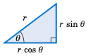

对于某些问题，记住以下内容可能会有所帮助：当一个直角三角形的斜边长度为 `r`，且有一个锐角为 :math:`\theta` 时，如右图所示，邻边的长度为 :math:`r\,\cos\theta`，对边的长度为 :math:`r\,\sin\theta`。你可以将这两个长度视为斜边的水平和垂直“分量”。

注意在上面的直角三角形中，我们已知的信息有两个：一个锐角和斜边的长度。由此我们可以求出另外两条边的长度，而另一个锐角只是已知锐角的余角。一般来说，一个三角形有六个要素：三条边和三个角。**解三角形** 的意思是根据已知的部分求出未知的部分。对于直角三角形而言，有一个要素总是已知的：其中一个角为 :math:`90^{\circ}`。

.. toggle::

    For some problems it may help to remember that when a right triangle has a hypotenuse of length ``r`` and an acute angle :math:`\theta`, as in the picture on the right, the adjacent side will have length :math:`r\,\cos\theta` and the opposite side will have length :math:`r\,\sin\theta`. You can think of those lengths as the horizontal and vertical "components" of the hypotenuse.

    Notice in the above right triangle that we were given two pieces of information: one of the acute angles and the length of the hypotenuse. From this we determined the lengths of the other two sides, and the other acute angle is just the complement of the known acute angle. In general, a triangle has six parts: three sides and three angles. **Solving a triangle** means finding the unknown parts based on the known parts. In the case of a right triangle, one part is always known: one of the angles is :math:`90^{\circ}`.

.. _Example 1.19:

.. admonition:: Example 1.19

    .. _Figure 1.3.3:

    .. _fig:solveright

    .. figure:: ./img/f1.3.3.png
        :align: right
    
        **Figure 1.3.3**

    解下图 :ref:`1.3.3 <fig:solveright>` 中的直角三角形，使用给定的信息：
    
    a. `c = 10`，:math:`A = 22^{\circ}`
    
    
    **解答：** 未知的部分是 :math:`A`、:math:`B` 和 :math:`B`。求解如下：
    
    .. math::
    
        \begin{alignat*}{7}
        a ~ &= ~ c\sin A ~ &= ~ 10\sin22^{\circ} ~ &= ~ 3.75\\
        b ~ &= ~ c\cos A ~ &= ~ 10\cos22^{\circ} ~ &= ~ 9.27\\
        B ~ &= ~ 90^{\circ} ~-~ A ~ &= ~ 90^{\circ} ~-~ 22^{\circ} ~ &= ~ 68^{\circ}
        \end{alignat*}
    
    b. `b = 8`， :math:`A = 40^{\circ}`
    
    
    **解答：** 未知的部分是 :math:`A`、:math:`C` 和 :math:`B`。求解如下：
    
    .. math::
    
        \begin{alignat*}{3}
        \frac{a}{b} ~ &= ~ \tan A \quad &\Rightarrow \quad a ~ &= ~ b\tan A ~ = ~
        8\tan40^{\circ} ~ = ~ 6.71\\[2mm]
        \frac{b}{c} ~ &= ~ \cos A \quad &\Rightarrow \quad c ~ &= ~ \frac{b}{\cos A} ~ = ~
        \frac{8}{\cos40^{\circ}} ~ = ~ 10.44
        \end{alignat*}
    
    .. math::
    
        B ~ = ~ 90^{\circ} ~-~ A ~ = ~ 90^{\circ} ~-~ 40^{\circ} ~ = ~ 50^{\circ}
    
    c. `a = 3`，`b = 4`
    
    
    **解答：** 未知的部分是 :math:`C`、:math:`A` 和 :math:`B`。由勾股定理可得：
    
    .. math::
    
        c ~=~ \sqrt{a^2 ~+~ b^2} ~=~ \sqrt{3^2 ~+~ 4^2} ~=~ \sqrt{25} ~=~ 5 ~.
    
    现在，:math:`\tan A = \frac{a}{b} = \frac{3}{4} = 0.75`。那我们该如何求 :math:`A` 呢？你的计算器上应该有一个标记为 :math:`{\boxed{\tan^{-1}}}` 的按键，它的使用方法如下：输入一个数字 :math:`x`，它会告诉你满足 :math:`\tan\theta = x` 的角 :math:`\theta`。在我们的例子中，我们希望求出满足 :math:`\tan A = 0.75` 的角 :math:`A`：
    
    .. math::
    
        \text{输入：} 0.75 \quad \text{按下：} \boxed{\tan^{-1}} \quad \text{结果：} 36.86989765
    
    这告诉我们 :math:`A ≈ 36.87^{\circ}`。因此，:math:`B = 90^{\circ} - A = 90^{\circ} - 36.87^{\circ} = 53.13^{\circ}`。

    注意：:math:`\boxed{\sin^{-1}}` 和 :math:`\boxed{\cos^{-1}}` 按键对于正弦和余弦函数也有类似的作用。这些按键使用的是 *反三角函数*，我们将在 :ref:`第 5 章 <c5>` 中进行讨论。

    .. toggle::
    
        Solve the right triangle in Figure :ref:`1.3.3 <fig:solveright>` using the given information:
    
        a. ``c = 10``, :math:`A = 22^{\circ}`
          
           **Solution:** The unknown parts are :math:`A`, :math:`B`, and :math:`B`. Solving yields:
    
           .. math::
    
              \begin{alignat*}{7}
              a ~ &= ~ c\sin A ~ &= ~ 10\sin22^{\circ} ~ &= ~ 3.75\\
              b ~ &= ~ c\cos A ~ &= ~ 10\cos22^{\circ} ~ &= ~ 9.27\\
              B ~ &= ~ 90^{\circ} ~-~ A ~ &= ~ 90^{\circ} ~-~ 22^{\circ} ~ &= ~ 68^{\circ}
              \end{alignat*}
    
        b. ``b = 8``, :math:`A = 40^{\circ}`
    
           **Solution:** The unknown parts are :math:`A`, :math:`C`, and :math:`B`. Solving yields:
    
           .. math::
    
              \begin{alignat*}{3}
              \frac{a}{b} ~ &= ~ \tan A \quad &\Rightarrow \quad a ~ &= ~ b\tan A ~ = ~
              8\tan40^{\circ} ~ = ~ 6.71\\[2mm]
              \frac{b}{c} ~ &= ~ \cos A \quad &\Rightarrow \quad c ~ &= ~ \frac{b}{\cos A} ~ = ~
              \frac{8}{\cos40^{\circ}} ~ = ~ 10.44
              \end{alignat*}
    
           .. math::
    
              B ~ = ~ 90^{\circ} ~-~ A ~ = ~ 90^{\circ} ~-~ 40^{\circ} ~ = ~ 50^{\circ}
    
        c. ``a = 3``, ``b = 4``
    
           **Solution:** The unknown parts are :math:`C`, :math:`A`, and :math:`B`. By the Pythagorean Theorem,
    
           .. math::
    
              c ~=~ \sqrt{a^2 ~+~ b^2} ~=~ \sqrt{3^2 ~+~ 4^2} ~=~ \sqrt{25} ~=~ 5 ~.
    
           Now, :math:`\tan A = \frac{a}{b} = \frac{3}{4} = 0.75`. So how do we find :math:`A`? There should be a key labeled :math:`{\boxed{\tan^{-1}}}` on your calculator, which works like this: give it a number :math:`x` and it will tell you the angle :math:`\theta` such that :math:`\tan\theta = x`. In our case, we want the angle :math:`A` such that :math:`\tan A = 0.75`:
    
           .. math::
    
              \text{Enter: } 0.75 \quad \text{Press:} \boxed{\tan^{-1}} \quad \text{Answer: } 36.86989765
    
           This tells us that :math:`A = 36.87^{\circ}`, approximately. Thus :math:`B = 90^{\circ} - A = 90^{\circ} - 36.87^{\circ} = 53.13^{\circ}`.
           Note: The :math:`\boxed{\sin^{-1}}` and :math:`\boxed{\cos^{-1}}` keys work similarly for sine and cosine, respectively. These keys use the *inverse trigonometric functions* , which we will discuss in :ref:`Chapter 5 <c5>`.

练习
~~~~~~~~~~~~~~
Exercises~~

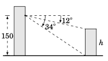

1. 一位观察者在距地面 150 英尺高的建筑物中，从当前位置测得某较小建筑物顶部和底部分别的俯角为 :math:`12^{\circ}` 和 :math:`34^{\circ}`，如右图所示。利用这些信息求出较小建筑物的高度 ``h``。

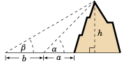

2. 推广示例 :ref:`1.12 <exmp:mountain>`：某人站在距山脚 :math:`A` 英尺处，从地面测得山顶的仰角为 :math:`\alpha`。该人随后直线向后走了 :math:`B` 英尺，测得山顶的仰角为 :math:`\beta`，如右图所示。假设地面水平，求山高 ``h`` 关于 :math:`A`、:math:`B`、:math:`\alpha` 和 :math:`\beta` 的公式。

3. 某塔顶至太阳的仰角在白天从 :math:`64^{\circ}` 下降到 :math:`49^{\circ}`，此过程中塔影在地面上的长度增加了 92 英尺。假设地面水平，求该塔的高度。

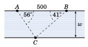

4. 一条河的两岸互相平行，河岸上一点 :math:`A` 到另一点 :math:`B` 的距离为 500 英尺。对岸有一点 :math:`C`，其中 :math:`\angle\,BAC = 56^{\circ}`，:math:`\angle\,ABC = 41^{\circ}`，如右图所示。求该河的宽度 ``w``。（*提示：将* :math:`\overline{AB}` *划分为两个部分。*）

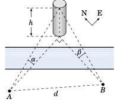

5. 一座塔位于河的一侧，恰好在另一侧的点 :math:`A` 的正东与点 :math:`B` 的正北方向上。从点 :math:`A` 和点 :math:`B` 分别测得塔顶的仰角为 :math:`\alpha` 和 :math:`\beta`，如右图所示。设 :math:`A` 与 :math:`B` 之间的距离为 ``d``，假设河的两岸地势相同，证明塔高 ``h`` 为：

   .. math::

      h ~=~ \frac{d}{\sqrt{(\cot\,\alpha)^2 ~+~ (\cot\,\beta)^2}} ~.

.. _exer:distmoon:

6. 月亮的赤道视差已被观测为约 :math:`57'`。假设地球半径为 3956.6 英里，估算地心到月球的距离。（*提示：参见示例* :ref:`1.15 <exmp:distsun>`。）

7. 地球上一位观察者测得从月亮一侧边缘到另一侧边缘的角度为 :math:`31'7''`。利用此信息估算月球的半径。（*提示：使用练习题* :ref:`6 <exer:distmoon>` *并参见示例* :ref:`1.16 <exmp:radsun>`。）

.. toggle::

    1. From a position ``150`` ft above the ground, an observer in a building measures angles of depression of :math:`12^{\circ}` and :math:`34^{\circ}` to the top and bottom, respectively, of a smaller building, as in the picture on the right. Use this to find the height ``h`` of the smaller building.
    
    .. figure:: ./img/28-1.png
        :align: right
    
    2. Generalize Example :ref:`1.12 <exmp:mountain>`: A person standing :math:`A` ft from the base of a mountain measures an angle of elevation :math:`\alpha` from the ground to the top of the mountain. The person then walks :math:`B` ft straight back and measures an angle of elevation :math:`\beta` to the top of the mountain, as in the picture on the right. Assuming the ground is level, find a formula for the height ``h`` of the mountain in terms of :math:`A`, :math:`B`, :math:`\alpha`, and :math:`\beta`.
    
    3. As the angle of elevation from the top of a tower to the sun decreases from :math:`64^{\circ}` to :math:`49^{\circ}` during the day, the length of the shadow of the tower increases by ``92`` ft along the ground. Assuming the ground is level, find the height of the tower.
    
    .. figure:: ./img/28-2.png
        :align: right
    
    4. Two banks of a river are parallel, and the distance between two points :math:`A` and :math:`B` along one bank is ``500`` ft. For a point :math:`C` on the opposite bank, :math:`\angle\,BAC = 56^{\circ}` and :math:`\angle\,ABC = 41^{\circ}`, as in the picture on the right. What is the width ``w`` of the river? ( *Hint: Divide* :math:`\overline{AB}` *into two pieces.* )
    
    .. figure:: ./img/28-3.png
        :align: right
    
    5. A tower on one side of a river is directly east and north of points :math:`A` and :math:`B`, respectively, on the other side of the river. The top of the tower has angles of elevation :math:`\alpha` and :math:`\beta` from :math:`A` and :math:`B`, respectively, as in the picture on the right. Let ``d`` be the distance between :math:`A` and :math:`B`. Assuming that both sides of the river are at the same elevation, show that the height ``h`` of the tower is
    
       .. math::
        
          h ~=~ \frac{d}{\sqrt{(\cot\,\alpha)^2 ~+~ (\cot\,\beta)^2}} ~.
    
    6. The equatorial parallax of the moon has been observed to be approximately :math:`57'`. Taking the radius of the earth to be ``3956.6`` miles, estimate the distance from the center of the earth to the moon. ( *Hint: See Example* :ref:`1.15 <exmp:distsun>`. )
    
    7. An observer on earth measures an angle of :math:`31'7''` from one visible edge of the moon to the other (opposite) edge. Use this to estimate the radius of the moon. ( *Hint: Use Exercise* :ref:`6 <exer:distmoon>` *and see Example* :ref:`1.16 <exmp:radsun>`. )

---------

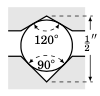

8. 一个滚珠轴承夹在两个金属槽之间，上槽的角度为 :math:`120^{\circ}`，下槽的角度为 :math:`90^{\circ}`，如右图所示。若槽顶点之间的距离为半英寸，求滚珠轴承的直径应为多少？可假设上顶点正好位于下顶点正上方。

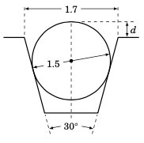

.. _exer:worm:

9. 右侧的机床图示显示了一个对称的 *蜗杆螺纹*，其中放置了一个直径为 ``1.5`` 英寸的圆形滚轮。根据图中的信息，求滚轮顶部高出螺纹顶部的高度 ``d``。（*提示：延长螺纹的斜边，直到它们在一点相交。*）

10. 重做练习 :ref:`9 <exer:worm>`，将蜗杆螺纹顶部的宽度改为 ``1.8`` 英寸。

11. 在练习 :ref:`9 <exer:worm>` 中，为了使 ``d`` 等于 ``0`` 英寸，蜗杆螺纹顶部的宽度应为多少？

12. 对于 Example :ref:`1.18 <exmp:crank>` 中滑块-连杆机构的 :math:`0^{\circ} < \theta < 90^{\circ}`，证明：

    .. math::
  
        c ~=~ \frac{\sqrt{b^2 ~-~ r^2 (\sin\,\theta)^2}}{\cos\theta} ~\qquad\text{and}\qquad~
        a ~=~ r\sin\theta ~+~ \sqrt{b^2 ~-~ r^2 (\sin\,\theta)^2}~\tan\theta ~.

    （*提示：在图* :ref:`1.3.2 <fig:crank>` *中，从点* :math:`B` *画垂直于* :math:`\overline{OA}` *和* :math:`\overline{AC}` *的线段。*）

.. figure:: ./img/29-2.png
    :align: right

13. 右侧的机床图示显示了一个对称的 *模冲头*。在此视图中，圆形尖端是一个半径为 ``r`` 的圆的一部分，斜边与该圆相切，且构成 :math:`54^{\circ}` 的角度。模冲头的上下边是水平的。根据图中的信息，求半径 ``r``。

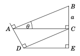

14. 在右图中，:math:`\angle\,BAC = \theta` 且 :math:`BC = a`。利用此信息，求 ``AB``、``AC``、``AD``、``DC``、``CE`` 和 ``DE``，均以 :math:`\theta` 和 :math:`A` 表示。（*提示：角* :math:`\angle\,ACD` *是多少？*）

.. _fig:exersolveright:

.. _Figure 1.3.4:

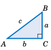

对于练习题 :ref:`15 <exer:solvrtfirst>` 到 :ref:`23 <exer:solvrtlast>`，使用给定信息解出图 :ref:`1.3.4 <fig:exersolveright>` 中的直角三角形。

.. toggle::

    8. A ball bearing sits between two metal grooves, with the top groove having an angle of :math:`120^{\circ}` and the bottom groove having an angle of :math:`90^{\circ}`, as in the picture on the right. What must the diameter of the ball bearing be for the distance between the vertexes of the grooves to be half an inch? You may assume that the top vertex is directly above the bottom vertex.
    
    .. figure:: ./img/29-1.png
        :align: right
    
    9. The machine tool diagram on the right shows a symmetric *worm thread* , in which a circular roller of diameter ``1.5`` inches sits. Find the amount ``d`` that the top of the roller rises above the top of the thread, given the information in the diagram. ( *Hint: Extend the slanted sides of the thread until they meet at a point.* )
    
    10. Repeat Exercise :ref:`9 <exer:worm>` using ``1.8`` inches as the distance across the top of the worm thread.
    
    11. In Exercise :ref:`9 <exer:worm>`, what would the distance across the top of the worm thread have to be to make ``d`` equal to ``0`` inches?
    
    12. For :math:`0^{\circ} < \theta < 90^{\circ}` in the slider-crank mechanism in Example :ref:`1.18 <exmp:crank>`, show that
    
        .. math::
      
            c ~=~ \frac{\sqrt{b^2 ~-~ r^2 (\sin\,\theta)^2}}{\cos\theta} ~\qquad\text{and}\qquad~
            a ~=~ r\sin\theta ~+~ \sqrt{b^2 ~-~ r^2 (\sin\,\theta)^2}~\tan\theta ~.
    
        ( *Hint: In Figure* :ref:`1.3.2 <fig:crank>` *draw line segments from* :math:`B` *perpendicular to* :math:`\overline{OA}` and :math:`\overline{AC}`. )
    
    .. figure:: ./img/29-2.png
        :align: right
    
    13. The machine tool diagram on the right shows a symmetric *die punch* . In this view, the rounded tip is part of a circle of radius ``r``, and the slanted sides are tangent to that circle and form an angle of :math:`54^{\circ}`. The top and bottom sides of the die punch are horizontal. Use the information in the diagram to find the radius ``r``.
    
    .. figure:: ./img/29-3.png
        :align: right
    
    14. In the figure on the right, :math:`\angle\,BAC = \theta` and :math:`BC = a`. Use this to find
        ``AB``, ``AC``, ``AD``, ``DC``, ``CE``, and ``DE`` in terms of :math:`\theta` and :math:`A`. ( *Hint: What is the angle* :math:`\angle\,ACD\,`? )
    
    .. figure:: ./img/f1.3.4.png
        :align: right
    
    For Exercises :ref:`15 <exer:solvrtfirst>` - :ref:`23 <exer:solvrtlast>`, solve the right triangle in Figure :ref:`1.3.4 <fig:exersolveright>` using the given information.

.. _exer:solvrtfirst:

15. :math:`a = 5`, :math:`b = 12`
16. :math:`c = 6`, :math:`B = 35^{\circ}`
17. :math:`b = 2`, :math:`A = 8^{\circ}`
18. :math:`a = 2`, :math:`c = 7`
19. :math:`a = 3`, :math:`A = 26^{\circ}`
20. :math:`b = 1`, :math:`c = 2`
21. :math:`b = 3`, :math:`B = 26^{\circ}`
22. :math:`a = 2`, :math:`B = 8^{\circ}`

.. _exer:solvrtlast:

23. :math:`c = 2`, :math:`A = 45^{\circ}`

24. 在第 1.2 节的示例 :ref:`1.10 <exmp:funcs75>` 中，我们找出了 :math:`75^{\circ}` 的所有六个三角函数的精确值。例如，我们展示了 :math:`\cot75^{\circ} = \frac{\sqrt{6} - \sqrt{2}}{\sqrt{6} + \sqrt{2}}`。因此，由于根据余角定理有 :math:`\tan15^{\circ} = \cot75^{\circ}`，这意味着 :math:`\tan15^{\circ} = \frac{\sqrt{6} - \sqrt{2}}{\sqrt{6} + \sqrt{2}}`。我们现在将介绍另一种方法，用于找出 :math:`15^{\circ}` 各三角函数的精确值。事实上，当已知 :math:`\theta` 的三角函数时，该方法可用于求任意 :math:`0^{\circ} < \theta < 90^{\circ}` 情况下 :math:`\frac{\theta}{2}` 的三角函数精确值。该方法如图 :ref:`1.3.5 <fig:semicircles>` 所示，具体如下所述。

    .. _Figure 1.3.5:
    
    .. _fig:semicircles:
    
    .. figure:: ./img/f1.3.5.png
        :align: center
    
        **图 1.3.5**

    画一个以某点 ``O`` 为圆心、半径为 ``1`` 的半圆，其位于一条水平线上。令 ``P`` 为该半圆上的一点，使得 :math:`\overline{OP}` 与水平线成 :math:`60^{\circ}` 角，如图 :ref:`1.3.5 <fig:semicircles>` 所示。从 ``P`` 向下作垂线交水平线于点 ``Q``。

    现在如下构造第二个半圆：设 :math:`A` 为第一个半圆的左端点，然后以 :math:`A` 为圆心，以 ``AP`` 为半径作一个新的半圆。接着以相同方式构造第三个半圆：设 :math:`B` 为第二个半圆的左端点，以 :math:`B` 为圆心，以 :math:`BP` 为半径作新半圆。

    按此过程可以无限继续构造更多半圆。一般来说，可以证明，从新半圆圆心到 ``P`` 的线段与水平线所成的角，是上一个半圆圆心到 ``P`` 的线段与水平线所成角的一半。

    a. 解释为何 :math:`\angle\,PAQ=30^{\circ}`。（*提示：* :math:`60^{\circ}` *的补角是多少？*）
    b. 解释为何 :math:`\angle\,PBQ=15^{\circ}` 且 :math:`\angle\,PCQ=7.5^{\circ}`。
    c. 利用图 :ref:`1.3.5 <fig:semicircles>` 求出 :math:`\sin15^{\circ}`、:math:`\cos15^{\circ}` 和 :math:`\tan15^{\circ}` 的精确值。（ *提示：首先需要使用* :math:`\angle\,POQ = 60^{\circ}` 和 :math:`OP = 1` *来求出* :math:`\overline{PQ}` 和 :math:`\overline{OQ}` *的精确长度。*）
    d. 利用图 :ref:`1.3.5 <fig:semicircles>` 计算 :math:`\tan7.5^{\circ}` 的精确值。
    e. 使用相同的方法，但初始角设为 :math:`\angle\,POQ = 45^{\circ}`，求出 :math:`\sin22.5^{\circ}`、:math:`\cos22.5^{\circ}` 和 :math:`\tan22.5^{\circ}` 的精确值。

.. toggle::

    24. In Example :ref:`1.10 <exmp:funcs75>` in Section 1.2, we found the exact values of all six trigonometric functions of :math:`75^{\circ}`. For example, we showed that :math:`\cot75^{\circ} = \frac{\sqrt{6} - \sqrt{2}}{\sqrt{6} + \sqrt{2}}`. So since :math:`\tan15^{\circ} = \cot75^{\circ}` by the Cofunction Theorem, this means that :math:`\tan15^{\circ} = \frac{\sqrt{6} - \sqrt{2}}{\sqrt{6} + \sqrt{2}}`. We will now describe another method for finding the exact values of the trigonometric functions of :math:`15^{\circ}`. In fact, it can be used to find the exact values for the trigonometric functions of :math:`\frac{\theta}{2}` when those for :math:`\theta` are known, for any :math:`0^{\circ} < \theta < 90^{\circ}`. The method is illustrated in Figure :ref:`1.3.5 <fig:semicircles>` and is described below.
        
        .. figure:: ./img/f1.3.5.png
            :align: center
        
            **Figure 1.3.5**
    
        Draw a semicircle of radius ``1`` centered at a point ``O`` on a horizontal line. Let ``P`` be the point on the semicircle such that :math:`\overline{OP}` makes an angle of :math:`60^{\circ}` with the horizontal line, as in Figure :ref:`1.3.5 <fig:semicircles>`. Draw a line straight down from ``P`` to the horizontal line at the point ``Q``.
    
        Now create a second semicircle as follows: Let :math:`A` be the left endpoint of the first semicircle, then draw a new semicircle centered at :math:`A` with radius equal to ``AP``. Then create a third semicircle in the same way: Let :math:`B` be the left endpoint of the second semicircle, then draw a new semicircle centered at :math:`B` with radius equal to :math:`BP`.
    
        This procedure can be continued indefinitely to create more semicircles. In general, it can be shown that the line segment from the center of the new semicircle to ``P`` makes an angle with the horizontal line equal to half the angle from the previous semicircle's center to ``P``.
    
        a. Explain why :math:`\angle\,PAQ=30^{\circ}`. ( *Hint: What is the supplement of* :math:`60^{\circ}`?)
        b. Explain why :math:`\angle\,PBQ=15^{\circ}` and :math:`\angle\,PCQ=7.5^{\circ}`.
        c. Use Figure :ref:`1.3.5 <fig:semicircles>` to find the exact values of :math:`\sin15^{\circ}`, :math:`\cos15^{\circ}`, and :math:`\tan15^{\circ}`. ( *Hint: To start, you will need to use* :math:`\angle\,POQ = 60^{\circ}` *and* :math:`OP = 1` *to find the exact lengths of* :math:`\overline{PQ}` *and* :math:`\overline{OQ}`. )
        d. Use Figure :ref:`1.3.5 <fig:semicircles>` to calculate the exact value of :math:`\tan7.5^{\circ}`.
        e. Use the same method but with an initial angle of :math:`\angle\,POQ = 45^{\circ}` to find the exact values of :math:`\sin22.5^{\circ}`, :math:`\cos22.5^{\circ}`, and :math:`\tan22.5^{\circ}`.

--------

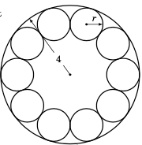

25. 一家制造商需要将十个相同的滚珠轴承靠在一个圆形容器的内侧放置，使得每个滚珠轴承都与另外两个滚珠轴承接触，如右图所示。容器的（内）半径为 ``4`` 厘米。

    a. 求滚珠轴承的公共半径 ``r``。
    b. 制造商需要在容器内放置一个圆形环。该圆环的最大可能（外）半径是多少，要求它不在滚珠轴承上方，且其底部与容器底部齐平？

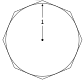

26. 一个半径为 ``1`` 的圆 *内切* 于一个边长相等的八边形内，这种八边形称为 *正八边形*。也就是说，这八条边都与圆相切，如右图所示。

    a. 计算该正八边形的面积。
    b. 如果增加多边形的边数，其内部面积是增加还是减少？该面积会趋近于某个数值吗？请解释。
    c. 在同一个圆内画一个内接正八边形，也就是说画一个正八边形，使其每个顶点都接触圆。计算该内接正八边形的面积。

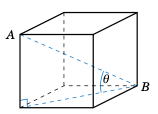

27. 右图展示了一个边长为 ``a > 0`` 的立方体。

    a. 求对角线线段 :math:`\overline{AB}` 的长度。
    b. 求线段 :math:`\overline{AB}` 与立方体底面的夹角 :math:`\theta`。

.. _fig:exerAD:

.. _Figure 1.3.6

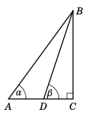

    **图 1.3.6**

28. 在图 :ref:`1.3.6 <fig:exerAD>` 中，假设已知 :math:`\alpha`、:math:`\beta` 和 :math:`AD`。证明以下等式：

    a. :math:`BC ~=~ \dfrac{AD}{\cot\alpha - \cot\beta}`
    b. :math:`AC ~=~ \dfrac{AD\cdot\tan\beta}{\tan\beta - \tan\alpha}`
    c. :math:`BD ~=~ \dfrac{AD\cdot\sin\alpha}{\sin(\beta - \alpha)}` （*提示：角* :math:`\angle\,ABD` *的度数是多少？*）

29. A 和 B 两人在海边，他们的眼睛分别距离海平面 ``5`` 英尺和 ``6`` 英尺。B 所看到的地平线比 A 远多少英里？（注：``1`` 英里 = ``5280`` 英尺）


.. toggle::

    25. A manufacturer needs to place ten identical ball bearings against the inner side of a circular container such that each ball bearing touches two other ball bearings, as in the picture on the right. The (inner) radius of the container is ``4`` cm.
     
        a. Find the common radius ``r`` of the ball bearings.
        b. The manufacturer needs to place a circular ring inside the container. What is the largest possible (outer) radius of the ring such that it is not on top of the ball bearings and its base is level with the base of the container?
    
    .. figure:: ./img/31-1.png
        :align: right
    
    26. A circle of radius ``1`` is *inscribed* inside a polygon with eight sides of equal length, called a *regular octagon* . That is, each of the eight sides is tangent to the circle, as in the picture on the right.
    
        a. Calculate the area of the octagon.
        b. If you were to increase the number of sides of the polygon, would the area inside it increase or decrease? What number would the area approach, if any? Explain.
        c. Inscribe a regular octagon inside the same circle. That is, draw a regular octagon such that each of its eight vertexes touches the circle. Calculate the area of this octagon.
     
    .. figure:: ./img/31-2.png
        :align: right
    
    27. The picture on the right shows a cube whose sides are of length ``a > 0``.
      
        a. Find the length of the diagonal line segment :math:`\overline{AB}`.
        b. Find the angle :math:`\theta` that :math:`\overline{AB}` makes with the base of the cube.
    
    .. figure:: ./img/f1.3.6.png
        :align: right
    
        **Figure 1.3.6**
    
    28. In Figure :ref:`1.3.6 <fig:exerAD>`, suppose that :math:`\alpha`, :math:`\beta`, and :math:`AD` are known. Show that:
    
        a. :math:`BC ~=~ \dfrac{AD}{\cot\alpha - \cot\beta}`
        b. :math:`AC ~=~ \dfrac{AD\cdot\tan\beta}{\tan\beta - \tan\alpha}`
        c. :math:`BD ~=~ \dfrac{AD\cdot\sin\alpha}{\sin(\beta - \alpha)}` ( *Hint: What is the measure of the angle* :math:`\angle\,ABD`? )
    
    29. Persons A and B are at the beach, their eyes are ``5`` ft and ``6`` ft, respectively, above sea level. How many miles farther out is Person B's horizon than Person A's? (Note: ``1`` mile = ``5280`` ft)
    
1.4 任意角的三角函数
-----------------------------------------
1.4 Trigonometric Functions of Any Angle

为了定义 *任意* 角度（包括小于 :math:`0^{\circ}` 或大于 :math:`360^{\circ}` 的角度）对应的三角函数，我们需要一个更一般的角度定义。我们说，一个 **角** 是通过绕端点 `O` （称为 **顶点** ）旋转射线 :math:`\overrightarrow{OA}` 而形成的，使得该射线到达一个新位置，记为射线 :math:`\overrightarrow{OB}`。射线 :math:`\overrightarrow{OA}` 称为该角的 **初边** ，而 :math:`\overrightarrow{OB}` 称为该角的 **终边** （见图 :ref:`1.4.1(a) <fig:genangle>`）。

.. _fig:genangle:

.. _Figure 1.4.1:

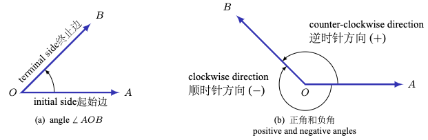

    **图 1.4.1 一般角的定义**

我们用 :math:`\angle\,AOB`，或者简记为 :math:`\angle\,O`，甚至直接记作 `O` 来表示这个旋转所形成的角度。如果旋转方向为逆时针，则称该角为 **正角** ；若旋转方向为顺时针，则称其为 **负角** （见图 :ref:`1.4.1(b) <fig:genangle>`）。

将 :math:`\overrightarrow{OA}` 完整逆时针旋转一圈回到自身（称为一次 **周转** ），使终边与初边重合，此时角度为 :math:`360^{\circ}` ；若为顺时针旋转，则为 :math:`-360^{\circ}` 。 [6]_ 若没有对 :math:`\overrightarrow{OA}` 进行任何旋转，则表示角度为 :math:`0^{\circ}` 。超过一次完整旋转会产生大于 :math:`360^{\circ}` 的角度。例如，如图 :ref:`1.4.2 <fig:plus360>` 所示，:math:`30^{\circ}` 和 :math:`390^{\circ}` 拥有相同的终边，因为 `30 + 360 = 390`。

.. [6] 以度数来度量角度的系统，即将 :math:`360^{\circ}` 定义为一次周转，起源于古巴比伦。人们常认为这个 `360` 的来源是因为巴比伦人（据说）认为一年有 `360` 天（即地球绕太阳一圈）。不过也有一种更合理的解释认为，在古代，一个人一天内可以行走 `12` 个 *巴比伦里程* （即地球自转一圈）。一个巴比伦里程大约相当于我们现在的 `7` 英里，便于将其划分为 `30` 等份，这样一圈就有 :math:`12 \times 30 = 360` 等份。参见 **H. Eves**, *An Introduction to the History of Mathematics*, 第五版，第 26 页，New York: Saunders College Publishing, 1983。

       The system of measuring angles in degrees, such that :math:`360^{\circ}` is one revolution, originated in ancient Babylonia. It is often assumed that the number ``360`` was used because the Babylonians (supposedly) thought that there were ``360`` days in a year (a year, of course, is one full revolution of the Earth around the Sun). However, there is another, perhaps more likely, explanation which says that in ancient times a person could travel ``12`` *Babylonian miles* in one day (i.e. one full rotation of the Earth about its axis). The Babylonian mile was large enough (approximately ``7`` of our miles) to be divided into ``30`` equal parts for convenience, thus giving :math:`12 \times 30 = 360` equal parts in a full rotation. See p.26 in **H. Eves**, *An Introduction to the History of Mathematics*, 5th ed., New York: Saunders College Publishing, 1983.

.. _Figure 1.4.2:

.. _fig:xyplane:

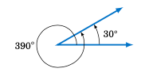

    **图 1.4.2**


我们现在可以用 **笛卡尔坐标系** 来定义任意角度的三角函数。回顾一下， **xy 坐标平面** 中的点是由一对实数 `(x, y)` 所表示的。第一个数 :math:`x` 是该点的 **x 坐标** ，第二个数 :math:`y` 是其 **y 坐标** 。:math:`x` 与 :math:`y` 坐标由其在 **x 轴** 与 **y 轴** 上的位置决定，从而确定点在平面中的位置。这样，xy 坐标平面被划分为四个 **象限** （分别记为 QI、QII、QIII、QIV），其划分依据是 :math:`x` 与 :math:`y` 的正负（见图 :ref:`1.4.3(a)-(b) <fig:xyplane>`）。

.. _Figure 1.4.3:

.. _fig:plus360:

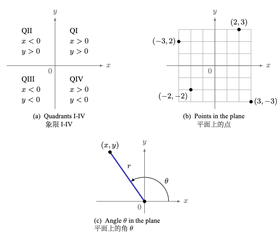

    **图 1.4.3 xy 坐标平面**


设 :math:`\theta` 是任意角。若其初边位于正 :math:`x` 轴，且顶点为原点 :math:`(0, 0)`，则称 :math:`\theta` 处于 **标准位置** 。在 :math:`\theta` 的终边上任取一点 :math:`(x, y)`，其到原点的距离为 `r > 0` （见图 :ref:`1.4.3(c) <fig:xyplane>` ）。（注意：:math:`r = \sqrt{x^2 + y^2}`。为什么？）我们据此定义 :math:`\theta` 的三角函数如下：

.. _eqn:gentrig1:

.. math::
    :label: equation 1.2

    \sin\theta ~=~ \dfrac{y}{r} \qquad\qquad
    \cos\theta ~=~ \dfrac{x}{r} \qquad\qquad
    \tan\theta ~=~ \dfrac{y}{x}

.. _eqn:gentrig2:

.. math::
    :label: equation 1.3

    \csc\theta ~=~ \dfrac{r}{y} \qquad\qquad
    \sec\theta ~=~ \dfrac{r}{x} \qquad\qquad
    \cot\theta ~=~ \dfrac{x}{y}

就像在锐角情形中一样，通过相似三角形可以证明这些定义是良定义的（即它们不依赖于我们在 :math:`\theta` 的终边上选择哪一个 `(x, y)` 点）。另外注意到，:math:`\mid \sin \theta \mid \le 1` 且 :math:`\mid \cos \theta \mid \le 1`，因为在上述定义中有 :math:`\mid y \mid \le r` 且 :math:`\mid x \mid \le r`。


.. toggle::

    To define the trigonometric functions of *any* angle - including angles less than :math:`0^{\circ}` or greater than :math:`360^{\circ}` - we need a more general definition of an angle. We say that an **angle** is formed by rotating a ray :math:`\overrightarrow{OA}` about the endpoint ``O`` (called the **vertex** ), so that the ray is in a new position, denoted by the ray :math:`\overrightarrow{OB}`. The ray :math:`\overrightarrow{OA}` is called the **initial side** of the angle, and :math:`\overrightarrow{OB}` is the
    **terminal side** of the angle (see Figure :ref:`1.4.1 (a) <fig:genangle>`).

    .. figure:: ./img/f1.4.1.png
        :align: center

        **Figure 1.4.1 Definition of a general angle**

    We denote the angle formed by this rotation as :math:`\angle\,AOB`, or simply :math:`\angle\,O`, or even just ``O``. If the rotation is counter-clockwise then we say that the angle is **positive**, and the angle is **negative** if the rotation is clockwise (see Figure :ref:`1.4.1(b) <fig:genangle>`).

    One full counter-clockwise rotation of :math:`\overrightarrow{OA}` back onto itself (called a **revolution** ), so that the terminal side coincides with the initial side, is an angle of :math:`360^{\circ}`; in the clockwise direction this would be :ref:`-360^{\circ}`. [6]_ Not rotating :math:`\overrightarrow{OA}` constitutes an angle of :math:`0^{\circ}`. More than one full rotation creates an angle greater than :math:`360^{\circ}`. For example, notice that :math:`30^{\circ}` and :math:`390^{\circ}` have the same terminal side in Figure :ref:`1.4.2 <fig:plus360>`, since ``30 + 360 = 390``.

    .. figure:: ./img/f1.4.2.png
        :align: center

        **Figure 1.4.2**

    We can now define the trigonometric functions of any angle in terms of **Cartesian coordinates**. Recall that the **xy-coordinate plane** consists of points denoted by pairs ``(x,y)`` of real numbers. The first number, :math:`x`, is the point's **x coordinate**, and the second number, :math:`y`, is its **y coordinate**. The :math:`x` and :math:`y` coordinates are measured by their positions along the **x-axis** and **y-axis**, respectively, which determine the point's position in the plane. This divides the xy-coordinate plane into four **quadrants** (denoted by QI, QII, QIII, QIV), based on the signs of :math:`x` and :math:`y` (see Figure :ref:`1.4.3 (a)-(b) <fig:xyplane>`).

    .. figure:: ./img/f1.4.3.png
        :align: center

        **Figure 1.4.3 xy-coordinate plane**

    Now let :math:`\theta` be any angle. We say that :math:`\theta` is in **standard position** if its initial side is the positive :math:`x`-axis and its vertex is the origin :math:`(0,0)`. Pick *any* point :math:`(x,y)` on the terminal side of :math:`\theta` a distance ``r>0`` from the origin (see Figure :ref:`1.4.3(c) <fig:xyplane>`). (Note that :math:`r = \sqrt{ x^2 + y^2 }`. Why?) We then define the trigonometric functions of :math:`\theta` as follows:

    .. math::

        \sin\theta ~=~ \dfrac{y}{r} \qquad\qquad
        \cos\theta ~=~ \dfrac{x}{r} \qquad\qquad
        \tan\theta ~=~ \dfrac{y}{x}
        
    .. math::

        \csc\theta ~=~ \dfrac{r}{y} \qquad\qquad
        \sec\theta ~=~ \dfrac{r}{x} \qquad\qquad
        \cot\theta ~=~ \dfrac{x}{y}

    As in the acute case, by the use of similar triangles these definitions are well-defined (i.e. they do not depend on which point ``(x,y)`` we choose on the terminal side of :math:`\theta`). Also, notice that :math:`\mid \sin \theta \mid \le 1` and :math:`\mid \cos \theta \mid \le 1`, since :math:`\mid y \mid \le r` and :math:`\mid x \mid \le r` in the above definitions.

-------

请注意，对于锐角的情况，这些定义等价于我们先前基于直角三角形的定义：画一个包含角 :math:`\theta` 的直角三角形，使得 :math:`x = \text{邻边}`，:math:`y = \text{对边}`，而 :math:`r = \text{斜边}`。例如，这将给出 :math:`\sin\theta = \frac{y}{r} = \frac{\text{对边}}{\text{斜边}}` 和 :math:`\cos\theta = \frac{x}{r} = \frac{\text{邻边}}{\text{斜边}}`，与之前一致（见图 :ref:`1.4.4(a) <fig:gentrig>`）。

.. _Figure 1.4.4:

.. _fig:gentrig:

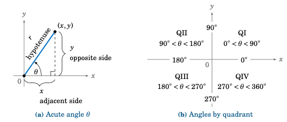

    **图 1.4.4**

在图 :ref:`1.4.4(b) <fig:gentrig>` 中，我们看到角 :math:`0^{\circ} \le \theta < 360^{\circ}` 的终边可能落在哪些象限或哪些坐标轴上。由图 :ref:`1.4.4(a) <fig:gentrig>` 以及公式 (:ref:`1.2 <eqn:gentrig1>`) 和 (:ref:`1.3 <eqn:gentrig2>`) 可知，三角函数可能为负值。例如，当 ``y<0`` 时，:math:`\sin\theta < 0`。图 :ref:`1.4.5 <fig:signchart>` 总结了各象限中三角函数的符号（正或负）：

.. _Figure 1.4.5:

.. _fig:signchart:

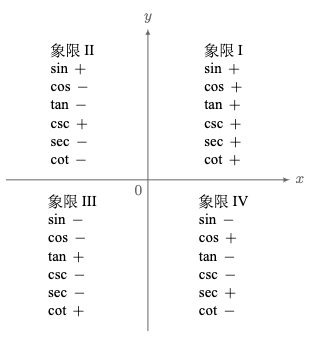

    **图 1.4.5 各象限中三角函数的符号**


.. toggle::

    Notice that in the case of an acute angle these definitions are equivalent to our earlier definitions in terms of right triangles: draw a right triangle with angle :math:`\theta` such that :math:`x = \text{adjacent side}`, :math:`y = \text{opposite side}`, and :math:`r = \text{hypotenuse}`. For example, this would give us :math:`\sin\theta = \frac{y}{r} = \frac{\text{opposite}}{\text{hypotenuse}}` and :math:`\cos\theta = \frac{x}{r} = \frac{\text{adjacent}}{\text{hypotenuse}}`, just as before (see Figure :ref:`1.4.4(a) <fig:gentrig>`).

    .. figure:: ./img/f1.4.4.png
        :align: center

        **Figure 1.4.4**

    In Figure :ref:`1.4.4(b) <fig:gentrig>` we see in which quadrants or on which axes the terminal side of an angle :math:`0^{\circ} \le \theta < 360^{\circ}` may fall. From Figure :ref:`1.4.4(a) <fig:gentrig>` and formulas (:ref:`1.2 <eqn:gentrig1>`) and (:ref:`1.3 <eqn:gentrig2>`), we see that we can get negative values for a trigonometric function. For example, :math:`\sin\theta < 0` when ``y<0``. Figure :ref:`1.4.5 <fig:signchart>` summarizes the signs (positive or negative) for the trigonometric functions based on the angle's quadrant:

    .. figure:: ./img/f1.4.5.png
        :align: center

        **Figure 1.4.5 Signs of the trigonometric functions by quadrant**

----------

.. _Example 1.20:

.. _exmp:funcs120:

.. admonition:: Example 1.20

    .. figure:: ./img/35-0.png
        :align: right

    求出 :math:`120^{\circ}` 的所有六个三角函数的精确值。

    **解答：** 我们知道 :math:`120^{\circ} = 180^{\circ} - 60^{\circ}`。根据第 1.2 节中例题 :ref:`1.7 <exmp:funcs60>`，我们可以使用点 :math:`(-1,\sqrt{3})` 作为角 :math:`120^{\circ}` 在第二象限终边上的一个点，因为在该例题中我们看到，一个包含 :math:`60^{\circ}` 的基本直角三角形的邻边长为 ``1``，对边长为 :math:`\sqrt{3}`，斜边长为 ``2``，如右图所示。在第二象限中绘制该三角形，使斜边落在 :math:`120^{\circ}` 的终边上，则 ``r = 2``， ``x = -1``，:math:`y = \sqrt{3}`。因此：

    .. toggle::

        Find the exact values of all six trigonometric functions of :math:`120^{\circ}`.

        **Solution:** We know :math:`120^{\circ} = 180^{\circ} - 60^{\circ}`. By Example :ref:`1.7 <exmp:funcs60>` in Section 1.2, we see that we can use the point :math:`(-1,\sqrt{3})` on the terminal side of the angle :math:`120^{\circ}` in QII, since we saw in that example that a basic right triangle with a :math:`60^{\circ}` angle has adjacent side of length ``1``, opposite side of length :math:`\sqrt{3}`, and hypotenuse of length ``2``, as in the figure on the right. Drawing that triangle in QII so that the hypotenuse is on the terminal side of :math:`120^{\circ}` makes ``r = 2``, ``x=-1``, and :math:`y=\sqrt{3}`. Hence:

    .. math::

        \sin120^{\circ} = \dfrac{y}{r} = \dfrac{\sqrt{3}}{2} \qquad
        \cos120^{\circ} = \dfrac{x}{r} = \dfrac{-1}{2} \qquad
        \tan120^{\circ} = \dfrac{y}{x} = \dfrac{\sqrt{3}}{-1} \,=\, -\sqrt{3}

    .. math::
      
      \csc120^{\circ} = \dfrac{r}{y} = \dfrac{2}{\sqrt{3}} \qquad
      \sec120^{\circ} = \dfrac{r}{x} = \dfrac{2}{-1} = -2 \qquad
      \cot120^{\circ} = \dfrac{x}{y} = \dfrac{-1}{\sqrt{3}}


.. _Example 1.21:

.. _exmp:funcs225:

.. admonition:: Example 1.21

    .. figure:: ./img/e1.21.png
        :align: right

    求出 :math:`225^{\circ}` 的所有六个三角函数的精确值。

    **解答：** 我们知道 :math:`225^{\circ} = 180^{\circ} + 45^{\circ}`。根据第 1.2 节中例题 :ref:`1.6 <exmp:funcs45>`，我们可以使用点 ``(-1,-1)`` 作为角 :math:`225^{\circ}` 在第三象限终边上的一个点，因为在该例题中我们看到，一个包含 :math:`45^{\circ}` 的基本直角三角形的邻边长为 ``1``，对边长为 ``1``，斜边长为 :math:`\sqrt{2}`，如右图所示。在第三象限中绘制该三角形，使斜边落在 :math:`225^{\circ}` 的终边上，则 :math:`r = \sqrt{2}`，:math:`x = -1`，:math:`y = -1`。因此：

    .. toggle::

        Find the exact values of all six trigonometric functions of :math:`225^{\circ}`.

        **Solution:** We know that :math:`225^{\circ} = 180^{\circ} + 45^{\circ}`. By
        Example :ref:`1.6 <exmp:funcs45>` in Section 1.2, we see that we can use the point ``(-1,-1)`` on
        the terminal side of the angle :math:`225^{\circ}` in QIII, since we saw in that example that a basic
        right triangle with a :math:`45^{\circ}` angle has adjacent side of length ``1``, opposite side of length
        ``1``, and hypotenuse of length :math:`\sqrt{2}`, as in the figure on the right. Drawing that triangle in
        QIII so that the hypotenuse is on the terminal side of :math:`225^{\circ}` makes :math:`r = \sqrt{2}`, :math:`x=-1`, and :math:`y=-1`. Hence:

    .. math::

        \sin225^{\circ} = \dfrac{y}{r} = \dfrac{-1}{\sqrt{2}} \qquad
        \cos225^{\circ} = \dfrac{x}{r} = \dfrac{-1}{\sqrt{2}} \qquad
        \tan225^{\circ} = \dfrac{y}{x} = \dfrac{-1}{-1} \,=\, 1

    .. math::

        \csc225^{\circ} = \dfrac{r}{y} = -\sqrt{2} \qquad
        \sec225^{\circ} = \dfrac{r}{x} = -\sqrt{2} \qquad
        \cot225^{\circ} = \dfrac{x}{y} = \dfrac{-1}{-1} \,=\, 1

.. _Example 1.22:

.. _exmp:funcs330:

.. admonition:: Example 1.22

    .. figure:: ./img/e1.22.png
        :align: right

    求出 :math:`330^{\circ}` 的所有六个三角函数的精确值。

    **解答：** 我们知道 :math:`330^{\circ} = 360^{\circ} - 30^{\circ}`。根据第 1.2 节中例题 :ref:`1.7 <exmp:funcs60>`，我们可以使用点 :math:`(\sqrt{3},-1)` 作为角 :math:`330^{\circ}` 在第四象限终边上的一个点，因为在该例题中我们看到，一个包含 :math:`30^{\circ}` 的基本直角三角形的邻边长为 :math:`\sqrt{3}`，对边长为 ``1``，斜边长为 ``2``，如右图所示。在第四象限中绘制该三角形，使斜边落在 :math:`330^{\circ}` 的终边上，则 :math:`r = 2`，:math:`x=\sqrt{3}`，:math:`y=-1`。因此：
    
    .. toggle::

        Find the exact values of all six trigonometric functions of :math:`330^{\circ}`.

        **Solution:** We know that :math:`330^{\circ} = 360^{\circ} - 30^{\circ}`. By Example :ref:`1.7 <exmp:funcs60>` in Section 1.2, we see that we can use the point :math:`(\sqrt{3},-1)` on the terminal side of the angle :math:`225^{\circ}` in QIV, since we saw in that example that a basic right triangle with a :math:`30^{\circ}` angle has adjacent side of length :math:`\sqrt{3}`, opposite side of length ``1``, and hypotenuse of length ``2``, as in the figure on the right. Drawing that triangle in QIV so that the hypotenuse is on the terminal side of :math:`330^{\circ}` makes :math:`r = 2`, :math:`x=\sqrt{3}`, and :math:`y=-1`. Hence:

    .. math::

        \sin330^{\circ} = \dfrac{y}{r} = \dfrac{-1}{2} \qquad
        \cos330^{\circ} = \dfrac{x}{r} = \dfrac{\sqrt{3}}{2} \qquad
        \tan330^{\circ} = \dfrac{y}{x} = \dfrac{-1}{\sqrt{3}}

    .. math::

        \csc330^{\circ} = \dfrac{r}{y} = -2 \qquad
        \sec330^{\circ} = \dfrac{r}{x} = \dfrac{2}{\sqrt{3}} \qquad
        \cot330^{\circ} = \dfrac{x}{y} = -\sqrt{3}

.. _Example 1.23:

.. _exmp:funcs0:

.. admonition:: Example 1.23

    .. _Figure 1.4.6:

    .. _fig:funcs0:

    .. figure:: ./img/f1.4.6.png
        :align: right

        **Figure 1.4.6**

    求出 :math:`0^{\circ}`、:math:`90^{\circ}`、:math:`180^{\circ}` 和 :math:`270^{\circ}` 的所有六个三角函数的精确值。

    **解答：** 这些角与我们目前所考虑的角不同，因为它们的终边都位于 :math:`x` 轴或 :math:`y` 轴上。因此与之前的例题不同，我们无法绘制任何直角三角形。然而，通过选择这些角的终边上的最简单的点，并使用公式 (:ref:`1.2 <eqn:gentrig1>`) 和 (:ref:`1.3 <eqn:gentrig2>`) 中的定义，可以轻松计算出三角函数的值。

    例如，对于角 :math:`0^{\circ}`，在其终边（正 :math:`x` 轴）上选取点 ``(1,0)``
    ，如图 :ref:`1.4.6 <fig:funcs0>` 所示。可以把从原点到 ``(1,0)`` 的线段看作是一个退化的直角三角形，其高为 ``0``，斜边和底边的长度相等，都是 ``1``。无论如何，在公式中我们使用 ``r = 1``，``x = 1``，``y = 0``。因此：

    .. math::

        \sin0^{\circ} = \dfrac{y}{r} = \dfrac{0}{1} = 0 \qquad
        \cos0^{\circ} = \dfrac{x}{r} = \dfrac{1}{1} = 1 \qquad
        \tan0^{\circ} = \dfrac{y}{x} = \dfrac{0}{1} = 0

    .. math::

        \csc0^{\circ} = \dfrac{r}{y} = \dfrac{1}{0} = \text{未定义}\qquad
        \sec0^{\circ} = \dfrac{r}{x} = \dfrac{1}{1} = 1 \qquad
        \cot0^{\circ} = \dfrac{x}{y} = \dfrac{1}{0} = \text{未定义}

    注意 :math:`\csc0^{\circ}` 和 :math:`\cot0^{\circ}` 是未定义的，因为不能除以 ``0``。

    类似地，从图 :ref:`1.4.6 <fig:funcs0>` 可知，:math:`90^{\circ}` 的终边是正 :math:`y` 轴，所以选取点 ``(0,1)``。同样地，可以把从原点到 ``(0,1)`` 的线段看作是一个退化的直角三角形，其底边长度为 ``0``，高等于斜边的长度。此时 ``r = 1``，``x = 0``，``y = 1``，因此：

    .. math::

        \sin90^{\circ} = \dfrac{y}{r} = \dfrac{1}{1} = 1 \qquad
        \cos90^{\circ} = \dfrac{x}{r} = \dfrac{0}{1} = 0 \qquad
        \tan90^{\circ} = \dfrac{y}{x} = \dfrac{1}{0} = \text{未定义}

    .. math::

      \csc90^{\circ} = \dfrac{r}{y} = \dfrac{1}{1} = 1\qquad
      \sec90^{\circ} = \dfrac{r}{x} = \dfrac{1}{0} = \text{未定义}\qquad
      \cot90^{\circ} = \dfrac{x}{y} = \dfrac{0}{1} = 0

    同样地，对于 :math:`180^{\circ}`，选取点 ``(-1,0)``，此时 ``r = 1``，``x = -1``，``y = 0``。因此：

    .. math::

        \sin180^{\circ} = \dfrac{y}{r} = \dfrac{0}{1} = 0 \qquad
        \cos180^{\circ} = \dfrac{x}{r} = \dfrac{-1}{1} = -1 \qquad
        \tan180^{\circ} = \dfrac{y}{x} = \dfrac{0}{-1} = 0

    .. math::

        \csc180^{\circ} = \dfrac{r}{y} = \dfrac{1}{0} = \text{未定义}\quad
        \sec180^{\circ} = \dfrac{r}{x} = \dfrac{1}{-1} = -1\quad
        \cot180^{\circ} = \dfrac{x}{y} = \dfrac{-1}{0} = \text{未定义}

    最后，对于 :math:`270^{\circ}`，选取点 ``(0,-1)``，则 ``r = 1``，``x = 0``，``y = -1``。因此：

    .. math::

      \sin270^{\circ} = \dfrac{y}{r} = \dfrac{-1}{1} = -1 \qquad
      \cos270^{\circ} = \dfrac{x}{r} = \dfrac{0}{1} = 0 \qquad
      \tan270^{\circ} = \dfrac{y}{x} = \dfrac{-1}{0} = \text{未定义}
    
    .. math::

        \csc270^{\circ} = \dfrac{r}{y} = \dfrac{1}{-1} = -1\qquad
        \sec270^{\circ} = \dfrac{r}{x} = \dfrac{1}{0} = \text{未定义}\qquad
        \cot270^{\circ} = \dfrac{x}{y} = \dfrac{0}{-1} = 0


    .. toggle::

        Find the exact values of all six trigonometric functions of :math:`0^{\circ}`, :math:`90^{\circ}`, :math:`180^{\circ}`, and :math:`270^{\circ}`.
    
        **Solution:** These angles are different from the angles we have considered so far, in that the terminal sides lie along either the :math:`x`-axis or the :math:`y`-axis. So unlike the previous examples, we do not have any right triangles to draw. However, the values of the trigonometric functions are easy to calculate by picking the simplest points on their terminal sides and then using the definitions in formulas (:ref:`1.2 <eqn:gentrig1>`) and (:ref:`1.3 <eqn:gentrig2>`).
    
        For instance, for the angle :math:`0^{\circ}` use the point ``(1,0)`` on its terminal side (the positive :math:`x`-axis), as in Figure :ref:`1.4.6 <fig:funcs0>`. You could think of the line segment from the origin to the point ``(1,0)`` as sort of a degenerate right triangle whose height is ``0`` and whose hypotenuse and base have the same length ``1``. Regardless, in the formulas we would use ``r = 1``, ``x = 1``, and ``y = 0``. Hence:
    
        .. math::
    
            \sin0^{\circ} = \dfrac{y}{r} = \dfrac{0}{1} = 0 \qquad
            \cos0^{\circ} = \dfrac{x}{r} = \dfrac{1}{1} = 1 \qquad
            \tan0^{\circ} = \dfrac{y}{x} = \dfrac{0}{1} = 0
    
        .. math::
    
            \csc0^{\circ} = \dfrac{r}{y} = \dfrac{1}{0} = \text{undefined}\qquad
            \sec0^{\circ} = \dfrac{r}{x} = \dfrac{1}{1} = 1 \qquad
            \cot0^{\circ} = \dfrac{x}{y} = \dfrac{1}{0} = \text{undefined}
     
        Note that :math:`\csc0^{\circ}` and :math:`\cot0^{\circ}` are undefined, since division by ``0`` is not allowed.
    
        Similarly, from Figure :ref:`1.4.6 <fig:funcs0>` we see that for :math:`90^{\circ}` the terminal side is the positive :math:`y`-axis, so use the point ``(0,1)``. Again, you could think of the line segment from the origin to ``(0,1)`` as a degenerate right triangle whose base has length ``0`` and whose height equals the length of the hypotenuse. We have ``r = 1``, ``x = 0``, and ``y = 1``, and hence:
    
        .. math::
    
            \sin90^{\circ} = \dfrac{y}{r} = \dfrac{1}{1} = 1 \qquad
            \cos90^{\circ} = \dfrac{x}{r} = \dfrac{0}{1} = 0 \qquad
            \tan90^{\circ} = \dfrac{y}{x} = \dfrac{1}{0} = \text{undefined}
    
        .. math::
    
          \csc90^{\circ} = \dfrac{r}{y} = \dfrac{1}{1} = 1\qquad
          \sec90^{\circ} = \dfrac{r}{x} = \dfrac{1}{0} = \text{undefined}\qquad
          \cot90^{\circ} = \dfrac{x}{y} = \dfrac{0}{1} = 0
    
        Likewise, for :math:`180^{\circ}` use the point ``(-1,0)`` so that ``r = 1``, ``x = -1``, and ``y = 0``. Hence:
     
        .. math::
    
            \sin180^{\circ} = \dfrac{y}{r} = \dfrac{0}{1} = 0 \qquad
            \cos180^{\circ} = \dfrac{x}{r} = \dfrac{-1}{1} = -1 \qquad
            \tan180^{\circ} = \dfrac{y}{x} = \dfrac{0}{-1} = 0
    
        .. math::
    
            \csc180^{\circ} = \dfrac{r}{y} = \dfrac{1}{0} = \text{undefined}\quad
            \sec180^{\circ} = \dfrac{r}{x} = \dfrac{1}{-1} = -1\quad
            \cot180^{\circ} = \dfrac{x}{y} = \dfrac{-1}{0} = \text{undefined}
    
        Lastly, for :math:`270^{\circ}` use the point ``(0,-1)`` so that ``r = 1``, ``x = 0``, and ``y = -1``. Hence:
    
        .. math::
    
          \sin270^{\circ} = \dfrac{y}{r} = \dfrac{-1}{1} = -1 \qquad
          \cos270^{\circ} = \dfrac{x}{r} = \dfrac{0}{1} = 0 \qquad
          \tan270^{\circ} = \dfrac{y}{x} = \dfrac{-1}{0} = \text{undefined}
    
        .. math::
    
          \csc270^{\circ} = \dfrac{r}{y} = \dfrac{1}{-1} = -1\qquad
          \sec270^{\circ} = \dfrac{r}{x} = \dfrac{1}{0} = \text{undefined}\qquad
          \cot270^{\circ} = \dfrac{x}{y} = \dfrac{0}{-1} = 0

下面的表格总结了在 :math:`0^{\circ}` 到 :math:`360^{\circ}` 之间，角度为 :math:`30^{\circ}` 或 :math:`45^{\circ}` 的整数倍时，各三角函数的值：

.. _Table 1.3:

.. _tbl:commonangles:

**表 1.3 三角函数值表**

.. list-table::

    * - **角度**
      - :math:`\sin`
      - :math:`\cos`
      - :math:`\tan`
      - :math:`\csc`
      - :math:`\sec`
      - :math:`\cot`
    * - :math:`0^{\circ}`
      - :math:`0`
      - :math:`1`
      - :math:`0`
      - 未定义
      - :math:`1`
      - 未定义
    * - :math:`30^{\circ}`
      - :math:`\frac{1}{2}`
      - :math:`\frac{\sqrt{3}}{2}`
      - :math:`\frac{1}{\sqrt{3}}`
      - :math:`2`
      - :math:`\frac{2}{\sqrt{3}}`
      - :math:`\sqrt{3}`
    * - :math:`45^{\circ}`
      - :math:`\frac{1}{\sqrt{2}}`
      - :math:`\frac{1}{\sqrt{2}}`
      - :math:`1`
      - :math:`\sqrt{2}`
      - :math:`\sqrt{2}`
      - :math:`1`
    * - :math:`60^{\circ}`
      - :math:`\frac{\sqrt{3}}{2}`
      - :math:`\frac{1}{2}`
      - :math:`\sqrt{3}`
      - :math:`\frac{2}{\sqrt{3}}`
      - :math:`2`
      - :math:`\frac{1}{\sqrt{3}}`
    * - :math:`90^{\circ}`
      - :math:`1`
      - :math:`0`
      - 未定义
      - :math:`1`
      - 未定义
      - :math:`0`
    * - :math:`120^{\circ}`
      - :math:`\frac{\sqrt{3}}{2}`
      - :math:`-\frac{1}{2}`
      - :math:`-\sqrt{3}`
      - :math:`\frac{2}{\sqrt{3}}`
      - :math:`-2`
      - :math:`-\frac{1}{\sqrt{3}}`
    * - :math:`135^{\circ}`
      - :math:`\frac{1}{\sqrt{2}}`
      - :math:`-\frac{1}{\sqrt{2}}`
      - :math:`-1`
      - :math:`\sqrt{2}`
      - :math:`-\sqrt{2}`
      - :math:`-1`
    * - :math:`150^{\circ}`
      - :math:`\frac{1}{2}`
      - :math:`-\frac{\sqrt{3}}{2}`
      - :math:`-\frac{1}{\sqrt{3}}`
      - :math:`2`
      - :math:`-\frac{2}{\sqrt{3}}`
      - :math:`-\sqrt{3}`
    * - :math:`180^{\circ}`
      - :math:`0`
      - :math:`-1`
      - :math:`0`
      - 未定义
      - :math:`-1`
      - 未定义
    * - :math:`210^{\circ}`
      - :math:`-\frac{1}{2}`
      - :math:`-\frac{\sqrt{3}}{2}`
      - :math:`\frac{1}{\sqrt{3}}`
      - :math:`-2`
      - :math:`-\frac{2}{\sqrt{3}}`
      - :math:`\sqrt{3}`
    * - :math:`225^{\circ}`
      - :math:`-\frac{1}{\sqrt{2}}`
      - :math:`-\frac{1}{\sqrt{2}}`
      - :math:`1`
      - :math:`-\sqrt{2}`
      - :math:`-\sqrt{2}`
      - :math:`1`
    * - :math:`240^{\circ}`
      - :math:`-\frac{\sqrt{3}}{2}`
      - :math:`-\frac{1}{2}`
      - :math:`\sqrt{3}`
      - :math:`-\frac{2}{\sqrt{3}}`
      - :math:`-2`
      - :math:`\frac{1}{\sqrt{3}}`
    * - :math:`270^{\circ}`
      - :math:`-1`
      - :math:`0`
      - 未定义
      - :math:`-1`
      - 未定义
      - :math:`0`
    * - :math:`300^{\circ}`
      - :math:`-\frac{\sqrt{3}}{2}`
      - :math:`\frac{1}{2}`
      - :math:`-\sqrt{3}` 
      - :math:`-\frac{2}{\sqrt{3}}`
      - :math:`2`
      - :math:`-\frac{1}{\sqrt{3}}`
    * - :math:`315^{\circ}`
      - :math:`-\frac{1}{\sqrt{2}}`
      - :math:`\frac{1}{\sqrt{2}}`
      - :math:`-1` 
      - :math:`-\sqrt{2}`
      - :math:`\sqrt{2}`
      - :math:`-1`
    * - :math:`330^{\circ}`
      - :math:`-\frac{1}{2}`
      - :math:`\frac{\sqrt{3}}{2}`
      - :math:`-\frac{1}{\sqrt{3}}` 
      - :math:`-2`
      - :math:`\frac{2}{\sqrt{3}}`
      - :math:`-\sqrt{3}`

由于 :math:`360^{\circ}` 代表一个完整的旋转周期，因此三角函数的值每隔 :math:`360^{\circ}` 就会重复一次。例如，:math:`\sin360^{\circ} = \sin0^{\circ}`，:math:`\cos390^{\circ} = \cos30^{\circ}`，:math:`\tan540^{\circ} = \tan180^{\circ}`，:math:`\sin(-45^{\circ}) = \sin315^{\circ}`，等等。一般来说，如果两个角度相差 :math:`360^{\circ}` 的整数倍，那么它们的每个三角函数值都相等。像这样的角，被称为 **同终边角（coterminal）**，即它们具有相同的初始边和终边。

在示例 :ref:`1.20 <exmp:funcs120>` 至 :ref:`1.22 <exmp:funcs330>` 中，我们看到，如何通过某个锐角作为直角三角形的一部分，来求出一个大于 :math:`90^{\circ}` 的角 :math:`\theta` 的三角函数值。这个锐角有一个特定的名称：如果 :math:`\theta` 是一个非锐角，那么我们称与 :math:`\theta` 的终边和正或负 :math:`x` 轴形成的锐角为 :math:`\theta` 的 **参考角（reference angle）**。所以在示例 :ref:`1.20 <exmp:funcs120>` 中，:math:`60^{\circ}` 是非锐角 :math:`\theta = 120^{\circ}` 的参考角；在示例 :ref:`1.21 <exmp:funcs225>` 中，:math:`45^{\circ}` 是 :math:`\theta = 225^{\circ}` 的参考角；而在示例 :ref:`1.22 <exmp:funcs330>` 中，:math:`30^{\circ}` 是 :math:`\theta = 330^{\circ}` 的参考角。

.. toggle::

    The following table summarizes the values of the trigonometric functions of angles between :math:`0^{\circ}` and :math:`360^{\circ}` which are integer multiples of :math:`30^{\circ}` or :math:`45^{\circ}`:
    
    **Table 1.3 Table of trigonometric function values**
    
    .. list-table::
    
        * - **Angle**
          - :math:`\sin`
          - :math:`\cos`
          - :math:`\tan`
          - :math:`\csc`
          - :math:`\sec`
          - :math:`\cot`
        * - :math:`0^{\circ}`
          - :math:`0`
          - :math:`1`
          - :math:`0`
          - undefined
          - :math:`1`
          - undefined
        * - :math:`30^{\circ}`
          - :math:`\frac{1}{2}`
          - :math:`\frac{\sqrt{3}}{2}`
          - :math:`\frac{1}{\sqrt{3}}`
          - :math:`2`
          - :math:`\frac{2}{\sqrt{3}}`
          - :math:`\sqrt{3}`
        * - :math:`45^{\circ}`
          - :math:`\frac{1}{\sqrt{2}}`
          - :math:`\frac{1}{\sqrt{2}}`
          - :math:`1`
          - :math:`\sqrt{2}`
          - :math:`\sqrt{2}`
          - :math:`1`
        * - :math:`60^{\circ}`
          - :math:`\frac{\sqrt{3}}{2}`
          - :math:`\frac{1}{2}`
          - :math:`\sqrt{3}`
          - :math:`\frac{2}{\sqrt{3}}`
          - :math:`2`
          - :math:`\frac{1}{\sqrt{3}}`
        * - :math:`90^{\circ}`
          - :math:`1`
          - :math:`0`
          - undefined
          - :math:`1`
          - undefined
          - :math:`0`
        * - :math:`120^{\circ}`
          - :math:`\frac{\sqrt{3}}{2}`
          - :math:`-\frac{1}{2}`
          - :math:`-\sqrt{3}`
          - :math:`\frac{2}{\sqrt{3}}`
          - :math:`-2`
          - :math:`-\frac{1}{\sqrt{3}}`
        * - :math:`135^{\circ}`
          - :math:`\frac{1}{\sqrt{2}}`
          - :math:`-\frac{1}{\sqrt{2}}`
          - :math:`-1`
          - :math:`\sqrt{2}`
          - :math:`-\sqrt{2}`
          - :math:`-1`
        * - :math:`150^{\circ}`
          - :math:`\frac{1}{2}`
          - :math:`-\frac{\sqrt{3}}{2}`
          - :math:`-\frac{1}{\sqrt{3}}`
          - :math:`2`
          - :math:`-\frac{2}{\sqrt{3}}`
          - :math:`-\sqrt{3}`
        * - :math:`180^{\circ}`
          - :math:`0`
          - :math:`-1`
          - :math:`0`
          - undefined
          - :math:`-1`
          - undefined
        * - :math:`210^{\circ}`
          - :math:`-\frac{1}{2}`
          - :math:`-\frac{\sqrt{3}}{2}`
          - :math:`\frac{1}{\sqrt{3}}`
          - :math:`-2`
          - :math:`-\frac{2}{\sqrt{3}}`
          - :math:`\sqrt{3}`
        * - :math:`225^{\circ}`
          - :math:`-\frac{1}{\sqrt{2}}`
          - :math:`-\frac{1}{\sqrt{2}}`
          - :math:`1`
          - :math:`-\sqrt{2}`
          - :math:`-\sqrt{2}`
          - :math:`1`
        * - :math:`240^{\circ}`
          - :math:`-\frac{\sqrt{3}}{2}`
          - :math:`-\frac{1}{2}`
          - :math:`\sqrt{3}`
          - :math:`-\frac{2}{\sqrt{3}}`
          - :math:`-2`
          - :math:`\frac{1}{\sqrt{3}}`
        * - :math:`270^{\circ}`
          - :math:`-1`
          - :math:`0`
          - undefined
          - :math:`-1`
          - undefined
          - :math:`0`
        * - :math:`300^{\circ}`
          - :math:`-\frac{\sqrt{3}}{2}`
          - :math:`\frac{1}{2}`
          - :math:`-\sqrt{3}` 
          - :math:`-\frac{2}{\sqrt{3}}`
          - :math:`2`
          - :math:`-\frac{1}{\sqrt{3}}`
        * - :math:`315^{\circ}`
          - :math:`-\frac{1}{\sqrt{2}}`
          - :math:`\frac{1}{\sqrt{2}}`
          - :math:`-1` 
          - :math:`-\sqrt{2}`
          - :math:`\sqrt{2}`
          - :math:`-1`
        * - :math:`330^{\circ}`
          - :math:`-\frac{1}{2}`
          - :math:`\frac{\sqrt{3}}{2}`
          - :math:`-\frac{1}{\sqrt{3}}` 
          - :math:`-2`
          - :math:`\frac{2}{\sqrt{3}}`
          - :math:`-\sqrt{3}`
    
    Since :math:`360^{\circ}` represents one full revolution, the trigonometric function values repeat every :math:`360^{\circ}`. For example, :math:`\sin360^{\circ} = \sin0^{\circ}`, :math:`\cos390^{\circ} = \cos30^{\circ}`, :math:`\tan540^{\circ} = \tan180^{\circ}`, :math:`\sin(-45^{\circ}) = \sin315^{\circ}`, etc. In general, if two angles differ by an integer multiple of :math:`360^{\circ}` then each trigonometric function will have equal values at both angles. Angles such as these, which have the same initial and terminal sides, are called **coterminal**.

    In Examples :ref:`1.20 <exmp:funcs120>`-:ref:`1.22 <exmp:funcs330>`, we saw how the values of trigonometric functions of an angle :math:`\theta` larger than :math:`90^{\circ}` were found by using a certain acute angle as part of a right triangle. That acute angle has a special name: if :math:`\theta` is a nonacute angle then we say that the **reference angle** for :math:`\theta` is the acute angle formed by the terminal side of :math:`\theta` and either the positive or negative :math:`x`-axis. So in Example :ref:`1.20 <exmp:funcs120>`, we see that :math:`60^{\circ}` is the reference angle for the nonacute angle :math:`\theta = 120^{\circ}`; in Example :ref:`1.21 <exmp:funcs225>`, :math:`45^{\circ}` is the reference angle for :math:`\theta = 225^{\circ}`; and in Example :ref:`1.22 <exmp:funcs330>`, :math:`30^{\circ}` is the reference angle for :math:`\theta = 330^{\circ}`.


.. _Example 1.24:

.. _exmp:funcs0:

.. admonition:: Example 1.24

    .. _Figure 1.4.7:

    .. _fig:exmp928:

    .. figure:: ./img/f1.4.7.png
        :align: right

        **Figure 1.4.7**

    让 :math:`\theta = 928^{\circ}`。

    (a) 哪一个介于 :math:`0^{\circ}` 到 :math:`360^{\circ}` 之间的角与 :math:`\theta\,` 有相同的终边（因此具有相同的三角函数值）？

    (b) :math:`\theta\,` 的参考角是多少？

    **解答：**
        **(a)** 由于 :math:`928^{\circ} = 2 \times 360^{\circ} + 208^{\circ}`，所以 :math:`\theta` 与 :math:`208^{\circ}` 有相同的终边，如图 :ref:`1.4.5 <fig:exmp928>` 所示。

        **(b)** :math:`928^{\circ}` 与 :math:`208^{\circ}` 在第三象限具有相同的终边，因此 :math:`\theta = 928^{\circ}` 的参考角为 :math:`208^{\circ} - 180^{\circ} = 28^{\circ}`。

    .. toggle::

        Let :math:`\theta = 928^{\circ}`.
        
        (a) Which angle between :math:`0^{\circ}` and :math:`360^{\circ}` has the same terminal side (and hence the same trigonometric function values) as :math:`\theta\,`?
    
        (b) What is the reference angle for :math:`\theta\,`?
        
        **Solution:** 
            **(a)** Since :math:`928^{\circ} = 2 \times 360^{\circ} + 208^{\circ}`, then :math:`\theta` has the same terminal side as :math:`208^{\circ}`, as in Figure :ref:`1.4.5 <fig:exmp928>`.
    
            **(b)** :math:`928^{\circ}` and :math:`208^{\circ}` have the same terminal side in QIII, so the reference angle for :math:`\theta = 928^{\circ}` is :math:`208^{\circ} - 180^{\circ} = 28^{\circ}`.

.. _Example 1.25:

.. _exmp:cosneg4over5:

.. admonition:: Example 1.25

    假设 :math:`\cos\theta = -\frac{4}{5}`。求 :math:`\sin\theta` 和 :math:`\tan\theta` 的精确值。
    
    **解答：** 我们可以使用与第 1.2 节中例题 \:ref:`1.8 <exmp:ex1.8>` 类似的方法。也就是说，画一个直角三角形，并将 :math:`\cos\theta` 理解为其两边之比 :math:`\frac{\text{邻边}}{\text{斜边}`。由于 :math:`\cos\theta = -\frac{4}{5}`，我们可以使用邻边长度为 `4`，斜边长度为 `5`。根据毕达哥拉斯定理，对边长度应为 `3`。由于 :math:`\cos\theta` 为负，我们从图 \:ref:`1.4.5 <fig:signchart>` 可知，:math:`\theta` 必须位于第二象限或第三象限。因此，如下图 \:ref:`1.4.8 <fig:negcosine>` 所示，有 *两种* 可能：
    
    .. _Figure 1.4.8:
    
    .. _fig:negcosine:
    
    .. figure:: ./img/f1.4.8.png
        :align: right
    
        **图 1.4.8** :math:`\cos\theta = -\frac{4}{5}`
    
    当 :math:`\theta` 位于第二象限时，从图 \:ref:`1.4.8 (a) <fig:negcosine>` 可见，点 `(-4,3)` 在 :math:`\theta` 的终边上，因此 `x = -4`，`y = 3`，`r = 5`。所以，:math:`\sin\theta = \frac{y}{r} = \frac{3}{5}`，:math:`\tan\theta = \frac{y}{x} = \frac{3}{-4}`。
    
    当 :math:`\theta` 位于第三象限时，从图 \:ref:`1.4.8 (b) <fig:negcosine>` 可见，点 `(-4,-3)` 在 :math:`\theta` 的终边上，因此 `x = -4`，`y = -3`，`r = 5`。所以，:math:`\sin\theta = \frac{y}{r} = \frac{-3}{5}`，:math:`\tan\theta = \frac{y}{x} = \frac{-3}{-4} = \frac{3}{4}`。
    
    因此，结果为：[:math:`\sin\theta = \frac{3}{5} \text{ 且 } \tan\theta = -\frac{3}{4}`] 或 [:math:`\sin\theta = -\frac{3}{5} \text{ 且 } \tan\theta = \frac{3}{4}`]。


    .. toggle::

        Suppose that :math:`\cos\theta = -\frac{4}{5}`. Find the exact values of :math:`\sin\theta` and :math:`\tan\theta`.
    
        **Solution:** We can use a method similar to the one used to solve Example :ref:`1.8 <exmp:ex1.8>` in Section 1.2. That is, draw a right triangle and interpret :math:`\cos\theta` as the ratio :math:`\frac{\text{adjacent}}{\text{hypotenuse}}` of two of its sides. Since :math:`\cos\theta = -\frac{4}{5}`, we can use ```4` as the length of the adjacent side and ``5`` as the length of the hypotenuse. By the Pythagorean Theorem, the length of the opposite side must then be ``3``. Since :math:`\cos\theta` is negative, we know from Figure :ref:`1.4.5 <fig:signchart>` that :math:`\theta` must be in either QII or QIII. Thus, we have *two* possibilities, as shown in Figure :ref:`1.4.8 <fig:negcosine>` below:
    
        .. figure:: ./img/f1.4.8.png
            :align: right
    
            **Figure 1.4.8** :math:`\cos\theta = -\frac{4}{5}`
    
        When :math:`\theta` is in QII, we see from Figure :ref:`1.4.8 (a) <fig:negcosine>` that the point ``(-4,3)`` is on the terminal side of :math:`\theta`, and so we have ``x = -4``, ``y = 3``, and ``r = 5``. Thus, :math:`\sin\theta = \frac{y}{r} = \frac{3}{5}` and :math:`\tan\theta = \frac{y}{x} = \frac{3}{-4}`.
    
        When :math:`\theta` is in QIII, we see from Figure :ref:`1.4.8 (b) <fig:negcosine>` that the point ``(-4,-3)`` is on the terminal side of :math:`\theta`, and so we have ``x = -4``, ``y = -3``, and ``r = 5``. Thus, :math:`\sin\theta = \frac{y}{r} = \frac{-3}{5}` and :math:`\tan\theta = \frac{y}{x} = \frac{-3}{-4} = \frac{3}{4}`.
    
        Thus, either [:math:`\sin\theta = \frac{3}{5} \text{ and } \tan\theta = -\frac{3}{4}`] or [:math:`\sin\theta = -\frac{3}{5} \text{ and } \tan\theta = \frac{3}{4}`].
    
---------

    由于倒数函数具有相同的符号，:math:`\csc\theta` 与 :math:`\sin\theta` 同号，:math:`\sec\theta` 与 :math:`\cos\theta` 同号，:math:`\cot\theta` 与 :math:`\tan\theta` 同号。因此，只需记住 :math:`\sin\theta`、:math:`\cos\theta` 和 :math:`\tan\theta` 的符号即可：

    对于一个处于标准位置的角 :math:`\theta`，以及其终边上的一点 `(x, y)`：

    * :math:`\sin\theta` 的符号与 :math:`y` 相同
    * :math:`\cos\theta` 的符号与 :math:`x` 相同
    * 当 :math:`x` 与 :math:`y` 同号时，:math:`\tan\theta` 为正
    * 当 :math:`x` 与 :math:`y` 异号时，:math:`\tan\theta` 为负


.. toggle::

    Since reciprocals have the same sign, :math:`\csc\theta` and :math:`\sin\theta` have the same sign, :math:`\sec\theta` and :math:`\cos\theta` have the same sign, and :math:`\cot\theta` and :math:`\tan\theta` have the same sign. So it suffices to remember the signs of :math:`\sin\theta`, :math:`\cos\theta`, and :math:`\tan\theta`:

    For an angle :math:`\theta` in standard position and a point ``(x,y)`` on its terminal side:

    - :math:`\sin\theta` has the same sign as :math:`y`
    - :math:`\cos\theta` has the same sign as :math:`x`
    - :math:`\tan\theta` is positive when :math:`x` and :math:`y` have the same sign
    - :math:`\tan\theta` is negative when :math:`x` and :math:`y` have opposite signs

---------

.. _sec1dot4:

练习
~~~~~~~~~~~~~~
Exercises

对于练习 1-10，说明给定角度位于哪个象限或哪个轴上。

For Exercises 1-10, state in which quadrant or on which axis the given angle lies.

1. :math:`127^{\circ}`
2. :math:`-127^{\circ}`
3. :math:`313^{\circ}`
4. :math:`-313^{\circ}`
5. :math:`-90^{\circ}`
6. :math:`621^{\circ}`
7. :math:`230^{\circ}`
8. :math:`2009^{\circ}`
9. :math:`1079^{\circ}`
10. :math:`-514^{\circ}`

|

11. 在哪个象限中，正弦和余弦的符号相同？
12. 在哪个象限中，正弦和余弦的符号相反？
13. 在哪个象限中，正弦和正切的符号相同？
14. 在哪个象限中，正弦和正切的符号相反？
15. 在哪个象限中，余弦和正切的符号相同？
16. 在哪个象限中，余弦和正切的符号相反？

.. toggle::

    11. In which quadrant(s) do sine and cosine have the same sign?
    12. In which quadrant(s) do sine and cosine have the opposite sign?
    13. In which quadrant(s) do sine and tangent have the same sign?
    14. In which quadrant(s) do sine and tangent have the opposite sign?
    15. In which quadrant(s) do cosine and tangent have the same sign?
    16. In which quadrant(s) do cosine and tangent have the opposite sign?

对于练习 17-21，找到给定角度的参考角度。

For Exercises 17-21, find the reference angle for the given angle.

17. :math:`317^{\circ}`
18. :math:`63^{\circ}`
19. :math:`-126^{\circ}`
20. :math:`696^{\circ}`
21. :math:`275^{\circ}`

对于练习 22-26，求出 :math:`\sin\theta` 和 :math:`\tan\theta` 的准确值，当

For Exercises 22-26, find the exact values of :math:`\sin\theta` and :math:`\tan\theta` when

22. :math:`\cos\theta = \frac{1}{2}`
23. :math:`\cos\theta = -\frac{1}{2}`
24. :math:`\cos\theta = 0`
25. :math:`\cos\theta = \frac{2}{5}`
26. :math:`\cos\theta = 1`

对于练习 27-31，当 :math:`\sin\theta` 具有指示值时，找出 :math:`\cos\theta` 和 :math:`\tan\theta` 的精确值。

For Exercises 27-31, find the exact values of :math:`\cos\theta` and :math:`\tan\theta` when :math:`\sin\theta` has the indicated value.

27. :math:`\sin\theta = \frac{1}{2}`
28. :math:`\sin\theta = -\frac{1}{2}`
29. :math:`\sin\theta = 0`
30. :math:`\sin\theta = -\frac{2}{3}`
31. :math:`\sin\theta = 1`

对于练习 32-36，当 :math:`\tan\theta` 具有指示值时，找出 :math:`\sin\theta` 和 :math:`\cos\theta` 的确切值。

For Exercises 32-36, find the exact values of :math:`\sin\theta` and :math:`\cos\theta` when :math:`\tan\theta` has the indicated value.

32. :math:`\tan\theta = \frac{1}{2}`
33. :math:`\tan\theta = -\frac{1}{2}`
34. :math:`\tan\theta = 0`
35. :math:`\tan\theta = \frac{5}{12}`
36. :math:`\tan\theta = 1`

对于练习 37-40，使用表格：:ref:`1.3 <tbl:commonangles>` 来回答以下问题。

For Exercises 37-40, use Table :ref:`1.3 <tbl:commonangles>` to answer the following questions.

37. Does :math:`\sin180^{\circ} ~+~ \sin45^{\circ} ~=~ \sin225^{\circ}`?
38. Does :math:`\tan300^{\circ} ~-~ \tan30^{\circ} ~=~ \tan270^{\circ}`?
39. Does :math:`\cos180^{\circ} ~-~ \cos60^{\circ} ~=~ \cos120^{\circ}`?
40. Does :math:`\cos240^{\circ} ~=~ (\cos120^{\circ})^2 ~-~ (\sin120^{\circ})^2`?

|

41. 扩展表 :ref:`1.3 <tbl:commonangles>`，使其包含 :math:`15^{\circ}` 的所有整数倍数。参见 1.2 节中的示例 :ref:`1.10 <exmp:funcs75>`。

41. Expand Table :ref:`1.3 <tbl:commonangles>` to include all integer multiples of :math:`15^{\circ}`. See Example :ref:`1.10 <exmp:funcs75>` in Section 1.2.

1.5 角的旋转与反射
---------------------------------------------
1.5 Rotations and Reflections of Angles

现在我们已经了解了如何处理任意度数的角度，我们将看看某些几何操作如何帮助简化任意角度三角函数的使用，以及如何建立这些函数之间的一些基本关系。本节我们将重点关注的两个操作是 *旋转* 和 *反射*。

**旋转一个角** 是指当角处于标准位置时，将其终边绕原点旋转。例如，假设我们将一个角 :math:`\theta` 逆时针绕原点旋转 :math:`90^{\circ}`。在图 :ref:`1.5.1 <fig:rotate90>` 中，我们看到一个位于第一象限的角 :math:`\theta` 被旋转了 :math:`90^{\circ}`，结果得到第二象限中的角 :math:`\theta + 90^{\circ}`。请注意，第一象限中直角三角形内与 :math:`\theta` 互余的角，与第二象限中角 :math:`\theta + 90^{\circ}` 的补角是相同的，因为 :math:`\theta` 与其互余角以及 :math:`90^{\circ}` 的和等于 :math:`180^{\circ}`。这使得第二象限中该直角三角形的另一个角为 :math:`\theta`。

.. _fig:rotate90:

.. _Figure 1.5.1:

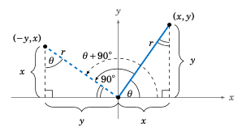

    **图 1.5.1 将角** :math:`\theta` **旋转** :math:`90^{\circ}`

因此，第一象限中的直角三角形与第二象限中的直角三角形是相似的，因为它们具有相同的角度。角 :math:`\theta` 旋转 :math:`90^{\circ}` 并不改变其终边的长度 `r`，因此相似三角形的斜边相等，从而根据相似性，其余对应边也相等。利用图 :ref:`1.5.1 <fig:rotate90>` 对应边的关系，可以看出当点 :math:`(x,y)` 在角 :math:`\theta` 的终边上时，点 `(-y,x)` 就位于角 :math:`\theta + 90^{\circ}` 的终边上。因此，根据定义，

.. math::

    \sin(\theta + 90^{\circ}) ~ = ~ \frac{x}{r} ~=~ \cos\theta ~,~~
    \cos(\theta + 90^{\circ}) ~ = ~ \frac{-y}{r} ~=~ -\sin\theta ~,~~
    \tan(\theta + 90^{\circ}) ~ = ~ \frac{x}{-y} ~=~ -\cot\theta ~.

尽管我们是以第一象限中的 :math:`\theta` 为例来说明的，但对于其他象限也可以用类似的方式进行论证（见练习 \:ref:`4 <exer:rotate90>`）。通常，对于所有角 :math:`\theta`，下列关系成立：

.. _eqn:sinplus90:

.. math::
    :label: equation 1.4

    \sin(\theta + 90^{\circ}) ~ = ~ \cos\theta\phantom{-}

.. _eqn:cosplus90:
    
.. math::
    :label: equation 1.5

    \cos(\theta + 90^{\circ}) ~ = ~ -\sin\theta

.. _eqn:tanplus90:
    
.. math::
    :label: equation 1.6

    \tan(\theta + 90^{\circ}) ~ = ~ -\cot\theta


.. toggle::

    Now that we know how to deal with angles of any measure, we will take a look at how certain geometric operations can help simplify the use of trigonometric functions of any angle, and how some basic relations between those functions can be made. The two operations on which we will concentrate in this section are *rotation* and *reflection*.
    
    To **rotate an angle** means to rotate its terminal side around the origin when the angle is in standard position. For example, suppose we rotate an angle :math:`\theta` around the origin by :math:`90^{\circ}` in the counterclockwise direction. In Figure :ref:`1.5.1 <fig:rotate90>` we see an angle :math:`\theta` in QI which is rotated by :math:`90^{\circ}`, resulting in the angle :math:`\theta + 90^{\circ}` in QII. Notice that the complement of :math:`\theta` in the right triangle in QI is the same as the supplement of the angle :math:`\theta + 90^{\circ}` in QII, since the sum of :math:`\theta`, its complement, and :math:`90^{\circ}` equals :math:`180^{\circ}`. This forces the other angle of the right triangle in QII to be :math:`\theta`.
    
    .. figure:: ./img/f1.5.1.png
        :align: center 
    
        **Figure 1.5.1 Rotation of an angle** :math:`\theta` by :math:`90^{\circ}`
    
    Thus, the right triangle in QI is similar to the right triangle in QII, since the triangles have the same angles. The rotation of :math:`\theta` by :math:`90^{\circ}` does not change the length ``r`` of its terminal side, so the hypotenuses of the similar right triangles are equal, and hence by similarity the remaining corresponding sides are also equal. Using Figure :ref:`1.5.1 <fig:rotate90>` to match up those corresponding sides shows that the point ``(-y,x)`` is on the terminal side of :math:`\theta + 90^{\circ}` when :math:`(x,y)` is on the terminal side of :math:`\theta`. Hence, by definition,
    
    .. math::
    
        \sin(\theta + 90^{\circ}) ~ = ~ \frac{x}{r} ~=~ \cos\theta ~,~~
        \cos(\theta + 90^{\circ}) ~ = ~ \frac{-y}{r} ~=~ -\sin\theta ~,~~
        \tan(\theta + 90^{\circ}) ~ = ~ \frac{x}{-y} ~=~ -\cot\theta ~.
    
    Though we showed this for :math:`\theta` in QI, it is easy (see Exercise :ref:`4 <exer:rotate90>`) to use similar arguments for the other quadrants. In general, the following relations hold for all angles :math:`\theta`:
    
    .. math::
    
        \sin(\theta + 90^{\circ}) ~ = ~ \cos\theta\phantom{-}
    
    .. math::
    
        \cos(\theta + 90^{\circ}) ~ = ~ -\sin\theta
    
    .. math::
    
        \tan(\theta + 90^{\circ}) ~ = ~ -\cot\theta
    
---------

.. _Example 1.26:

.. _exmp:slope:

.. admonition:: Example 1.26

    回忆一下，在 :math:`xy` 坐标平面中，任何非垂直的直线都可以写成 `y=mx+b` 的形式，其中 `m` 是该直线的 *斜率* （定义为 :math:`m = \frac{\text{rise}}{\text{run}}`），:math:`b` 是 :math:`y` 轴截距，即直线与 :math:`y` 轴的交点（见图 :ref:`1.5.2 (a) <fig:slope>`）。我们将证明垂直直线的斜率互为相反数的倒数。也就是说，如果 :math:`y=m_{1}x+b_1` 和 :math:`y=m_{2}x+b_2` 是非垂直也非水平的垂直直线，则有 :math:`m_2 = -\frac{1}{m_1}` （见图 :ref:`1.5.2 (b) <fig:slope>`）。
    
    .. _Figure 1.5.2:

    .. _fig:slope:
    
    .. figure:: ./img/f1.5.2.png
        :align: center
    
        **图 1.5.2**
    
    首先，假设一条直线 :math:`y=mx+b` 的斜率不为零。该直线在某处穿过 :math:`x` 轴，令 :math:`\theta` 为正向 :math:`x` 轴与直线在 :math:`x` 轴上方部分所成的角，如图 :ref:`1.5.3 <fig:slopeangle>` 所示。对于 :math:`m > 0` 的情况，可以看到 :math:`\theta` 是锐角，并且 :math:`\tan\theta = \frac{\text{rise}}{\text{run}} = m`。
    
    .. _Figure 1.5.3:
    
    .. _fig:slopeangle:
    
    .. figure:: ./img/f1.5.3.png
        :align: center
    
        **图 1.5.3**
    
    如果 `m < 0`，则 :math:`\theta` 是钝角，且上升量为负。由于“运行量”始终为正，根据第 1.4 节中对 :math:`\tan\theta` 的定义，有 :math:`\tan\theta = \frac{-\text{rise}}{-\text{run}} = \frac{\text{rise}}{\text{run}} = m` （只需想象图 :ref:`1.5.3 (b) <fig:slopeangle>` 中的整条直线被水平平移，使其经过原点，这样 :math:`\theta` 不变，且点 :math:`(-\text{run},-\text{rise})` 位于角 :math:`\theta` 的终边上）。因此：
    
        对于一条 `y=mx+b` 的直线，若 :math:`m \ne 0`，则其斜率为 :math:`m = \tan\theta`，其中 :math:`\theta` 是正向 :math:`x` 轴与直线在 :math:`x` 轴上方部分之间所成的角。
    
    现在，图 :ref:`1.5.2 (b) <fig:slope>` 中可以看到，如果两条直线 :math:`y=m_{1}x+b_1` 和 :math:`y=m_{2}x+b_2` 互相垂直，那么将其中一条直线绕交点逆时针旋转 :math:`90^{\circ}`，便得到另一条直线。因此，如果 :math:`\theta` 是直线 :math:`y=m_{1}x+b_1` 与正向 :math:`x` 轴所成的角，则 :math:`\theta + 90^{\circ}` 是直线 :math:`y=m_{2}x+b_2` 与正向 :math:`x` 轴所成的角。因此根据我们刚刚证明的内容，:math:`m_1 = \tan\theta`，而 :math:`m_2 = \tan(\theta + 90^{\circ})` 。根据公式 ( :ref:`1.6 <eqn:tanplus90>` )， 我们知道 :math:`\tan(\theta + 90^{\circ}) = -\cot\theta` 。因此，:math:`m_2 = -\cot\theta = -\frac{1}{\tan\theta} = -\frac{1}{m_1}`。[证毕]

    .. toggle::

        Recall that any nonvertical line in the :math:`xy`-coordinate plane can be written as ``y=mx+b``, where ``m`` is the *slope* of the line (defined as :math:`m = \frac{\text{rise}}{\text{run}}` ) and :math:`B` is the :math:`y`-intercept, i.e. where the line crosses the :math:`y`-axis (see Figure :ref:`1.5.2 (a) <fig:slope>`). We will show that the slopes of perpendicular lines are negative reciprocals. That is, if :math:`y=m_{1}x+b_1` and :math:`y=m_{2}x+b_2` are nonvertical and nonhorizontal perpendicular lines, then :math:`m_2 = -\frac{1}{m_1}` (see Figure :ref:`1.5.2 (b) <fig:slope>`).

        .. figure:: ./img/f1.5.2.png 
            :align: center 

            **Figure 1.5.2**

        First, suppose that a line :math:`y=mx+b` has nonzero slope. The line crosses the :math:`x`-axis somewhere, so let :math:`\theta` be the angle that the positive :math:`x`-axis makes with the part of the line above the :math:`x`-axis, as in Figure :ref:`1.5.3 <fig:slopeangle>`. For :math:`m > 0` we see that :math:`\theta` is acute and :math:`\tan\theta = \frac{\text{rise}}{\text{run}} = m`.

        .. figure:: ./img/f1.5.3.png 
            :align: center 

            **Figure 1.5.3**

        If ``m < 0``, then we see that :math:`\theta` is obtuse and the rise is negative. Since the run is always positive, our definition of :math:`\tan\theta` from Section 1.4 means that :math:`\tan\theta = \frac{-\text{rise}}{-\text{run}} = \frac{\text{rise}}{\text{run}} = m` (just imagine in Figure :ref:`1.5.3 (b) <fig:slopeangle>` the entire line being shifted horizontally to go through the origin, so that :math:`\theta` is unchanged and the point :math:`(-\text{run},-\text{rise})` is on the terminal side of :math:`\theta`). Hence:
    
        For a line ``y=mx+b`` with :math:`m \ne 0`, the slope is given by :math:`m = \tan\theta`, where :math:`\theta` is the angle formed by the positive :math:`x`-axis and the part of the line above the :math:`x`-axis.

        Now, in Figure :ref:`1.5.2 (b) <fig:slope>` we see that if two lines :math:`y=m_{1}x+b_1` and :math:`y=m_{2}x+b_2` are perpendicular then rotating one line counterclockwise by :math:`90^{\circ}` around the point of intersection gives us the second line. So if :math:`\theta` is the angle that the line :math:`y=m_{1}x+b_1` makes with the positive :math:`x`-axis, then :math:`\theta + 90^{\circ}` is the angle that the line :math:`y=m_{2}x+b_2` makes with the positive :math:`x`-axis. So by what we just showed, :math:`m_1 = \tan\theta` and :math:`m_2 = \tan(\theta + 90^{\circ})`. But by formula (:ref:`1.6 <eqn:tanplus90>`) we know that :ref:`\tan(\theta + 90^{\circ}) = -\cot\theta`. Hence, :math:`m_2 = -\cot\theta = -\frac{1}{\tan\theta} = -\frac{1}{m_1}`. [QED]

-----

将一个角 :math:`\theta` 顺时针旋转 :math:`90^{\circ}`，将得到角 :math:`\theta - 90^{\circ}`。我们可以使用另一种几何方法来推导涉及 :math:`\theta - 90^{\circ}` 的三角函数关系，但有一个更简单的技巧：由于公式 ( :ref:`1.4 <eqn:sinplus90>`)-( :ref:`1.6 <eqn:tanplus90>`) 对 *任意* 角度 :math:`\theta` 都成立，只需在每个公式中将 :math:`\theta` 替换为 :math:`\theta - 90^{\circ}`。由于 :math:`(\theta - 90^{\circ}) + 90^{\circ} = \theta`，于是我们得到：

.. _eqn:sinminus90:

.. math::
    :label: equation 1.7

    \sin(\theta - 90^{\circ}) ~ = ~ -\cos\theta


.. _eqn:cosminus90:

.. math::
    :label: equation 1.8

    \cos(\theta - 90^{\circ}) ~ = ~ \sin\theta\phantom{-}

.. _eqn:tanminus90:

.. math::
    :label: equation 1.9

    \tan(\theta - 90^{\circ}) ~ = ~ -\cot\theta

我们现在来考虑将一个角 :math:`\theta` 旋转 :math:`180^{\circ}` 的情形。观察图 :ref:`1.5.4 <fig:rotate180>` 可知，角 :math:`\theta \pm 180^{\circ}` 拥有相同的终边，并且位于与 :math:`\theta` 相对的象限中。

.. _Figure 1.5.4:

.. _fig:rotate180:

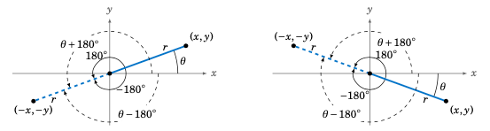

    **图 1.5.4** 将 :math:`\theta` 旋转 :math:`\pm 180^{\circ}`


当 `(x,y)` 位于角 :math:`\theta` 的终边上时，`(-x,-y)` 就位于角 :math:`\theta \pm 180^{\circ}` 的终边上，因此我们得到以下对所有 :math:`\theta` 都成立的关系：

.. _eqn:sinpm180:

.. math::
    :label: equation 1.10


    \sin(\theta \pm 180^{\circ}) ~ = ~ -\sin\theta

.. _eqn:cospm180:

.. math::
    :label: equation 1.11


    \cos(\theta \pm 180^{\circ}) ~ = ~ -\cos\theta

.. _eqn:tanpm180:

.. math::
    :label: equation 1.12

    \tan(\theta \pm 180^{\circ}) ~ = ~ \tan\theta\phantom{-}

.. _Figure 1.5.5:

.. _fig:reflection:

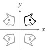

    **图 1.5.5**

**反射** 就是物体的镜像。例如，在图 :ref:`1.5.5 <fig:reflection>` 中，原始物体位于第一象限，绕 :math:`y` 轴反射后的图像位于第二象限，绕 :math:`x` 轴反射后的图像位于第四象限。注意，如果我们先将第一象限的物体绕 :math:`y` 轴反射，再绕 :math:`x` 轴反射，就会得到一个位于第三象限的图像。这个图像就是原始物体绕原点的 **中心对称反射**，它等价于绕原点旋转 :math:`180^{\circ}`。还要注意，绕 :math:`y` 轴的反射等价于绕 :math:`x` 轴反射后再绕原点旋转 :math:`180^{\circ}`。

.. toggle::

    Rotating an angle :math:`\theta` by :math:`90^{\circ}` in the clockwise direction results in the angle :math:`\theta - 90^{\circ}`. We could use another geometric argument to derive trigonometric relations involving :math:`\theta - 90^{\circ}`, but it is easier to use a simple trick: since formulas (:ref:`1.4 <eqn:sinplus90>`)-(:ref:`1.6 <eqn:tanplus90>`) hold for *any* angle :math:`\theta`, just replace :math:`\theta` by :math:`\theta - 90^{\circ}` in each formula. Since :math:`(\theta - 90^{\circ}) + 90^{\circ} = \theta`, this gives us:

    .. math::

        \sin(\theta - 90^{\circ}) ~ = ~ -\cos\theta

    .. math::

        \cos(\theta - 90^{\circ}) ~ = ~ \sin\theta\phantom{-}

    .. math::

        \tan(\theta - 90^{\circ}) ~ = ~ -\cot\theta

    We now consider rotating an angle :math:`\theta` by :math:`180^{\circ}`. Notice from Figure :ref:`1.5.4 <fig:rotate180>` that the angles :math:`\theta \pm 180^{\circ}` have the same terminal side, and are in the quadrant opposite :math:`\theta`.

    .. figure:: ./img/f1.5.4.png 
        :align: center 

        **Figure 1.5.4** Rotation of :math:`\theta` by :math:`\pm 180^{\circ}`


    Since ``(-x,-y)`` is on the terminal side of :math:`\theta \pm 180^{\circ}` when ``(x,y)`` is on the terminal side of :math:`\theta`, we get the following relations, which hold for all :math:`\theta`:

    .. math::
        
        \sin(\theta \pm 180^{\circ}) ~ = ~ -\sin\theta

    .. math::
        
        \cos(\theta \pm 180^{\circ}) ~ = ~ -\cos\theta

    .. math::

        \tan(\theta \pm 180^{\circ}) ~ = ~ \tan\theta\phantom{-}

    .. figure:: ./img/f1.5.5.png 
        :align: right 

        **Figure 1.5.5**

    A **reflection** is simply the mirror image of an object. For example, in Figure :ref:`1.5.5 <fig:reflection>` the original object is in QI, its reflection around the :math:`y`-axis is in QII, and its reflection around the :math:`x`-axis is in QIV. Notice that if we first reflect the object in QI around the :math:`y`-axis and then follow that with a reflection around the :math:`x`-axis, we get an image in QIII. That image is the **reflection around the origin** of the original object, and it is equivalent to a rotation of :math:`180^{\circ}` around the origin. Notice also that a reflection around the :math:`y`-axis is equivalent to a reflection around the :math:`x`-axis followed by a rotation of :math:`180^{\circ}` around the origin.

-----

以下是翻译后的 RST 文本，保持原始结构与格式不变：

将这一点应用到角度上，我们可以看到，角 :math:`\theta` 绕 :math:`x` 轴的反射是角 :math:`-\theta`，如图 :ref:`1.5.6 <fig:reflectminus>` 所示。
    
.. _Figure 1.5.6:

.. _fig:reflectminus:

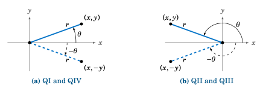

    **Figure 1.5.6** Reflection of :math:`\theta` around the :math:`x`-axis

因此我们看到，将一个点 `(x, y)` 绕 :math:`x` 轴反射只是将 :math:`y` 替换为 `-y`。因此：
    
.. _eqn:sinminus:

.. math::
    :label: equation 1.13

    \sin(-\theta) ~ = ~ -\sin\theta

.. _eqn:cosminus:

.. math::
    :label: equation 1.14

    \cos(-\theta) ~ = ~ \cos\theta\phantom{-}

.. _eqn:tanminus:

.. math::
    :label: equation 1.15

    \tan(-\theta) ~ = ~ -\tan\theta

请注意，余弦函数在公式 :ref:`1.14 <eqn:cosminus>` 中没有改变，是因为它依赖于点 `(x, y)` 中的 :math:`x` 坐标，而不是 :math:`y`，对于位于角 :math:`\theta` 的终边上的点来说。

通常来说，如果函数 :math:`f(x)` 满足 :math:`f(-x) = f(x)`，则称其为 **偶函数（even function）**；若满足  :ref:`f(-x) = -f(x)`，则称为 **奇函数（odd function）**。因此，余弦函数是偶函数，而正弦和正切函数是奇函数。

将公式 ( :ref:`1.4 <eqn:sinplus90>`) - ( :ref:`1.6 <eqn:tanplus90>`) 中的 :math:`\theta` 替换为 :math:`-\theta`，再使用公式 ( :ref:`1.13 <eqn:sinminus>`)-( :ref:`1.15 <eqn:tanminus>`)，可以得到：
    
.. _eqn:sin90minus:

.. math::
    :label: equation 1.16

    \sin(90^{\circ} - \theta) ~ = ~ \cos\theta

.. _eqn:cos90minus:

.. math::
    :label: equation 1.17

    \cos(90^{\circ} - \theta) ~ = ~ \sin\theta

.. _eqn:tan90minus:

.. math::
    :label: equation 1.18

    \tan(90^{\circ} - \theta) ~ = ~ \cot\theta

请注意，公式 ( :ref:`1.16 <eqn:sin90minus>`)-( :ref:`1.18 <eqn:tan90minus>`) 将第 1.2 节中的余角定理推广到了 *所有* :math:`\theta`，而不仅限于锐角。同样，公式 ( :ref:`1.10 <eqn:sinpm180>`) - ( :ref:`1.12 <eqn:tanpm180>` ) 与 ( :ref:`1.13 <eqn:sinminus>` )-( :ref:`1.15 <eqn:tanminus>` ) 给出了：
    
.. _eqn:sin180minus:

.. math::
    :label: equation 1.19

    \sin(180^{\circ} - \theta) ~ = ~ \sin\theta\phantom{-}

.. _eqn:cos180minus:

.. math::
    :label: equation 1.20

    \cos(180^{\circ} - \theta) ~ = ~ -\cos\theta

.. _eqn:tan180minus:

.. math::
    :label: equation 1.21

    \tan(180^{\circ} - \theta) ~ = ~ -\tan\theta


.. toggle::

    Applying this to angles, we see that the reflection of an angle :math:`\theta` around the :math:`x`-axis is the angle :math:`-\theta`, as in Figure :ref:`1.5.6 <fig:reflectminus>`.
    
    .. figure:: ./img/f1.5.6.png 
        :align: right 
    
        **Figure 1.5.6** Reflection of :math:`\theta` around the :math:`x`-axis
    
    So we see that reflecting a point ``(x, y)`` around the :math:`x`-axis just replaces :math:`y` by ``-y``. Hence:
    
    .. math::
    
        \sin(-\theta) ~ = ~ -\sin\theta
    
    .. math::
    
        \cos(-\theta) ~ = ~ \cos\theta\phantom{-}
    
    .. math::
    
        \tan(-\theta) ~ = ~ -\tan\theta
    
    Notice that the cosine function does not change in formula (\ref{eqn:cosminus}) because it depends on :math:`x`, and not on :math:`y`, for a point ``(x, y)`` on the terminal side of :math:`\theta`.
    
    In general, a function :math:`f(x)` is an **even function** if :math:`f(-x) = f(x)` for all :math:`x`, and it is called an **odd function** if :ref:`f(-x) = -f(x)` for all :math:`x`. Thus, the cosine function is even, while the sine and tangent functions are odd.
    
    Replacing :math:`\theta` by :math:`-\theta` in formulas (:ref:`1.4 <eqn:sinplus90>`) - (:ref:`1.6 <eqn:tanplus90>`), then using formulas (:ref:`1.13 <eqn:sinminus>`)- (:ref:`1.15 <eqn:tanminus>`), gives:
    
    .. math::
    
        \sin(90^{\circ} - \theta) ~ = ~ \cos\theta
    
    .. math::
    
        \cos(90^{\circ} - \theta) ~ = ~ \sin\theta
    
    .. math::
    
        \tan(90^{\circ} - \theta) ~ = ~ \cot\theta
    
    Note that formulas (:ref:`1.16 <eqn:sin90minus>`)-(:ref:`1.18 <eqn:tan90minus>`) extend the Cofunction Theorem from Section 1.2 to *all* :math:`\theta`, not just acute angles. Similarly, formulas (:ref:`1.10 <eqn:sinpm180>`) - (:ref:`1.12 <eqn:tanpm180>`) and (:ref:`1.13 <eqn:sinminus>`)-(:ref:`1.15 <eqn:tanminus>`) give:
    
    .. math::
    
        \sin(180^{\circ} - \theta) ~ = ~ \sin\theta\phantom{-}
    
    .. math::
    
        \cos(180^{\circ} - \theta) ~ = ~ -\cos\theta
    
    .. math::
    
        \tan(180^{\circ} - \theta) ~ = ~ -\tan\theta

-----

注意，关于 :math:`y` 轴的反射等价于先关于 :math:`x` 轴的反射（:math:`\theta \mapsto -\theta`），再进行 :math:`180^{\circ}` 的旋转（:math:`-\theta \mapsto -\theta + 180^{\circ} = 180^{\circ} - \theta`），如图 :ref:`1.5.7 <fig:reflecty>` 所示。

.. _Figure 1.5.7:

.. _fig:reflecty:

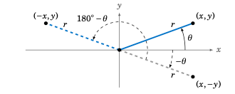

    **图 1.5.7** 关于 :math:`y` 轴的反射：:math:`\theta` 映射为 :math:`180^{\circ} - \theta`

乍一看，这些几何操作和公式似乎对于计算三角函数并非必需，因为我们可以直接使用计算器。然而，这些操作的用处有两个原因。第一，这些公式适用于任意角度，因此常用于数学及其他领域中推导通用公式，我们将在后文中看到。第二，它们可以帮助确定具有给定三角函数值的所有角度。

.. toggle::

    Notice that reflection around the :math:`y`-axis is equivalent to reflection around the :math:`x`-axis
    (:math:`\theta \mapsto -\theta`) followed by a rotation of :math:`180^{\circ}` (:math:`-\theta \mapsto -\theta + 180^{\circ} = 180^{\circ} - \theta`), as in Figure :ref:`1.5.7 <fig:reflecty>`.
    
    .. figure:: ./img/f1.5.7.png 
        :align: center
    
        **Figure 1.5.7** Reflection of :math:`\theta` around the :math:`y`-axis :math:`= 180^{\circ} - \theta`
    
    
    It may seem that these geometrical operations and formulas are not necessary for evaluating the
    trigonometric functions, since we could just use a calculator. However, there are two reasons
    for why they are useful. First, the formulas work for any angles, so they are often used to prove
    general formulas in mathematics and other fields, as we will see later in the text. Second, they
    can help in determining which angles have a given trigonometric function value.

.. _Example 1.27:

.. _exmp:sinneg0682:

.. admonition:: Example 1.27

    回忆一下，:math:`xy` 坐标平面中任意非垂直直线可以表示为 :math:`y = mx + b`，其中 ``m`` 是该直线的 *斜率* （定义为 :math:`m = \frac{\text{rise}}{\text{run}}`），而 :math:`b` 是 :math:`y` 轴截距，即该直线与 :math:`y` 轴相交的点（见图 :ref:`1.5.2 (a) <fig:slope>`）。我们将展示垂直直线的斜率互为负倒数。也就是说，如果 :math:`y = m_1x + b_1` 和 :math:`y = m_2x + b_2` 是非垂直也非水平的垂直直线，则有 :math:`m_2 = -\frac{1}{m_1}` （见图 :ref:`1.5.2 (b) <fig:slope>`）。
    
    .. _Figure 1.5.8:
    
    .. _fig:exmpnegsin:
    
    .. figure:: ./img/f1.5.8.png 
        :align: center 
    
        **图 1.5.8** 关于 :math:`y` 轴的反射：:math:`-43^{\circ}` 和 :math:`223^{\circ}`
    
    找出所有满足 :math:`0^{\circ} \le \theta < 360^{\circ}` 且 :math:`\sin\theta = -0.682` 的角度。
    
    **解答：** 使用计算器的 :math:`\boxed{\sin^{-1}}` 按钮，输入 ``-0.682``，得到 :math:`\theta = -43^{\circ}`，这不在 :math:`0^{\circ}` 到 :math:`360^{\circ}` 的范围内。 [7]_ 由于 :math:`\theta = -43^{\circ}` 位于第四象限（QIV），其关于 :math:`y` 轴的反射 :math:`180^{\circ} - \theta` 将位于第三象限（QIII），且具有相同的正弦值。而 :math:`180^{\circ} - \theta = 180^{\circ} - (-43^{\circ}) = 223^{\circ}` （见图 :ref:`1.5.8 <fig:exmpnegsin>`）。此外，我们知道 :math:`-43^{\circ}` 和 :math:`-43^{\circ} + 360^{\circ} = 317^{\circ}` 的三角函数值相同。因此，由于第一象限和第二象限（QI 和 QII）中的角度的正弦值为正，我们可以得出结论，在 :math:`0^{\circ}` 到 :math:`360^{\circ}` 之间，正弦值为 ``-0.682`` 的唯一角度为：:math:`\boxed{\theta = 223^{\circ} ~\text{和}~ 317^{\circ}}~`。
    
    .. [7] 在 :ref:`第 5 章 <c5>` 中，我们将讨论为什么 :math:`\boxed{\sin^{-1}}` 按钮返回该值。
    
           In :ref:`Chapter 5 <c5>` we will discuss why the :math:`\boxed{\sin^{-1}}` button returns that value.
    
    .. toggle::

        Recall that any nonvertical line in the :math:`xy`-coordinate plane can be written as :math:`y=mx+b`, where ``m`` is the *slope* of the line (defined as :math:`m = \frac{\text{rise}}{\text{run}}` ) and :math:`B` is the :math:`y`-intercept, i.e. where the line crosses the :math:`y`-axis (see Figure :ref:`1.5.2 (a) <fig:slope>`). We will show that the slopes of perpendicular lines are negative reciprocals. That is, if :math:`y=m_{1}x+b_1` and :math:`y=m_{2}x+b_2` are nonvertical and nonhorizontal perpendicular lines, then :math:`m_2 = -\frac{1}{m_1}` (see Figure :ref:`1.5.2 (b) <fig:slope>`).
    
        .. figure:: ./img/f1.5.8.png 
            :align: center 
    
            **Figure 1.5.8** Reflection around the :math:`y`-axis: :math:`-43^{\circ}` and :math:`223^{\circ}`
    
        Find all angles :math:`0^{\circ} \le \theta < 360^{\circ}` such that :math:`\sin\theta = -0.682`.
    
        **Solution:** Using the :math:`\boxed{\sin^{-1}}` button
        on a calculator with ``-0.682`` as the input, we get :math:`\theta = -43^{\circ}`, which is not between
        :math:`0^{\circ}` and :math:`360^{\circ}`. [7]_ Since
        :math:`\theta = -43^{\circ}` is in QIV, its reflection :math:`180^{\circ} - \theta` around the :math:`y`-axis will be in QIII
        and have the same sine value. But :math:`180^{\circ} - \theta = 180^{\circ} - (-43^{\circ}) = 223^{\circ}` (see Figure :ref:`1.5.8 <fig:exmpnegsin>`). Also, we know that
        :math:`-43^{\circ}` and :math:`-43^{\circ} + 360^{\circ} = 317^{\circ}` have the same trigonometric function
        values. So since angles in QI and QII have positive sine values, we see that the only angles
        between :math:`0^{\circ}` and :math:`360^{\circ}` with a sine of ``-0.682`` are :math:`\boxed{\theta = 223^{\circ} ~\text{and}~ 317^{\circ}}~`.

------

.. _sec1dot5:

练习
~~~~~~~~~~~~~~
Exercises

.. _exer:reflect:

1. 设 :math:`\theta = 32^{\circ}`，求位于 :math:`0^{\circ}` 到 :math:`360^{\circ}` 之间的角度，使得它是：

   a. :math:`\theta` 关于 :math:`x` 轴的反射
   b. :math:`\theta` 关于 :math:`y` 轴的反射
   c. :math:`\theta` 关于原点的反射

2. 用 :math:`\theta = 248^{\circ}` 重做练习 :ref:`1 <exer:reflect>`。

3. 用 :math:`\theta = -248^{\circ}` 重做练习 :ref:`1 <exer:reflect>`。

.. _exer:rotate90:

4. 我们已经证明了 QI 象限中任意角 :math:`\theta` 的公式 ( :ref:`1.4 <eqn:sinplus90>`)-( :ref:`1.6 <eqn:tanplus90>`)。仿照该证明，说明这些公式对 QII 象限中的 :math:`\theta` 也成立。
5. 验证公式 ( :ref:`1.4 <eqn:sinplus90>`)-( :ref:`1.6 <eqn:tanplus90>`) 在坐标轴上的角度，即 :math:`\theta = 0^{\circ}`、:math:`90^{\circ}`、:math:`180^{\circ}`、:math:`270^{\circ}` 处是否成立。
6. 在示例  :ref:`1.26 <exmp:slope>` 中，我们使用涉及 :math:`\theta + 90^{\circ}` 的公式证明了垂直直线的斜率互为负倒数。请说明该结论也可通过使用 :math:`\theta - 90^{\circ}` 的公式证明。（ *提示：只需修改该示例中的最后一段。* ）

对于练习  :ref:`7 <exer:invtrigfirst>` -  :ref:`14 <exer:invtriglast>`，找出所有满足下列方程的 :math:`0^{\circ} \le \theta < 360^{\circ}` 的角度：

.. _exer:invtrigfirst:

7. :math:`\sin\theta = 0.4226`
8. :math:`\sin\theta = 0.1909`
9. :math:`\cos\theta = 0.4226`
10. :math:`\sin\theta = 0`
11. :math:`\tan\theta = 0.7813`
12. :math:`\sin\theta = -0.6294`
13. :math:`\cos\theta = -0.9816`
14. :math:`\tan\theta = -9.514`

.. _exer:invtriglast:

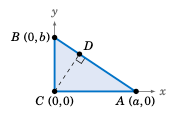

15. 在第 1.2 节中对勾股定理的证明中，我们声称在直角三角形 :math:`\triangle\,ABC` 中，可以从直角顶点 :math:`C` 向斜边 :math:`\overline{AB}` 上某点 `d` 作一条线段 :math:`\overline{CD}`，使得 :math:`\overline{CD} \perp \overline{AB}`。使用右侧的图来证明该结论。（ *提示：注意* :math:`\triangle\,ABC` *是如何放置在 xy 坐标平面上的。斜边的斜率是多少？垂直于它的直线斜率应是多少？* ）此外，请用点 :math:`A` 和 :math:`B` 表示点 `d` 的 `(x, y)` 坐标。

16. 可以在不使用三角函数的情况下证明，垂直直线的斜率互为负倒数。设 :math:`y = m_1{}x + b_1` 和 :math:`y = m_2{}x + b_2` 是垂直直线（斜率非零），如图所示。利用图形说明 :math:`m_2 = -\frac{1}{m_1}`。（*提示：思考相似三角形和斜率的定义。*）

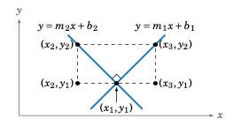

17. 使用公式 ( :ref:`1.10 <eqn:sinpm180>`)-( :ref:`1.12 <eqn:tanpm180>`) 和 ( :ref:`1.13 <eqn:sinminus>`)-( :ref:`1.15 <eqn:tanminus>`)，证明公式 ( :ref:`1.19 <eqn:sin180minus>`)-( :ref:`1.21 <eqn:tan180minus>`)。


.. toggle::

    1. Let :math:`\theta = 32^{\circ}`. Find the angle between :math:`0^{\circ}` and :math:`360^{\circ}` which is the
    
       a. reflection of :math:`\theta` around the :math:`x`-axis
       b. reflection of :math:`\theta` around the :math:`y`-axis
       c. reflection of :math:`\theta` around the origin
    
    2. Repeat Exercise :ref:`1 <exer:reflect>` with :math:`\theta = 248^{\circ}`.
    3. Repeat Exercise :ref:`1 <exer:reflect>` with :math:`\theta = -248^{\circ}`.
    
    4. We proved formulas (:ref:`1.4 <eqn:sinplus90>`)-(:ref:`1.6 <eqn:tanplus90>`) for any angle :math:`\theta` in QI. Mimic that proof to show that the formulas hold for :math:`\theta` in QII.
    5. Verify formulas (:ref:`1.4 <eqn:sinplus90>`)-(:ref:`1.6 <eqn:tanplus90>`) for :math:`\theta` on the coordinate axes, i.e. for :math:`\theta = 0^{\circ}`, :math:`90^{\circ}`, :math:`180^{\circ}`, :math:`270^{\circ}`.
    6. In Example :ref:`1.26 <exmp:slope>` we used the formulas involving :math:`\theta + 90^{\circ}` to prove that the slopes of perpendicular lines are negative reciprocals. Show that this result can also be proved using the formulas involving :math:`\theta - 90^{\circ}`. (*Hint: Only the last paragraph in that example needs to be modified.*)
    
    For Exercises :ref:`7 <exer:invtrigfirst>` - :ref:`14 <exer:invtriglast>`, find all angles :math:`0^{\circ} \le \theta < 360^{\circ}` which satisfy the given equation:
    
    7. :math:`\sin\theta = 0.4226`
    8. :math:`\sin\theta = 0.1909`
    9. :math:`\cos\theta = 0.4226`
    10. :math:`\sin\theta = 0`
    11. :math:`\tan\theta = 0.7813`
    12. :math:`\sin\theta = -0.6294`
    13. :math:`\cos\theta = -0.9816`
    14. :math:`\tan\theta = -9.514`
    
    .. figure:: ./img/45-0.png 
        :align: right
    
    15. In our proof of the Pythagorean Theorem in Section 1.2, we claimed that in a right triangle :math:`\triangle\,ABC` it was possible to draw a line segment :math:`\overline{CD}` from the right angle vertex :math:`C` to a point ``d`` on the hypotenuse :math:`\overline{AB}` such that :math:`\overline{CD} \perp \overline{AB}`. Use the picture on the right to prove that claim. (*Hint: Notice how* :math:`\triangle\,ABC` *is placed on the xy-coordinate plane. What is the slope of the hypotenuse? What would be the slope of a line perpendicular to it?*) Also, find the ``(x, y)`` coordinates of the point ``d`` in terms of :math:`A` and :math:`B`.
    
    16. It can be proved without using trigonometric functions that the slopes of perpendicular lines are negative reciprocals. Let :math:`y = m_1{}x+b_1` and :math:`y = m_2{}x+b_2` be perpendicular lines (with nonzero slopes), as in the picture below. Use the picture to show that :math:`m_2 = -\frac{1}{m_1}`. (*Hint: Think of similar triangles and the definition of slope.*)
    
    .. figure:: ./img/45-1.png
        :align: center
    
    17. Prove formulas (:ref:`1.19 <eqn:sin180minus>`)-(:ref:`1.21 <eqn:tan180minus>`) by using formulas (:ref:`1.10 <eqn:sinpm180>`)-(:ref:`1.12 <eqn:tanpm180>`) and (:ref:`1.13 <eqn:sinminus>`) - (:ref:`1.15 <eqn:tanminus>`).
    
    