.. _c2:

第 2 章 一般三角形
=============================
Chapter 2 General Triangles

在第 1.3 节中，我们学习了如何求解一个直角三角形：已知两条边，或者一条边和一个锐角，就可以求出其余的边和角。实际上，在每种情况下，我们都已知三条信息，因为我们知道其中一个角是 :math:`90^\circ`。

对于一个 **一般三角形** （它可能有，也可能没有直角），我们同样需要三条已知条件。共有以下四种情况：

* 情况 1：已知一条边和两个角
* 情况 2：已知两条边和其中一条边所对的角
* 情况 3：已知两条边及其夹角
* 情况 4：已知三条边

需要注意的是，如果只给出三个角，是无法唯一确定三角形的边长的；因为根据 **相似性原理**，有无数个三角形具有相同的角度。

在本章中，我们将学习如何在上述四种情况下求解一般三角形。虽然这些方法同样适用于直角三角形，但它们主要用于求解 **斜三角形** ，也就是 **没有直角** 的三角形。斜三角形分为两种类型：

* **锐角三角形（acute triangle）**：三个角都是锐角；
* **钝角三角形（obtuse triangle）**：有一个角是钝角。

正如我们将看到的那样：

* 情况 1 和 情况 2 可以通过 **正弦定理（law of sines）** 求解；
* 情况 3 可以通过 **余弦定理（law of cosines）** 或 **正切定理（law of tangents）** 求解；
* 情况 4 则可以通过 **余弦定理（law of cosines）** 求解。

.. toggle::

    In Section 1.3 we saw how to solve a right triangle: given two sides, or one side and one acute angle, we could find the remaining sides and angles. In each case we were actually given three pieces of information, since we already knew one angle was :math:`90^\circ`.

    For a general triangle, which may or may not have a right angle, we will again need three pieces of information. The four cases are:

    - Case 1: One side and two angles
    - Case 2: Two sides and one opposite angle
    - Case 3: Two sides and the angle between them
    - Case 4: Three sides

    Note that if we were given all three angles we could not determine the sides uniquely; by similarity an infinite number of triangles have the same angles.

    In this chapter we will learn how to solve a general triangle in all four of the above cases. Though the methods described will work for right triangles, they are mostly used to solve **oblique triangles**, that is, triangles which do not have a right angle. There are two types of oblique triangles: an **acute triangle** has all acute angles, and an **obtuse triangle** has one obtuse angle.

    As we will see, Cases 1 and 2 can be solved using the *law of sines*, Case 3 can be solved using either the *law of cosines* or the *law of tangents*, and Case 4 can be solved using the law of cosines.

2.1 正弦定理
------------------
The Law of Sines

.. _Theorem 2.1:

**定理 2.1 正弦定理（Law of Sines）：**

如果一个三角形的三边分别为 $a$、$b$、$c$，并且它们所对的角分别为 $A$、$B$、$C$，则有：

.. _equation 2.1:

.. _eqn:lawsines

.. math::
   :label: eqn:lawsines

   \frac{a}{\sin\;A} ~=~ \frac{b}{\sin\;B} ~=~ \frac{c}{\sin\;C} ~.

注意，通过取倒数，方程 (:ref:`2.1 <eqn:lawsines>`) 可以改写为：

.. _equation 2.2:

.. _eqn:lawsines2:

.. math::
    :label: eqn:lawsines2

    \frac{\sin\;A}{a} ~=~ \frac{\sin\;B}{b} ~=~ \frac{\sin\;C}{c} ~,

也可以写成三组方程的形式：

.. _equation 2.3:

.. _eqn:lawsines3:

.. math::
    :label: eqn:lawsines3

    \frac{a}{b} ~=~ \frac{\sin\;A}{\sin\;B} ~~,\quad \frac{a}{c} ~=~ \frac{\sin\;A}{\sin\;C} ~~,\quad
    \frac{b}{c} ~=~ \frac{\sin\;B}{\sin\;C}

换句话说， **三角形的边与其所对角的正弦成比例** 。

------

要证明正弦定理，设 :math:`\triangle ABC` 为一个斜三角形。则 :math:`\triangle ABC` 可能是锐角三角形（如图 :ref:`2.1.1 <fig:lawsines>` (a)），也可能是钝角三角形（如图 :ref:`2.1.1 <fig:lawsines>` (b)）。
在这两种情况下，从顶点 $C$ 向边 :math:`\overline{AB}` 作 **高线（altitude）** [1]_。 在图 :ref:`2.1.1 <fig:lawsines>` (a) 中，高线落在三角形内部；而在图 :ref:`2.1.1 <fig:lawsines>` (b) 中，高线落在三角形外部。

.. [1] 几何中定义：三角形的高是从任意顶点作到其对边所在直线的垂线线段。

.. _Figure 2.1.1:

.. _fig:lawsines:

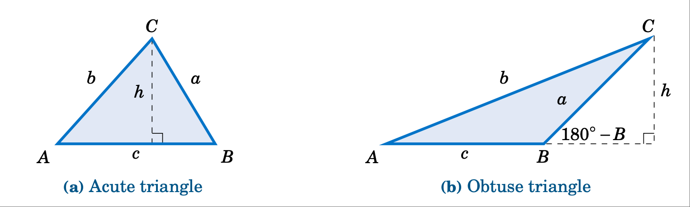

   **图 2.1.1 正弦定理的证明** （斜三角形 :math:`\triangle ABC`）

------

设高的长度为 $h$。
对于图 :ref:`2.1.1 <fig:lawsines>` 中的每个三角形，有：

.. _equation 2.4:

.. _eqn:hbsinA:

.. math::
    :label: eqn:hbsinA

    \frac{h}{b} ~=~ \sin\;A

以及：

.. _equation 2.5:

.. _eqn:hasinB:

.. math::
    :label: eqn:hasinB

    \frac{h}{a} ~=~ \sin B

（在图 :ref:`2.1.1 <fig:lawsines>` (b) 中，:math:`\frac{h}{a} = \sin(180^\circ - B) = \sin B`，由第 1.5 节的公式 (:ref:`1.19 <eqn:sin180minus>`) 可得。）

因此，由方程 (:ref:`2.5 <eqn:hasinB>`) 解出 $h$ 并代入方程 (:ref:`2.4 <eqn:hbsinA>`)，得：

.. math::
    :label: equation 2.6

    \frac{a \sin B}{b} ~=~ \sin A ~,

于是将 $a$ 与 $A$ 放在左边，$b$ 与 $B$ 放在右边，可得：

.. math::
    :label: equation 2.7

    \frac{a}{\sin\;A} ~=~ \frac{b}{\sin\;B} ~.

用类似的方法，从顶点 $A$ 向边 :math:`\overline{BC}` 作高，可以得到：

.. math::
    :label: equation 2.8

    \frac{b}{\sin\;B} ~=~ \frac{c}{\sin\;C} ~,

将上面两个方程结合起来，即得证定理。[QED]

------

注意：我们没有单独证明直角三角形的正弦定理，因为在这种情况下（见练习 :ref:`12 <exer:lawsinesright>`），该定理显然成立。

.. toggle::

    **Theorem 2.1. Law of Sines:** If a triangle has sides of lengths $a$, $b$, and $c$ opposite the angles $A$,
    $B$, and $C$, respectively, then

    .. math::
        :label: eqn:lawsines

        \frac{a}{\sin\;A} ~=~ \frac{b}{\sin\;B} ~=~ \frac{c}{\sin\;C} ~.

    Note that by taking reciprocals, equation (:ref:`2.1 <eqn:lawsines>`) can be written as

    .. math::
        :label: eqn:lawsines2

        \frac{\sin\;A}{a} ~=~ \frac{\sin\;B}{b} ~=~ \frac{\sin\;C}{c} ~,

    and it can also be written as a collection of three equations:

    .. math::
        :label: eqn:lawsines3

        \frac{a}{b} ~=~ \frac{\sin\;A}{\sin\;B} ~~,\quad \frac{a}{c} ~=~ \frac{\sin\;A}{\sin\;C} ~~,\quad
        \frac{b}{c} ~=~ \frac{\sin\;B}{\sin\;C}

    Another way of stating the Law of Sines is: *The sides of a triangle are proportional to the sines of their opposite angles.*

    To prove the Law of Sines, let :math:`\triangle ABC` be an oblique triangle. Then :math:`\triangle ABC` can be acute, as in Figure :ref:`2.1.1 <fig:lawsines>` (a), or it can be obtuse, as in Figure :ref:`2.1.1 <fig:lawsines>` (b). In each case, draw the **altitude** [1]_ from the vertex at $C$ to the side :math:`\overline{AB}`. In Figure :ref:`2.1.1 <fig:lawsines>` (a) the altitude lies inside the triangle, while in Figure :ref:`2.1.1 <fig:lawsines>` (b) the altitude lies outside the triangle.

    .. [1] Recall from geometry that an altitude of a triangle is a perpendicular line segment from any vertex to the line containing the side opposite the vertex.

    .. figure:: ./img/f2.1.1.png
        :align: center

        **Figure 2.1.1 Proof of the Law of Sines for an oblique triangle** :math:`\triangle ABC`

    Let $h$ be the height of the altitude. For each triangle in Figure :ref:`2.1.1 <fig:lawsines>`, we see that

    .. math::
        :label: eqn:hbsinA

        \frac{h}{b} ~=~ \sin\;A

    and

    .. math::
        :label: eqn:hasinB

        \frac{h}{a} ~=~ \sin B

    (in Figure :ref:`2.1.1 <fig:lawsines>`(b), :math:`\frac{h}{a} = \sin\;(180^\circ - B) = \sin\;B` by formula (:ref:`1.19 <eqn:sin180minus>`) in Section 1.5). Thus, solving for $h$ in equation (:ref:`2.5 <eqn:hasinB>`) and substituting that into equation (:ref:`2.4 <eqn:hbsinA>`) gives

    .. math::
        :label: equation 2.6

        \frac{a \sin B}{b} ~=~ \sin A ~,

    and so putting $a$ and $A$ on the left side and $b$ and $B$ on the right side, we get

    .. math::
        :label: equation 2.7

        \frac{a}{\sin\;A} ~=~ \frac{b}{\sin\;B} ~.

    By a similar argument, drawing the altitude from $A$ to :math:`\overline{BC}` gives

    .. math::
        :label: equation 2.8

        \frac{b}{\sin\;B} ~=~ \frac{c}{\sin\;C} ~,

    so putting the last two equations together proves the theorem. [qed]

    Note that we did not prove the Law of Sines for right triangles, since it turns out (see Exercise
    :ref:`12 <exer:lawsinesright>`) to be trivially true for that case.

.. _Example 2.1:

.. admonition:: Example 2.1

    .. figure:: ./img/e2.1.png 
        :align: right
        :scale: 50%

    *案例 1：已知一边和两个角。*

    求解三角形 :math:`\triangle ABC`，已知 $a = 10$，:math:`A = 41^\circ`，:math:`C = 75^\circ`。

    **解答：** 我们可以通过用 :math:`180^\circ` 减去已知的两个角，来求出第三个角，然后利用正弦定理求出未知的两条边。在本例中，需要求 $B$、$b$ 和 $c$。首先，计算得：

    .. math::

        B ~=~ 180^\circ ~-~ A ~-~ C ~=~ 180^\circ ~-~ 41^\circ ~-~ 75^\circ \quad\Rightarrow\quad \boxed{B ~=~ 64^\circ} ~.

    因此，根据正弦定理可得：

    .. math::

        \frac{b}{\sin\;B} ~=~ \frac{a}{\sin\;A} \quad\Rightarrow\quad b ~=~ \frac{a\;\sin\;B}{\sin\;A} ~=~ \frac{10\;\sin\;64^\circ}{\sin\;41^\circ} \quad\Rightarrow\quad \boxed{b ~=~ 13.7} ~,

    以及：

    .. math::

        \frac{c}{\sin\;C} ~=~ \frac{a}{\sin\;A} \quad\Rightarrow\quad c ~=~ \frac{a\;\sin\;C}{\sin\;A}
        ~=~ \frac{10\;\sin\;75^\circ}{\sin\;41^\circ} \quad\Rightarrow\quad \boxed{c ~=~ 14.7} ~.

    .. toggle::

        .. figure:: ./img/e2.1.png 
            :align: right
            :scale: 50%
    
        *Case 1: One side and two angles.*
    
        Solve the triangle :math:`\triangle ABC` given $a = 10$, :math:`A = 41^\circ`, and :math:`C = 75^\circ`.
    
        **Solution:** We can find the third angle by subtracting the other two angles from :math:`180^\circ`, then use the law of sines to find the two unknown sides. In this example we need to find $B$, $b$, and $c$. First, we see that
    
        .. math::
    
            B ~=~ 180^\circ ~-~ A ~-~ C ~=~ 180^\circ ~-~ 41^\circ ~-~ 75^\circ \quad\Rightarrow\quad \boxed{B ~=~ 64^\circ} ~.
    
        So by the Law of Sines we have
    
        .. math::
    
            \frac{b}{\sin\;B} ~=~ \frac{a}{\sin\;A} \quad\Rightarrow\quad b ~=~ \frac{a\;\sin\;B}{\sin\;A} ~=~ \frac{10\;\sin\;64^\circ}{\sin\;41^\circ} \quad\Rightarrow\quad \boxed{b ~=~ 13.7} ~,
    
        and
    
        .. math::
    
            \frac{c}{\sin\;C} ~=~ \frac{a}{\sin\;A} \quad\Rightarrow\quad c ~=~ \frac{a\;\sin\;C}{\sin\;A}
            ~=~ \frac{10\;\sin\;75^\circ}{\sin\;41^\circ} \quad\Rightarrow\quad \boxed{c ~=~ 14.7} ~.
    
.. _Example 2.2:

.. _exmp:case2:

.. admonition:: Example 2.2

    .. figure:: ./img/e2.2.png 
        :align: right
        :scale: 50%

    **案例 2：两边及其夹角的对边角已知。**

    已知三角形 :math:`\triangle ABC` 中 `a = 18`、:math:`A = 25^\circ`、`b = 30`，求其余边角。

    **解：**
    在此例中，我们已知边 $a$ 及其对角 $A$，同时已知另一边 $b$。
    我们可以利用正弦定理求出另一对角 $B$，然后用 :math:`180^\circ` 减去 $A$ 与 $B$ 得到第三个角 $C$，
    再利用正弦定理求出第三条边 $c$。
    根据正弦定理，有：

    .. math::

        \frac{\sin\;B}{b} ~=~ \frac{\sin\;A}{a} \quad\Rightarrow\quad \sin\;B ~=~ \frac{b\;\sin\;A}{a} ~=~
        \frac{30\;\sin\;25^\circ}{18} \quad\Rightarrow\quad \sin\;B ~=~ 0.7044 ~.

    使用计算器上的 :math:`\boxed{\sin^{-1}}` 按键可得 :math:`B = 44.8^\circ`。
    然而，请回忆第 1.5 节中提到的：:math:`\sin\;(180^\circ - B) = \sin\;B`。
    因此，$B$ 还有第二种可能解，即 :math:`180^\circ - 44.8^\circ = 135.2^\circ`。
    因此，我们需要分别求解两组 $C$ 和 $c$ 的值：一次取 :math:`B = 44.8^\circ`，一次取 :math:`B = 135.2^\circ`：

    .. math::

        \begin{align} 
        &\boxed{B = 44.8^\circ}\\
        &C = 180^\circ - A - B = 180^\circ - 25^\circ - 44.8^\circ = 110.2^\circ \\
        &\dfrac{c}{\sin\;C} = \dfrac{a}{\sin\;A} ~\Rightarrow~ c = \dfrac{a\;\sin\;C}{\sin\;A} = \dfrac{18\;\sin\;110.2^\circ}{\sin\;25^\circ}\\
        &\Rightarrow~ c = 40
        \end{align}
    

    .. math::

        \begin{align} 
        &\boxed{B = 135.2^\circ}\\
        &C = 180^\circ - A - B = 180^\circ - 25^\circ - 135.2^\circ = 19.8^\circ\\
        &\dfrac{c}{\sin\;C} = \dfrac{a}{\sin\;A} ~\Rightarrow~ c = \dfrac{a\;\sin\;C}{\sin\;A} = \dfrac{18\;\sin\;19.8^\circ}{\sin\;25^\circ}\\
        &\Rightarrow~ c = 14.4
        \end{align}
    

    因此，:math:`\boxed{B = 44.8^\circ, C = 110.2^\circ, c = 40}`
    以及 :math:`\boxed{B = 135.2^\circ, C = 19.8^\circ, c = 14.4}`
    是两组可能的解。
    这意味着存在两个可能的三角形，如图 :ref:`2.1.2 <fig:case2>` 所示。

    .. _Figure 2.1.2:

    .. _fig:case2:

    .. figure:: ./img/f2.1.2.png
        :align: center

        **图 2.1.2 两种可能的解**
    
    .. toggle::

        .. figure:: ./img/e2.2.png 
            :align: right
            :scale: 50%

        **Case 2: Two sides and one opposite angle.** 

        Solve the triangle :math:`\triangle ABC` given ``a = 18``, :math:`A = 25^\circ`, and ``b = 30``.

        **Solution:** In this example we know the side $a$ and its opposite angle $A$,
        and we know the side $b$. We can use the Law of Sines to find the other opposite angle $B$,
        then find the third angle $C$ by subtracting $A$ and $B$ from :math:`180^\circ`, then use the law
        of sines to find the third side $c$. By the Law of Sines, we have

        .. math::

            \frac{\sin\;B}{b} ~=~ \frac{\sin\;A}{a} \quad\Rightarrow\quad \sin\;B ~=~ \frac{b\;\sin\;A}{a} ~=~
            \frac{30\;\sin\;25^\circ}{18} \quad\Rightarrow\quad \sin\;B ~=~ 0.7044 ~.

        Using the :math:`\boxed{\sin^{-1}}` button on a calculator gives :math:`B = 44.8^\circ`. However, recall from Section 1.5 that :math:`\sin\;(180^\circ - B) = \sin\;B`. So there is a second possible solution for $B$, namely :math:`180^\circ - 44.8^\circ = 135.2^\circ`. Thus, we have to solve *twice* for $C$ and $c$ : once for :math:`B = 44.8^\circ` and once for :math:`B = 135.2^\circ`:

        .. math::

            \begin{align} 
            &\boxed{B = 44.8^\circ}\\
            &C = 180^\circ - A - B = 180^\circ - 25^\circ - 44.8^\circ = 110.2^\circ \\
            &\dfrac{c}{\sin\;C} = \dfrac{a}{\sin\;A} ~\Rightarrow~ c = \dfrac{a\;\sin\;C}{\sin\;A} = \dfrac{18\;\sin\;110.2^\circ}{\sin\;25^\circ}\\
            &\Rightarrow~ c = 40
            \end{align}

        .. math::

            \begin{align} 
            &\boxed{B = 135.2^\circ}\\
            &C = 180^\circ - A - B = 180^\circ - 25^\circ - 135.2^\circ = 19.8^\circ\\
            &\dfrac{c}{\sin\;C} = \dfrac{a}{\sin\;A} ~\Rightarrow~ c = \dfrac{a\;\sin\;C}{\sin\;A} = \dfrac{18\;\sin\;19.8^\circ}{\sin\;25^\circ}\\
            &\Rightarrow~ c = 14.4
            \end{align}

        Hence, :math:`\boxed{B = 44.8^\circ, C = 110.2^\circ, c = 40}` and :math:`\boxed{B = 135.2^\circ, C = 19.8^\circ, c = 14.4}` are the two possible sets
        of solutions. This means that there are two possible triangles, as shown in Figure :ref:`2.1.2 <fig:case2>`.

        .. figure:: ./img/f2.1.2.png 
            :align: center

            **Figure 2.1.2 Two possible solutions**

------

在示例 :ref:`2.2 <exmp:case2>` 中，我们看到了所谓的“模棱两可的情况”。也就是说，可能存在多个解。也可能只有一个解，或者根本没有解。

.. toggle::

    In Example :ref:`2.2 <exmp:case2>` we saw what is known as the *ambiguous case*. That is, there may be more than one solution. It is also possible for there to be exactly one solution or no solution at all.

.. _Example 2.3:

.. _exmp:case2nosoln:

.. admonition:: Example 2.3

    *情况 2：两条边和一个对角。*

    已知 $a = 5$，:math:`A = 30^\circ`，$b = 12$，解三角形 :math:`\triangle ABC`。

    **解：** 根据正弦定理，我们有

    .. math::

        \frac{\sin\;B}{b} ~=~ \frac{\sin\;A}{a} \quad\Rightarrow\quad \sin\;B ~=~ \frac{b\;\sin\;A}{a} ~=~
        \frac{12\;\sin\;30^\circ}{5} \quad\Rightarrow\quad \sin\;B ~=~ 1.2 ~,

    这是不可能的，因为对于任意角 $B$，:math:`\mid \sin B \mid \le 1`。因此，[无解]。

    .. toggle::

        *Case 2: Two sides and one opposite angle.*

        Solve the triangle :math:`\triangle ABC` given $a = 5$, :math:`A = 30^\circ`, and $b = 12$.

        **Solution:** By the Law of Sines, we have

        .. math::

            \frac{\sin\;B}{b} ~=~ \frac{\sin\;A}{a} \quad\Rightarrow\quad \sin\;B ~=~ \frac{b\;\sin\;A}{a} ~=~
            \frac{12\;\sin\;30^\circ}{5} \quad\Rightarrow\quad \sin\;B ~=~ 1.2 ~,

        which is impossible since :math:`\mid \sin B \mid \le 1` for any angle $B$. Thus, there is [no solution].

------

有一种方法可以确定情况 2 中三角形有多少个解。对于三角形 :math:`\triangle ABC`，假设我们知道边 $a$、$b$ 和角 $A$。画出角 $A$ 和边 $b$，并想象边 $a$ 连接到顶点 $C$，这样它可以自由“摆动”，如下图 :ref:`2.1.3 <fig:ambiguous>` 中的虚线圆弧所示。

.. _Figure 2.1.3:

.. _fig:ambiguous:

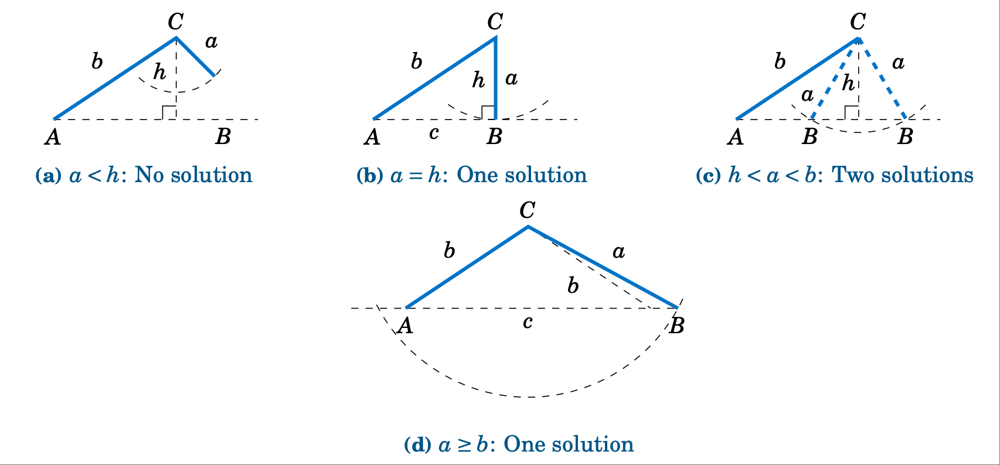

    **图 2.1.3 当 $A$ 为模棱两可时，歧义情况**

如果 $A$ 是锐角，则从 $C$ 到 :math:`\overline{AB}` 的高为 :math:`h = b\;\sin\;A`。如图 :ref:`2.1.3 <fig:ambiguous>` (a)-(c) 所示，当 $a < h$ 时无解（例 :ref:`2.3 <exmp:case2nosoln>` 中就是这种情况）；当 $a = h$ 时，有且只有一个解，即直角三角形；当 $h < a < b$ 时，有两个解（例 :ref:`2.2 <exmp:case2>` 中就是这种情况）。当 :math:`a \ge b` 时，只有一个解，尽管从图 :ref:`2.1.3 <fig:ambiguous>` (d) 中可以看出，可能有两个解，因为虚线弧与水平线相交于两点。然而，图 :ref:`2.1.3 <fig:ambiguous>` (d) 中 $A$ 左侧的交点不能用于确定 $B$，因为那样会使 $A$ 成为钝角，而我们假设 $A$ 是锐角。

如果 $A$ 不是锐角（即 $A$ 是钝角或直角），则情况更简单：如果 :math:`a \le b` 则无解，如果 :math:`a > b` 则只有一个解（参见图 :ref:`2.1.4 <fig:ambigobtuse>`）。

.. _Figure 2.1.4:

.. _fig:ambigobtuse:

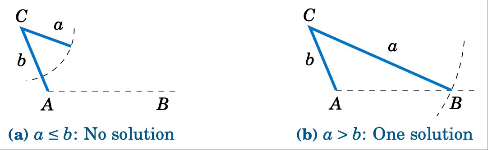

    **图 2.1.4 当** :math:`A \ge 90^\circ` 时出现歧义的情况

表 :ref:`2.1 模棱两可的案例摘要` 总结了给定 $a$、$A$ 和 $b$ 时求解 :math:`\triangle ABC` 的模糊情况。当然，字母可以互换，例如，将 $a$ 和 $A$ 分别替换为 $c$ 和 $C$，等等。

.. _tbl:ambiguous:

.. _Table 2.1:

**Table 2.1 模棱两可的案例摘要**

+---------------------------------------------+---------------------------------------+
| :math:`0^\circ < A < 90^\circ`              | :math:`90^\circ \le A < 180^\circ`    |
+=============================================+=======================================+
| - :math:`a < b\;\sin\;A`: 无解              | - :math:`a \le b`: 无解               |
| - :math:`a = b\;\sin\;A`: 1个解             | - :math:`a > b`: 1个解                |
| - :math:`b\;\sin\;A < a < b`: 2个解         |                                       |
| - :math:`a \ge b`: 1个解                    |                                       |
+---------------------------------------------+---------------------------------------+

正弦定理有一个有趣的几何推论。回想一下1.1节，直角三角形中斜边是最大的边。由于直角是直角三角形中最大的角，这意味着最大的边是最大角的对边。正弦定理的作用是将这一推论推广到*任何*三角形：

.. note::

    在任何三角形中，最大的边与最大的角相对。

为了证明这一点，设 $C$ 是三角形 :math:`\triangle ABC` 中的最大角。如果 :math:`C = 90^\circ`，那么我们已经知道它的对边 $c$ 是最大边。因此，我们只需要证明当 $C$ 为锐角和 $C$ 为钝角时的结果。在这两种情况下，都有 :math:`A \le C` 和 :math:`B \le C`。我们首先证明 :math:`\sin\;A \le \sin\;C` 和 :math:`\sin\;B \le \sin\;C`。

.. _fig:sinasinc:

.. _Figure 2.1.5:

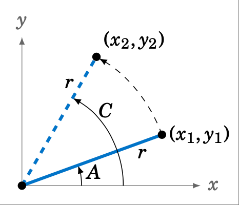

    **Figure 2.1.5**

如果 C 为锐角，则 A 和 B 也为锐角。由于 A ≤ C，设 A 在 xy 坐标平面中处于标准位置，我们将 A 的终边逆时针旋转至较大角 C 的终边，如图 2.1.5 所示。如果我们分别在 $A$ 和 $C$ 的端点上选取点 :math:`(x_{1},y_{1})` 和 :math:`(x_{2},y_{2})`，使得它们到原点的距离等于 $r$，那么从图中可以看出 $y_{1} \le y_{2}$，因此

.. math::

    \sin\;A ~=~ \frac{y_{1}}{r} ~\le~ \frac{y_{2}}{r} ~=~ \sin\;C ~。

类似地，:math:`B \le C` 意味着 :math:`\sin\;B \le \sin\;C`。因此，当 $C$ 为锐角时，:math:`\sin\;A \le \sin\;C` 和 :math:`\sin\;B \le \sin\;C` 不等式成立。现在我们将证明，当 $C$ 为钝角时，这些不等式成立。

如果 C 是钝角，则 :math:`180^\circ - C` 是锐角，A 和 B 也是锐角。如果 :math:`A > 180^\circ - C`，则 :math:`A + C > 180^\circ`，这是不可能的。因此，A 必然小于 :math:`180^\circ - C`。同理，B 也必然小于 :math:`180^\circ - C`。所以，根据上面关于锐角的证明，我们知道 :math:`\sin\;A` 小于 :math:`\sin\;(180^\circ - C)`，并且 :math:`\sin\;B` 小于 :math:`\sin\;(180^\circ - C)`。但是，根据 1.5 节，我们知道 :math:`\sin\;C = \sin\;(180^\circ - C)` 。因此，当 $C$ 为钝角时，:math:`\sin\;A \le \sin\;C` 和 :math:`\sin\;B \le \sin\;C`。

因此，如果 $C$ 是锐角或钝角，则 :math:`\sin\;A \le \sin\;C`，根据正弦定理，我们有

.. math::

    \begin{align*}
    \frac{a}{c} ~=~ \frac{\sin\;A}{\sin\;C} ~\le~ \frac{\sin\;C}{\sin\;C} ~=~ 1 \quad\Rightarrow\quad
    \frac{a}{c} ~\le~ 1 \quad\Rightarrow\quad a ~\le~ c ~.
    \end{align*}

类似地，:math:`b \le c`。因此，:math:`a \le c` 和 :math:`b \le c`，即 $c$ 是最大边。[证明完毕]

.. toggle::

    There is a way to determine how many solutions a triangle has in Case 2. For a triangle
    :math:`\triangle ABC`, suppose that we know the sides $a$ and $b$ and the angle $A$. Draw the angle $A$
    and the side $b$, and imagine that the side $a$ is attached at the vertex at $C$ so that it can
    "swing" freely, as indicated by the dashed arc in Figure :ref:`2.1.3 <fig:ambiguous>` below.
    
    
    .. figure:: ./img/f2.1.3.png 
        :align: center 
        :scale: 50%
    
        **Figure 2.1.3 The ambiguous case when $A$ is acute**
    
    If $A$ is acute, then the altitude from $C$ to :math:`\overline{AB}` has height :math:`h = b\;\sin\;A`. As we
    can see in Figure :ref:`2.1.3 <fig:ambiguous>` (a)-(c), there is no solution when $a < h$ (this was the case
    in Example :ref:`2.3 <exmp:case2nosoln>`); there is exactly one solution - namely, a right triangle - when
    $a = h$; and there are two solutions when $h < a < b$ (as was the case in Example :ref:`2.2 <exmp:case2>`).
    When :math:`a \ge b` there is only one solution, even though it appears from Figure :ref:`2.1.3 <fig:ambiguous>` (d)
    that there may be two solutions, since the dashed arc intersects the horizontal line at two points.
    However, the point of intersection to the left of $A$ in Figure :ref:`2.1.3 <fig:ambiguous>` (d) can not be
    used to determine $B$, since that would make $A$ an obtuse angle, and we assumed that $A$ was acute.
    
    If $A$ is not acute (i.e. $A$ is obtuse or a right angle), then the situation is simpler: there is
    no solution if :math:`a \le b`, and there is exactly one solution if :math:`a > b` (see Figure
    :ref:`2.1.4 <fig:ambigobtuse>`).
    
    
    .. figure:: ./img/f2.1.4.png 
        :align: center 
        :scale: 50%
    
        **Figure 2.1.4 The ambiguous case when** :math:`A \ge 90^\circ`
    
    Table :ref:`2.1 <tbl:ambiguous>` summarizes the ambiguous case of solving :math:`\triangle ABC` when
    given $a$, $A$, and $b$. Of course, the letters can be interchanged, e.g. replace $a$ and $A$ by $c$
    and $C$, etc.
    
    
    **Table 2.1 Summary of the ambiguous case**
    
    +---------------------------------------------+---------------------------------------+
    | :math:`0^\circ < A < 90^\circ`              | :math:`90^\circ \le A < 180^\circ`    |
    +=============================================+=======================================+
    | - :math:`a < b\;\sin\;A`: No solution       | - :math:`a \le b`: No solution        |
    | - :math:`a = b\;\sin\;A`: One solution      | - :math:`a > b`: One solution         |
    | - :math:`b\;\sin\;A < a < b`: Two solutions |                                       |
    | - :math:`a \ge b`: One solution             |                                       |
    +---------------------------------------------+---------------------------------------+
    
    
    There is an interesting geometric consequence of the Law of Sines. Recall from Section 1.1 that in a right triangle the hypotenuse is the largest side. Since a right angle is the largest angle in a right triangle, this means that the largest side is opposite the largest angle. What the Law of Sines does is generalize this to *any* triangle:
    
    .. note::
    
        In any triangle, the largest side is opposite the largest angle.
    
    To prove this, let $C$ be the largest angle in a triangle :math:`\triangle ABC`. If :math:`C = 90^\circ` then we already know that its opposite side $c$ is the largest side. So we just need to prove the result for when $C$ is acute and for when $C$ is obtuse. In both cases, we have :math:`A \le C` and :math:`B \le C`. We will first show that :math:`\sin\;A \le \sin\;C` and :math:`\sin\;B \le \sin\;C`.
    
    
    .. figure:: ./img/f2.1.5.png 
        :align: right
        :scale: 50%
    
        **Figure 2.1.5**
    
    If $C$ is acute, then $A$ and $B$ are also acute. Since :math:`A \le C`, imagine
    that $A$ is in standard position in the $xy$-coordinate plane and that we rotate the terminal side
    of $A$ counterclockwise to the terminal side of the larger angle $C$, as in Figure
    :ref:`2.1.5 <fig:sinasinc>`. If we pick points :math:`(x_{1},y_{1})` and :math:`(x_{2},y_{2})` on the terminal sides of
    $A$ and $C$, respectively, so that their distance to the origin is the same number $r$, then we see
    from the picture that $y_{1} \le y_{2}$, and hence
    
    .. math::
    
        \sin\;A ~=~ \frac{y_{1}}{r} ~\le~ \frac{y_{2}}{r} ~=~ \sin\;C ~.
    
    By a similar argument, :math:`B \le C` implies that :math:`\sin\;B \le \sin\;C`. Thus, :math:`\sin\;A \le \sin\;C` and :math:`\sin\;B \le \sin\;C` when $C$ is acute. We will now show that these inequalities hold when $C$ is obtuse.
    
    If $C$ is obtuse, then $180^\circ - C$ is acute, as are $A$ and $B$. If :math:`A > 180^\circ - C` then :math:`A + C > 180^\circ`, which is impossible. Thus, we must have :math:`A \le 180^\circ - C`. Likewise, :math:`B \le 180^\circ - C`. So by what we showed above for acute angles, we know that :math:`\sin\;A \le \sin\;(180^\circ - C)` and :math:`\sin\;B \le \sin\;(180^\circ - C)`. But we know from Section 1.5 that :math:`\sin\;C = \sin\;(180^\circ - C)`. Hence, :math:`\sin\;A \le \sin\;C` and :math:`\sin\;B \le \sin\;C` when $C$ is obtuse.
    
    Thus, :math:`\sin\;A \le \sin\;C` if $C$ is acute or obtuse, so by the Law of Sines we have
    
    .. math::
    
        \begin{align*}
        \frac{a}{c} ~=~ \frac{\sin\;A}{\sin\;C} ~\le~ \frac{\sin\;C}{\sin\;C} ~=~ 1 \quad\Rightarrow\quad
        \frac{a}{c} ~\le~ 1 \quad\Rightarrow\quad a ~\le~ c ~.
        \end{align*}
    
    By a similar argument, :math:`b \le c`. Thus, :math:`a \le c` and :math:`b \le c`, i.e. $c$ is the largest side. [qed]

练习
~~~~~~~~~~~~~~
Exercises

对于练习 1-9，解三角形 :math:`\triangle ABC`。

1. :math:`a = 10, A = 35^\circ, B = 25^\circ`
2. :math:`b = 40, B = 75^\circ, c = 35`
3. :math:`A = 40^\circ, B = 45^\circ, c = 15`
4. :math:`a = 5, A = 42^\circ, b = 7`
5. :math:`a = 40, A = 25^\circ, c = 30`
6. :math:`a = 5, A = 47^\circ, b = 9`
7. :math:`a = 12, A = 94^\circ, b = 15`
8. :math:`a = 15, A = 94^\circ, b = 12`
9. :math:`a = 22, A = 50^\circ, c = 27`

10. 画一个半径为 $2$ 英寸的圆，并在圆内画一个三角形。用尺子和量角器测量三角形的边 $a$、$b$、$c$ 和角 $A$、$B$、$C$。正弦定律指出， :math:`\frac{a}{\sin\;A}`、:math:`\frac{b}{\sin\;B}` 和 :math:`\frac{c}{\sin\;C}` 的比值相等。验证一下你的三角形是否满足此定律。这个公比与圆的直径有什么关系？

11. 地面上的一名观察员测量到一架正在接近的飞机的倾角为 :math:`30^\circ`，$10$ 秒后，他测量到的倾角为 :math:`55^\circ`。如果飞机以恒定速度在观察者正上方 6000 英尺的高度沿直线飞行，求飞机的速度（英里/小时）。（注意：1 英里 = 5280 英尺）

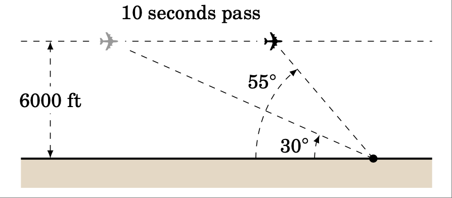

.. _exer:lawsinesright:

12. 证明直角三角形的正弦定理。（*提示：其中一个角已知。*）
13. 对于三角形 :math:`\triangle ABC`，证明 :math:`~\dfrac{a \pm b}{c} ~=~ \dfrac{\sin\;A \;\pm\; \sin\;B}{\sin\;C}\,`。
14. 对于三角形 :math:`\triangle ABC`，证明 :math:`~\dfrac{a}{c} ~=~\dfrac{\sin\;(B+C)}{\sin\;C}\,`。
15. 平行四边形的一条对角线长 17 cm，与边的夹角分别为 :math:`36^\circ \text{ 和 } 15^\circ`。求边长。
16. 解释为什么在情况 1（一条边和两个角）中始终只有一个解。

.. toggle::

    For Exercises 1-9, solve the triangle :math:`\triangle ABC`.
    
    1. :math:`a = 10, A = 35^\circ, B = 25^\circ`
    2. :math:`b = 40, B = 75^\circ, c = 35`
    3. :math:`A = 40^\circ, B = 45^\circ, c = 15`
    4. :math:`a = 5, A = 42^\circ, b = 7`
    5. :math:`a = 40, A = 25^\circ, c = 30`
    6. :math:`a = 5, A = 47^\circ, b = 9`
    7. :math:`a = 12, A = 94^\circ, b = 15`
    8. :math:`a = 15, A = 94^\circ, b = 12`
    9. :math:`a = 22, A = 50^\circ, c = 27`
    
    10. Draw a circle with a radius of $2$ inches and inscribe a triangle inside the circle. Use a ruler and a protractor to measure the sides $a$, $b$, $c$ and the angles $A$, $B$, $C$ of the triangle. The Law of Sines says that the ratios :math:`\frac{a}{\sin\;A}`, :math:`\frac{b}{\sin\;B}`, :math:`\frac{c}{\sin\;C}` are equal. Verify this for your triangle. What relation does that common ratio have to the diameter of your circle?
    
    11. An observer on the ground measures an angle of inclination of :math:`30^\circ` to an approaching airplane, and $10$ seconds later measures an angle of inclination of :math:`55^\circ`. If the airplane is flying at a constant speed and at a steady altitude of $6000$ ft in a straight line directly over the observer, find the speed of the airplane in miles per hour. (Note: $1$ mile = $5280$ ft)
    
    .. figure:: ./img/51-0.png 
        :align: center
        :scale: 50%
    
    12. Prove the Law of Sines for right triangles. (*Hint: One of the angles is known.*)
    13. For a triangle :math:`\triangle ABC`, show that :math:`~\dfrac{a \pm b}{c} ~=~ \dfrac{\sin\;A \;\pm\; \sin\;B}{\sin\;C}\,`.
    14. For a triangle :math:`\triangle ABC`, show that :math:`~\dfrac{a}{c} ~=~\dfrac{\sin\;(B+C)}{\sin\;C}\,`.
    15. One diagonal of a parallelogram is 17 cm long and makes angles of :math:`36^\circ \text{ and } 15^\circ` with the sides. Find the lengths of the sides.
    16. Explain why in Case 1 (one side and two angles) there is always exactly one solution.

2.2 余弦定理
--------------------
The Law of Cosines

现在我们将讨论如何解三角形的第三种情况：两条边和它们之间的夹角。首先，让我们看看在这种情况下尝试使用正弦定理会发生什么。

.. _Example 2.4:

.. _exmp:case3sine:

.. admonition:: Example 2.4

    .. figure:: ./img/e2.4.png 
        :align: right
        :scale: 50%

    *案例 3：两条边和它们之间的角度。*

    给定 :math:`A = 30^\circ`、$b = 4$ 和 $c = 5$，解三角形 :math:`\triangle ABC`。

    **解答：** 利用正弦定理，我们得到

    .. math::

        \frac{a}{\sin\;30^\circ} ~=~ \frac{4}{\sin\;B} ~=~ \frac{5}{\sin\;C} ~,

    其中每个方程都有两个未知数，使得问题无法求解。例如，为了求解 $a$，我们可以使用方程 :math:`\frac{4}{\sin\;B} = \frac{5}{\sin\;C}` 来求解 :math:`\sin\;B`，并将其代入方程 :math:`\frac{a}{\sin\;30^\circ} = \frac{4}{\sin\;B}`。但这只会得到方程 :math:`\frac{a}{\sin\;30^\circ} = \frac{5}{\sin\;C}`，这个方程我们已经知道了，但仍然有两个未知数！

    因此，这个问题无法用正弦定理来解。

    .. toggle::

        .. figure:: ./img/e2.4.png 
            :align: right
            :scale: 50%

        *Case 3: Two sides and the angle between them.*

        Solve the triangle :math:`\triangle ABC` given :math:`A = 30^\circ`, $b = 4$, and $c = 5$.

        **Solution:** Using the Law of Sines, we have

        .. math::

            \frac{a}{\sin\;30^\circ} ~=~ \frac{4}{\sin\;B} ~=~ \frac{5}{\sin\;C} ~,

        where each of the equations has two unknown parts, making the problem impossible to solve. For example, to solve for $a$ we could use the equation :math:`\frac{4}{\sin\;B} = \frac{5}{\sin\;C}` to solve for :math:`\sin\;B` in terms of :math:`\sin\;C` and substitute that into the equation :math:`\frac{a}{\sin\;30^\circ} = \frac{4}{\sin\;B}`. But that would just result in the equation :math:`\frac{a}{\sin\;30^\circ} = \frac{5}{\sin\;C}`, which we already knew and which still has two unknowns!

        Thus, this problem can not be solved using the Law of Sines.

为了解上面例子中的三角形，我们可以使用 *余弦定律(Law of Cosines)*：

.. toggle::

    To solve the triangle in the above example, we can use the *Law of Cosines*:

.. _thm:lawcosines:

    **定理 2.2. 余弦定律:** 如果一个三角形的边长分别为 $a$、$b$ 和 $c$，分别与角 $A$、$B$ 和 $C$ 对角，则

    .. _equation 2.9:

    .. _eqn:lawcosinesa:

    .. math::
        :label: eqn:lawcosinesa

        a^2 = b^2 + c^2 - 2bc\;\cos\;A ~,

    .. _equation 2.10:

    .. _eqn:lawcosinesb:

    .. math::
        :label: eqn:lawcosinesb

        b^2 = c^2 + a^2 - 2ca\;\cos\;B ~,

    .. _equation 2.11:

    .. _eqn:lawcosinesc:

    .. math::
        :label: eqn:lawcosinesc

        c^2 = a^2 + b^2 - 2ab\;\cos\;C ~.

    .. toggle::

        **Theorem 2.2. Law of Cosines:** If a triangle has sides of lengths $a$, $b$, and $c$ opposite the angles $A$, $B$, and $C$, respectively, then

        .. math::
            :label: eqn:lawcosinesa

            a^2 = b^2 + c^2 - 2bc\;\cos\;A ~,

        .. math::
            :label: eqn:lawcosinesb

            b^2 = c^2 + a^2 - 2ca\;\cos\;B ~,

        .. math::
            :label: eqn:lawcosinesc

            c^2 = a^2 + b^2 - 2ab\;\cos\;C ~.

为了证明余弦定律，设 :math:`\triangle ABC` 为斜三角形。则 :math:`\triangle ABC` 可以是锐角三角形，如图 :ref:`2.2.1 <fig:lawcosines>` (a) 所示；也可以是钝角三角形，如图 :ref:`2.2.1 <fig:lawcosines>` (b) 所示。分别画出从顶点 $C$ 到边 :math:`\overline{AB}` 的高。在图 :ref:`2.2.1 <fig:lawcosines>` (a) 中，高线将 :math:`\overline{AB}` 分成两条线段，长度分别为 $x$ 和 $c-x$；在图 :ref:`2.2.1 <fig:lawcosines>` (b) 中，高线将边 :math:`\overline{AB}` 延长了 $x$。令 $h$ 为高线的高度。

.. _fig:lawcosines:

.. _Figure 2.2.1:

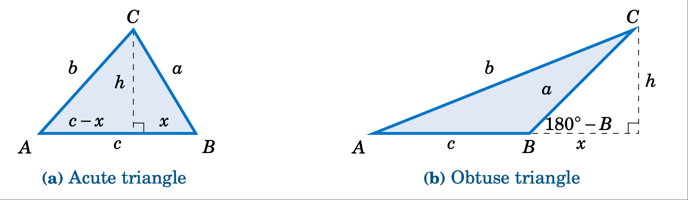

    **斜三角形余弦定理的证明** :math:`\triangle ABC`

对于图 :ref:`2.2.1 <fig:lawcosines>` 中的每个三角形，根据勾股定理，我们可知：

.. _equation 2.12:

.. _eqn:hsquared

.. math::
    :label: eqn:hsquared

    h^2 ~=~ a^2 ~-~ x^2

同样，对于图 :ref:`2.2.1 <fig:lawcosines>` (a) 中的锐角三角形，我们可知：

.. _equation 2.13:

.. _eqn:bsquaredacute:

.. math::
    :label: eqn:bsquaredacute

    b^2 ~=~ h^2 ~+~ (c-x)^2 ~.

因此，将方程 :eq:`2.12 <eqn:hsquared>` 中 $h^2$ 的表达式代入方程 :eq:`2.13 <eqn:bsquaredacute>` 中，可得

.. math::

    \begin{align}
    b^2 ~&=~ a^2 ~-~ x^2 ~+~ (c-x)^2\\
    &=~ a^2 ~-~ x^2 ~+~ c^2 ~-~ 2cx ~+~ x^2\\
    &=~ a^2 ~+~ c^2 ~-~ 2cx ~.
    \end{align}

但是我们从图 :ref:`2.2.1 <fig:lawcosines>` (a) 中看到 :math:`x = a\;\cos\;B`，所以

.. _equation 2.14:

.. _eqn:2.14:

.. math::
    :label: eqn:2.14

    b^2 ~=~ a^2 ~+~ c^2 ~-~ 2ca\;\cos\;B ~.

对于图 :ref:`2.2.1 <fig:lawcosines>` (b) 中的钝角三角形，我们看到

.. _equation 2.15:

.. _eqn:bsquaredobtuse:

.. math::
    :label: eqn:bsquaredobtuse

    b^2 ~=~ h^2 ~+~ (c+x)^2 ~.

因此，将方程 (:ref:`2.12 <eqn:hsquared>`) 中 $h^2$ 的表达式代入方程 :eq:`2.15 <eqn:bsquaredobtuse>` 中，可得

.. math::

    \begin{align}
    b^2 ~&=~ a^2 ~-~ x^2 ~+~ (c+x)^2\\
    &=~ a^2 ~-~ x^2 ~+~ c^2 ~+~ 2cx ~+~ x^2\\
    &=~ a^2 ~+~ c^2 ~+~ 2cx ~.
    \end{align}

但是，从图 :ref:`2.2.1 <fig:lawcosines>` (a) 中可以看出 :math:`x = a\;\cos\;(180^\circ - B)`，并且从 1.5 节中得知 :math:`\cos\;(180^\circ - B) = -\cos\;B`。因此， :math:`x = -a\;\cos\;B`，因此

.. _equation 2.15:

.. _eqn:2.15:

.. math::
    :label: eqn:2.15

    b^2 ~=~ a^2 ~+~ c^2 ~-~ 2ca\;\cos\;B ~.

因此，对于锐角三角形和钝角三角形，我们都证明了余弦定律中的公式 :eq:`2.10 <eqn:lawcosinesb>`。注意，该证明针对的是 $B$ 锐角和钝角的情况。通过对 $A$ 和 $C$ 进行类似的推导，我们得到了另外两个公式。[qed]

注意，我们没有证明直角三角形的余弦定律，因为事实证明（参见练习 :ref:`15 <exer:lawcosinesright>`），对于直角三角形，这三个公式都可以化简为勾股定理。余弦定律可以看作是勾股定理的推广。

另外，请注意，只需记住 :eq:`2.9 <eqn:lawcosinesa>` - :eq:`2.11 <eqn:lawcosinesc>` 这三个公式中的一个即可，因为另外两个公式可以通过“循环”字母 $a$、$b$ 和 $c$ 得到。也就是说，用 $b$ 替换 $a$，用 $c$ 替换 $b$，再用 $a$ 替换 $c$（大写字母也同样如此）。循环一次可以得到第二个公式，再循环一次可以得到第三个公式。

三角形两条边之间的夹角通常称为 **夹角** 。注意，在余弦定律中，如果已知两条边及其夹角（例如 $b$、$c$ 和 $A$），那么我们就有第三边平方的公式。

我们现在将解决示例 :ref:`2.4 <exmp:case3sine>` 中的三角形。

.. toggle::

    To prove the Law of Cosines, let :math:`\triangle ABC` be an oblique triangle. Then :math:`\triangle ABC` can be acute, as in Figure :ref:`2.2.1 <fig:lawcosines>` (a), or it can be obtuse, as in Figure :ref:`2.2.1 <fig:lawcosines>` (b). In each case, draw the altitude from the vertex at $C$ to the side :math:`\overline{AB}`. In Figure :ref:`2.2.1 <fig:lawcosines>` (a) the altitude divides :math:`\overline{AB}` into two line segments with lengths $x$ and $c-x$, while in Figure :ref:`2.2.1 <fig:lawcosines>` (b) the altitude extends the side :math:`\overline{AB}` by a distance $x$. Let $h$ be the height of the altitude.

    .. figure:: ./img/f2.2.1.png
        :align: center
        :scale: 50%

        **Proof of the Law of Cosines for an oblique triangle** :math:`\triangle ABC`

    For each triangle in Figure :ref:`2.2.1 <fig:lawcosines>`, we see by the Pythagorean Theorem that

    .. math::
        :label: eqn:hsquared

        h^2 ~=~ a^2 ~-~ x^2

    and likewise for the acute triangle in Figure :ref:`2.2.1 <fig:lawcosines>` (a) we see that

    .. math::
        :label: eqn:bsquaredacute

        b^2 ~=~ h^2 ~+~ (c-x)^2 ~.

    Thus, substituting the expression for $h^2$ in equation :eq:`2.12 <eqn:hsquared>` into equation :eq:`2.13 <eqn:bsquaredacute>` gives

    .. math::
    
        \begin{align}
        b^2 ~&=~ a^2 ~-~ x^2 ~+~ (c-x)^2\\
        &=~ a^2 ~-~ x^2 ~+~ c^2 ~-~ 2cx ~+~ x^2\\
        &=~ a^2 ~+~ c^2 ~-~ 2cx ~.
        \end{align}

    But we see from Figure :ref:`2.2.1 <fig:lawcosines>` (a) that :math:`x = a\;\cos\;B`, so

    .. math::
        :label: eqn:2.14

        b^2 ~=~ a^2 ~+~ c^2 ~-~ 2ca\;\cos\;B ~.

    And for the obtuse triangle in Figure :ref:`2.2.1 <fig:lawcosines>` (b) we see that

    .. math::
        :label: eqn:bsquaredobtuse

        b^2 ~=~ h^2 ~+~ (c+x)^2 ~.

    Thus, substituting the expression for $h^2$ in equation (:ref:`2.12 <eqn:hsquared>`) into equation :eq:`2.15 <eqn:bsquaredobtuse>` gives

    .. math::

        \begin{align}
        b^2 ~&=~ a^2 ~-~ x^2 ~+~ (c+x)^2\\
        &=~ a^2 ~-~ x^2 ~+~ c^2 ~+~ 2cx ~+~ x^2\\
        &=~ a^2 ~+~ c^2 ~+~ 2cx ~.
        \end{align}

    But we see from Figure :ref:`2.2.1 <fig:lawcosines>` (a) that :math:`x = a\;\cos\;(180^\circ - B)`, and we know from Section 1.5 that :math:`\cos\;(180^\circ - B) = -\cos\;B`. Thus, :math:`x = -a\;\cos\;B` and so

    .. math::
        :label: eqn:2.15

        b^2 ~=~ a^2 ~+~ c^2 ~-~ 2ca\;\cos\;B ~.

    So for both acute and obtuse triangles we have proved formula :eq:`2.10 <eqn:lawcosinesb>` in the Law of Cosines. Notice that the proof was for $B$ acute and obtuse. By similar arguments for $A$ and $C$ we get the other two formulas. [qed]

    Note that we did not prove the Law of Cosines for right triangles, since it turns out (see Exercise :ref:`15 <exer:lawcosinesright>`) that all three formulas reduce to the Pythagorean Theorem for that case. The Law of Cosines can be viewed as a generalization of the Pythagorean Theorem.

    Also, notice that it suffices to remember just one of the three formulas :eq:`2.9 <eqn:lawcosinesa>` - :eq:`2.11 <eqn:lawcosinesc>`, since the other two can be obtained by "cycling" through the letters $a$, $b$, and $c$. That is, replace $a$ by $b$, replace $b$ by $c$, and replace $c$ by $a$ (likewise for the capital letters). One cycle will give you the second formula, and another cycle will give you the third.

    The angle between two sides of a triangle is often called the **included angle**. Notice in the Law of Cosines that if two sides and their included angle are known (e.g. $b$, $c$, and $A$), then we have a formula for the square of the third side.

    We will now solve the triangle from Example :ref:`2.4 <exmp:case3sine>`.

.. _Example 2.5:

.. _exmp:case3cosine:

.. admonition:: Example 2.5

    .. figure:: ./img/e2.5.png 
        :align: right
        :scale: 50%

    *案例 3：两条边和它们之间的角度。*

    已知 :math:`A = 30^\circ`、$b = 4$ 和 $c = 5$，求解三角形 :math:`\triangle ABC`。

    **解答：** 我们将使用余弦定理求出 $a$，再次使用它求出 $B$，然后使用 :math:`C = 180^\circ - A - B`。首先，我们有

    .. math::

        \begin{align}
        a^2 ~ &= ~ b^2 ~ &+ ~ c^2 ~ &- ~ 2bc\;\cos\;A\\
        &= ~ 4^2 ~ &+ ~ 5^2 ~ &- ~ 2(4)(5)\;\cos\;30^\circ ~=~ 6.36 \quad\Rightarrow\quad
        \boxed{a ~=~ 2.52} ~.
        \end{align}

    现在我们使用 $b^2$ 的公式来求 $B$：

    .. math::

        \begin{align*}
        b^2 ~ = ~ c^2 ~ + ~ a^2 ~ - ~ 2ca\;\cos\;B \quad&\Rightarrow\quad
        \cos\;B ~=~ \frac{c^2 ~ + ~ a^2 ~-~ b^2}{2ca}\\
        &\Rightarrow\quad \cos\;B ~=~ \frac{5^2 ~ + ~ (2.52)^2 ~-~ 4^2}{2(5)(2.52)} ~=~ 0.6091\\
        &\Rightarrow\quad \boxed{B ~=~ 52.5^\circ}
        \end{align*}

    因此，:math:`C = 180^\circ - A - B = 180^\circ - 30^\circ - 52.5^\circ \Rightarrow \boxed{C = 97.5^\circ}\;`。

    .. toggle::

        .. figure:: ./img/e2.5.png 
            :align: right
            :scale: 50%

        *Case 3: Two sides and the angle between them.* 

        Solve the triangle :math:`\triangle ABC` given :math:`A = 30^\circ`, $b = 4$, and $c = 5$.

        **Solution:** We will use the Law of Cosines to find $a$, use it again to find $B$, then use :math:`C = 180^\circ - A - B`. First, we have

        .. math::

            \begin{align}
            a^2 ~ &= ~ b^2 ~ &+ ~ c^2 ~ &- ~ 2bc\;\cos\;A\\
            &= ~ 4^2 ~ &+ ~ 5^2 ~ &- ~ 2(4)(5)\;\cos\;30^\circ ~=~ 6.36 \quad\Rightarrow\quad
            \boxed{a ~=~ 2.52} ~.
            \end{align}

        Now we use the formula for $b^2$ to find $B$:

        .. math::

            \begin{align*}
            b^2 ~ = ~ c^2 ~ + ~ a^2 ~ - ~ 2ca\;\cos\;B \quad&\Rightarrow\quad
            \cos\;B ~=~ \frac{c^2 ~ + ~ a^2 ~-~ b^2}{2ca}\\
            &\Rightarrow\quad \cos\;B ~=~ \frac{5^2 ~ + ~ (2.52)^2 ~-~ 4^2}{2(5)(2.52)} ~=~ 0.6091\\
            &\Rightarrow\quad \boxed{B ~=~ 52.5^\circ}
            \end{align*}

        Thus, :math:`C = 180^\circ - A - B = 180^\circ - 30^\circ - 52.5^\circ \Rightarrow \boxed{C = 97.5^\circ}\;`.

请注意，在示例 :ref:`2.5 <exmp:case3cosine>` 中，只有一个解。对于情况 3，这将 *始终* 成立：当给定两条边及其夹角时，三角形将只有一个解。原因很简单：当在公共顶点连接两条线段以形成一个角时，只有一种方法可以将它们的自由端点与第三条线段连接起来，无论角度大小如何。

您可能想知道为什么我们在示例 :ref:`2.5 <exmp:case3cosine>` 中第二次使用余弦定律来求角 $B$。为什么不使用公式更简单的正弦定律呢？原因是使用余弦函数可以消除任何歧义：如果余弦为正，则角为锐角，如果余弦为负，则角为钝角。这与使用正弦函数相反；正如我们在 2.1 节中看到的，锐角及其钝角补角的正弦值相同。

为了说明这一点，假设我们在例 :ref:`2.5 <exmp:case3cosine>` 中使用正弦定理求 $B$：

.. math::

    \sin\;B ~=~ \frac{b\;\sin\;A}{a} ~=~ \frac{4\;\sin\;30^\circ}{2.52} ~=~ 0.7937
    \quad\Rightarrow\quad B ~=~ 52.5^\circ ~\text{or}~ 127.5^\circ

我们如何知道哪个答案是正确的？我们不能立即排除 :math:`B = 127.5^\circ` 过大的可能性，因为它会导致 :math:`A + B = 157.5^\circ < 180^\circ`，因此 :math:`C = 22.5^\circ`，这似乎是一个有效的解。然而，这个解是不可能的。为什么？因为三角形中最大的边是 $c = 5$，这（正如我们在 2.1 节中学到的）意味着 $C$ 必须是最大的角。但 :math:`C = 22.5^\circ` 并不是这个解中最大的角，因此我们得到了矛盾。

剩下的就是解情况 4 中的三角形，即给定三条边。现在我们将讨论如何将余弦定律应用于这种情况。

.. toggle::

    Notice in Example :ref:`2.5 <exmp:case3cosine>` that there was only one solution. For Case 3 this will *always* be true: when given two sides and their included angle, the triangle will have exactly one solution. The reason is simple: when joining two line segments at a common vertex to form an angle, there is exactly one way to connect their free endpoints with a third line segment, regardless of the size of the angle.

    You may be wondering why we used the Law of Cosines a second time in Example :ref:`2.5 <exmp:case3cosine>`, to find the angle $B$. Why not use the Law of Sines, which has a simpler formula?  The reason is that using the cosine function eliminates any ambiguity: if the cosine is positive then the angle is acute, and if the cosine is negative then the angle is obtuse. This is in contrast to using the sine function; as we saw in Section 2.1, both an acute angle and its obtuse supplement have the same positive sine.

    To see this, suppose that we had used the Law of Sines to find $B$ in Example :ref:`2.5 <exmp:case3cosine>`:

    .. math::

        \sin\;B ~=~ \frac{b\;\sin\;A}{a} ~=~ \frac{4\;\sin\;30^\circ}{2.52} ~=~ 0.7937
        \quad\Rightarrow\quad B ~=~ 52.5^\circ ~\text{or}~ 127.5^\circ

    How would we know which answer is correct? We could not immediately rule out :math:`B = 127.5^\circ` as too large, since it would make :math:`A + B = 157.5^\circ < 180^\circ` and so :math:`C = 22.5^\circ`, which seems like it could be a valid solution. However, this solution is impossible. Why? Because the largest side in the triangle is $c = 5$, which (as we learned in Section 2.1) means that $C$ has to be the largest angle. But :math:`C = 22.5^\circ` would not be the largest angle in this solution, and hence we have a contradiction.

    It remains to solve a triangle in Case 4, i.e. given three sides. We will now see how to use the Law of Cosines for that case.

.. _Example 2.6:

.. _exmp:case4cosine:

.. admonition:: Example 2.6

    .. figure:: ./img/e2.6.png
        :align: right
        :scale: 40%

    *情况 4：三条边。*

    已知 $a = 2$、$b = 3$ 和 $c = 4$，求解三角形 :math:`\triangle ABC`。

    **解答：** 我们将利用余弦定理求出 $B$ 和 $C$，然后利用 :math:`A = 180^\circ - B - C`。首先，我们使用 $b^2$ 的公式求 $B$：

    .. math::

        \begin{align*}
        b^2 ~ = ~ c^2 ~ + ~ a^2 ~ - ~ 2ca\;\cos\;B \quad&\Rightarrow\quad
        \cos\;B ~=~ \frac{c^2 ~ + ~ a^2 ~-~ b^2}{2ca}\\
        &\Rightarrow\quad \cos\;B ~=~ \frac{4^2 ~ + ~ 2^2 ~-~ 3^2}{2(4)(2)} ~=~ 0.6875\\
        &\Rightarrow\quad \boxed{B ~=~ 46.6^\circ}
        \end{align*}

    现在我们使用 $c^2$ 的公式求 $C$：

    .. math::

        \begin{align*}
        c^2 ~ = ~ a^2 ~ + ~ b^2 ~ - ~ 2ab\;\cos\;C \quad&\Rightarrow\quad
        \cos\;C ~=~ \frac{a^2 ~ + ~ b^2 ~-~ c^2}{2ab}\\
        &\Rightarrow\quad \cos\;C ~=~ \frac{2^2 ~ + ~ 3^2 ~-~ 4^2}{2(2)(3)} ~=~ -0.25\\
        &\Rightarrow\quad \boxed{C ~=~ 104.5^\circ}
        \end{align*}

    因此，:math:`A = 180^\circ - B - C = 180^\circ - 46.6^\circ - 104.5^\circ \Rightarrow \boxed{A = 28.9^\circ}\;`。

    .. toggle::

        .. figure:: ./img/e2.6.png 
            :align: right
            :scale: 50%

        *Case 4: Three sides.*

        Solve the triangle :math:`\triangle ABC` given $a = 2$, $b = 3$, and $c = 4$.

        **Solution:** We will use the Law of Cosines to find $B$ and $C$, then use :math:`A = 180^\circ - B - C`. First, we use the formula for $b^2$ to find $B$:

        .. math::

            \begin{align*}
            b^2 ~ = ~ c^2 ~ + ~ a^2 ~ - ~ 2ca\;\cos\;B \quad&\Rightarrow\quad
            \cos\;B ~=~ \frac{c^2 ~ + ~ a^2 ~-~ b^2}{2ca}\\
            &\Rightarrow\quad \cos\;B ~=~ \frac{4^2 ~ + ~ 2^2 ~-~ 3^2}{2(4)(2)} ~=~ 0.6875\\
            &\Rightarrow\quad \boxed{B ~=~ 46.6^\circ}
            \end{align*}

        Now we use the formula for $c^2$ to find $C$:

        .. math::

            \begin{align*}
            c^2 ~ = ~ a^2 ~ + ~ b^2 ~ - ~ 2ab\;\cos\;C \quad&\Rightarrow\quad
            \cos\;C ~=~ \frac{a^2 ~ + ~ b^2 ~-~ c^2}{2ab}\\
            &\Rightarrow\quad \cos\;C ~=~ \frac{2^2 ~ + ~ 3^2 ~-~ 4^2}{2(2)(3)} ~=~ -0.25\\
            &\Rightarrow\quad \boxed{C ~=~ 104.5^\circ}
            \end{align*}

        Thus, :math:`A = 180^\circ - B - C = 180^\circ - 46.6^\circ - 104.5^\circ \Rightarrow \boxed{A = 28.9^\circ}\;`.

看起来，情况 4 中总有一个解（给定所有三条边），但事实并非如此，如下例所示。

.. toggle::

    It may seem that there is always a solution in Case 4 (given all three sides), but that is not true, as the following example shows.

.. _Example 2.7:

.. _exmp:case4fail:

.. admonition:: Example 2.7

    .. figure:: ./img/e2.7.png
        :align: right
        :scale: 50%

    *情况 4：三条边*

    已知 $a = 2$、$b = 3$、$c = 6$，解三角形 :math:`\triangle ABC`。

    **解：** 如果我们盲目地尝试使用余弦定律来求 $A$，我们会得到

    .. math::

        a^2 ~ = ~ b^2 ~ + ~ c^2 ~ - ~ 2bc\;\cos\;A \quad\Rightarrow\quad \cos\;A ~=~
        \frac{b^2 ~ + ~ c^2 ~-~ a^2}{2bc} ~=~ \frac{3^2 ~ + ~ 6^2 ~-~ 2^2}{2(3)(6)} ~=~ 1.139 ~,

    这是不可能的，因为 :math:`\mid \cos\;A \mid \le 1`。因此，存在 :math:`\boxed{\text{无解}}`。

    .. figure:: ./img/e2.7.1.png
        :align: right
        :scale: 50%

    我们本可以通过认识到其中一条边的长度（c=6）大于其余边的长度之和（a=2 和 b=3），从而节省一些精力，而这（如右图所示）在三角形中是不可能的。

    .. toggle::

        .. figure:: ./img/e2.7.png 
            :align: right
            :scale: 50%

        *Case 4: Three sides.*

        Solve the triangle :math:`\triangle ABC` given $a = 2$, $b = 3$, and $c = 6$.

        **Solution:** If we blindly try to use the Law of Cosines to find $A$, we get

        .. math::

            a^2 ~ = ~ b^2 ~ + ~ c^2 ~ - ~ 2bc\;\cos\;A \quad\Rightarrow\quad \cos\;A ~=~
            \frac{b^2 ~ + ~ c^2 ~-~ a^2}{2bc} ~=~ \frac{3^2 ~ + ~ 6^2 ~-~ 2^2}{2(3)(6)} ~=~ 1.139 ~,

        which is impossible since :math:`\mid \cos\;A \mid \le 1`. Thus, there is :math:`\boxed{\text{no solution}}`.

        .. figure:: ./img/e2.7.1.png 
            :align: right
            :scale: 50%

        We could have saved ourselves some effort by recognizing that the length of one of the sides ($c=6$) is greater than the sums of the lengths of the remaining sides ($a=2$ and $b=3$), which (as the picture on the right shows) is impossible in a triangle.

余弦定理也可以用来解第二种情况（两条边和一个对角）的三角形，尽管它不如正弦定理那么常用。以下示例演示了如何做到这一点。

.. toggle::

    The Law of Cosines can also be used to solve triangles in Case 2 (two sides and one opposite angle), though it is less commonly used for that purpose than the Law of Sines. The following example gives an idea of how to do this.

.. _Example 2.8:

.. _exmp:case2cosine:

.. admonition:: Example 2.8

    *案例 2：两条边和一个对角。*

    已知 $a = 18$，:math:`A = 25^\circ`，$b = 30$，求解三角形 :math:`\triangle ABC`。

    **解答：** 在 2.1 节的例 :ref:`2.2 <exmp:case2>` 中，我们利用正弦定理证明了该三角形有两组解：:math:`B = 44.8^\circ`，:math:`C = 110.2^\circ`，$c = 40$ 和 :math:`B = 135.2^\circ`，:math:`C = 19.8^\circ`，$c = 14.4$。要用余弦定理求解该方程，首先使用 $a^2$ 的公式求出 $c$：

    .. math::

        \begin{align*}
        a^2 ~ = ~ b^2 ~ + ~ c^2 ~ - ~ 2bc\;\cos\;A \quad&\Rightarrow\quad
        18^2 = ~ 30^2 ~ + ~ c^2 ~ - ~ 2(30)c\;\cos\;25^\circ\\
        &\Rightarrow\quad c^2 ~-~ 54.38\,c ~+~ 576 ~ = ~ 0 ~,
        \end{align*}

    这是一个 $c$ 的二次方程，因此我们知道它可以有零个、一个或两个实根（对应于情况 2 中的解的数量）。根据二次公式，我们有

    .. math::

        c ~=~ \frac{54.38 ~\pm~ \sqrt{(54.38)^2 ~-~ 4(1)(576)}}{2(1)} ~=~ 40 ~~\text{or}~~ 14.4 ~。

    注意，这些值与我们之前找到的 $c$ 值相同。对于 $c=40$，我们得到

    .. math::

        \cos\;B ~=~ \frac{c^2 ~ + ~ a^2 ~-~ b^2}{2ca} ~=~
        \frac{40^2 ~ + ~ 18^2 ~-~ 30^2}{2(40)(18)} ~=~ 0.7111
        \quad\Rightarrow\quad B ~=~ 44.7^\circ \quad\Rightarrow\quad C ~=~ 110.3^\circ ~,

    这与我们之前得到的结果很接近（细微的差别是由于不同的舍入方法造成的）。另一个解集可以用类似的方法得到。

    .. toggle::

        *Case 2: Two sides and one opposite angle.* 

        Solve the triangle :math:`\triangle ABC` given $a = 18$, :math:`A = 25^\circ`, and $b = 30$.

        **Solution:** In Example :ref:`2.2 <exmp:case2>` from Section 2.1 we used the Law of Sines to show that there are two sets of solutions for this triangle: :math:`B = 44.8^\circ`, :math:`C = 110.2^\circ`, $c = 40$ and :math:`B = 135.2^\circ`, :math:`C = 19.8^\circ`, $c = 14.4$. To solve this using the Law of Cosines, first find $c$ by using the formula for $a^2$:

        .. math::

            \begin{align*}
            a^2 ~ = ~ b^2 ~ + ~ c^2 ~ - ~ 2bc\;\cos\;A \quad&\Rightarrow\quad
            18^2 = ~ 30^2 ~ + ~ c^2 ~ - ~ 2(30)c\;\cos\;25^\circ\\
            &\Rightarrow\quad c^2 ~-~ 54.38\,c ~+~ 576 ~ = ~ 0 ~,
            \end{align*}

        which is a quadratic equation in $c$, so we know that it can have either zero, one, or two real roots (corresponding to the number of solutions in Case 2). By the quadratic formula, we have

        .. math::

            c ~=~ \frac{54.38 ~\pm~ \sqrt{(54.38)^2 ~-~ 4(1)(576)}}{2(1)} ~=~ 40 ~~\text{or}~~ 14.4 ~.

        Note that these are the same values for $c$ that we found before. For $c=40$ we get

        .. math::

            \cos\;B ~=~ \frac{c^2 ~ + ~ a^2 ~-~ b^2}{2ca} ~=~
            \frac{40^2 ~ + ~ 18^2 ~-~ 30^2}{2(40)(18)} ~=~ 0.7111
            \quad\Rightarrow\quad B ~=~ 44.7^\circ \quad\Rightarrow\quad C ~=~ 110.3^\circ ~,

        which is close to what we found before (the small difference being due to different rounding). The other solution set can be obtained similarly.

与正弦定律类似，余弦定律也可以用来证明一些几何事实，如下例所示。

.. toggle::

    Like the Law of Sines, the Law of Cosines can be used to prove some geometric facts, as in the following example.

.. _Example 2.9:

.. _exmp:case4fail:

.. admonition:: Example 2.9

    .. _Figure 2.2.2:

    .. _fig:diagonal:

    .. figure:: ./img/f2.2.2.png 
        :align: right
        :scale: 50%

    利用余弦定理证明，任何平行四边形对角线的平方和等于边的平方和。

    **解答：** 设 $a$ 和 $b$ 分别为边长，角 $C$ 和 $D$ 所对应的对角线长度分别为 $c$ 和 $d$，如图 :ref:`2.2.2 <fig:diagonal>` 所示。然后我们需要证明：

    .. math::

        c^2 ~+~ d^2 ~=~ a^2 ~+~ b^2 ~+~ a^2 ~+~ b^2 ~=~ 2\,( a^2 ~+~ b^2 ) ~.

    根据余弦定律，我们知道：

    .. math::

        \begin{align*}
        c^2 ~ &= ~ a^2 ~ + ~ b^2 ~ - ~ 2ab\;\cos\;C ~,~\text{and}\\
        d^2 ~ &= ~ a^2 ~ + ~ b^2 ~ - ~ 2ab\;\cos\;D ~.
        \end{align*}

    根据平行四边形的性质，我们知道 :math:`D = 180^\circ - C`，所以

    .. math::

        \begin{align*}
        d^2 ~ &= ~ a^2 ~ + ~ b^2 ~ - ~ 2ab\;\cos\;(180^\circ - C)\\
        &=~ a^2 ~ + ~ b^2 ~ + ~ 2ab\;\cos\;C ~,
        \end{align*}

    因为 :math:`\;\cos\;(180^\circ - C) = -\cos\;C`。因此，

    .. math::

        \begin{align*}
        c^2 ~+~ d^2 ~&=~ a^2 ~ + ~ b^2 ~ - ~ 2ab\;\cos\;C ~+~ a^2 ~ + ~ b^2 ~ + ~ 2ab\;\cos\;C\\
        &=~ 2\,( a^2 ~+~ b^2 ) ~.\quad
        \end{align*}

    **[QED]**

    .. toggle::

        .. figure:: ./img/f2.2.2.png 
            :align: right
            :scale: 50%

        Use the Law of Cosines to prove that the sum of the squares of the diagonals of any parallelogram equals the sum of the squares of the sides.

        **Solution:** Let $a$ and $b$ be the lengths of the sides, and let the diagonals opposite the angles $C$ and $D$ have lengths $c$ and $d$, respectively, as in Figure :ref:`2.2.2 <fig:diagonal>`. Then we need to show that

        .. math::

            c^2 ~+~ d^2 ~=~ a^2 ~+~ b^2 ~+~ a^2 ~+~ b^2 ~=~ 2\,( a^2 ~+~ b^2 ) ~.

        By the Law of Cosines, we know that

        .. math::

            \begin{align*}
            c^2 ~ &= ~ a^2 ~ + ~ b^2 ~ - ~ 2ab\;\cos\;C ~,~\text{and}\\
            d^2 ~ &= ~ a^2 ~ + ~ b^2 ~ - ~ 2ab\;\cos\;D ~.
            \end{align*}

        By properties of parallelograms, we know that :math:`D = 180^\circ - C`, so

        .. math::

            \begin{align*}
            d^2 ~ &= ~ a^2 ~ + ~ b^2 ~ - ~ 2ab\;\cos\;(180^\circ - C)\\
            &=~ a^2 ~ + ~ b^2 ~ + ~ 2ab\;\cos\;C ~,
            \end{align*}
            
        since :math:`\;\cos\;(180^\circ - C) = -\cos\;C`. Thus,

        .. math::

            \begin{align*}
            c^2 ~+~ d^2 ~&=~ a^2 ~ + ~ b^2 ~ - ~ 2ab\;\cos\;C ~+~ a^2 ~ + ~ b^2 ~ + ~ 2ab\;\cos\;C\\
            &=~ 2\,( a^2 ~+~ b^2 ) ~. \quad
            \end{align*}

        **[QED]**

练习
~~~~~~~~~~~~~~
Exercises

练习 1-6，解三角形 :math:`\triangle ABC`。

1. :math:`A = 60^\circ, b = 8, c = 12`
2. :math:`A = 30^\circ, b = 4, c = 6`
3. :math:`a = 7, B = 60^\circ, c = 9`
4. :math:`a = 7, b = 3, c = 9`
5. :math:`a = 6, b = 4, c = 1`
6. :math:`a = 11, b = 13, c = 16`

7. 平行四边形的对角线相交于 :math:`42^\circ` 角，对角线长度分别为 $12$ 和 $7$ 厘米。求平行四边形的边长。 (*提示：对角线互相平分。*)
8. 两列火车同时从同一个火车站出发，沿着构成 :math:`35^\circ` 角的直轨行驶。如果一列火车的平均速度为 $100$ 英里/小时，另一列火车的平均速度为 $90$ 英里/小时，那么半小时后两列火车的间距是多少？
9. 三个半径分别为 $4$、$5$ 和 $6$ 厘米的圆相互外切。求以三个圆心为顶点的三角形的角。

.. _exer:quad:

10. 求下图 :ref:`2.2.3 <fig:exerquad>` 中四边形对角线的长度 $x$。

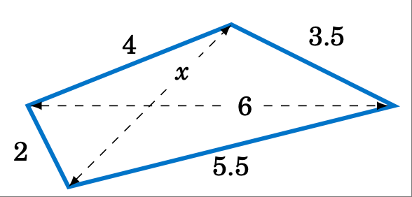

    **图 2.2.3 练习 10**

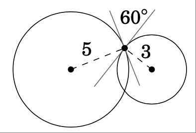

    **图 2.2.3 练习 11**

.. _exer:tancircs:

11. 两个半径分别为 $5$ 厘米和 $3$ 厘米的圆相交于两点。在任一交点处，圆的切线均形成 :math:`60^\circ` 角，如上图 :ref:`2.2.4 <fig:exertancircs>` 所示。求圆心之间的距离。
12. 利用余弦定律证明，对于任意三角形 :math:`\triangle ABC`，若 $C$ 为锐角，则 :math:`c^2 < a^2 + b^2`；若 $C$ 为钝角，则 :ref:`c^2 > a^2 + b^2`；若 $C$ 为直角，则 :math:`c^2 = a^2 + b^2`。
13. 证明，对于任意三角形 :math:`\triangle ABC`，

.. math::

    \frac{\cos\;A}{a} ~+~ \frac{\cos\;B}{b} ~+~ \frac{\cos\;C}{c} ~=~ \frac{a^2 + b^2 + c^2}{2abc}~。

14. 证明：对于任意三角形 :math:`\triangle ABC`，

.. math::

    \cos\;A ~+~ \cos\;B ~+~ \cos\;C ~=~ \frac{a^2 \;(b+c-a)~+~ b^2 \;(a+c-b)~+~ c^2 \;(a+b-c)}{2abc}~。

括号中的项在几何上代表什么？用你的答案解释为什么：math:`\cos\;A ~+~ \cos\;B ~+~ \cos\;C ~>~0\,` 对于任意三角形，即使其中一个余弦为负。 [2]_

.. [2] 事实证明，对于任何三角形，:math:`\;1 < \cos\;A ~+~ \cos\;B ~+~ \cos\;C ~\le~3/2\;`，我们稍后会看到。
       
       It turns out that :math:`\;1 < \cos\;A ~+~ \cos\;B ~+~ \cos\;C ~\le~3/2\;` for any triangle, as we will see later.

.. _exer:lawcosinesright:

15. 证明直角三角形的余弦定律（即公式 :eq:`2.9 <eqn:lawcosinesa>`-:eq:`2.11 <eqn:lawcosinesc>`）。
16. 回忆一下初等几何知识，三角形的 \emph{中线} 是从任意顶点到对边中点的线段。证明三角形三条中线的平方和等于 \sfrac{3}{4} 三条边的平方和。
17. 荷兰天文学家和数学家 Willebrord Snell (1580-1626) 将余弦定律写为

.. math::

    \frac{2ab}{c^2 \;-\; (a - b)^2} ~=~ \frac{1}{1 \;-\; \cos\;C}

在他的三角学教材《三角学说》（出版于他去世一年后）中。请证明该公式与我们关于余弦定律的陈述中的公式 (\ref{eqn:lawcosinesc}) 等价。

18. 假设太空中的一颗卫星、一个地球站和地心都位于同一平面上。设 $r_e$ 为地球半径，$r_s$ 为地心到卫星的距离（称为卫星的*轨道半径*），$d$ 为地球站到卫星的距离。设 $E$ 为地球站到卫星的仰角，设 :math:`\gamma` 和 :math:`\psi` 为图 :ref:`2.2.5 <fig:satellite>` 中所示的角度。

.. Figure 2.2.5:

.. _fig:satellite:

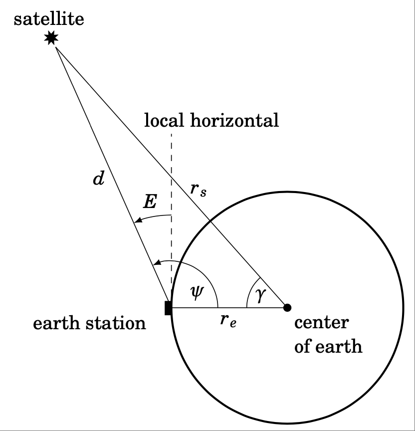

    **图 2.2.5**

利用余弦定律证明

.. math::

    d ~=~ r_s \,\sqrt{1 \;+\; \left( \frac{r_e}{r_s} \right)^2 \;-\; 2\,\left( \frac{r_e}{r_s} \right)
    \,\cos\;\gamma} ~~,

然后利用 :math:`E=\psi-90^\circ` 和正弦定律证明

.. math::

    \cos\;E ~=~ \dfrac{\sin\;\gamma}{\sqrt{1 \;+\; \left( \dfrac{r_e}{r_s} \right)^2 \;-\;
    2\,\left( \dfrac{r_e}{r_s} \right) \,\cos\;\gamma}} ~.

注：此公式允许根据地球站坐标和*星下点*（卫星到地心连线与地球表面的交点）计算仰角 $E$。[3]_

.. [3] 参见 T. Pratt 和 C.W. Bostian 所著《卫星通信》第 22-25 页，纽约：John Wiley & Sons，1986 年。
    
       See pp. 22-25 in T. Pratt and C.W. Bostian, *Satellite Communications*, New York: John Wiley \& Sons, 1986.

.. toggle::

    For Exercises 1-6, solve the triangle :math:`\triangle ABC`.

    1. :math:`A = 60^\circ, b = 8, c = 12`
    2. :math:`A = 30^\circ, b = 4, c = 6`
    3. :math:`a = 7, B = 60^\circ, c = 9`
    4. :math:`a = 7, b = 3, c = 9`
    5. :math:`a = 6, b = 4, c = 1`
    6. :math:`a = 11, b = 13, c = 16`

    7. The diagonals of a parallelogram intersect at a :math:`42^\circ` angle and have lengths of $12$ and $7$ cm. Find the lengths of the sides of the parallelogram. (*Hint: The diagonals bisect each other.*)
    8. Two trains leave the same train station at the same time, moving along straight tracks that form a :math:`35^\circ` angle. If one train travels at an average speed of $100$ mi/hr and the other at an average speed of $90$ mi/hr, how far apart are the trains after half an hour?
    9. Three circles with radii of $4$, $5$, and $6$ cm, respectively, are tangent to each other externally. Find the angles of the triangle whose vertexes are the centers of the circles.

    .. _exer:quad:

    10. Find the length $x$ of the diagonal of the quadrilateral in Figure :ref:`2.2.3 <fig:exerquad>` below.

    .. figure:: ./img/f2.2.3.png
        :align: left
        :scale: 50%

        **Figure 2.2.3 Exercise 10** 

    .. figure:: ./img/f2.2.4.png
        :align: right
        :scale: 50%

        **Figure 2.2.3 Exercise 11** 

    .. _exer:tancircs:

    11. Two circles of radii $5$ and $3$ cm, respectively, intersect at two points. At either point of intersection, the tangent lines to the circles form a :math:`60^\circ` angle, as in Figure :ref:`2.2.4 <fig:exertancircs>` above. Find the distance between the centers of the circles.
    12. Use the Law of Cosines to show that for any triangle :math:`\triangle ABC`, :math:`c^2 < a^2 + b^2` if $C$ is acute, :ref:`c^2 > a^2 + b^2` if $C$ is obtuse, and :math:`c^2 = a^2 + b^2` if $C$ is a right angle.
    13. Show that for any triangle :math:`\triangle ABC`,

        .. math::

            \frac{\cos\;A}{a} ~+~ \frac{\cos\;B}{b} ~+~ \frac{\cos\;C}{c} ~=~ \frac{a^2 + b^2 + c^2}{2abc}~.

    14. Show that for any triangle :math:`\triangle ABC`,

        .. math::

            \cos\;A ~+~ \cos\;B ~+~ \cos\;C ~=~ \frac{a^2 \;(b+c-a)~+~ b^2 \;(a+c-b)~+~ c^2 \;(a+b-c)}{2abc}~.

        What do the terms in parentheses represent geometrically? Use your answer to explain why :math:`\;\cos\;A ~+~ \cos\;B ~+~ \cos\;C ~>~0\,` for any triangle, even if one of the cosines is negative. [2]_

    15. Prove the Law of Cosines (i.e. formulas :eq:`2.9 <eqn:lawcosinesa>`-:eq:`2.11 <eqn:lawcosinesc>` for right triangles.
    16. Recall from elementary geometry that a \emph{median} of a triangle is a line segment from any vertex to the midpoint of the opposite side. Show that the sum of the squares of the three medians of a triangle is \sfrac{3}{4} the sum of the squares of the sides.
    17. The Dutch astronomer and mathematician Willebrord Snell (1580-1626) wrote the Law of Cosines as
    
        .. math::
    
            \frac{2ab}{c^2 \;-\; (a - b)^2} ~=~ \frac{1}{1 \;-\; \cos\;C}
    
        in his trigonometry text \emph{Doctrina triangulorum} (published a year after his death). Show that this formula is equivalent to formula (\ref{eqn:lawcosinesc}) in our statement of the Law of Cosines.
    
    18. Suppose that a satellite in space, an earth station, and the center of the earth all lie in the same plane. Let $r_e$ be the radius of the earth, let $r_s$ be the distance from the center of the earth to the satellite (called the *orbital radius* of the satellite), and let $d$ be the distance from the earth station to the satellite. Let $E$ be the angle of elevation from the earth station to the satellite, and let :math:`\gamma` and :math:`\psi` be the angles shown in Figure :ref:`2.2.5 <fig:satellite>`.
    
        .. figure:: ./img/f2.2.5.png
            :align: center 
            :scale: 40%
    
            **Figure 2.2.5**
    
        Use the Law of Cosines to show that
    
        .. math::
        
            d ~=~ r_s \,\sqrt{1 \;+\; \left( \frac{r_e}{r_s} \right)^2 \;-\; 2\,\left( \frac{r_e}{r_s} \right)
            \,\cos\;\gamma} ~~,
    
        and then use :math:`E=\psi-90^\circ` and the Law of Sines to show that
    
        .. math::
        
            \cos\;E ~=~ \dfrac{\sin\;\gamma}{\sqrt{1 \;+\; \left( \dfrac{r_e}{r_s} \right)^2 \;-\;
              2\,\left( \dfrac{r_e}{r_s} \right) \,\cos\;\gamma}} ~.
    
        Note: This formula allows the angle of elevation $E$ to be calculated from the coordinates of the earth station and the *subsatellite point* (where the line from the satellite to the center of the earth crosses the surface of the earth). [3]_

2.3 正切定理
----------------------
The Law of Tangents

我们已经展示了本章开头讨论的四种三角形解法。对于第三种情况（两条边和一个夹角），可以用 *正切定律(Law of Tangents)* 来代替余弦定律：

.. _thm:lawtangents:

**定理 2.3。正切定律(Law of Tangents)：** 设一个三角形的边长分别为 $a$、$b$ 和 $c$，分别与角 $A$、$B$ 和 $C$ 对角，则

.. _equation 2.17:

.. _eqn:lawtangentsab:

.. math::
    :label: eqn:lawtangentsab

    \frac{a-b}{a+b} ~=~ \frac{\tan\;\frac{1}{2}(A-B)}{\tan\;\frac{1}{2}(A+B)} ~,

.. _equation 2.18:

.. _eqn:lawtangentsbc:

.. math::
    :label: eqn:lawtangentsbc

    \frac{b-c}{b+c} ~=~
    \frac{\tan\;\frac{1}{2}(B-C)}{\tan\;\frac{1}{2}(B+C)}~,

.. _equation 2.19:

.. _eqn:lawtangentsca:

.. math::
    :label: eqn:lawtangentsca

    \frac{c-a}{c+a} ~=~
    \frac{\tan\;\frac{1}{2}(C-A)}{\tan\;\frac{1}{2}(C+A)}~.

注意，由于对于任意角度 :math:`\theta`，:math:`\tan\;(-\theta) = -\tan\;\theta`，我们可以交换上述每个公式中字母的顺序。例如，我们可以将公式 :eq:`2.17 <eqn:lawtangentsab>` 重写为

.. _equation 2.20:

.. _eqn:lawtangentsba:

.. math::
    :label: eqn:lawtangentsba

    \frac{b-a}{b+a}~=~\frac{\tan\;\frac{1}{2}(B-A)}{\tan\;\frac{1}{2}(B+A)}~，

其他公式也类似。如果 $a > b$，通常使用公式 :eq:`2.17 <eqn:lawtangentsab>` 更方便，而当 $b > a$ 时，使用公式 :eq:`2.20 <eqn:lawtangentsba>` 更方便。

.. toggle::

    We have shown how to solve a triangle in all four cases discussed at the beginning of this chapter. An alternative to the Law of Cosines for Case 3 (two sides and the included angle) is the *Law of Tangents*:

    **Theorem 2.3. Law of Tangents:** If a triangle has sides of lengths $a$, $b$, and $c$ opposite the angles $A$, $B$, and $C$, respectively, then

    .. math::
        :label: eqn:lawtangentsab

        \frac{a-b}{a+b} ~=~ \frac{\tan\;\frac{1}{2}(A-B)}{\tan\;\frac{1}{2}(A+B)} ~,

    .. math::
        :label: eqn:lawtangentsbc

        \frac{b-c}{b+c} ~=~
        \frac{\tan\;\frac{1}{2}(B-C)}{\tan\;\frac{1}{2}(B+C)}~,

    .. math::
        :label: eqn:lawtangentsca

        \frac{c-a}{c+a} ~=~
        \frac{\tan\;\frac{1}{2}(C-A)}{\tan\;\frac{1}{2}(C+A)}~.

    Note that since :math:`\tan\;(-\theta) = -\tan\;\theta` for any angle :math:`\theta`, we can switch the order of the letters in each of the above formulas. For example, we can rewrite formula :eq:`2.17 <eqn:lawtangentsab>` as

    .. math::
        :label: eqn:lawtangentsba

        \frac{b-a}{b+a}~=~\frac{\tan\;\frac{1}{2}(B-A)}{\tan\;\frac{1}{2}(B+A)}~,

    and similarly for the other formulas. If $a > b$, then it is usually more convenient to use formula :eq:`2.17 <eqn:lawtangentsab>`, while formula :eq:`2.20 <eqn:lawtangentsba>` is more convenient when $b > a$.

.. _Example 2.10:

.. _exmp:case3tangent:

.. admonition:: Example 2.10

    .. figure:: ./img/e2.10.png
        :align: right
        :scale: 50%

    *案例 3：两条边和夹角。*

    已知 $a = 5$，$b = 3$，且 :math:`C = 96^\circ`，解三角形 :math:`\triangle ABC`。

    **解法**： :math:`A + B + C = 180^\circ`，因此 :math:`A + B = 180^\circ - C = 180^\circ - 96^\circ = 84^\circ`。因此，根据正切定律，

    .. math::

        \begin{align*}
        \frac{a-b}{a+b} ~=~ \frac{\tan\;\frac{1}{2}(A-B)}{\tan\;\frac{1}{2}(A+B)} \quad&\Rightarrow\quad
        \frac{5-3}{5+3} ~=~ \frac{\tan\;\frac{1}{2}(A-B)}{\tan\;\frac{1}{2}(84^\circ)}\\
        &\Rightarrow\quad \tan\;\tfrac{1}{2}(A-B) ~=~ \tfrac{2}{8}\tan\;42^\circ ~=~ 0.2251\\
        &\Rightarrow\quad \tfrac{1}{2}(A-B) ~=~ 12.7^\circ \quad\Rightarrow\quad A-B ~=~ 25.4^\circ ~.
        \end{align*}

    现在我们有两个涉及 $A$ 和 $B$ 的方程，可以通过将方程相加来求解：

    .. math::

        \begin{align}
        A &- B &&=\; 25.4^\circ\\
        A &+ B &&=\; 84^\circ\phantom{4^\circ}\\[-2mm]
        --&--&&----\\[-2mm]
        2A &\phantom{+} &&=\; 109.4^\circ \quad\Rightarrow\quad \boxed{A = 54.7^\circ}
        \quad\Rightarrow\quad B ~=~ 84^\circ - 54.7^\circ \quad\Rightarrow\quad
        \boxed{B = 29.3^\circ}
        \end{align}

    我们可以利用正弦定理求出余边 $c$：

    .. math::

        c ~=~ \frac{a\;\sin\;C}{\sin\;A} ~=~ \frac{5\;\sin\;96^\circ}{\sin\;54.7^\circ}
        \quad\Rightarrow\quad \boxed{c = 6.09}

    .. toggle::

        .. figure:: ./img/e2.10.png 
            :align: right
            :scale: 50%

        *Case 3: Two sides and the included angle.*

        Solve the triangle :math:`\triangle ABC` given $a =5$, $b = 3$, and :math:`C = 96^\circ`.

        **Solution:** :math:`A + B + C = 180^\circ`, so :math:`A + B = 180^\circ - C = 180^\circ - 96^\circ = 84^\circ`. Thus, by the Law of Tangents,

        .. math::

            \begin{align*}
            \frac{a-b}{a+b} ~=~ \frac{\tan\;\frac{1}{2}(A-B)}{\tan\;\frac{1}{2}(A+B)} \quad&\Rightarrow\quad
            \frac{5-3}{5+3} ~=~ \frac{\tan\;\frac{1}{2}(A-B)}{\tan\;\frac{1}{2}(84^\circ)}\\
            &\Rightarrow\quad \tan\;\tfrac{1}{2}(A-B) ~=~ \tfrac{2}{8}\tan\;42^\circ ~=~ 0.2251\\
            &\Rightarrow\quad \tfrac{1}{2}(A-B) ~=~ 12.7^\circ \quad\Rightarrow\quad A-B ~=~ 25.4^\circ ~.
            \end{align*}

        We now have two equations involving $A$ and $B$, which we can solve by adding the equations:
        
        .. math::

            \begin{align}
            A &- B &&=\; 25.4^\circ\\
            A &+ B &&=\; 84^\circ\phantom{4^\circ}\\[-2mm]
            --&--&&----\\[-2mm]
            2A &\phantom{+} &&=\; 109.4^\circ \quad\Rightarrow\quad \boxed{A = 54.7^\circ}
            \quad\Rightarrow\quad B ~=~ 84^\circ - 54.7^\circ \quad\Rightarrow\quad
            \boxed{B = 29.3^\circ}
            \end{align}

        We can find the remaining side $c$ by using the Law of Sines:

        .. math::
        
            c ~=~ \frac{a\;\sin\;C}{\sin\;A} ~=~ \frac{5\;\sin\;96^\circ}{\sin\;54.7^\circ}
            \quad\Rightarrow\quad \boxed{c = 6.09}

请注意，在任意三角形 :math:`\triangle ABC` 中，如果 $a = b$ 则 $A = B$（为什么？），因此公式 :eq:`2.17 <eqn:lawtangentsab>` 的两边均为 $0$（因为 :math:`\tan 0^\circ = 0`）。这意味着 *当已知两条边相等时，切线定律在情况 3 中毫无作用* 。出于这个原因，或许也因为它的使用方式有些不寻常，切线定律最近在三角学书籍中似乎已经失宠了。它似乎并不比余弦定律有任何优势，后者即使在已知两条边相等的情况下也能成立，所需的步骤略少，而且可能更直接。 [4]_

.. [4] 在电子计算器出现之前，正切定律比现在更流行，因为它比余弦定律更适合所谓的 *对数计算*。在那个年代，大数计算是通过取对数并在 *对数表* 中查找值来处理的。比率（例如正切定律和正弦定律中的比率）可以用对数差来代替，从而使计算更容易。

       Before the advent of electronic calculators, the Law of Tangents was more popular than it is today since it lent itself better than the Law of Cosines to what was known as *logarithmic computation*. In those days, computations with large numbers were handled by taking logarithms and looking up values in a *logarithm table*. Ratios (such as in the Law of Tangents and the Law of Sines) could be replaced by differences of logarithms, making computation easier.

与正切定律相关的是 *摩尔维德方程* ：[5]_

.. [5] 以德国天文学家和数学家卡尔·摩尔维德（1774-1825）的名字命名。

       Named after the German astronomer and mathematician Karl Mollweide (1774-1825).

**摩尔维德方程**：对于任意三角形 :math:`\triangle ABC`，

.. _equation 2.21:

.. _eqn:mollweideamb:

.. math::
    :label: eqn:mollweideamb

    \frac{a-b}{c} ~=~
    \frac{\sin\;\frac{1}{2}(A-B)}{\cos\;\frac{1}{2}C} ~,~\text{以及}

.. _equation 2.22:

.. _eqn:mollweideapb:

.. math::
    :label: eqn:mollweideapb

    \frac{a+b}{c} ~=~
    \frac{\cos\;\frac{1}{2}(A-B)}{\sin\;\frac{1}{2}C} ~.

注意，三角形的六个部分在两个摩尔维特方程中都出现了。因此，任何一个方程都可以用来检验三角形的解。如果方程两边（或多或少）相等，我们就知道解是正确的。

.. toggle::

    Note that in any triangle :math:`\triangle ABC`, if $a = b$ then $A = B$ (why?), and so both sides of formula :eq:`2.17 <eqn:lawtangentsab>` would be $0$ (since :math:`\tan 0^\circ = 0`). This means that *the Law of Tangents is of no help in Case 3 when the two known sides are equal*. For this reason, and perhaps also because of the somewhat unusual way in which it is used, the Law of Tangents seems to have fallen out of favor in trigonometry books lately. It does not seem to have any advantages over the Law of Cosines, which works even when the sides are equal, requires slightly fewer steps, and is perhaps more straightforward. [4]_

    Related to the Law of Tangents are *Mollweide's equations*: [5]_

    **Mollweide's equations**: For any triangle :math:`\triangle ABC`,

    .. math:: 
        :label: eqn:mollweideamb

        \frac{a-b}{c} ~=~
        \frac{\sin\;\frac{1}{2}(A-B)}{\cos\;\frac{1}{2}C} ~,~\text{and}

    .. math::
        :label: eqn:mollweideapb

        \frac{a+b}{c} ~=~
        \frac{\cos\;\frac{1}{2}(A-B)}{\sin\;\frac{1}{2}C} ~.

    Note that all six parts of a triangle appear in both of Mollweide's equations. For this reason, either equation can be used to check a solution of a triangle. If both sides of the equation agree (more or less), then we know that the solution is correct.

.. _Example 2.11:

.. _exmp:case3tangent:

.. admonition:: Example 2.11

    使用摩尔维特方程之一来检查例题 :ref:`2.10 <exmp:case3tangent>` 中三角形的解。

    **解：** 回想一下，完整的解是 $a=5$，$b=3$，$c=6.09$，:math:`A=54.7^\circ`，:math:`B=29.3^\circ`，以及 :math:`C=96^\circ`。我们将使用方程 :eq:`2.21 <eqn:mollweideamb>` 来验证这一点：

    .. math::

        \begin{align*}
        \frac{a-b}{c} ~&=~ \frac{\sin\;\frac{1}{2}(A-B)}{\cos\;\frac{1}{2}C}\\
        \frac{5-3}{6.09} ~&=~
        \frac{\sin\;\frac{1}{2}(54.7^\circ - 29.3^\circ)}{\cos\;\frac{1}{2}(96^\circ)}\\
        \frac{2}{6.09} ~&=~ \frac{\sin\;12.7^\circ}{\cos\;48^\circ}\\
        0.3284 ~&=~ 0.3285 \quad\checkmark
        \end{align*}

    微小的差异（:math:`\approx 0.0001`）是由于原始解的舍入误差造成的，因此我们可以得出结论，等式两边一致，因此解是正确的。

    .. toggle::

        Use one of Mollweide's equations to check the solution of the triangle from Example :ref:`2.10 <exmp:case3tangent>`.

        **Solution:** Recall that the full solution was $a=5$, $b=3$, $c=6.09$, :math:`A=54.7^\circ`, :math:`B=29.3^\circ`, and :math:`C=96^\circ`. We will check this with equation :eq:`2.21 <eqn:mollweideamb>` :

        .. math::

            \begin{align*}
            \frac{a-b}{c} ~&=~ \frac{\sin\;\frac{1}{2}(A-B)}{\cos\;\frac{1}{2}C}\\
            \frac{5-3}{6.09} ~&=~
            \frac{\sin\;\frac{1}{2}(54.7^\circ - 29.3^\circ)}{\cos\;\frac{1}{2}(96^\circ)}\\
            \frac{2}{6.09} ~&=~ \frac{\sin\;12.7^\circ}{\cos\;48^\circ}\\
            0.3284 ~&=~ 0.3285 \quad\checkmark
            \end{align*}

        The small difference (:math:`\approx 0.0001`) is due to rounding errors from the original solution, so we can conclude that both sides of the equation agree, and hence the solution is correct.

.. _Example 2.12:

.. admonition:: Example 2.12

    一个三角形可以包含以下部分：$a=6$、$b=7$、$c=9$、:math:`A=55^\circ`、:math:`B=60^\circ` 和 :math:`C=65^\circ\;` 吗？

    **解答：** 在使用摩尔维特方程之前，更简单的检查方法是：所有角的和等于 :math:`180^\circ`，并且最小边和最大边分别与最小角和最大角相对。在本例中，所有这些条件都成立。因此，请用摩尔维特方程 :eq:`2.22 <eqn:mollweideapb>` 进行验证：

    .. math::

        \begin{align*}
        \frac{a+b}{c} ~&=~ \frac{\cos\;\frac{1}{2}(A-B)}{\sin\;\frac{1}{2}C}\\
        \frac{6+7}{9} ~&=~
        \frac{\cos\;\frac{1}{2}(55^\circ - 60^\circ)}{\sin\;\frac{1}{2}(65^\circ)}\\
        \frac{13}{9} ~&=~ \frac{\cos\;(-2.5^\circ)}{\sin\;32.5^\circ}\\
        1.44 ~&=~ 1.86 \quad\times
        \end{align*}

    这里的差异太大了，所以我们得出结论，不存在包含这些部分的三角形。

    .. toggle::

        Can a triangle have the parts $a=6$, $b=7$, $c=9$, :math:`A=55^\circ`, :math:`B=60^\circ`, and :math:`C=65^\circ\;`?

        **Solution:** Before using Mollweide's equations, simpler checks are that the angles add up to :math:`180^\circ` and that the smallest and largest sides are opposite the smallest and largest angles, respectively. In this case all those conditions hold. So check with Mollweide's equation :eq:`2.22 <eqn:mollweideapb>` :

        .. math::

            \begin{align*}
            \frac{a+b}{c} ~&=~ \frac{\cos\;\frac{1}{2}(A-B)}{\sin\;\frac{1}{2}C}\\
            \frac{6+7}{9} ~&=~
            \frac{\cos\;\frac{1}{2}(55^\circ - 60^\circ)}{\sin\;\frac{1}{2}(65^\circ)}\\
            \frac{13}{9} ~&=~ \frac{\cos\;(-2.5^\circ)}{\sin\;32.5^\circ}\\
            1.44 ~&=~ 1.86 \quad\times
            \end{align*}

        Here the difference is far too large, so we conclude that there is no triangle with these parts.

我们将在 :ref:`第 3 章 <c3>` 中证明切线定律和摩尔维特方程，在那里我们将能够提供简短的分析证明。 [6]_

.. toggle::

    We will prove the Law of Tangents and Mollweide's equations in :ref:`Chapter 3 <c3>`, where we will be able to supply brief analytic proofs. [6]_

.. [6] 切线定律和摩尔维特方程有（复）几何证明。参见P.R. Rider著《平面和球面三角学》第96-98页，纽约：麦克米伦公司，1942年。
    
       There are (complex) geometric proofs of the Law of Tangents and Mollweide's equations. See pp. 96-98 in *P.R. Rider*, *Plane and Spherical Trigonometry*, New York: The Macmillan Company, 1942.

练习
~~~~~~~~~~~~~~
Exercises

.. _sec2dot3:

在练习 1-3 中，使用切线定律解三角形 :math:`\triangle ABC`。

1. $a = 12$, $b = 8$, :math:`C = 60^\circ`
2. :math:`A = 30^\circ`, $b = 4$, $c = 6$
3. $a = 7$, :math:`B = 60^\circ`, $c = 9$

在练习 4-6 中，检查三角形是否有可能包含给定的部分。

4. $a=5$, $b=7$, $c=10$, :math:`A=27.7^\circ`, :math:`B=40.5^\circ`, :math:`C=111.8^\circ`
5. $a=3$, $b=7$, $c=9$, :math:`A=19.2^\circ`, :math:`B=68.2^\circ`, :math:`C=92.6^\circ`
6. $a=6$, $b=9$, $c=9$, :math:`A=39^\circ`, :math:`B=70.5^\circ`, :math:`C=70.5^\circ`

7. 设 :math:`\triangle ABC` 为直角三角形， :math:`C=90^\circ`。证明 :math:`\;\tan\;\frac{1}{2}(A-B) = \frac{a-b}{a+b}\,`。
8. 对于任意三角形 :math:`\triangle ABC`，证明 :math:`\;\tan\;\frac{1}{2}(A-B) = \frac{a-b}{a+b}\;\cot\;\frac{1}{2}C\,`。
9. 对于任意三角形 :math:`\triangle ABC`，证明 :math:`\;\tan\;A = \dfrac{a\;\sin\;B}{c - a\;\cos\;B}\,`。 （*提示：从顶点* $C$ *到* :math:`\overline{AB}` 画出高。）请注意，此公式提供了另一种解情况 3 中三角形的方法（两条边和夹角）。
10. 对于任意三角形 :math:`\triangle ABC`，证明 :math:`\;c = b\;\cos\;A + a\;\cos\;B\,`。这是对三角形的另一种检验。
11. 如果 :math:`\,b\;\cos\;A = a\;\cos\;B\,`，证明三角形 :math:`\triangle ABC` 是等腰三角形。
12. 设 $ABCD$ 是一个完全包含其两条对角线的四边形。该四边形有八个部分：四条边和四个角。解该四边形至少需要知道几个部分？解释你的答案。

.. toggle::

    For Exercises 1-3, use the Law of Tangents to solve the triangle :math:`\triangle ABC`.

    1. $a = 12$, $b = 8$, :math:`C = 60^\circ`
    2. :math:`A = 30^\circ`, $b = 4$, $c = 6$
    3. $a = 7$, :math:`B = 60^\circ`, $c = 9$

    For Exercises 4-6, check if it is possible for a triangle to have the given parts.

    4. $a=5$, $b=7$, $c=10$, :math:`A=27.7^\circ`, :math:`B=40.5^\circ`, :math:`C=111.8^\circ`
    5. $a=3$, $b=7$, $c=9$, :math:`A=19.2^\circ`, :math:`B=68.2^\circ`, :math:`C=92.6^\circ`
    6. $a=6$, $b=9$, $c=9$, :math:`A=39^\circ`, :math:`B=70.5^\circ`, :math:`C=70.5^\circ`

    7. Let :math:`\triangle ABC` be a right triangle with :math:`C=90^\circ`. Show that :math:`\;\tan\;\frac{1}{2}(A-B) =\frac{a-b}{a+b}\,`.
    8. For any triangle :math:`\triangle ABC`, show that :math:`\;\tan\;\frac{1}{2}(A-B) = \frac{a-b}{a+b}\;\cot\;\frac{1}{2}C\,`.
    9. For any triangle :math:`\triangle ABC`, show that :math:`\;\tan\;A = \dfrac{a\;\sin\;B}{c - a\;\cos\;B}\,`. (*Hint: Draw the altitude from the vertex* $C$ *to* :math:`\overline{AB}`.) Notice that this formula provides another way of solving a triangle in Case 3 (two sides and the included angle).
    10. For any triangle :math:`\triangle ABC`, show that :math:`\;c = b\;\cos\;A + a\;\cos\;B\,`. This is another check of a triangle.
    11. If :math:`\,b\;\cos\;A = a\;\cos\;B\,`, show that the triangle :math:`\triangle ABC` is isosceles.
    12. Let $ABCD$ be a quadrilateral which completely contains its two diagonals. The quadrilateral has eight parts: four sides and four angles. What is the smallest number of parts that you would need to know to solve the quadrilateral? Explain your answer.

2.4 三角形的面积
-----------------------
The Area of a Triangle

In elementary geometry you learned that the area of a triangle is one-half the base times the height. We will now use that, combined with some trigonometry, to derive more formulas for the area when given various parts of the triangle.

*Case 1: Two sides and the included angle.* 

Suppose that we have a triangle :math:`\triangle ABC`, in which $A$ can be either acute, a right angle, or obtuse, as in Figure :ref:`2.4.1 <fig:areacase1>`. Assume that $A$, $b$, and $c$ are known.

.. _fig:areacase1:

.. _Figure 2.4.1:

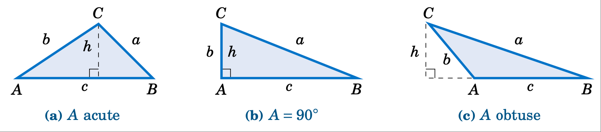

    **Figure 2.4.1 Area of** :math:`\triangle ABC`

In each case we draw an altitude of height $h$ from the vertex at $C$ to :math:`\overline{AB}`, so that
the area (which we will denote by the letter $K$) is given by :math:`K = \frac{1}{2}hc`. But we see that
:math:`h = b\;\sin\;A` in each of the triangles (since :math:`\;h=b` and :math:`\sin\;A = \sin\;90^\circ = 1` in Figure :ref:`2.4.1 <fig:areacase1>` (b), and :math:`\;h = b\;\sin\;(180^\circ - A) = b\;\sin\;A` in Figure :ref:`2.4.1 <fig:areacase1>` (c)). We thus get the following formula:

.. _equation 2.23:

.. math::
    :label: eqn:areacase1a

    \boxed{\text{Area} ~=~ K ~=~ \tfrac{1}{2}\,bc\;\sin\;A}

The above formula for the area of :math:`\triangle ABC` is in terms of the known parts $A$, $b$, and $c$. Similar arguments for the angles $B$ and $C$ give us:

.. _equation 2.24:

.. math::
    :label: eqn:areacase1b

    \boxed{\text{Area} ~=~ K ~=~ \tfrac{1}{2}\,ac\;\sin\;B}
 
.. _equation 2.25:

.. math::
    :label: eqn:areacase1c
    
    \boxed{\text{Area} ~=~ K ~=~ \tfrac{1}{2}\,ab\;\sin\;C}

Notice that the height $h$ does not appear explicitly in these formulas, although it is implicitly there. These formulas have the advantage of being in terms of parts of the triangle, without having to find $h$ separately.

.. _Example 2.13:

.. _exmp:areacase1:

.. admonition:: Example 2.13

    .. figure:: ./img/e2.13.png 
        :align: right
        :scale: 50%

    Find the area of the triangle :math:`\triangle ABC` given :math:`A = 33^\circ`, $b = 5$, and $c = 7$.

    **Solution:** Using formula :eq:`2.23 <eqn:areacase1a>`, the area $K$ is given by:

    .. math::

        \begin{align*}
          K ~&=~ \tfrac{1}{2}\,bc\;\sin\;A\\
          &=~ \tfrac{1}{2}\,(5)(7)\;\sin\;33^\circ\\
          K ~&=~ 9.53
        \end{align*}

    *Case 2: Three angles and any side.*

    Suppose that we have a triangle :math:`\triangle ABC` in which one side, say, $a$, and all three angles are known. [7]_ By the Law of Sines we know that

    .. math::

        c ~=~ \frac{a\;\sin\;C}{\sin\;A} ~,

    so substituting this into formula :eq:`2.24 <eqn:areacase1b>` we get:

    .. _Figure 2.26:

    .. math::
        :label: eqn:areacase2a

        \text{Area} ~=~ K ~=~ \frac{a^2 \;\sin\;B \;\sin\;C}{2\;\sin\;A}

    Similar arguments for the sides $b$ and $c$ give us:

    .. _Figure 2.27:

    .. math::
        :label: eqn:areacase2b

        \text{Area} ~=~ K ~=~ \frac{b^2 \;\sin\;A \;\sin\;C}{2\;\sin\;B}

    .. _Figure 2.28:

    .. math::
        :label: eqn:areacase2c

        \text{Area} ~=~ K ~=~ \frac{c^2 \;\sin\;A \;\sin\;B}{2\;\sin\;C}

    .. [7] Note that this is equivalent to knowing just \emph{two} angles and a side (why?).

.. _Example 2.14:

.. _exmp:areacase2:

.. admonition:: Example 2.14

    .. figure:: ./img/e2.14.png 
        :align: right
        :scale: 50%

    Find the area of the triangle :math:`\triangle ABC` given :math:`A = 115^\circ`, :math:`B=25^\circ`, :math:`C=40^\circ`, and $a = 12$.

    **Solution:** Using formula :eq:`2.26 <eqn:areacase2a>`, the area $K$ is given by:

    .. math::

        \begin{align*}
          K ~&=~ \frac{a^2 \;\sin\;B \;\sin\;C}{2\;\sin\;A}\\
          &=~ \frac{12^2 \;\sin\;25^\circ \;\sin\;40^\circ}{2\;\sin\;115^\circ}\\
          K ~&=~ 21.58
        \end{align*}

*Case 3: Three sides.* Suppose that we have a triangle :math:`\triangle ABC` in which all three sides are known. Then *Heron's formula* [8]_ gives us the area:

.. [8] Due to the ancient Greek engineer and mathematician Heron of Alexandria (c. 10-70 A.D.).

    **Heron's formula:** For a triangle :math:`\triangle ABC` with sides $a$, $b$, and $c$, let :math:`s = \frac{1}{2}\,(a+b+c)` (i.e. :math:`2s = a+b+c` is the perimeter of the triangle). Then the area $K$ of the triangle is

    .. _equation 2.29:

    .. math::
        :label: eqn:heron

        \text{Area} ~=~ K ~=~ \sqrt{s\,(s-a)\,(s-b)\,(s-c)} ~~.

To prove this, first remember that the area $K$ is one-half the base times the height. Using $c$ as the base and the altitude $h$ as the height, as before in Figure :ref:`2.4.1 <fig:areacase1>`, we have :math:`K = \frac{1}{2}hc`. Squaring both sides gives us

.. _equation 2.29:

.. math::
    :label: eqn:heronproof1

    K^2 = \tfrac{1}{4}\,h^2 c^2 ~.

In Figure :ref:`2.4.2 <fig:heron>`, let $D$ be the point where the altitude touches :math:`\overline{AB}` (or its extension).

.. _Figure 2.4.2:

.. _fig:heron:

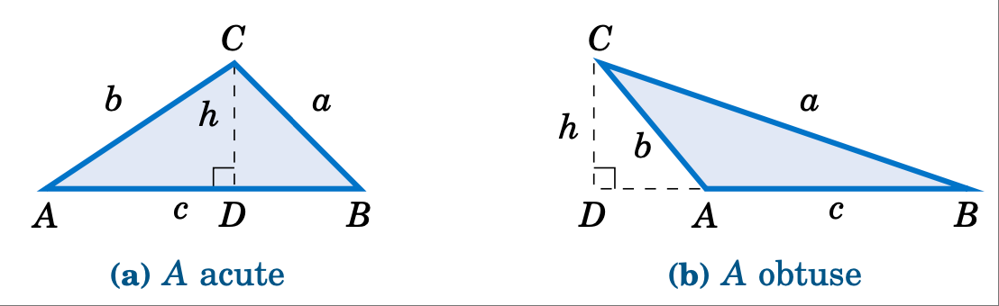

    **Figure 2.4.2 Proof of Heron's formula**

By the Pythagorean Theorem, we see that :math:`\;h^2 = b^2 - (AD)^2`. In Figure :ref:`2.4.2 <fig:heron>` (a), we see that $\;AD = b\;\cos\;A$. And in Figure :ref:`2.4.2 <fig:heron>` (b) we see that :math:`\;AD = b\;\cos\;(180^\circ - A) = -b\cos\;A`. Hence, in either case we have :math:`\;(AD)^2 = b^2 \;(\cos\;A)^2`, and so

.. _equation 2.31:

.. math::
    :label: eqn:heronproof2

    h^2 ~=~ b^2 - b^2 \;(\cos\;A)^2 ~=~ b^2 \,(1 - (\cos\;A)^2 ) ~=~ b^2 \,(1+ \cos\;A)\,(1- \cos\;A)~.

(Note that the above equation also holds when :math:`A=90^\circ` since :math:`\cos\;90^\circ =0` and $h=b$).
Thus, substituting equation :eq:`2.31 <eqn:heronproof2>` into equation :eq:`2.30 <eqn:heronproof1>`, we have

.. _equation 2.32:

.. math::
    :label: eqn:heronproof3

    K^2 = \tfrac{1}{4}\,b^2 c^2 \,(1+ \cos\;A)\,(1- \cos\;A) ~.

By the Law of Cosines we know that

.. math::

    \begin{align*}
    1 + \cos\;A ~&=~ 1 + \frac{b^2 + c^2 - a^2}{2bc} ~=~ \frac{2bc + b^2 + c^2 - a^2}{2bc}
      ~=~ \frac{(b+c)^2 - a^2}{2bc} ~=~ \frac{((b+c) + a)\,((b+c) - a)}{2bc}\\
      &=~ \frac{(a + b + c)\,(b + c - a)}{2bc} ~,
    \end{align*}

and similarly

.. math::

    \begin{align*}
    1 - \cos\;A ~&=~ 1 - \frac{b^2 + c^2 - a^2}{2bc} ~=~ \frac{2bc - b^2 - c^2 + a^2}{2bc}
      ~=~ \frac{a^2 - (b-c)^2}{2bc} ~=~ \frac{(a - (b-c))\,(a + (b-c))}{2bc}\\
      &=~ \frac{(a - b + c)\,(a + b - c)}{2bc} ~.
    \end{align*}

Thus, substituting these expressions into equation :eq:`2.32 <eqn:heronproof3>`, we have

.. math::

    \begin{align*}
    K^2 ~&=~ \tfrac{1}{4}\,b^2 c^2 \;\frac{(a + b + c)\,(b + c - a)}{2bc} \;\cdot\;
      \frac{(a - b + c)\,(a + b - c)}{2bc}\\
      &=~ \frac{a + b + c}{2} \;\cdot\; \frac{b + c - a}{2} \;\cdot\; \frac{a - b + c}{2} \;\cdot\;
      \frac{a + b - c}{2} ~,
    \end{align*}

and since we defined :math:`s = \frac{1}{2}\,(a+b+c)`, we see that

.. math::

      K^2 ~=~ s\,(s-a)\,(s-b)\,(s-c) ~,\\

so upon taking square roots we get

.. math::

    K ~=~ \sqrt{s\,(s-a)\,(s-b)\,(s-c)} ~~.\quad
    
[qed]

.. _Example 2.15

.. _exmp:heron:

.. admonition:: Example 2.15

    .. figure:: ./img/e2.15.png 
        :align: right
        :scale: 50%

    Find the area of the triangle :math:`\triangle ABC` given $a=5$, $b=4$, and $c = 7$.

    **Solution:** Using Heron's formula with :math:`s = \frac{1}{2}\,(a+b+c) = \frac{1}{2}\,(5+4+7) = 8`, the area $K$ is given by:

    .. math::

        \begin{align*}
          K ~&=~ \sqrt{s\,(s-a)\,(s-b)\,(s-c)}\\
          &=~ \sqrt{8\,(8-5)\,(8-4)\,(8-7)} ~=~ \sqrt{96} \quad\Rightarrow\quad \boxed{K ~=~ 4\,\sqrt{6}
          ~\approx~ 9.8} ~.
        \end{align*}

Heron's formula is useful for theoretical purposes (e.g. in deriving other formulas). However, it is not well-suited for calculator use, exhibiting what is called *numerical instability* for "extreme" triangles, as in the following example.

.. _Example 2.16

.. _exmp:heronfail:

.. admonition:: Example 2.16

    Find the area of the triangle :math:`\triangle ABC` given $a=1000000$, $b=999999.9999979$, and $c = 0.0000029$.

    **Solution:** To use Heron's formula, we need to calculate :math:`s = \frac{1}{2}\,(a+b+c)`. Notice that the actual value of $a+b+c$ is $2000000.0000008$, which has $14$ digits. Most calculators can store $12$-$14$ digits internally (even if they display less), and hence may round off that value of $a+b+c$ to $2000000$. When we then divide that rounded value for $a+b+c$ by $2$ to get $s$, some calculators (e.g. the TI-83 Plus) will give a rounded down value of $1000000$.

    This is a problem because $a=1000000$, and so we would get $s-a=0$, causing Heron's formula to give us an area of $0$ for the triangle! And this is indeed the incorrect answer that the TI-83 Plus returns. Other calculators may give some other inaccurate answer, depending on how they store values internally. The actual area - accurate to $15$ decimal places - is $K = 0.99999999999895$, i.e. it is basically $1$.

The above example shows how problematic *floating-point arithmetic* can be. [9]_ Luckily there is a better formula [10]_ for the area of a triangle when the three sides are known:

    For a triangle :math:`\triangle ABC` with sides :math:`a \ge b \ge c`, the area is :
    
    .. _equation 2.33

    .. math::
        :label: eqn:kahan

        \text{Area} ~=~ K ~=~ \tfrac{1}{4}\,\sqrt{(a + (b+c))\,(c - (a-b))\,(c + (a-b))\,(a + (b-c))}

.. [9] This is an issue even on modern computers. There is an excellent overview of this important subject in the article *What Every Computer Scientist Should Know About Floating-Point Arithmetic* by D. Goldberg, available at http://docs.oracle.com/cd/E19957-01/806-3568/ncg_goldberg.html

.. [10] Due to W. Kahan: http://www.eecs.berkeley.edu/~wkahan/Triangle.pdf

To use this formula, sort the names of the sides so that :math:`a \ge b \ge c`. Then perform the operations inside the square root *in the exact order in which they appear in the formula, including the use of parentheses*. Then take the square root and divide by $4$. For the triangle in Example :ref:`2.16 <exmp:heronfail>`, the above formula gives an answer of exactly $K = 1$ on the same TI-83 Plus calculator that failed with Heron's formula. What is amazing about this formula is that it is just Heron's formula rewritten! The use of parentheses is what forces the correct order of operations for numerical stability.

Another formula [11]_ for the area of a triangle given its three sides is given below:

.. [11] Due to the Chinese mathematician Qiu Jiushao (ca. 1202-1261).

For a triangle :math:`\triangle ABC` with sides $a \ge b \ge c$, the area is:

    .. _equation 2.34

    .. math::
        :label: eqn:jiushao

        \text{Area} ~=~ K ~=~ \tfrac{1}{2}\,\sqrt{a^2 c^2 ~-~ \left( \tfrac{a^2 + c^2 - b^2}{2} \right)^2}

For the triangle in Example :ref:`2.16 <exmp:heronfail>`, the above formula gives an answer of exactly $K = 1$ on the same TI-83 Plus calculator that failed with Heron's formula.

练习
~~~~~~~~~~~~~~
Exercises

.. _sec2dot4:

For Exercises 1-6, find the area of the triangle :math:`\triangle ABC`.

1. :math:`A = 70^\circ`, $b = 4$, $c = 12$
2. $a = 10$, :math:`B = 95^\circ`, $c = 35$
3. :math:`A = 10^\circ`, :math:`B = 48^\circ`, :math:`C = 122^\circ`, $c = 11$
4. :math:`A = 171^\circ`, :math:`B = 1^\circ`, :math:`C = 8^\circ`, $b = 2$
5. $a = 2$, $b = 3$, $c = 4$
6. $a = 5$, $b=6$, $c = 5$

.. _exer:areaquad:

7. Find the area of the quadrilateral in Figure :ref:`2.4.3 <fig:areaquad>` below.

.. _fig:areaquad:

.. _Figure 2.4.3:

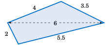

    **Fiugre 2.4.3 Exercise** :ref:`7 <exer:areaquad>`

.. _fig:areaquaddiag:

.. _Figure 2.4.4:

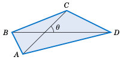

    **Fiugre 2.4.4 Exercise** :ref:`8 <exer:areaquaddiag>`

.. _exer:areaquaddiag:

8. Let $ABCD$ be a quadrilateral which completely contains its two diagonals, as in Figure :ref:`2.4.4 <fig:areaquaddiag>` above. Show that the area $K$ of $ABCD$ is equal to half the product of its diagonals and the sine of the angle they form, i.e. :math:`K = \frac{1}{2}\,AC\,\cdot\,BD\;\sin\;\theta\;`.

9. From formula :eq:`2.26 <eqn:areacase2a>` derive the following formula for the area of a triangle :math:`\triangle ABC`:

    .. math::

        \text{Area} ~=~ K ~=~ \frac{a^2 \;\sin\;B \;\sin\;C}{2\;\sin\;(B+C)}

10. Show that the triangle area formula

    .. math::

        \text{Area} ~=~ K ~=~ \tfrac{1}{4}\,\sqrt{(a + (b+c))\,(c - (a-b))\,(c + (a-b))\,(a + (b-c))}

    is equivalent to Heron's formula. (*Hint: In Heron's formula replace* $s$ by :math:`\frac{1}{2}(a+b+c)`.)

.. _exmp:jiushao:

11. Show that the triangle area formula :eq:`2.34 <eqn:jiushao>` is equivalent to Heron's formula. (*Hint: Factor the expression inside the square root.*)
12. Find the angle $A$ in Example :ref:`2.16 <exmp:heronfail>`, then use formula :eq:`2.23 <eqn:areacase1a>` to find the area. Did it work?

2.5 外接圆与内切圆
-------------------------------------
Circumscribed and Inscribed Circles

Recall from the Law of Sines that any triangle :math:`\triangle ABC` has a common ratio of sides to
sines of opposite angles, namely

.. math::

    \frac{a}{\sin\;A} ~=~ \frac{b}{\sin\;B} ~=~ \frac{c}{\sin\;C} ~.

This common ratio has a geometric meaning: it is the diameter (i.e. twice the radius) of the unique circle in which :math:`\triangle ABC` can be inscribed, called the **circumscribed circle** of the triangle. Before proving this, we need to review some elementary geometry.

A **central angle** of a circle is an angle whose vertex is the center $O$ of the circle and whose sides (called **radii** are line segments from $O$ to two points on the circle. In Figure :ref:`2.5.1 <fig:angletypes>` (a), :math:`\angle\,O` is a central angle and we say that it *intercepts the arc* :math:`\stackrel\frown{BC}`.

.. _Figure 2.5.1:

.. _fig:angletypes:

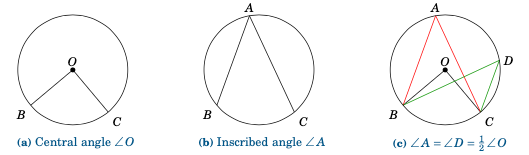
    
    **Figure 2.5.1 Types of angles in a circle**

An **inscribed angle** of a circle is an angle whose vertex is a point $A$ on the circle and whose sides are line segments (called **chords**)
from $A$ to two other points on the circle. In Figure :ref:`2.5.1 <fig:angletypes>` (b), :math:`\angle\,A` is an inscribed angle that intercepts the arc :math:`\stackrel\frown{BC}`. We state here without proof [12]_ a useful relation between inscribed and central angles:

.. _thm:centralangle:

    **Theorem 2.4.** If an inscribed angle :math:`\angle\,A` and a central angle :math:`\angle\,O` intercept the same arc, then :math:`\angle\,A = \frac{1}{2}\,\angle\,O\,`. Thus, inscribed angles which intercept the same arc are equal.

.. [12] For a proof, see pp. 210-211 in *R.A. Avery*, *Plane Geometry*, Boston: Allyn \& Bacon, 1950.

Figure :ref:`2.5.1 <fig:angletypes>` (c) shows two inscribed angles, :math:`\angle\,A` and :math:`\angle\,D`, which intercept the same arc :math:`\stackrel\frown{BC}` as the central angle :math:`\angle\,O`, and hence :math:`\angle\,A = \angle\,D = \frac{1}{2}\,\angle\,O` (so :math:`\;\angle\,O = 2\,\angle\,A = 2\,\angle\,D\,`).

We will now prove our assertion about the common ratio in the Law of Sines:

.. _thm:circumscribedradius:

    **Theorem 2.5.** For any triangle :math:`\triangle ABC`, the radius $R$ of its circumscribed circle is given by:

    .. _equation 2.35:

    .. math::
        :label: eqn:circumscribedradius

        2\,R ~=~ \frac{a}{\sin\;A} ~=~ \frac{b}{\sin\;B} ~=~ \frac{c}{\sin\;C}

(Note: For a circle of diameter $1$, this means :math:`a=\sin\;A`, :math:`b=\sin\;B`, and :math:`c=\sin\;C`.)

To prove this, let $O$ be the center of the circumscribed circle for a triangle :math:`\triangle ABC`. Then $O$ can be either inside, outside, or on the triangle, as in Figure :ref:`2.5.2 <fig:circumscribedradius>` below. In the first two cases, draw a perpendicular line segment from $O$ to :math:`\overline{AB}` at the point $D$.

.. _Figure 2.5.2:

.. _fig:circumscribedradius:

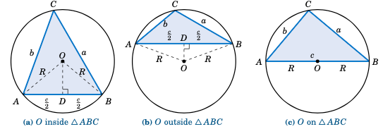

    **Fiugre 2.5.2 Circumscribed circle for** :math:`\triangle ABC`

The radii :math:`\overline{OA}` and :math:`\overline{OB}` have the same length $R$, so :math:`\triangle\,AOB` is an
isosceles triangle. Thus, from elementary geometry we know that :math:`\overline{OD}` bisects both the
angle :math:`\angle\,AOB` and the side :math:`\overline{AB}`. So :math:`\angle\,AOD = \frac{1}{2}\,\angle\,AOB`
and :math:`AD = \frac{c}{2}`. But since the inscribed angle :math:`\angle\,ACB` and the central angle
:math:`\angle\,AOB` intercept the same arc :math:`\stackrel\frown{AB}`, we know from Theorem :ref:`2.4 <thm:centralangle>`
that :math:`\angle\,ACB = \frac{1}{2}\,\angle\,AOB`. Hence, :math:`\angle\,ACB = \angle\,AOD`. So since :math:`C = \angle\,ACB`, we have

.. math::

    \sin\;C ~=~ \sin\;\angle\,AOD ~=~ \frac{AD}{OA} ~=~ \frac{\frac{c}{2}}{R} ~=~ \frac{c}{2R}
    \quad\Rightarrow\quad 2\,R ~=~ \frac{c}{\sin\;C} ~,

so by the Law of Sines the result follows if $O$ is inside or outside :math:`\triangle ABC`.

Now suppose that $O$ is on :math:`\triangle ABC`, say, on the side :math:`\overline{AB}`, as in Figure :ref:`2.5.2 <fig:circumscribedradius>` (c). Then :math:`\overline{AB}` is a diameter of the circle, so :math:`C = 90^\circ` by Thales' Theorem. Hence, :math:`\sin\;C = 1`, and so :math:`2\,R = AB = c = \frac{c}{1} = \frac{c}{\sin\;C}\;`, and the result again follows by the Law of Sines. [qed]

.. _Example 2.17

.. _exmp:heronfail:

.. admonition:: Example 2.17

    .. _fig:circum345:

    .. _Figure 2.5.3:

    .. figure:: ./img/f2.5.3.png 
        :align: right

        **Figure 2.5.3**

    Find the radius $R$ of the circumscribed circle for the triangle :math:`\triangle ABC` whose sides are $a=3$, $b=4$, and $c=5$.

    **Solution:** We know that :math:`\triangle ABC` is a right triangle. So as we see from Figure :ref:`2.5.3 <fig:circum345>`, :math:`\sin\;A = 3/5`. Thus,

    .. math::

        2\,R ~=~ \frac{a}{\sin\;A} ~=~ \frac{3}{\frac{3}{5}} ~=~ 5 \quad\Rightarrow\quad
        \boxed{R ~=~ 2.5} ~.

    Note that since $R =2.5$, the diameter of the circle is $5$, which is the same as $AB$. Thus, :math:`\overline{AB}` must be a diameter of the circle, and so the center $O$ of the circle is the midpoint of :math:`\overline{AB}`.

.. _cor:circumscribedright:

    **Corollary 2.6.** For any right triangle, the hypotenuse is a diameter of the circumscribed circle, i.e. the center of the circle is the midpoint of the hypotenuse.

For the right triangle in the above example, the circumscribed circle is simple to draw; its center can be found by measuring a distance of $2.5$ units from $A$ along :math:`\overline{AB}`.

We need a different procedure for acute and obtuse triangles, since for an acute triangle the center of the circumscribed circle will be inside the triangle, and it will be outside for an obtuse triangle. Notice from the proof of Theorem :ref:`2.5 <thm:circumscribedradius>` that the center $O$ was on the perpendicular bisector of one of the sides (:math:`\overline{AB}`). Similar arguments for the other sides would show that $O$ is on the perpendicular bisectors for those sides:

.. _cor:circumscribedcenter:

    **Corollary 2.7.** For any triangle, the center of its circumscribed circle is the intersection of the perpendicular bisectors of the sides.

.. _Figure 2.5.4:

.. _fig:perpbisect:

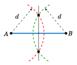

    **Figure 2.5.4**

Recall from geometry how to create the perpendicular bisector of a line segment: at each endpoint use a compass to draw an arc with the same radius. Pick the radius large enough so that the arcs intersect at two points, as in Figure :ref:`2.5.4 <fig:perpbisect>`. The line through those two points is the perpendicular bisector of the line segment. For the circumscribed circle of a triangle, you need the perpendicular bisectors of only *two* of the sides; their intersection will be the center of the circle.

|

.. _Example 2.18

.. _exmp:heronfail:

.. admonition:: Example 2.18

    Find the radius $R$ of the circumscribed circle for the triangle :math:`\triangle ABC` from Example
    :ref:`2.6 <exmp:case4cosine>` in Section 2.2: $a = 2$, $b = 3$, and $c = 4$. Then draw the triangle and
    the circle.

    **Solution:** In Example :ref:`2.6 <exmp:case4cosine>` we found :math:`A=28.9^\circ`, so :math:`2\,R = \frac{a}{\sin\;A} = \frac{2}{\sin\;28.9^\circ} = 4.14`, so :math:`\boxed{R = 2.07}\;`. In Figure :ref:`2.5.5 <fig:circum234>` (a) we show how to draw :math:`\triangle ABC`: use a ruler to draw the longest side :math:`\overline{AB}` of length $c=4$, then use a compass to draw arcs of radius $3$ and $2$ centered at $A$ and $B$, respectively. The intersection of the arcs is the vertex $C$.

    .. _Figure 2.5.5:

    .. _fig:circum234:

    .. figure:: ./img/f2.5.5.png
        :align: center 

        **Figure 2.5.5**

    In Figure :ref:`2.5.5 <fig:circum234>` (b) we show how to draw the circumscribed circle: draw the perpendicular bisectors of :math:`\overline{AB}` and :math:`\overline{AC}`; their intersection is the center $O$ of the circle. Use a compass to draw the circle centered at $O$ which passes through $A$.

Theorem :ref:`2.5 <thm:circumscribedradius>` can be used to derive another formula for the area of a triangle:

.. _thm:areacircumradius:

    **Theorem 2.8.** For a triangle :math:`\triangle ABC`, let $K$ be its area and let $R$ be the radius of its circumscribed circle. Then

    .. _equation 2.36

    .. math::
        :label: eqn:areacircumradius

        K ~=~ \frac{abc}{4\,R} \quad ( \text{and hence }\; R ~=~ \frac{abc}{4\,K} ~) ~.

To prove this, note that by Theorem :ref:`2.5 <thm:circumscribedradius>` we have

.. math::

    2\,R ~=~ \frac{a}{\sin\;A} ~=~ \frac{b}{\sin\;B} ~=~ \frac{c}{\sin\;C} \quad\Rightarrow\quad
    \sin\;A ~=~ \frac{a}{2\,R} ~,~~ \sin\;B ~=~ \frac{b}{2\,R} ~,~~ \sin\;C ~=~ \frac{c}{2\,R} ~.

Substitute those expressions into formula :eq:`2.26 <eqn:areacase2a>` from Section 2.4 for the area $K$:

.. math::

    K ~=~ \frac{a^2 \;\sin\;B \;\sin\;C}{2\;\sin\;A} ~=~
    \frac{a^2 \;\cdot\; \frac{b}{2\,R} \;\cdot\; \frac{c}{2\,R}}{2\;\cdot\; \frac{a}{2\,R}}
    ~=~ \frac{abc}{4\,R}  \qquad

Combining Theorem :ref:`2.8 <thm:areacircumradius>` with Heron's formula for the area of a triangle, we get:

.. _cor:circumradiusheron:

    **Theorem 2.9.** For a triangle :math:`\triangle ABC`, let :math:`s = \frac{1}{2}(a+b+c)`. Then the radius $R$ of its circumscribed circle is

    .. equation: 2.37

    .. math::
        :label: eqn:circumradiusheron

        R ~=~ \frac{abc}{4\,\sqrt{s\,(s-a)\,(s-b)\,(s-c)}} ~~.

In addition to a circumscribed circle, every triangle has an **inscribed circle**, i.e. a circle to which the sides of the triangle are tangent, as in Figure :ref:`2.5.6 <fig:inscribed>`.

.. _fig:inscribed:

.. _Figure 2.5.6:

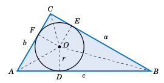

    **Fiugre 2.5.6 Inscribed circle for** :math:`\triangle ABC`

Let $r$ be the radius of the inscribed circle, and let $D$, $E$, and $F$ be the points on :math:`\overline{AB}`, :math:`\overline{BC}`, and :math:`\overline{AC}`, respectively, at which the circle is tangent. Then :math:`\overline{OD} \perp \overline{AB}`, :math:`\overline{OE} \perp \overline{BC}`, and :math:`\overline{OF} \perp \overline{AC}`. Thus, :math:`\triangle\,OAD` and :math:`\triangle\,OAF` are equivalent triangles, since they are right triangles with the same hypotenuse :math:`\overline{OA}` and with corresponding legs :math:`\overline{OD}` and :math:`\overline{OF}` of the same length $r$. Hence, :math:`\angle\,OAD =\angle\,OAF`, which means that :math:`\overline{OA}` bisects the angle $A$. Similarly, :math:`\overline{OB}` bisects $B$ and :math:`\overline{OC}` bisects $C$. We have thus shown:

.. note::
    
    For any triangle, the center of its inscribed circle is the intersection of the bisectors of the angles.

We will use Figure :ref:`2.5.6 <fig:inscribed>` to find the radius $r$ of the inscribed circle. Since :math:`\overline{OA}` bisects $A$, we see that :math:`\tan\;\frac{1}{2}A = \frac{r}{AD}`, and so :math:`r = AD \,\cdot\, \tan\;\frac{1}{2}A`. Now, :math:`\triangle\,OAD` and :math:`\triangle\,OAF` are equivalent triangles, so $AD = AF$. Similarly, $DB = EB$ and $FC = CE$. Thus, if we let :math:`s=\frac{1}{2}(a+b+c)`, we see that

.. math::

    \begin{align*}
    2\,s ~&=~ a ~+~ b ~+~ c ~=~ (AD + DB ) ~+~ (CE + EB) ~+~ (AF + FC)\\
    &=~ AD ~+~ EB ~+~ CE ~+~ EB ~+~ AD ~+~ CE ~=~ 2\,(AD + EB + CE)\\
    s ~&=~ AD ~+~ EB ~+~ CE ~=~ AD ~+~ a\\
    AD ~&=~ s - a ~.
    \end{align*}

Hence, :math:`r = (s-a)\,\tan\;\frac{1}{2}A`. Similar arguments for the angles $B$ and $C$ give us:

.. _thm:inscribedradius:

**Theorem 2.10.** For any triangle :math:`\triangle ABC`, let :math:`s = \frac{1}{2}(a+b+c)`. Then the radius $r$ of its inscribed circle is

.. _Figure 2.38:

.. math::
    :label: eqn:inscribedradius

    r ~=~ (s-a)\,\tan\;\tfrac{1}{2}A ~=~ (s-b)\,\tan\;\tfrac{1}{2}B ~=~
    (s-c)\,\tan\;\tfrac{1}{2}C ~.

We also see from Figure :ref:`2.5.6 <fig:inscribed>` that the area of the triangle :math:`\triangle\,AOB` is

.. math::

    \text{Area}(\triangle\,AOB) ~=~ \tfrac{1}{2}\,\text{base} \times \text{height} ~=~
    \tfrac{1}{2}\,c\,r ~.

Similarly, :math:`\text{Area}(\triangle\,BOC) = \frac{1}{2}\,a\,r` and :math:`\text{Area}(\triangle\,AOC) = \frac{1}{2}\,b\,r`. Thus, the area $K$ of :math:`\triangle ABC` is

.. math::

    \begin{align*}
    K ~&=~ \text{Area}(\triangle\,AOB) ~+~\text{Area}(\triangle\,BOC) ~+~ \text{Area}(\triangle\,AOC)
    ~=~ \tfrac{1}{2}\,c\,r ~+~ \tfrac{1}{2}\,a\,r ~+~ \tfrac{1}{2}\,b\,r\\
    &=~ \tfrac{1}{2}\,(a+b+c)\,r ~=~ sr ~,~\text{so by Heron's formula we get}\\
    r ~&=~ \frac{K}{s} ~=~ \frac{\sqrt{s\,(s-a)\,(s-b)\,(s-c)}}{s} ~=~
    \sqrt{\frac{s\,(s-a)\,(s-b)\,(s-c)}{s^2}} ~=~ \sqrt{\frac{(s-a)\,(s-b)\,(s-c)}{s}} ~~.
    \end{align*}

We have thus proved the following theorem:

.. _thm:inscribedarea:

**Theorem 2.11.** For any triangle :math:`\triangle ABC`, let :math:`s = \frac{1}{2}(a+b+c)`. Then the radius $r$ of its inscribed circle is
 
.. _equation 2.39:

.. math::
    :label: eqn:inscribedarea

    r ~=~ \frac{K}{s} ~=~ \sqrt{\frac{(s-a)\,(s-b)\,(s-c)}{s}} ~~.

.. _fig:angbisect:

.. _Figure 2.5.7:

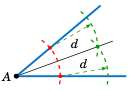

    **Figure 2.5.7**

Recall from geometry how to bisect an angle: use a compass centered at the vertex to draw an arc that intersects the sides of the angle at two points. At those two points use a compass to draw an arc with the same radius, large enough so that the two arcs intersect at a point, as in Figure :ref:`2.5.7 <fig:angbisect>`. The line through that point and the vertex is the bisector of the angle. For the inscribed circle of a triangle, you need only *two* angle bisectors; their intersection will be the center of the circle.

.. _Example 2.19

.. _exmp:heronfail:

.. admonition:: Example 2.19

    Find the radius $r$ of the inscribed circle for the triangle :math:`\triangle ABC` from Example :ref:`2.6 <exmp:case4cosine>` in Section 2.2: $a = 2$, $b = 3$, and $c = 4$. Draw the circle.

    .. _fig:inscrib234:

    .. _Figure 2.5.8:

    .. figure:: ./img/f2.5.8.png
        :align: right 

        **Figure 2.5.8**

    **Solution:** Using Theorem :ref:`2.11 <thm:inscribedarea>` with :math:`s = \frac{1}{2}(a+b+c) = \frac{1}{2}(2+3+4) = \frac{9}{2}`, we have

    .. math::

        r ~=~ \sqrt{\frac{(s-a)\,(s-b)\,(s-c)}{s}} ~=~
        \sqrt{\frac{\left(\frac{9}{2}-2\right)\,\left(\frac{9}{2}-3\right)\,\left(\frac{9}{2}-
        4\right)}{\frac{9}{2}}} ~=~ \sqrt{\frac{5}{12}}~.

    Figure :ref:`2.5.8 <fig:inscrib234>` shows how to draw the inscribed circle: draw the bisectors of $A$ and $B$, then at their intersection use a compass to draw a circle of radius :math:`r = \sqrt{5/12} \approx 0.645`.

练习
~~~~~~~~~~~~~~
Exercises

.. _sec2dot5:

For Exercises 1-6, find the radii $R$ and $r$ of the circumscribed and inscribed circles, respectively, of the triangle :math:`\triangle ABC`.

1. $a = 2$, $b = 4$, $c = 5$
2. $a = 6$, $b = 8$, $c = 8$
3. $a = 5$, $b = 7$, :math:`C = 40^\circ`
4. :math:`A = 170^\circ`, $b = 100$, $c = 300$
5. $a = 10$, $b = 11$, $c = 20.5$
6. $a = 5$, $b = 12$, $c = 13$

For Exercises 7 and 8, draw the triangle :math:`\triangle ABC` and its circumscribed and inscribed circles accurately, using a ruler and compass (or computer software).
 
7. $a = 2$ in, $b = 4$ in, $c = 5$ in
8. $a = 5$ in, $b = 6$ in, $c = 7$ in

9. For any triangle :math:`\triangle ABC`, let $s = \frac{1}{2}(a+b+c)$. Show that

   .. math::
   
       \tan\;\tfrac{1}{2}A ~=~ \sqrt{\frac{(s-b)\,(s-c)}{s\,(s-a)}} ~~,~~~
       \tan\;\tfrac{1}{2}B ~=~ \sqrt{\frac{(s-a)\,(s-c)}{s\,(s-b)}} ~~,~~~
       \tan\;\tfrac{1}{2}C ~=~ \sqrt{\frac{(s-a)\,(s-b)}{s\,(s-c)}} ~~.

10. Show that for any triangle :math:`\triangle ABC`, the radius $R$ of its circumscribed circle is

    .. math::
    
        R ~=~ \frac{abc}{\sqrt{(a+b+c)\,(b+c-a)\,(a-b+c)\,(a+b-c)}} ~~.

11. Show that for any triangle :math:`\triangle ABC`, the radius $R$ of its circumscribed circle and the radius $r$ of its inscribed circle satisfy the relation

    .. math::
    
        rR ~=~ \frac{abc}{2\,(a+b+c)} ~~.

12. Let :math:`\triangle ABC` be an equilateral triangle whose sides are of length $a$.

13. Find the exact value of the radius $R$ of the circumscribed circle of :math:`\triangle ABC`.
14. Find the exact value of the radius $r$ of the inscribed circle of :math:`\triangle ABC`.
15. How much larger is $R$ than $r$?
16. Show that the circumscribed and inscribed circles of :math:`\triangle ABC` have the same center.
17. Let :math:`\triangle ABC` be a right triangle with :math:`C=90^\circ`. Show that :math:`\;\tan\;\tfrac{1}{2}A = \sqrt{\frac{c-b}{c+b}}~`.

