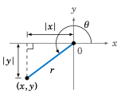
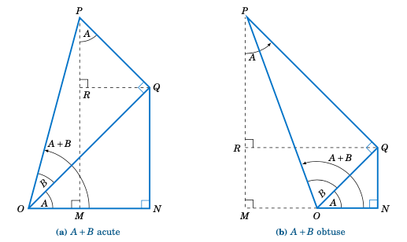

.. _c3:

第 3 章 恒等式  
===========================================
Chapter 3 Identities

基本三角恒等式  
-------------------------------
Basic Trigonometric Identities

So far we know a few relations between the trigonometric functions. For example, we know the
reciprocal relations:

1. :math:`\csc\;\theta ~=~ \dfrac{1}{\sin\;\theta}\qquad` when :math:`\sin\;\theta \ne 0`
2. :math:`\sec\;\theta ~=~ \dfrac{1}{\cos\;\theta}\qquad` when :math:`\cos\;\theta \ne 0`
3. :math:`\cot\;\theta ~=~ \dfrac{1}{\tan\;\theta}\qquad` when :math:`\tan\;\theta` is defined and not $0$
4. :math:`\sin\;\theta ~=~ \dfrac{1}{\csc\;\theta}\qquad` when :math:`\csc\;\theta` is defined and not $0$
5. :math:`\cos\;\theta ~=~ \dfrac{1}{\sec\;\theta}\qquad` when :math:`\sec\;\theta` is defined and not $0$
6. :math:`\tan\;\theta ~=~ \dfrac{1}{\cot\;\theta}\qquad` when :math:`\cot\;\theta` is defined and not $0$

Notice that each of these equations is true for *all* angles :math:`\theta` for which both sides of the equation are defined. Such equations are called **identities**, and in this section we will discuss several *trigonometric identities*, i.e. identities involving the trigonometric functions. These identities are often used to simplify complicated expressions or equations. For example, one of the most useful trigonometric identities is the following:

.. _equation 3.1:

.. math::
    :label: eqn:identan

    \tan\;\theta ~=~ \frac{\sin\;\theta}{\cos\;\theta} \qquad \text{when } \cos\;\theta \ne 0

To prove this identity, pick a point $(x,y)$ on the terminal side of :math:`\theta` a distance $r >0$ from
the origin, and suppose that :math:`\cos\;\theta \ne 0`. Then :math:`x \ne 0` (since :math:`\cos\;\theta = \frac{x}{r}`), so by definition

.. math::

    \frac{\sin\;\theta}{\cos\;\theta} ~=~ \dfrac{~\dfrac{y}{r}~}{~\dfrac{x}{r}~} ~=~ \frac{y}{x} ~=~
    \tan\;\theta ~.

Note how we proved the identity by expanding one of its sides (:math:`\frac{\sin\;\theta}{\cos\;\theta}`) until we got an expression that was equal to the other side (:math:`\tan\;\theta`). This is probably the most common technique for proving identities. Taking reciprocals in the above identity gives:

.. _equation 3.2:

.. math::
    :label: eqn:idencot

    \cot\;\theta ~=~ \frac{\cos\;\theta}{\sin\;\theta} \qquad \text{when } \sin\;\theta \ne 0

.. _fig:rdist:

.. _Figure 3.1.1:

    **Figure 3.1.1**

We will now derive one of the most important trigonometric identities. Let :math:`\theta` be any angle with a point $(x,y)$ on its terminal side a distance $r>0$ from the origin. By the Pythagorean Theorem, :math:`r^2 = x^2 + y^2` (and hence :math:`r=\sqrt{x^2 + y^2}`).

For example, if :math:`\theta` is in QIII as in Figure :ref:`3.1.1 <fig:rdist>`, then the legs of the right triangle formed by the reference angle have lengths :math:`|x|` and :math:`|y|` (we use absolute values because $x$ and $y$ are negative in QIII). The same argument holds if :math:`\theta` is in the other quadrants or on either axis. Thus,

.. math::

    r^2 ~=~ |x|^2 ~+~ |y|^2 ~=~ x^2 ~+~ y^2 ~,

so dividing both sides of the equation by $r^2$ (which we can do since $r>0$) gives

.. math::

    \frac{r^2}{r^2} ~=~ \frac{x^2 ~+~ y^2}{r^2} ~=~ \frac{x^2}{r^2} ~+~ \frac{y^2}{r^2} ~=~
    \left(\frac{x}{r}\right)^2 ~+~ \left(\frac{y}{r}\right)^2 ~.

Since :math:`\frac{r^2}{r^2} = 1$, $\frac{x}{r} = \cos\;\theta`, and :math:`\frac{y}{r} = \sin\;\theta`, we can rewrite this as:

.. _equation 3.3:

.. math::
    :label: eqn:idensincos1

    \cos^2 \;\theta ~+~ \sin^2 \;\theta ~=~ 1

You can think of this as sort of a trigonometric variant of the Pythagorean Theorem. Note that we use the notation :math:`\sin^2 \;\theta` to mean :math:`(\sin\;\theta)^2`, likewise for cosine and the other trigonometric functions. We will use the same notation for other powers besides $2$.

From the above identity we can derive more identities. For example:

.. _equation 3.4:

.. math::
    :label: eqn:idensinsq

    \sin^2 \;\theta ~=~ 1 ~-~ \cos^2 \;\theta

.. _equation 3.5:

.. math::
    :label: eqn:idencossq

    \cos^2 \;\theta ~=~ 1 ~-~ \sin^2 \;\theta

from which we get (after taking square roots):

.. _equation 3.6:

.. math::
    :label: eqn:idensinsqrt

    \sin\;\theta ~=~ \pm\,\sqrt{1 ~-~ \cos^2 \;\theta}

.. _equation 3.7:

.. math::
    :label: eqn:idencossqrt

    \cos\;\theta ~=~ \pm\,\sqrt{1 ~-~ \sin^2 \;\theta}

Also, from the inequalities :math:`0 \le \sin^2 \;\theta = 1 ~-~ \cos^2 \;\theta \le 1` and :math:`0 \le \cos^2 \;\theta = 1 ~-~ \sin^2 \;\theta \le 1`, taking square roots gives us the following bounds on sine and cosine:

.. _equation 3.8:

.. math::
    :label: eqn:ineqsin1
    
    -1 ~ \le ~ \sin\;\theta ~ \le ~ 1

.. _equation 3.9:

.. math::
    :label: eqn:ineqcos1

    -1 ~ \le ~ \cos\;\theta ~ \le ~ 1

The above inequalities are not identities (since they are not equations), but they provide useful checks on calculations. Recall that we derived those inequalities from the definitions of sine and cosine in Section 1.4.

In formula :eq:`3.3 <eqn:idensincos1>`, dividing both sides of the identity by :math:`\cos^2 \;\theta` gives

.. math::

    \frac{\cos^2 \;\theta}{\cos^2 \;\theta} ~+~ \frac{\sin^2 \;\theta}{\cos^2 \;\theta} ~=~
    \frac{1}{\cos^2 \;\theta} ~~,

so since :math:`\tan\;\theta = \frac{\sin\;\theta}{\cos\;\theta}` and :math:`\sec\;\theta = \frac{1}{\cos\;\theta}`, we get:

.. _equation 3.10:

.. math::
    :label: eqn:idensecsq

    1 ~+~ \tan^2 \;\theta ~=~ \sec^2 \;\theta

Likewise, dividing both sides of formula :eq:`3.3 <eqn:idensincos1>` by :math:`\sin^2 \;\theta` gives

.. math::

    \frac{\cos^2 \;\theta}{\sin^2 \;\theta} ~+~ \frac{\sin^2 \;\theta}{\sin^2 \;\theta} ~=~
    \frac{1}{\sin^2 \;\theta} ~~,

so since :math:`\cot\;\theta = \frac{\cos\;\theta}{\sin\;\theta}` and :math:`\csc\;\theta = \frac{1}{\sin\;\theta}`, we get:

.. _equation 3.10:

.. math::
    :label: eqn:idencscsq
    
    \cot^2 \;\theta ~+~ 1 ~=~ \csc^2 \;\theta

.. _Example 3.1:

.. admonition:: Example 3.1

    Simplify :math:`\;\cos^2 \;\theta ~ \tan^2 \;\theta\;`.

    **Solution:** We can use formula :eq:`3.1 <eqn:identan>` to simplify:

    .. math::

        \begin{align*}
        \cos^2 \;\theta~\tan^2 \;\theta ~ &= ~ \cos^2 \;\theta ~\cdot~
          \frac{\sin^2 \;\theta}{\cos^2 \;\theta}\\
        &= ~ \sin^2 \;\theta
        \end{align*}

.. _Example 3.2:

.. admonition:: Example 3.2

    Simplify :math:`\;5\sin^2 \;\theta ~+~ 4\cos^2 \;\theta\;`.

    **Solution:** We can use formula :eq:`3.5 <eqn:idencossq>` to simplify:

    .. math::

        \begin{align*}
        5\sin^2 \;\theta ~+~ 4\cos^2 \;\theta ~ &= ~ 5\sin^2 \;\theta ~+~
          4\left( 1 ~-~ \sin^2 \;\theta \right)\\[1mm]
        &= ~ 5\sin^2 \;\theta ~+~ 4 ~-~ 4\sin^2 \;\theta\\[1mm]
        &= ~ \sin^2 \;\theta ~+~ 4
        \end{align*}

.. _Example 3.3:

.. admonition:: Example 3.3

    Prove that :math:`\;\tan \;\theta ~+~ \cot \;\theta ~=~ \sec \;\theta ~ \csc \;\theta\;`.

    **Solution:** We will expand the left side and show that it equals the right side:

    .. math::

        \begin{alignat*}{3}
          \tan \;\theta + \cot \;\theta ~ &= ~ \frac{\sin\;\theta}{\cos\;\theta} ~+~
          \frac{\cos\;\theta}{\sin\;\theta} &{} \qquad &\text{(by eq 3.1 and
          eq 3.2 )}\\[2mm]
          &= ~ \frac{\sin\;\theta}{\cos\;\theta} \;\cdot\; \frac{\sin\;\theta}{\sin\;\theta} ~+~
          \frac{\cos\;\theta}{\sin\;\theta} \;\cdot\; \frac{\cos\;\theta}{\cos\;\theta}
          &{} \qquad &\text{(multiply both fractions by $1$)}\\[2mm]
          &= ~ \frac{\sin^2 \;\theta ~+~ \cos^2 \;\theta}{\cos\;\theta ~ \sin\;\theta} &{} \qquad
          &\text{(after getting a common denominator)}\\[2mm]
          &= ~ \frac{1}{\cos\;\theta ~ \sin\;\theta} &{} \qquad &\text{(by eq 3.3)}\\[2mm]
          &= ~ \frac{1}{\cos\;\theta} ~\cdot~ \frac{1}{\sin\;\theta}\\[2mm]
          &= ~ \sec \;\theta ~ \csc \;\theta
        \end{alignat*}

In the above example, how did we know to expand the left side instead of the right side? In general, though this technique does not always work, the more complicated side of the identity is likely to be easier to expand. The reason is that, by its complexity, there will be more things that you can do with that expression. For example, if you were asked to prove that

.. math::

    \sec\;\theta ~-~ \sin\;\theta ~ \tan\;\theta ~=~ \cos\;\theta ~,

there would not be much that you could do with the right side of that identity; it consists of a single term (:math:`\cos\;\theta`) that offers no obvious means of expansion.

.. _Example 3.4:

.. admonition:: Example 3.4

    Prove that :math:`\;\dfrac{1 ~+~ \cot^2 \;\theta}{\sec\;\theta} ~=~ \csc\;\theta ~ \cot\;\theta\;`.

    **Solution:** Of the two sides, the left side looks more complicated, so we will expand that:

    .. math::

        \begin{alignat*}{3}
        \frac{1 ~+~ \cot^2 \;\theta}{\sec\;\theta} ~ &= ~ \frac{\csc^2 \;\theta}{\sec\;\theta}
          &{} \qquad &\text{(by eq 3.11)}\\[1.5mm]
        &= ~ \dfrac{\csc\;\theta ~\cdot~ \dfrac{1}{\sin\;\theta}}{\dfrac{1}{\cos\;\theta}} &{}
          &{}\\[2mm]
        &= ~ \csc\;\theta ~\cdot~ \frac{\cos\;\theta}{\sin\;\theta} &{} &{}\\[2mm]
        &= ~ \csc \;\theta ~ \cot \;\theta &{} \qquad &\text{(by eq 3.2)}
        \end{alignat*}

.. _Example 3.5:

.. admonition:: Example 3.5

    Prove that :math:`\;\dfrac{\tan^2 \;\theta ~+~ 2}{1 ~+~ \tan^2 \;\theta} ~=~ 1 ~+~ \cos^2 \;\theta\;`.

    **Solution:** Expand the left side:

    .. math::

        \begin{alignat*}{3}
        \frac{\tan^2 \;\theta ~+~ 2}{1 ~+~ \tan^2 \;\theta} ~ &= ~
          \frac{\left( \tan^2 \;\theta ~+~ 1 \right) ~+~ 1}{1 ~+~ \tan^2 \;\theta} &{} \qquad &{}\\[2mm]
        &= ~ \frac{\sec^2 \;\theta ~+~ 1}{\sec^2 \;\theta} &{} \qquad
          &\text{(by eq 3.10)}\\[2mm]
        &= ~ \frac{\sec^2 \;\theta}{\sec^2 \;\theta} ~+~ \frac{1}{\sec^2 \;\theta} &{} &{}\\[2mm]
        &= ~ 1 ~+~ \cos^2 \;\theta\
        \end{alignat*}

When trying to prove an identity where at least one side is a ratio of expressions,
*cross-multiplying* can be an effective technique:

.. math::

    \frac{a}{b} ~=~ \frac{c}{d} \quad\text{if and only if}\quad ad ~=~ bc

.. _Example 3.6:

.. admonition:: Example 3.6

    Prove that :math:`\;\dfrac{1 ~+~ \sin\;\theta}{\cos\;\theta} ~=~ \dfrac{\cos\;\theta}{1 ~-~ \sin\;\theta}\;`.

    **Solution:** Cross-multiply and reduce both sides until it is clear that they are equal:

    .. math::

        \begin{align*}
        ( 1 ~+~ \sin\;\theta ) ( 1 ~-~ \sin\;\theta ) ~ &= ~ \cos\;\theta ~\cdot~ \cos\;\theta\\
        1 ~-~ \sin^2 \;\theta ~ &= ~ \cos^2 \;\theta
        \end{align*}

By :eq:`3.5 <eqn:idencossq>` both sides of the last equation are indeed equal. Thus, the original identity holds.

.. _Example 3.7:

.. _exmp:elimtheta:

.. admonition:: Example 3.7

    Suppose that :math:`\;a\,\cos\;\theta = b\;` and :math:`\;c\,\sin\;\theta = d\;` for some angle :math:`\theta` and
    some constants $a$, $b$, $c$, and $d$. Show that :math:`\;a^2 c^2 = b^2 c^2 + a^2 d^2`.

    **Solution:** Multiply both sides of the first equation by $c$ and the second equation by $a$:

    .. math::
      
        \begin{align*}
        ac\,\cos\;\theta ~ &= ~ bc\\
        ac\,\sin\;\theta ~ &= ~ ad
        \end{align*}

    Now square each of the above equations then add them together to get:

    .. math::
      
      \begin{align*}
      (ac\,\cos\;\theta)^2 ~+~ (ac\,\sin\;\theta)^2 ~ &= ~ (bc)^2 ~+~ (ad)^2\\
      (ac)^2 \left( \cos^2 \;\theta ~+~ \sin^2 \;\theta \right)~ &= ~ b^2 c^2 ~+~ a^2 d^2\\
      a^2 c^2 ~ &= ~ b^2 c^2 ~+~ a^2 d^2 \qquad\text{(by (\ref{eqn:idensincos1}))}
      \end{align*}

    Notice how :math:`\theta` does not appear in our final result. The trick was to get a common coefficient ($ac$) for :math:`\;\cos\;\theta\;` and :math:`\;\sin\;\theta\;` so that we could use :math:`\;\cos^2 \;\theta + \sin^2 \;\theta = 1`. This is a common technique for eliminating trigonometric functions from systems of equations.

.. _sec3dot1:

练习
~~~~~~~~~~~~~~
Exercises

1. We showed that :math:`\;\sin\;\theta ~=~ \pm\,\sqrt{1 ~-~ \cos^2 \;\theta}\;` for all :math:`\theta`. Give an example of an angle :math:`\theta` such that :math:`\sin\;\theta ~=~ -\sqrt{1 ~-~ \cos^2 \;\theta}\;`.
2. We showed that :math:`\;\cos\;\theta ~=~ \pm\,\sqrt{1 ~-~ \sin^2 \;\theta}\;` for all :math:`\theta`. Give an example of an angle :math:`\theta` such that :math:`\cos\;\theta ~=~ -\sqrt{1 ~-~ \sin^2 \;\theta}\;`.
3. Suppose that you are given a system of two equations of the following form: [1]_

   .. math::
 
       \begin{align*}
       A\,\cos\;\phi ~ &= ~ B\, \nu_1 ~-~ B\nu_2 \;\cos\;\theta\\
       A\,\sin\;\phi ~ &= ~ B\, \nu_2 \;\sin\;\theta ~.
       \end{align*}
 
   Show that :math:`\;A ^2 ~=~ B^2 \left( \nu_1^2 ~+~ \nu_2^2 ~-~ 2\nu_1 \nu_2 \;\cos\theta\ \right)`.

   .. [1] These types of equations arise in physics, e.g. in the study of photon-electron collisions. See pp. 95-97 in *W. Rindler*, *Special Relativity*, Edinburgh: Oliver and Boyd, LTD., 1960.
 

For Exercises 4-16, prove the given identity.

4. :math:`\cos\;\theta ~ \tan\;\theta ~=~ \sin\;\theta`
5. :math:`\sin\;\theta ~ \cot\;\theta ~=~ \cos\;\theta`
6. :math:`\dfrac{\tan\;\theta}{\cot\;\theta} ~=~ \tan^2 \;\theta`
7. :math:`\dfrac{\csc\;\theta}{\sin\;\theta} ~=~ \csc^2 \;\theta`
8. :math:`\dfrac{\cos^2 \;\theta}{1 ~+~ \sin\;\theta} ~=~ 1 ~-~ \sin\;\theta`
9. :math:`\dfrac{1 ~-~ 2\;\cos^2 \;\theta}{\sin\;\theta ~ \cos\;\theta} ~=~ \tan\;\theta ~-~ \cot\;\theta`
10. :math:`\sin^4 \;\theta ~-~ \cos^4 \;\theta ~=~ \sin^2 \;\theta ~-~ \cos^2 \;\theta`
11. :math:`\cos^4 \;\theta ~-~ \sin^4 \;\theta ~=~ 1 ~-~ 2\;\sin^2 \;\theta`
12. :math:`\dfrac{1 ~-~ \tan\;\theta}{1 ~+~ \tan\;\theta} ~=~ \dfrac{\cot\;\theta ~-~ 1}{\cot\;\theta ~+~ 1}`
13. :math:`\dfrac{\tan\;\theta ~+~ \tan\;\phi}{\cot\;\theta ~+~ \cot\;\phi} ~=~ \tan\;\theta ~ \tan\;\phi`

.. _exer:sintan:

14. :math:`\dfrac{\sin^2 \;\theta}{1 ~-~ \sin^2 \;\theta} ~=~ \tan^2 \;\theta`
15. :math:`\dfrac{1 ~-~ \tan^2 \;\theta}{1 ~-~ \cot^2 \;\theta} ~=~  1 ~-~ \sec^2 \;\theta`

.. _exer:sintansq:

16. :math:`\sin\;\theta ~=~ \pm\,\dfrac{\tan\;\theta}{\sqrt{1 ~+~ \tan^2 \;\theta}}\qquad` (*Hint: Solve for* :math:`\;\sin^2 \theta\;` *in Exercise* :ref:`14 <exer:sintan>`.})

.. _fig:exer2.1.21:

.. figure:: ./img/f3.1.2.png
    :align: right
    
    **Figure 3.1.2**

.. _exer:sintansqg:

17. Sometimes identities can be proved by geometrical methods. For example, to prove the identity in Exercise :ref:`16 <exer:sintansq>`, draw an acute angle :math:`\theta` in QI and pick the point $(1,y)$ on its terminal side, as in Figure :ref:`3.1.2 <fig:exer2.1.21>`. What must $y$ equal? Use that to prove the identity for acute :math:`\theta`. Explain the adjustment(s) you would need to make in Figure :ref:`3.1.2 <fig:exer2.1.21>` to prove the identity for :math:`\theta` in the other quadrants. Does the identity hold if :math:`\theta` is on either axis?

18. Similar to Exercise :ref:`16 <exer:sintansq>` , find an expression for :math:`\cos\;\theta` solely in terms of :math:`\tan\;\theta`.
19. Find an expression for :math:`\tan\;\theta` solely in terms of :math:`\sin\;\theta`, and one solely in terms of :math:`\cos\;\theta`

.. _exer:marion:

20. Suppose that a point with coordinates :math:`(x,y)=(a\;(\cos\;\psi\;-\;\epsilon),a\sqrt{1 - \epsilon^2}~\sin\;\psi)` is a distance $r>0$ from the origin, where $a>0$ and :math:`0 < \epsilon < 1`. Use :math:`\;r^2 = x^2 + y^2` to show that :math:`\;r = a\;(1 \;-\; \epsilon\;\cos\;\psi)\;`. (Note: These coordinates arise in the study of elliptical orbits of planets.)

21. Show that each trigonometric function can be put in terms of the sine function.

和差公式  
-----------------------------
Sum and Difference Formulas

We will now derive identities for the trigonometric functions of the sum and difference of two angles. For the sum of any two angles $A$ and $B$, we have the *addition formulas*: 

.. _equation 3.12:

.. math::
    :label: eqn:sumsin

    \sin\;(A+B) ~=~ \sin\;A ~ \cos\;B ~+~ \cos\;A ~ \sin\;B

.. _equation 3.13:

.. math::
    :label: eqn:sumcos

    \cos\;(A+B) ~=~ \cos\;A ~ \cos\;B ~-~ \sin\;A ~ \sin\;B

To prove these, first assume that $A$ and $B$ are acute angles. Then $A+B$ is either acute or
obtuse, as in Figure :ref:`3.2.1 <fig:anglesum>`. Note in both cases that :math:`\angle\,QPR = A`, since

.. math::

    \begin{align*}
    \angle\,QPR ~&=~ \angle\,QPO - \angle\,OPM ~=~ (90^\circ - B) -
      (90^\circ - (A+B)) ~=~ A ~~\text{in Figure 3.2.1 (a), and}\\
    \angle\,QPR ~&=~ \angle\,QPO + \angle\,OPM ~=~ (90^\circ - B) +
      (90^\circ - (180^\circ - (A+B))) ~=~ A ~~\text{in Figure 3.2.1 (b).}
    \end{align*}

.. _fig:anglesum:

    **Figure 3.2.1** :math:`\sin\;(A+B)` and :math:`\cos\;(A+B)` for acute $A$ and $B$

Thus,

.. _equation 3.14:

.. math::
    :label: eqn:sinsumproof

    \begin{align}
    \sin\;(A+B) ~&=~ \frac{MP}{OP} ~=~ \frac{MR+RP}{OP} ~=~ \frac{NQ+RP}{OP} ~=~
      \frac{NQ}{OP} ~+~ \frac{RP}{OP}\notag\\
    &=~ \frac{NQ}{OQ}\,\cdot\,\frac{OQ}{OP} ~+~ \frac{RP}{PQ}\,\cdot\,\frac{PQ}{OP}\notag\\
    &=~ \sin\;A ~ \cos\;B ~+~ \cos\;A ~ \sin\;B ~,
    \end{align}

and

.. _equation 3.15:

.. math::
    :label: eqn:cossumproof

    \begin{align}
    \cos\;(A+B) ~&=~ \frac{OM}{OP} ~=~ \frac{ON-MN}{OP} ~=~ \frac{ON-RQ}{OP} ~=~
      \frac{ON}{OP} ~-~ \frac{RQ}{OP}\notag\\
    &=~ \frac{ON}{OQ}\,\cdot\,\frac{OQ}{OP} ~-~ \frac{RQ}{PQ}\,\cdot\,\frac{PQ}{OP}\notag\\
    &=~ \cos\;A ~ \cos\;B ~-~ \sin\;A ~ \sin\;B ~.
    \end{align}

So we have proved the identities for acute angles $A$ and $B$. It is simple to verify that they hold in the special case of :math:`A=B=0^\circ`. For general angles, we will need to use the relations we derived in Section 1.5 which involve adding or subtracting :math:`90^\circ`:

.. math::

    \begin{alignat*}{4}
    \sin\;(\theta + 90^\circ) ~ &= ~ \phantom{-}\cos\;\theta &\qquad\quad
    \sin\;(\theta - 90^\circ) ~ &= ~ -\cos\;\theta\\
    \cos\;(\theta + 90^\circ) ~ &= ~ -\sin\;\theta &\qquad\quad
    \cos\;(\theta - 90^\circ) ~ &= ~ \phantom{-}\sin\;\theta
    \end{alignat*}

These will be useful because *any angle can be written as the sum of an acute angle (or* :math:`0^\circ`) *and integer multiples of* :math:`\pm90^\circ`. For example, :math:`155^\circ = 65^\circ + 90^\circ`, :math:`222^\circ = 42^\circ + 2(90^\circ)`, :math:`-77^\circ = 13^\circ - 90^\circ`, etc. So if
we can prove that the identities hold when adding or subtracting :math:`90^\circ` to or from either $A$
or $B$, respectively, where $A$ and $B$ are acute or :math:`0^\circ`, then the identities will also hold
when repeatedly adding or subtracting :math:`90^\circ`, and hence will hold for all
angles. Replacing $A$ by :math:`A+90^\circ` and using the relations for adding :math:`90^\circ` gives

.. math::

    \begin{align*}
    \sin\;((A+90^\circ) + B) ~&=~ \sin\;((A+B) + 90^\circ) ~=~ \cos\;(A+B)~,\\
    &=~ \cos\;A ~ \cos\;B ~-~ \sin\;A ~ \sin\;B ~~\text{(by equation 3.15)}\\
    &=~ \sin\;(A + 90^\circ)~\cos\;B ~+~ \cos\;(A + 90^\circ)~\sin\;B ~,
    \end{align*}

so the identity holds for :math:`A+90^\circ` and $B$ (and, similarly, for $A$ and :math:`B+90^\circ`). Likewise,

.. math::

    \begin{align*}
    \sin\;((A-90^\circ) + B) ~&=~ \sin\;((A+B) - 90^\circ) ~=~ -\cos\;(A+B)~,\\
    &=~ -(\cos\;A ~ \cos\;B ~-~ \sin\;A ~ \sin\;B) \\
    &=~ (-\cos\;A) ~ \cos\;B ~+~ \sin\;A ~ \sin\;B\\
    &=~ \sin\;(A - 90^\circ)~\cos\;B ~+~ \cos\;(A - 90^\circ)~\sin\;B ~,
    \end{align*}

so the identity holds for :math:`A-90^\circ` and $B$ (and, similarly, for $A$ and :math:`B+90^\circ`). Thus, the addition formula (\ref{eqn:sumsin}) for sine holds for \emph{all} $A$ and $B$. A similar argument shows that the addition formula (\ref{eqn:sumcos}) for cosine is true for all $A$ and $B$. [qed]

Replacing $B$ by $-B$ in the addition formulas and using the relations :math:`\sin\;(-\theta) = -\sin\;\theta` and :math:`\cos\;(-\theta) = \cos\;\theta` from Section 1.5 gives us the *subtraction formulas* :

.. _equation 3.16:

.. math::
    :label: eqn:diffsin

    \sin\;(A-B) ~=~ \sin\;A ~ \cos\;B ~-~ \cos\;A ~ \sin\;B\label{}

.. _equation 3.17:

.. math::
    :label: eqn:diffcos

    \cos\;(A-B) ~=~ \cos\;A ~ \cos\;B ~+~ \sin\;A ~ \sin\;B\label{eqn:}

Using the identity :math:`\tan\;\theta = \frac{\sin\;\theta}{\cos\;\theta}`, and the addition formulas for sine and cosine, we can derive the addition formula for tangent:

.. math::

    \begin{align*}
    \tan\;(A+B) ~&=~ \frac{\sin\;(A+B)}{\cos\;(A+B)}\\[5pt]
    &=~ \frac{\sin\;A ~ \cos\;B ~+~ \cos\;A ~ \sin\;B}{\cos\;A ~ \cos\;B ~-~ \sin\;A ~ \sin\;B}\\[5pt]
    &=~ \frac{\dfrac{\sin\;A ~ \cos\;B}{\cos\;A ~ \cos\;B} ~+~
      \dfrac{\cos\;A ~ \sin\;B}{\cos\;A ~ \cos\;B}}{\dfrac{\cos\;A ~ \cos\;B}{\cos\;A ~ \cos\;B}
      ~-~ \dfrac{\sin\;A ~ \sin\;B}{\cos\;A ~ \cos\;B}}\quad\text{(divide top and bottom by
      $\cos\;A ~ \cos\;B$)}\\[5pt]
    &=~ \frac{\dfrac{\sin\;A}{\cos\;A} \;\cdot\; \cancel{\dfrac{\cos\;B}{\cos\;B}} ~+~
      \cancel{\dfrac{\cos\;A}{\cos\;A}} \;\cdot\; \dfrac{\sin\;B}{\cos\;B}}{1 ~-~
      \dfrac{\sin\;A}{\cos\;A} \;\cdot\; \dfrac{\sin\;B}{\cos\;B}}
      ~=~ \frac{\tan\;A ~+~ \tan\;B}{1 ~-~ \tan\;A ~ \tan\;B}
    \end{align*}

This, combined with replacing $B$ by $-B$ and using the relation :math:`\tan\;(-\theta) = -\tan\;\theta`, gives us the addition and subtraction formulas for tangent:

.. _equation 3.17:

.. math::
    :label: eqn:sumtan

    \tan\;(A+B) ~=~ \frac{\tan\;A ~+~ \tan\;B}{1 ~-~ \tan\;A ~ \tan\;B}

.. _equation 3.18:

.. math::
    :label: eqn:difftan

    \tan\;(A-B) ~=~ \frac{\tan\;A ~-~ \tan\;B}{1 ~+~ \tan\;A ~ \tan\;B}

.. _Example 3.18:

.. _exmp:sumsincostan:

.. admonition:: Example 3.8

    Given angles $A$ and $B$ such that :math:`\sin\;A = \frac{4}{5}`, :math:`\cos\;A = \frac{3}{5}`, :math:`\sin\;B = \frac{12}{13}`, and :math:`\cos\;B = \frac{5}{13}`, find the exact values of :math:`\sin\;(A+B)`, :math:`\cos\;(A+B)`, and :math:`\tan\;(A+B)`.

    **Solution:** Using the addition formula for sine, we get:

    .. math::

        \begin{align*}
        \sin\;(A+B) ~&=~ \sin\;A ~ \cos\;B ~+~ \cos\;A ~ \sin\;B\\
        &=~ \frac{4}{5} \;\cdot\; \frac{5}{13} ~+~ \frac{3}{5} \;\cdot\; \frac{12}{13}
          \quad\Rightarrow\quad \boxed{\sin\;(A+B) ~=~ \frac{56}{65}}\\
        \end{align*}
        
    Using the addition formula for cosine, we get

    .. math::

        \begin{align*}
        \cos\;(A+B) ~&=~ \cos\;A ~ \cos\;B ~-~ \sin\;A ~ \sin\;B\\
        &=~ \frac{3}{5} \;\cdot\; \frac{5}{13} ~-~ \frac{4}{5} \;\cdot\; \frac{12}{13}
          \quad\Rightarrow\quad \boxed{\cos\;(A+B) ~=~ -\frac{33}{65}}\\
        \end{align*}

    Instead of using the addition formula for tangent, we can use the results above:

    .. math::

        \begin{align*}
        \tan\;(A+B) ~&=~ \frac{\sin\;(A+B)}{\cos\;(A+B)}
        ~=~ \frac{\frac{56}{65}}{-\frac{33}{65}}
        \quad\Rightarrow\quad \boxed{\tan\;(A+B) ~=~ -\frac{56}{33}}
        \end{align*}

.. _Example 3.19:

.. _exmp:sumsinabc:

.. admonition:: Example 3.9

    Prove the following identity:

    .. math::

        \sin\;(A+B+C) ~=~ \sin\;A~\cos\;B~\cos\;C \;+\; \cos\;A~\sin\;B~\cos\;C \;+\; 
                          \cos\;A~\cos\;B~\sin\;C \;-\; \sin\;A~\sin\;B~\sin\;C

    **Solution:** Treat $A+B+C$ as $(A+B)+C$ and use the addition formulas three times:

    .. math::

        \begin{align*}
        \sin\;(A+B+C) ~&=~ \sin\;((A+B)+C)\\
        &=~ \sin\;(A+B)~\cos\;C \;+\; \cos\;(A+B)~\sin\;C\\
        &=~ (\sin\;A ~ \cos\;B \;+\; \cos\;A ~ \sin\;B)~\cos\;C \;+\;
            (\cos\;A ~ \cos\;B \;-\; \sin\;A ~ \sin\;B)~\sin\;C\\
        &=~ \sin\;A~\cos\;B~\cos\;C \;+\; \cos\;A~\sin\;B~\cos\;C \;+\; 
            \cos\;A~\cos\;B~\sin\;C \;-\; \sin\;A~\sin\;B~\sin\;C
        \end{align*}

.. _Example 3.20:

.. _exmp:sumtantriangle:

.. admonition:: Example 3.10

    For any triangle :math:`\triangle\,ABC`, show that :math:`\tan\;A + \tan\;B + \tan\;C = \tan\;A~\tan\;B~\tan\;C`.

    **Solution:** Note that this is *not* an identity which holds for *all* angles; since $A$, $B$, and $C$ are the angles of a triangle, it holds when $A$, $B$, $C$ :math:`> 0^\circ` and :math:`A + B + C = 180^\circ`. So using :math:`C = 180^\circ - (A+B)` and the relation :math:`\;\tan\;(180^\circ - \theta) = -\tan\;\theta\;` from Section 1.5, we get:

    .. math::

        \begin{align*}
        \tan\;A \;+\; \tan\;B \;+\; \tan\;C ~&=~ \tan\;A \;+\; \tan\;B \;+\; \tan\;(180^\circ - (A+B))\\
        &=~ \tan\;A \;+\; \tan\;B \;-\; \tan\;(A+B)\\
        &=~ \tan\;A \;+\; \tan\;B \;-\; \frac{\tan\;A + \tan\;B}{1 - \tan\;A ~ \tan\;B}\\
        &=~ (\tan\;A \;+\; \tan\;B)~\left( 1 \;-\; \dfrac{1}{1 - \tan\;A ~ \tan\;B} \right)\\
        &=~ (\tan\;A \;+\; \tan\;B)~\left( \dfrac{1 - \tan\;A ~ \tan\;B}{1 - \tan\;A ~ \tan\;B} \;-\;
          \dfrac{1}{1 - \tan\;A ~ \tan\;B} \right)\\
        &=~ (\tan\;A \;+\; \tan\;B)\;\cdot\;\left( \frac{-\tan\;A ~ \tan\;B}{{1 - \tan\;A ~ \tan\;B}}
          \right)\\
        &=~ \tan\;A ~ \tan\;B \;\cdot\; \left( -\frac{\tan\;A \;+\; \tan\;B}{{1 - \tan\;A ~ \tan\;B}}
          \right)\\
        &=~ \tan\;A ~ \tan\;B \;\cdot\; (-\tan\;(A+B))\\
        &=~ \tan\;A ~ \tan\;B \;\cdot\; (\tan\;(180^\circ - (A+B)))\\
        &=~ \tan\;A ~ \tan\;B ~ \tan\;C
        \end{align*}

.. _Example 3.11:

.. _exmp:ptolemytrig:

.. admonition:: Example 3.11

    Let $A$, $B$, $C$, and $D$ be positive angles such that :math:`A+B+C+D=180^\circ`. Show that [2]_

    .. math::

        \sin\;A~\sin\;B ~+~ \sin\;C~\sin\;D ~=~ \sin\;(A+C)~\sin\;(B+C) ~.

    .. [2] This is the "trigonometric form" of *Ptolemy's Theorem*, which says that a quadrilateral can be inscribed in a circle if and only if the sum of the products of its opposite sides equals the product of its diagonals.

    **Solution:** It may be tempting to expand the right side, since it appears more complicated. However, notice that the right side has no $D$ term. So instead, we will expand the left side, since we can eliminate the $D$ term on that side by using :math:`D=180^\circ - (A+B+C)` and the relation

    .. math::

        \sin\;(180^\circ -(A+B+C)) ~=~ \sin\;(A+B+C).

    So since :math:`\;\sin\;D = \sin\;(A+B+C)`, we get

    .. math::
          
        \begin{align*}
        \sin\;A~\sin\;B ~+~ \sin\;C~\sin\;D ~&=~ \sin\;A~\sin\;B ~+~ \sin\;C~\sin\;(A+B+C) ~,~\text{so by
          Example 3.9 we get}\\
        &=~ \sin\;A~\sin\;B ~+~ \sin\;C~(\sin\;A~\cos\;B~\cos\;C \;+\; \cos\;A~\sin\;B~\cos\;C\\
        &\mathrel{\phantom{=}} {}  +\;   \cos\;A~\cos\;B~\sin\;C \;-\; \sin\;A~\sin\;B~\sin\;C)\\
        &=~ \sin\;A~\sin\;B ~+~ \sin\;C~\sin\;A~\cos\;B~\cos\;C ~+~ \sin\;C~\cos\;A~\sin\;B~\cos\;C\\
        &\mathrel{\phantom{=}} {} +~ \sin\;C~\cos\;A~\cos\;B~\sin\;C ~-~
          \sin\;C~\sin\;A~\sin\;B~\sin\;C ~.\\
        \end{align*}

    It may not be immediately obvious where to go from here, but it is not completely guesswork. We need to end up with :math:`\sin\;(A+C)~\sin\;(B+C)`, and we know that :math:`\sin\;(B+C) = \sin\;B~\cos\;C + \cos\;B~\sin\;C`. There are two terms involving :math:`\;\cos\;B~\sin\;C`, so group them together to get

    .. math::
          
        \begin{align*}
        \sin\;A~\sin\;B ~+~ \sin\;C~\sin\;D ~
        &=~ \sin\;A~\sin\;B ~-~ \sin\;C~\sin\;A~\sin\;B~\sin\;C ~+~ \sin\;C~\cos\;A~\sin\;B~\cos\;C\\
        &\mathrel{\phantom{=}} {} +~ \cos\;B~\sin\;C~(\sin\;A~\cos\;C ~+~ \cos\;A~\sin\;C)\\
        &=~ \sin\;A~\sin\;B~(1 - \sin^2 \;C) ~+~ \sin\;C~\cos\;A~\sin\;B~\cos\;C\\
        &\mathrel{\phantom{=}} {} +~ \cos\;B~\sin\;C~\sin\;(A+C)\\
        &=~ \sin\;A~\sin\;B~\cos^2 \;C ~+~ \sin\;C~\cos\;A~\sin\;B~\cos\;C\\
        &\mathrel{\phantom{=}} {} +~ \cos\;B~\sin\;C~\sin\;(A+C)~.\\
        \end{align*}

    We now have two terms involving :math:`\;\sin\;B~\cos\;C`, which we can factor out:

    .. math::
          
        \begin{align*}
        \sin\;A~\sin\;B ~+~ \sin\;C~\sin\;D ~
        &=~ \sin\;B~\cos\;C~(\sin\;A~\cos\;C + \cos\;A~\sin\;C~)\\
        &\mathrel{\phantom{=}} {} +~ \cos\;B~\sin\;C~\sin\;(A+C)\\
        &=~ \sin\;B~\cos\;C~\sin\;(A+C) ~+~ \cos\;B~\sin\;C~\sin\;(A+C)\\
        &=~ \sin\;(A+C)~(\sin\;B~\cos\;C + \cos\;B~\sin\;C)\\
        &=~ \sin\;(A+C)~\sin\;(B+C)
        \end{align*}

.. _Example 3.12:

.. _exmp:fresnel:

.. admonition:: Example 3.12

    In the study of the propagation of electromagnetic waves, *Snell's law* gives the relation

    .. equation 3.20:

    .. math::
        :label: eqn:snell
      
        n_1 ~\sin\;\theta_1 ~=~ n_2 ~\sin\;\theta_2 ~,

    where :math:`\theta_1` is the *angle of incidence* at which a wave strikes the planar boundary between two mediums, :math:`\theta_2` is the *angle of transmission* of the wave through the new medium, and $n_1$ and $n_2$ are the *indexes of refraction* of the two mediums. The quantity

    .. equation 3.21:

    .. math::
        :label: eqn:fresnelsr

        r_{1\;2\;s} ~=~ \frac{n_1 ~\cos\;\theta_1 ~-~ n_2 ~\cos\;\theta_2}{n_1 ~\cos\;\theta_1 ~+~
        n_2 ~\cos\;\theta_2}

    is called the *Fresnel coefficient* for normal
    incidence reflection of the wave for *s-polarization*. Show that this can be written as:

    .. math::

        r_{1\;2\;s} ~=~ \frac{\sin\;(\theta_2 - \theta_1)}{\sin\;(\theta_2 + \theta_1)}

    **Solution:** Multiply the top and bottom of :math:`r_{1\;2\;s}` by :math:`\;\sin\;\theta_1 ~ \sin\;\theta_2\;` to get:

    .. math::

        \begin{align*}
        r_{1\;2\;s} ~&=~ \frac{n_1 ~\cos\;\theta_1 ~-~ n_2 ~\cos\;\theta_2}{n_1 ~\cos\;\theta_1 ~+~
          n_2 ~\cos\;\theta_2} \;\cdot\; \frac{\sin\;\theta_1 ~ \sin\;\theta_2}{\sin\;\theta_1 ~
          \sin\;\theta_2}\\[7pt]
        &=~ \frac{(n_1 ~\sin\;\theta_1)~\sin\;\theta_2 ~\cos\;\theta_1 ~-~
                  (n_2 ~\sin\;\theta_2)~\cos\;\theta_2 ~\sin\;\theta_1}{
                  (n_1 ~\sin\;\theta_1)~\sin\;\theta_2 ~\cos\;\theta_1 ~+~
                  (n_2 ~\sin\;\theta_2)~\cos\;\theta_2 ~\sin\;\theta_1}\\[7pt]
        &=~ \frac{(n_1 ~\sin\;\theta_1)~\sin\;\theta_2 ~\cos\;\theta_1 ~-~
                  (n_1 ~\sin\;\theta_1)~\cos\;\theta_2 ~\sin\;\theta_1}{
                  (n_1 ~\sin\;\theta_1)~\sin\;\theta_2 ~\cos\;\theta_1 ~+~
                  (n_1 ~\sin\;\theta_1)~\cos\;\theta_2 ~\sin\;\theta_1}
            \qquad\text{(by Snell's law)}\\[7pt]
        &=~ \frac{\sin\;\theta_2 ~\cos\;\theta_1 ~-~
                  \cos\;\theta_2 ~\sin\;\theta_1}{
                  \sin\;\theta_2 ~\cos\;\theta_1 ~+~
                  \cos\;\theta_2 ~\sin\;\theta_1}\\[7pt]
        &=~ \frac{\sin\;(\theta_2 - \theta_1)}{\sin\;(\theta_2 + \theta_1)}
        \end{align*}

The last two examples demonstrate an important aspect of how identities are used in practice: recognizing terms which are part of known identities, so that they can be factored out. This is a common technique.

练习
~~~~~~~~~~~~~~
Exercises

.. _exer:sumzero:

1. Verify the addition formulas :eq:`3.12 <eqn:sumsin>` and :eq:`3.13 <eqn:sumcos>` for :math:`A=B=0^\circ`.

For Exercises 2 and 3, find the exact values of :math:`\sin\;(A+B)`, :math:`\cos\;(A+B)`, and :math:`\tan\;(A+B)`.

2. :math:`\sin\;A = \frac{8}{17}, \cos\;A = \frac{15}{17}, \sin\;B = \frac{24}{25}, \cos\;B = \frac{7}{25}`
3. :math:`\sin\;A = \frac{40}{41}, \cos\;A = \frac{9}{41}, \sin\;B = \frac{20}{29}, \cos\;B = \frac{21}{29}`
4. Use :math:`75^\circ = 45^\circ + 30^\circ` to find the exact value of :math:`\;\sin\;75^\circ`.
5. Use :math:`15^\circ = 45^\circ - 30^\circ` to find the exact value of :math:`\;\tan\;15^\circ`.

.. _exer:sinpluscos:

6. Prove the identity $\;\sin\;\theta + \cos\;\theta = \sqrt{2}\;\sin\;(\theta + 45^\circ)\;$. Explain why this shows that
 
   .. math::
     
       -\sqrt{2} ~\le~ \;\sin\;\theta ~+~ \cos\;\theta ~\le~ \sqrt{2}
   
   for all angles :math:`\theta`. For which :math:`\theta` between :math:`0^\circ` and :math:`360^\circ` would :math:`\;\sin\;\theta \;+\; \cos\;\theta\;` be the largest?

For Exercises \ref{exer:iden32start}-\ref{exer:iden32end}, prove the given identity.

.. _exer:iden32start:

7. :math:`\cos\;(A+B+C) \;=\; \cos\;A~\cos\;B~\cos\;C \;-\; \cos\;A~\sin\;B~\sin\;C \;-\; \sin\;A~\cos\;B~\sin\;C \;-\; \sin\;A~\sin\;B~\cos\;C`
8. :math:`\tan\;(A+B+C) ~=~ \dfrac{\tan\;A \;+\; \tan\;B \;+\; \tan\;C \;-\; \tan\;A~\tan\;B~\tan\;C}{1 \;-\; \tan\;B~\tan\;C \;-\; \tan\;A~\tan\;C \;-\; \tan\;A~\tan\;B}`

.. _exer:sumcot:

9. :math:`\cot\;(A+B) ~=~ \dfrac{\cot\;A~\cot\;B \;-\; 1}{\cot\;A \;+\; \cot\;B}`
10. :math:`\cot\;(A-B) ~=~ \dfrac{\cot\;A~\cot\;B \;+\; 1}{\cot\;B \;-\; \cot\;A}`
11. :math:`\tan\;(\theta + 45^\circ) ~=~ \dfrac{1 \;+\; \tan\;\theta}{1 \;-\; \tan\;\theta}`
12. :math:`\dfrac{\cos\;(A+B)}{\sin\;A~\cos\;B} ~=~ \cot\;A \;-\; \tan\;B`
13. :math:`\cot\;A ~+~ \cot\;B ~=~ \dfrac{\sin\;(A+B)}{\sin\;A~\sin\;B}`

.. _exer:iden32end:

14. :math:`\dfrac{\sin\;(A-B)}{\sin\;(A+B)} ~=~ \dfrac{\cot\;B \;-\; \cot\;A}{\cot\;B \;+\; \cot\;A}`
15. Generalize Exercise :ref:`6 <exer:sinpluscos>`: For any $a$ and $b$, :math:`-\sqrt{a^2 + b^2} \;\le\; a\;\sin\;\theta \;+\; b\;\cos\;\theta \;\le\; \sqrt{a^2 + b^2}\;` for all :math:`\theta`.

16. Continuing Example :ref:`3.12 <exmp:fresnel>`, use Snell's law to show that the *s-polarization transmission Fresnel coefficient*
  
    .. _equation 3.22:

    .. math::
        :label: eqn:3.22
  
        t_{1\;2\;s} ~=~ \frac{2\;n_1 ~\cos\;\theta_1}{n_1 ~\cos\;\theta_1 ~+~ n_2 ~\cos\;\theta_2}
    
    can be written as:
  
    .. math::
  
        t_{1\;2\;s} ~=~ \frac{2\;\cos\;\theta_1~\sin\;\theta_2}{\sin\;(\theta_2 + \theta_1)}

.. figure:: ./img/85-0.png 
    :align: right

.. _exer:tanslope:

17. Suppose that two lines with slopes $m_1$ and $m_2$, respectively, intersect at an angle :math:`\theta` and are not perpendicular (i.e. :math:`\theta \ne 90^\circ`), as in the figure on the right. Show that
  
    .. math::
  
        \tan\;\theta ~=~ \left| \frac{m_1 ~-~ m_2}{1 ~+~ m_1 \; m_2} \right| ~.
    
    (*Hint: Use Example* :ref:`3.12 <exmp:fresnel>` from Section 1.5. )

18. Use Exercise :ref:`3.12 <exmp:fresnel>` to find the angle between the lines $y=2x+3$ and $y=-5x-4$.
19. For any triangle :math:`\triangle\,ABC`, show that :math:`\;\cot\;A~\cot\;B ~+~ \cot\;B~\cot\;C ~+~ \cot\;C~\cot\;A ~=~ 1`. (*Hint: Use Exercise* :ref:`9 <exer:sumcot>` and :math:`C=180^\circ - (A+B)`.)

20. For any positive angles $A$, $B$, and $C$ such that :math:`A+B+C=90^\circ`, show that

.. math::
  
    \tan\;A~\tan\;B ~+~ \tan\;B~\tan\;C ~+~ \tan\;C~\tan\;A ~=~ 1 ~.
 
21. Prove the identity :math:`\;\sin\;(A+B)~\cos\;B ~-~ \cos\;(A+B)~\sin\;B ~=~ \sin\;A`. Note that the right side depends only on $A$, while the left side depends on both $A$ and $B$.
22. A line segment of length $r > 0$ from the origin to the point $(x,y)$ makes an angle :math:`\alpha` with the positive $x$-axis, so that :math:`(x,y) = (r\;\cos\;\alpha,r\;\sin\;\alpha)`, as in the figure below. What are the endpoint's new coordinates $(x',y')$ after a counterclockwise rotation by an angle :math:`\beta\;`? Your answer should be in terms of $r$, :math:`\alpha`, and :math:`\beta`.

.. figure:: ./img/85-1.png
    :align: center

倍角与半角公式  
--------------------------------------
Double-Angle and Half-Angle Formulas

A special case of the addition formulas is when the two angles being added are equal, resulting in the *double-angle formulas*:

.. _equation 3.23:

.. math::
    :label: eqn:doublesin

    \sin\;2\theta ~=~ 2\;\sin\;\theta ~ \cos\;\theta

.. _equation 3.24:

.. math::
    :label: eqn:doublecos

    \cos\;2\theta ~=~ \cos^2 \;\theta ~-~ \sin^2 \;\theta
    
.. _equation 3.25:

.. math::
    :label: eqn:doubletan
    
    \tan\;2\theta ~=~ \frac{2\;\tan\;\theta}{1 ~-~ \tan^2 \;\theta}

To derive the sine double-angle formula, we see that

.. math::

    \sin\;2\theta ~=~ \sin\;(\theta+\theta) ~=~ \sin\;\theta ~ \cos\;\theta ~+~ \cos\;\theta ~ \sin\;\theta ~=~ 2\;\sin\;\theta ~ \cos\;\theta~.\\

Likewise, for the cosine double-angle formula, we have

.. math::

    \cos\;2\theta ~=~ \cos\;(\theta+\theta) ~=~ \cos\;\theta~\cos\;\theta ~-~ \sin\;\theta~\sin\;\theta ~=~ \cos^2 \;\theta ~-~ \sin^2 \;\theta~,\\

and for the tangent we get

.. math::

    \tan\;2\theta ~=~ \tan\;(\theta+\theta) ~=~ \frac{\tan\;\theta ~+~ \tan\;\theta}{1 ~-~ \tan\;\theta ~ \tan\;\theta} ~=~
      \frac{2\;\tan\;\theta}{1 ~-~ \tan^2 \;\theta}

Using the identities :math:`\;\sin^2 \;\theta = 1 - \cos^2 \;\theta` and :math:`\;\cos^2 \;\theta = 1 - \sin^2 \;\theta`, we get the following useful alternate forms for the cosine double-angle formula:

.. _equation 3.26:

.. math::
    :label: eqn:doublecosalt1

    \cos\;2\theta ~=~ 2\;\cos^2 \;\theta ~-~ 1

.. _equation 3.27:

.. math::
    :label: eqn:doublecosalt2

    \qquad\quad=~ 1 ~-~ 2\;\sin^2 \;\theta
    
.. admonition:: Example 3.13

    Prove that :math:`\;\sin\;3\theta ~=~ 3\;\sin\;\theta ~-~ 4\;\sin^3 \;\theta\;`.

    **Solution:** Using :math:`3\theta = 2\theta + \theta`, the addition formula for sine, and the double-angle formulas :eq:`23 <eqn:doublesin>` and :eq:`27 <eqn:doublecosalt2>`, we get:

    .. math::

        \begin{align*}
        \sin\;3\theta ~&=~ \sin\;(2\theta+\theta)\\
        &=~ \sin\;2\theta~\cos\;\theta ~+~ \cos\;2\theta~\sin\;\theta\\
        &=~ (2\;\sin\;\theta~\cos\;\theta)\;\cos\;\theta ~+~ (1 - 2\;\sin^2 \;\theta)\;\sin\;\theta\\
        &=~ 2\;\sin\;\theta~\cos^2 \;\theta ~+~ \sin\;\theta ~-~ 2\;\sin^3 \;\theta\\
        &=~ 2\;\sin\;\theta\;(1 - \sin^2 \;\theta) ~+~ \sin\;\theta ~-~ 2\;\sin^3 \;\theta\\
        &=~ 3\;\sin\;\theta ~-~ 4\;\sin^3 \;\theta
        \end{align*}

.. admonition:: Example 3.14

    Prove that :math:`\;\sin\;4z ~=~ \dfrac{4\;\tan\;z~(1 - \tan^2 \;z)}{(1 + \tan^2 \;z)^2}\;`.

    **Solution:** Expand the right side and use :math:`1 + \tan^2 \;z= \sec^2 \;z\,`:

    .. math::

        \begin{align*}
        \dfrac{4\;\tan\;z~(1 - \tan^2 \;z)}{(1 + \tan^2 \;z)^2} ~&=~
          \dfrac{4 \;\cdot\; \dfrac{\sin\;z}{\cos\;z} \;\cdot\; \left( \dfrac{\cos^2 \;z}{\cos^2 \;z} -
          \dfrac{\sin^2 \;z}{\cos^2 \;z} \right)}{( \sec^2 \;z )^2}\\[6pt]
        &=~ \dfrac{4 \;\cdot\; \dfrac{\sin\;z}{\cos\;z} \;\cdot\; \dfrac{\cos\;2z}{\cos^2 \;z}}{\left(
          \dfrac{1}{\cos^2 \;z} \right)^2}\quad\qquad\text{(by formula (24))}\\[5pt]
        &=~ (4\;\sin\;z~\cos\;2z)\;\cos\;z\\
        &=~ 2\;(2\;\sin\;z~\cos\;z)\;\cos\;2z\\
        &=~ 2\;\sin\;2z~\cos\;2z\quad\qquad\text{(by formula (23))}\\
        &=~ \sin\;4z\quad\qquad\text{(by formula (23) with } \theta \text{ replaced by } 2z \text{)}
        \end{align*}

    Note: Perhaps surprisingly, this seemingly obscure identity has found a use in physics, in the derivation of a solution of the *sine-Gordon equation* in the theory of nonlinear waves. [3]_

    .. [3] See p.331 in *L.A. Ostrovsky and A.I.Potapov*, *Modulated Waves: Theory and Applications*, Baltimore: The Johns Hopkins University Press, 1999.

Closely related to the double-angle formulas are the *half-angle formulas*: 

.. _equation 3.28:

.. math::
    :label: eqn:halfsin

    \sin^2 \;\tfrac{1}{2}\theta ~=~ \frac{1 \;-\; \cos\;\theta}{2}

.. _equation 3.29:

.. math::
    :label: eqn:halfcos

    \cos^2 \;\tfrac{1}{2}\theta ~=~ \frac{1 \;+\; \cos\;\theta}{2}

.. _equation 3.30:

.. math::
    :label: eqn:halftan

    \tan^2 \;\tfrac{1}{2}\theta ~=~ \frac{1 \;-\; \cos\;\theta}{1 \;+\; \cos\;\theta}

These formulas are just the double-angle formulas rewritten with :math:`\theta` replaced by :math:`\tfrac{1}{2}\theta`:

.. math::

    \begin{align*}
    \cos\;2\theta \;&=\; 1 \;-\; 2\;\sin^2 \;\theta ~\Rightarrow~ \sin^2 \;\theta \;=\; \frac{1 \;-\; \cos\;2\theta}{2}
      ~\Rightarrow~ \sin^2 \;\tfrac{1}{2}\theta \;=\; \frac{1 \;-\; \cos\;2\,(\tfrac{1}{2}\theta)}{2} \;=\;
      \frac{1 \;-\; \cos\;\theta}{2}\\
    \cos\;2\theta \;&=\; 2\;\cos^2  \;\theta\;-\; 1 ~\Rightarrow~ \cos^2 \;\theta \;=\; \frac{1 \;+\; \cos\;2\theta}{2}
      ~\Rightarrow~ \cos^2 \;\tfrac{1}{2}\theta \;=\; \frac{1 \;+\; \cos\;2\,(\tfrac{1}{2}\theta)}{2} \;=\;
      \frac{1 \;+\; \cos\;\theta}{2}
    \end{align*}

The tangent half-angle formula then follows easily:

.. math::

    \tan^2 \;\tfrac{1}{2}\theta \;=\; \left( \dfrac{\sin\;\tfrac{1}{2}\theta}{\cos\;\tfrac{1}{2}\theta} \right)^2
      \;=\; \dfrac{\sin^2 \;\tfrac{1}{2}\theta}{\cos^2 \;\tfrac{1}{2}\theta} \;=\;
      \dfrac{\tfrac{1 \;-\; \cos\;\theta}{2}}{\tfrac{1 \;+\; \cos\;\theta}{2}} \;=\;
      \frac{1 \;-\; \cos\;\theta}{1 \;+\; \cos\;\theta}

The half-angle formulas are often used (e.g. in calculus) to replace a squared trigonometric function by a nonsquared function, especially when :math:`2\theta` is used instead of :math:`\theta`.

By taking square roots, we can write the above formulas in an alternate form:

.. _equation 3.31:

.. math::
    :label: eqn:halfsinsq

    \sin\;\tfrac{1}{2}\theta ~=~ \pm\;\sqrt{\frac{1 \;-\; \cos\;\theta}{2}}

.. _equation 3.32:

.. math::
    :label: eqn:halfcossq

    \cos\;\tfrac{1}{2}\theta ~=~ \pm\;\sqrt{\frac{1 \;+\; \cos\;\theta}{2}}

.. _equation 3.33:

.. math::
    :label: eqn:halftansq

    \tan\;\tfrac{1}{2}\theta ~=~ \pm\;\sqrt{\frac{1 \;-\; \cos\;\theta}{1 \;+\; \cos\;\theta}}

In the above form, the sign in front of the square root is determined by the quadrant in which the angle :math:`\tfrac{1}{2}\theta` is located. For example, if :math:`\theta=300^\circ` then :math:`\tfrac{1}{2}\theta = 150^\circ` is in QII. So in this case :math:`\cos\;\tfrac{1}{2}\theta < 0` and hence we would have :math:`\cos\;\tfrac{1}{2}\theta = -\;\sqrt{\frac{1 \;+\; \cos\;\theta}{2}}`.

In formula :eq:`3.33 <eqn:halftansq>`, multiplying the numerator and denominator inside the square root by :math:`(1 - \cos\;\theta)` gives

.. math::

    \tan\;\tfrac{1}{2}\theta ~=~ \pm\;\sqrt{\frac{1 - \cos\;\theta}{1 + \cos\;\theta} \,\cdot\,
      \frac{1 - \cos\;\theta}{1 - \cos\;\theta}} ~=~
      \pm\;\sqrt{\frac{(1 - \cos\;\theta)^2}{1 - \cos^2 \;\theta}} ~=~
      \pm\;\sqrt{\frac{(1 - \cos\;\theta)^2}{\sin^2 \;\theta}} ~=~ \pm\;\frac{1 - \cos\;\theta}{\sin\;\theta} ~.

But :math:`1 - \cos\;\theta \ge 0`, and it turns out (see Exercise :ref:`10 <exer:halftanaltpos>`) that :math:`\tan\;\tfrac{1}{2}\theta` and :math:`\sin\;\theta` always have the same sign. Thus, the minus sign in front of the last expression is not possible (since that would switch the signs of :math:`\tan\;\tfrac{1}{2}\theta` and :math:`\sin\;\theta`), so we have:

.. _equation 3.34:

.. math::
    :label: eqn:halftanalt1

    \tan\;\tfrac{1}{2}\theta ~=~ \frac{1 \;-\; \cos\;\theta}{\sin\;\theta}

Multiplying the numerator and denominator in formula :eq:`3.34 <eqn:halftanalt1>` by :math:`1 + \cos\;\theta` gives

.. math::

    \tan\;\tfrac{1}{2}\theta ~=~ \frac{1 \;-\; \cos\;\theta}{\sin\;\theta} \;\cdot\;
      \frac{1 \;+\; \cos\;\theta}{1 \;+\; \cos\;\theta} ~=~ \frac{1 \;-\; \cos^2 \;\theta}{\sin\;\theta\;(1 \;+\; \cos\;\theta)}
      ~=~ \frac{\sin^2 \;\theta}{\sin\;\theta\;(1 \;+\; \cos\;\theta)} ~,

so we also get:

.. _equation 3.35:

.. math::
    :label: eqn:halftanalt2

    \tan\;\tfrac{1}{2}\theta ~=~ \frac{\sin\;\theta}{1 \;+\; \cos\;\theta}

Taking reciprocals in formulas :eq:`3.34 <eqn:halftanalt1>` and :eq:`3.35 <eqn:halftanalt2>` gives:

.. _equation 3.36:

.. math::
    :label: eqn:halfcot

    \cot\;\tfrac{1}{2}\theta ~=~ \frac{\sin\;\theta}{1 \;-\; \cos\;\theta} ~=~
    \frac{1 \;+\; \cos\;\theta}{\sin\;\theta}

.. _Example 3.15:

.. admonition:: Example 3.15

    Prove the identity :math:`\;\sec^2 \;\tfrac{1}{2}\theta ~=~\dfrac{2\;\sec\;\theta}{\sec\;\theta \;+\; 1}\;`.

    **Solution:** Since secant is the reciprocal of cosine, taking the reciprocal of formula :eq:`3.29 <eqn:halfcos>` for :math:`\;\cos^2 \;\tfrac{1}{2}\theta` gives us

    .. math::

        \sec^2 \;\tfrac{1}{2}\theta ~=~ \frac{2}{1 \;+\; \cos\;\theta}
        ~=~ \frac{2}{1 \;+\; \cos\;\theta} \;\cdot\; \frac{\sec\;\theta}{\sec\;\theta}
        ~=~ \frac{2\;\sec\;\theta}{\sec\;\theta \;+\; 1} ~.

练习
~~~~~~~~~~~~~~
Exercises

For Exercises 1-8, prove the given identity.

1. :math:`\cos\;3\theta ~=~ 4\;\cos^3 \;\theta ~-~ 3\;\cos\;\theta`
2. :math:`\tan\;\tfrac{1}{2}\theta ~=~ \csc\;\theta ~-~ \cot\;\theta`
3. :math:`\dfrac{\sin\;2\theta}{\sin\;\theta} ~-~ \dfrac{\cos\;2\theta}{\cos\;\theta} ~=~ \sec\;\theta`
4. :math:`\dfrac{\sin\;3\theta}{\sin\;\theta} ~-~ \dfrac{\cos\;3\theta}{\cos\;\theta} ~=~ 2`
5. :math:`\tan\;2\theta ~=~ \dfrac{2}{\cot\;\theta \;-\; \tan\;\theta}`
6. :math:`\tan\;3\theta ~=~ \dfrac{3\;\tan\;\theta \;-\; \tan^3 \;\theta}{1 \;-\; 3\;\tan^2 \;\theta}`
7. :math:`\tan^2 \;\tfrac{1}{2}\theta ~=~ \dfrac{\tan\;\theta \;-\; \sin\;\theta}{\tan\;\theta \;+\; \sin\;\theta}`
8. :math:`\dfrac{\cos^2 \;\psi}{\cos^2 \;\theta} ~=~ \dfrac{1 \;+\; \cos\;2\psi}{1 \;+\; \cos\;2\theta}`
9. Some trigonometry textbooks used to claim incorrectly that :math:`\;\sin\;\theta ~+~ \cos\;\theta ~=~ \sqrt{1 \;+\; \sin\;2\theta}` was an identity. Give an example of a specific angle :math:`\theta` that would make that equation false. Is :math:`\;\sin\;\theta ~+~ \cos\;\theta ~=~ \pm\;\sqrt{1 \;+\; \sin\;2\theta}` an identity? Justify your answer.

.. _exer:halftanaltpos:

10. Fill out the rest of the table below for the angles :math:`0^\circ < \theta < 720^\circ` in increments of :math:`90^\circ`, showing :math:`\theta`, :math:`\tfrac{1}{2}\theta`, and the signs ($+$ or $-$) of :math:`\sin\;\theta` and :math:`\tan\;\tfrac{1}{2}\theta`.

    .. list-table::
    
        * - :math:`\theta`
          - :math:`\tfrac{1}{2}\theta`
          - :math:`\sin\;\theta`
          - :math:`\tan\;\tfrac{1}{2}\theta`
        * - :math:`0^\circ - 90^\circ`
          - :math:`0^\circ - 45^\circ`
          - 
          - 
        * - :math:`90^\circ - 180^\circ`
          - :math:`45^\circ - 90^\circ`
          - 
          - 
        * - :math:`180^\circ - 270^\circ`
          - :math:`90^\circ - 135^\circ`
          - 
          - 
        * - :math:`270^\circ - 360^\circ`
          - :math:`135^\circ - 180^\circ`
          - 
          - 
        * - :math:`360^\circ - 450^\circ`
          - :math:`180^\circ - 225^\circ`
          - 
          - 
        * - :math:`450^\circ - 540^\circ`
          - :math:`225^\circ - 270^\circ`
          - 
          - 
        * - :math:`540^\circ - 630^\circ`
          - :math:`270^\circ - 315^\circ`
          - 
          - 
        * - :math:`630^\circ - 720^\circ`
          - :math:`315^\circ - 360^\circ`
          - 
          - 

11. In general, what is the largest value that :math:`\;\sin\;\theta~\cos\;\theta\;` can take? Justify your answer.

For Exercises :ref:`12 <exer:rt33start>`- :ref:`17 <exer:rt33end>`, prove the given identity for any right triangle :math:`\triangle\,ABC$ with $C=90^\circ`.

.. _exer:rt33start:

12. :math:`\sin\;(A-B) ~=~ \cos\;2B`
13. :math:`\cos\;(A-B) ~=~ \sin\;2A`
14. :math:`\sin\;2A ~=~ \dfrac{2\;ab}{c^2}`
15. :math:`\cos\;2A ~=~ \dfrac{b^2 - a^2}{c^2}`
16. :math:`\tan\;2A ~=~ \dfrac{2\;ab}{b^2 - a^2}`

.. _exer:rt33end:

17.  :math:`\tan\;\tfrac{1}{2}A ~=~ \dfrac{c - b}{a} ~=~ \dfrac{a}{c + b}`
18.  Continuing Exercise :ref:`20 <exer:marion>` from Section 3.1, it can be shown that

    .. math::
    
      \begin{align*}
       r\;(1 \;-\; \cos\;\theta) ~&=~ a\;(1 \;+\; \epsilon)\,(1 \;-\; \cos\;\psi) ~,~\text{and}\\
       r\;(1 \;+\; \cos\;\theta) ~&=~ a\;(1 \;-\; \epsilon)\,(1 \;+\; \cos\;\psi) ~,
      \end{align*}

    where :math:`\theta` and :math:`\psi` are always in the same quadrant. Show that :math:`\;\tan\;\tfrac{1}{2}\theta ~=~ \sqrt{\frac{1 \;+\; \epsilon}{1 \;-\; \epsilon}}~ \tan\;\tfrac{1}{2}\psi\;`.

其他恒等式  
------------------
Other Identities

Though the identities in this section fall under the category of "other", they are perhaps (along with :math:`\cos^2 \;\theta + \sin^2 \;\theta = 1`) the most widely used identities in practice. It is very common to encounter terms such as :math:`\;\sin\;A + \sin\;B\;` or :math:`\;\sin\;A~\cos\;B\;` in calculations, so we will now derive identities for those expressions. First, we have what are often called the *product-to-sum formulas*:

.. _equation 3.37:

.. math::
    :label: eqn:p2ssincos

    \sin\;A~\cos\;B ~=~ \phantom{-}\tfrac{1}{2}\;(\sin\;(A+B) ~+~ \sin\;(A-B))

.. _equation 3.38:

.. math::
    :label: eqn:p2scossin

    \cos\;A~\sin\;B ~=~ \phantom{-}\tfrac{1}{2}\;(\sin\;(A+B) ~-~ \sin\;(A-B))

.. _equation 3.39:

.. math::
    :label: eqn:p2scoscos

    \cos\;A~\cos\;B ~=~ \phantom{-}\tfrac{1}{2}\;(\cos\;(A+B) ~+~ \cos\;(A-B))

.. _equation 3.40:

.. math::
    :label: eqn:p2ssinsin

    \sin\;A~\sin\;B ~=~ -\tfrac{1}{2}\;(\cos\;(A+B) ~-~ \cos\;(A-B))

We will prove the first formula; the proofs of the others are similar (see Exercises :ref:`1 <exer:p2s1>`-:ref:`3 <exer:p2s3>`). We see that

.. math::

    \begin{align*}
    \sin\;(A+B) ~+~ \sin\;(A-B) ~&=~ (\sin\;A~\cos\;B ~+~ \cancel{\cos\;A~\sin\;B}) ~+~
      (\sin\;A~\cos\;B ~-~ \cancel{\cos\;A~\sin\;B})\\
    &=~ 2\;\sin\;A~\cos\;B ~,
    \end{align*}

so formula :eq:`3.37 <eqn:p2ssincos>` follows upon dividing both sides by $2$. Notice how in each of the above identities a product (e.g. :math:`\sin\;A~\cos\;B`) of trigonometric functions is shown to be equivalent to a sum (e.g. :math:`\tfrac{1}{2}\;(\sin\;(A+B) ~+~ \sin\;(A-B))`) of such functions. We can go in the opposite direction, with the *sum-to-product formulas*:

.. _equation 3.41:

.. math::
    :label: eqn:s2psinpsin

    \sin\;A ~+~ \sin\;B ~=~ \phantom{-}2\;\sin\;\tfrac{1}{2}(A+B)~ \cos\;\tfrac{1}{2}(A-B)

.. _equation 3.42:

.. math::
    :label: eqn:s2psinmsin

    \sin\;A ~-~ \sin\;B ~=~ \phantom{-}2\;\cos\;\tfrac{1}{2}(A+B)~ \sin\;\tfrac{1}{2}(A-B)

.. _equation 3.43:

.. math::
    :label: eqn:s2pcospcos

    \cos\;A ~+~ \cos\;B ~=~ \phantom{-}2\;\cos\;\tfrac{1}{2}(A+B)~ \cos\;\tfrac{1}{2}(A-B)

.. _equation 3.44:

.. math::
    :label: eqn:s2pcosmcos

    \cos\;A ~-~ \cos\;B ~=~ -2\;\sin\;\tfrac{1}{2}(A+B)~\sin\;\tfrac{1}{2}(A-B)

These formulas are just the product-to-sum formulas rewritten by using some clever substitutions: let :math:`x=\frac{1}{2}(A+B)` and :math:`y=\frac{1}{2}(A-B)`. Then $x+y=A$ and $x-y=B$. For example, to derive formula :ref:`3.43 <eqn:s2pcospcos>`, make the above substitutions in formula :eq:`3.39 <eqn:p2scoscos>` to get

.. math::

    \begin{align*}
    \cos\;A ~+~ \cos\;B ~&=~ \cos\;(x+y) ~+~ \cos\;(x-y)\\
    &=~ 2\;\cdot\;\tfrac{1}{2}(\cos\;(x+y) ~+~ \cos\;(x-y))\\
    &=~ 2\;\cos\;x~\cos\;y\qquad\qquad\text{(by formula (3.39)}\\
    &=~ 2\;\cos\;\tfrac{1}{2}(A+B)~\cos\;\tfrac{1}{2}(A-B) ~.
    \end{align*}

The proofs of the other sum-to-product formulas are similar (see Exercises :ref:`4 <exer:s2p1>`-:ref:`6 <exer:s2p3>`).

.. _Example 3.16:

.. _exmp:mollweideproof:

.. admonition:: Example 3.16

    We are now in a position to prove Mollweide's equations, which we introduced in Section 2.3: For any triangle :math:`\triangle\,ABC`,
    
    .. math::

        \frac{a-b}{c} ~=~ \frac{\sin\;\frac{1}{2}(A-B)}{\cos\;\frac{1}{2}C} \qquad\text{and}\qquad
        \frac{a+b}{c} ~=~ \frac{\cos\;\frac{1}{2}(A-B)}{\sin\;\frac{1}{2}C} ~.

    First, since :math:`C=2\;\cdot\;\tfrac{1}{2}C`, by the double-angle formula we have :math:`\;\sin\;C = 2\;\sin\;\tfrac{1}{2}C~\cos\;\tfrac{1}{2}C`. Thus,

    .. math::

        \begin{align*}
        \frac{a-b}{c} ~&=~ \frac{a}{c} ~-~ \frac{b}{c}
        ~=~ \frac{\sin\;A}{\sin\;C} ~-~ \frac{\sin\;B}{\sin\;C}\quad\text{(by the Law of Sines)}\\
        &=~ \frac{\sin\;A ~-~ \sin\;B}{\sin\;C} ~=~
          \frac{\sin\;A ~-~ \sin\;B}{2\;\sin\;\tfrac{1}{2}C~\cos\;\tfrac{1}{2}C}\\
        &=~ \frac{2\;\cos\;\tfrac{1}{2}(A+B)~\sin\;\tfrac{1}{2}(A-B)}{2\;\sin\;\tfrac{1}{2}C~
          \cos\;\tfrac{1}{2}C}\quad\text{(by formula (3.42))}\\
        &=~ \frac{\cos\;\tfrac{1}{2}(180^\circ - C)~\sin\;\tfrac{1}{2}(A-B)}{\sin\;\tfrac{1}{2}C~
          \cos\;\tfrac{1}{2}C}\quad\text{(since $A+B=180^\circ - C$)}\\
        &=~ \frac{\cancel{\cos\;(90^\circ - \tfrac{1}{2}C)}~\sin\;\tfrac{1}{2}(A-B)}{
        \cancel{\sin\;\tfrac{1}{2}C}~\cos\;\tfrac{1}{2}C}\\
        &=~ \frac{\sin\;\frac{1}{2}(A-B)}{\cos\;\frac{1}{2}C}\quad\text{(since $\;\cos\;(90^\circ -
          \tfrac{1}{2}C) = \sin\;\tfrac{1}{2}C$)}~.
        \end{align*}

    This proves the first equation. The proof of the other equation is similar (see Exercise :ref:`7 <exer:mollproof2>`).

.. _Example 3.17:

.. _exmp:lawtanproof:

.. admonition:: Example 3.17

    Using Mollweide's equations, we can prove the Law of Tangents: For any triangle $\triangle\,ABC$,

    .. math::

        \frac{a-b}{a+b} ~=~ \frac{\tan\;\frac{1}{2}(A-B)}{\tan\;\frac{1}{2}(A+B)} ~,\quad
        \frac{b-c}{b+c} ~=~ \frac{\tan\;\frac{1}{2}(B-C)}{\tan\;\frac{1}{2}(B+C)} ~,\quad
        \frac{c-a}{c+a} ~=~ \frac{\tan\;\frac{1}{2}(C-A)}{\tan\;\frac{1}{2}(C+A)} ~.

    We need only prove the first equation; the other two are obtained by cycling through the letters. We see that

    .. math::

        \begin{align*}
        \frac{a-b}{a+b} ~&=~ \dfrac{\dfrac{a-b}{c}}{\dfrac{a+b}{c}} ~=~
          \dfrac{\dfrac{\sin\;\tfrac{1}{2}(A-B)}{\cos\;\tfrac{1}{2}C}}{
          \dfrac{\cos\;\tfrac{1}{2}(A-B)}{\sin\;\tfrac{1}{2}C}}\quad\text{(by Mollweide's equations)}\\
        &=~ \dfrac{\sin\;\tfrac{1}{2}(A-B)}{\cos\;\tfrac{1}{2}(A-B)} \;\cdot\;
            \dfrac{\sin\;\tfrac{1}{2}C}{\cos\;\tfrac{1}{2}C}\\
        &=~ \tan\;\tfrac{1}{2}(A-B) \;\cdot\; \tan\;\tfrac{1}{2}C ~=~
            \tan\;\tfrac{1}{2}(A-B) \;\cdot\; \tan\;(90^\circ - \tfrac{1}{2}(A+B))
          \quad\text{(since $C=180^\circ - (A+B)$)}\\
        &=~ \tan\;\tfrac{1}{2}(A-B) \;\cdot\; \cot\;\tfrac{1}{2}(A+B)\quad\text{(since $\tan\;(90^\circ
            - \tfrac{1}{2}(A+B)) = \cot\;\tfrac{1}{2}(A+B)$, see Section 1.5)}\\
        &=~ \frac{\tan\;\frac{1}{2}(A-B)}{\tan\;\frac{1}{2}(A+B)} ~.\quad 
        \end{align*}

    [qed]

.. _Example 3.18:

.. _exmp:cosabctri:

.. admonition:: Example 3.18

    For any triangle :math:`\triangle\,ABC`, show that

    .. math::

        \cos\;A ~+~ \cos\;B ~+~ \cos\;C ~=~ 1 ~+~
        4\;\sin\;\tfrac{1}{2}A~\sin\;\tfrac{1}{2}B~\sin\;\tfrac{1}{2}C ~.

    **Solution:** Since :math:`\;\cos\;(A+B+C) = \cos\;180^\circ = -1`, we can rewrite the left side as

    .. math::

        \begin{align*}
        \cos\;A \;+\; \cos\;B \;+\; \cos\;C ~&=~ 1 \;+\; (\cos\;(A+B+C) \;+\; \cos\;C) \;+\; (\cos\;A
          \;+\; \cos\;B)~~\text{, so by formula (3.43)}\\
        &=~ 1 \;+\; 2\;\cos\;\tfrac{1}{2}(A+B+2C)~\cos\;\tfrac{1}{2}(A+B) \;+\;
          2\;\cos\;\tfrac{1}{2}(A+B)~\cos\;\tfrac{1}{2}(A-B)\\
        &=~ 1 \;+\; 2\;\cos\;\tfrac{1}{2}(A+B)~\left( \cos\;\tfrac{1}{2}(A+B+2C) \;+\;
          \cos\;\tfrac{1}{2}(A-B) \right) ~~\text{, so}\\
        &=~ 1 \;+\; 2\;\cos\;\tfrac{1}{2}(A+B)\;\cdot\;2\;\cos\;\tfrac{1}{2}(A+C)~
          \cos\;\tfrac{1}{2}(B+C)~~\text{by formula (3.43),}\\
        \end{align*}

    since :math:`\tfrac{1}{2}\left( \tfrac{1}{2}(A+B+2C) + \tfrac{1}{2}(A-B) \right) = \tfrac{1}{2}(A+C)` and :math:`\tfrac{1}{2}\left( \tfrac{1}{2}(A+B+2C) - \tfrac{1}{2}(A-B) \right) = \tfrac{1}{2}(B+C)`. Thus,

    .. math::

        \begin{align*}
        \cos\;A \;+\; \cos\;B \;+\; \cos\;C ~&=~
          1 \;+\; 4\;\cos\;(90^\circ - \tfrac{1}{2}C)~\cos\;(90^\circ - \tfrac{1}{2}B)~
          \cos\;(90^\circ - \tfrac{1}{2}A)\\
        &=~ 1 \;+\; 4\;\sin\;\tfrac{1}{2}C~\sin\;\tfrac{1}{2}B~\sin\;\tfrac{1}{2}A
        ~~,\text{ so rearranging the order gives}\\
        &=~ 1 \;+\; 4\;\sin\;\tfrac{1}{2}A~\sin\;\tfrac{1}{2}B~\sin\;\tfrac{1}{2}C ~.
        \end{align*}

.. _Example 3.19:

.. _exmp:sinhalftri:

.. admonition:: Example 3.19

    For any triangle :math:`\triangle\,ABC`, show that :math:`\;\sin\;\tfrac{1}{2}A~\sin\;\tfrac{1}{2}B~ \sin\;\tfrac{1}{2}C \;\le\; \frac{1}{8}\;`.

    **Solution:** Let :math:`u=\sin\;\tfrac{1}{2}A~\sin\;\tfrac{1}{2}B~\sin\;\tfrac{1}{2}C`. Apply formula :eq:`3.40 <eqn:p2ssinsin>` to the first two terms in $u$ to get

    .. math::

        u ~=~ -\tfrac{1}{2}\;(\cos\;\tfrac{1}{2}(A+B) \;-\; \cos\;\tfrac{1}{2}(A-B))~
          \sin\;\tfrac{1}{2}C ~=~ \tfrac{1}{2}\;(\cos\;\tfrac{1}{2}(A-B) \;-\;
          \cos\;\tfrac{1}{2}(A+B))~\cos\;\tfrac{1}{2}(A+B) ~,

    since :math:`\;\sin\;\tfrac{1}{2}C = \cos\;\tfrac{1}{2}(A+B)`, as we saw in Example :ref:`3.18 <exmp:cosabctri>`. Multiply both sides by $2$ to get

    .. math::

        \cos^2 \;\tfrac{1}{2}(A+B) ~-~ \cos\;\tfrac{1}{2}(A-B)~\cos\;\tfrac{1}{2}(A+B) ~+~ 2u ~=~ 0 ~,

    after rearranging the terms. Notice that the expression above is a quadratic equation in the term :math:`\;\cos\;\tfrac{1}{2}(A+B)`. So by the quadratic formula,

    .. math::

        \cos\;\tfrac{1}{2}(A+B) ~=~ \frac{\cos\;\tfrac{1}{2}(A-B) \;\pm\;
          \sqrt{\cos^2 \;\tfrac{1}{2}(A-B) - 4(1)(2u)}}{2} ~~,

    which has a real solution only if the quantity inside the square root is nonnegative. But we know that :math:`\;\cos\;\tfrac{1}{2}(A+B)\;` is a real number (and, hence, a solution exists), so we must have

    .. math::

      \cos^2 \;\tfrac{1}{2}(A-B) \;- \; 8u ~\ge~ 0 \quad\Rightarrow\quad u ~\le~ \tfrac{1}{8}\;
      \cos^2 \;\tfrac{1}{2}(A-B) ~\le~ \tfrac{1}{8} \quad\Rightarrow\quad
      \;\sin\;\tfrac{1}{2}A~\sin\;\tfrac{1}{2}B~\sin\;\tfrac{1}{2}C ~\le~ \tfrac{1}{8} ~.

.. _Example 3.20:

.. _exmp:cosabcmax:

.. admonition:: Example 3.20

    For any triangle :math:`\triangle\,ABC`, show that :math:`\;1 ~<~ \cos\;A + \cos\;B + \cos\;C ~\le~ \tfrac{3}{2}\;`.

    **Solution:** Since :math:`0^\circ < A,\; B,\; C < 180^\circ`, the sines of :math:`\tfrac{1}{2}A`, :math:`\tfrac{1}{2}B`, and :math:`\tfrac{1}{2}C` are all positive, so

    .. math::

        \cos\;A \;+\; \cos\;B \;+\; \cos\;C ~=~ 1 \;+\;
          4\;\sin\;\tfrac{1}{2}A~\sin\;\tfrac{1}{2}B~\sin\;\tfrac{1}{2}C ~ > ~ 1

    by Example :ref:`3.18 <exmp:cosabctri>`. Also, by Examples :ref:`3.18 <exmp:cosabctri>` and :ref:`3.19 <exmp:sinhalftri>` we have

    .. math::

        \cos\;A \;+\; \cos\;B \;+\; \cos\;C ~=~ 1 \;+\;
          4\;\sin\;\tfrac{1}{2}A~\sin\;\tfrac{1}{2}B~\sin\;\tfrac{1}{2}C ~\le~ 1 \;+\;
          4\;\cdot\;\tfrac{1}{8} ~=~ \tfrac{3}{2} ~.

    Hence, :math:`\;1 ~<~ \cos\;A + \cos\;B + \cos\;C ~\le~ \tfrac{3}{2}\;`.

.. _Example 3.21:

.. _exmp:fresnelp:

.. admonition:: Example 3.21

    Recall Snell's law from Example :ref:`3.12 <exmp:fresnel>` in Section 3.2: :math:`n_1 ~\sin\;\theta_1 = n_2 ~\sin\;\theta_2`. Use it to show that the *p-polarization transmission Fresnel coefficient* defined by

    .. _equation 3.45:

    .. math::
        :label: eq:3.45
        
        t_{1\;2\;p} ~=~ \frac{2\;n_1 ~\cos\;\theta_1}{n_2 ~\cos\;\theta_1 ~+~ n_1 ~\cos\;\theta_2}

    can be written as:

    .. math::
        
        t_{1\;2\;p} ~=~ \frac{2\;\cos\;\theta_1~\sin\;\theta_2}{\sin\;(\theta_1 + \theta_2)~
          \cos\;(\theta_1 - \theta_2)} ~.

    **Solution:** Multiply the top and bottom of :math:`t_{1\;2\;p}` by :math:`\;\sin\;\theta_1 ~\sin\;\theta_2\;` to get:

    .. math::

        \begin{align*}
        t_{1\;2\;p} ~&=~ \frac{2\;n_1 ~\cos\;\theta_1}{n_2 ~\cos\;\theta_1 ~+~ n_1 ~\cos\;\theta_2}
          \;\cdot\; \frac{\sin\;\theta_1 ~ \sin\;\theta_2}{\sin\;\theta_1 ~
          \sin\;\theta_2}\\[7pt]
        &=~ \frac{2\;(n_1 ~\sin\;\theta_1)~\cos\;\theta_1 ~\sin\;\theta_2}{
                  (n_2 ~\sin\;\theta_2)~\sin\;\theta_1 ~\cos\;\theta_1 ~+~
                  (n_1 ~\sin\;\theta_1)~\sin\;\theta_2 ~\cos\;\theta_2}\\[7pt]
        &=~ \frac{2\;\cos\;\theta_1~\sin\;\theta_2}{
                  \sin\;\theta_1 ~\cos\;\theta_1 ~+~ \sin\;\theta_2 ~\cos\;\theta_2}
            \qquad\text{(by Snell's law)}\\[7pt]
        &=~ \frac{2\;\cos\;\theta_1~\sin\;\theta_2}{
                  \tfrac{1}{2}\;(\sin\;2\,\theta_1 ~+~ \sin\;2\theta_2)}
            \qquad\text{(by the double-angle formula)}\\[7pt]
        &=~ \frac{2\;\cos\;\theta_1~\sin\;\theta_2}{
                  \tfrac{1}{2}\;(2\;\sin\;\tfrac{1}{2}(2\theta_1 + 2\theta_2)~
            \cos\;\tfrac{1}{2}(2\theta_1 - 2\theta_2))}
            \qquad\text{(by formula (3.41))}\\[7pt]
        &=~ \frac{2\;\cos\;\theta_1~\sin\;\theta_2}{\sin\;(\theta_1 + \theta_2)~
          \cos\;(\theta_1 - \theta_2)}
        \end{align*}

.. _Example 3.22:

.. _exmp:acpower:

.. admonition:: Example 3.22

    In an AC electrical circuit, the *instantaneous power* $p(t)$ delivered to the entire circuit in the *sinusoidal steady state* at time $t$ is given by

    .. math::

        p(t) ~=~ v(t)\;i(t) ~,

    where the *voltage* $v(t)$ and *current* $i(t)$ are given by

    .. math::

        \begin{align*}
        v(t) ~&=~ V_m \;\cos\;\omega t ~,\\
        i(t) ~&=~ I_m \;\cos\;(\omega t + \phi)~,
        \end{align*}

    for some constants $V_m$, $I_m$, $\omega$, and $\phi$. Show that the instantaneous power can be written as

    .. math::

        p(t) ~=~ \tfrac{1}{2}\,V_m \; I_m \;\cos\;\phi ~+~
          \tfrac{1}{2}\,V_m \; I_m \;\cos\;(2\omega t + \phi) ~.

    **Solution:** By definition of $p(t)$, we have

    .. math::

        \begin{align*}
        p(t) ~&=~ V_m \;I_m \;\cos\;\omega t~\cos\;(\omega t + \phi)\\
        &=~ V_m \;I_m \;\cdot\;\tfrac{1}{2}(\cos\;(2\omega t + \phi) \;+\; \cos\;(-\phi))
        \qquad&&\text{(by formula (3.39))}\\
        &=~ \tfrac{1}{2}\,V_m \; I_m \;\cos\;\phi ~+~
        \tfrac{1}{2}\,V_m \; I_m \;\cos\;(2\omega t + \phi)
        \qquad&&\text{(since $\cos\;(-\phi) = \cos\;\phi$)}~.
        \end{align*}

.. _sec3dot4:

练习
~~~~~~~~~~~~~~
Exercises

.. _exer:p2s1:

1. Prove formula :eq:`3.38 <eqn:p2scossin>`.

.. _exer:p2s2:

2. Prove formula :eq:`3.39 <eqn:p2scoscos>`.

.. _exer:p2s3:

3. Prove formula :eq:`3.40 <eqn:p2ssinsin>`.

.. _exer:s2p1:

4. Prove formula :eq:`3.41 <eqn:s2psinpsin>`.

.. _exer:s2p2:

5. Prove formula :eq:`3.42 <eqn:s2psinmsin>`.

.. _exer:s2p3:

6. Prove formula :eq:`3.44 <eqn:s2pcosmcos>`.

.. _exer:mollproof2:

7. Prove Mollweide's second equation: For any triangle :math:`\triangle\,ABC`, :math:`~\dfrac{a+b}{c} ~=~ \dfrac{\cos\;\tfrac{1}{2}(A-B)}{\sin\;\tfrac{1}{2}C}~`.
8. Continuing Example :ref:`3.21 <exmp:fresnelp>`, use Snell's law to show that the *p-polarization reflection Fresnel coefficient*

   .. math::
     
       r_{1\;2\;p} ~=~ \frac{n_2 ~\cos\;\theta_1 ~-~ n_1 ~\cos\;\theta_2}{n_2 ~\cos\;\theta_1 ~+~ n_1 ~\cos\;\theta_2}
   
   can be written as:
   
   .. math::
     r_{1\;2\;p} ~=~ \frac{\tan\;(\theta_1 - \theta_2)}{\tan\;(\theta_1 + \theta_2)}

9. There is a more general form for the instantaneous power :math:`p(t) = v(t)\;i(t)` in an electrical circuit than the one in Example :ref:`3.22 <exmp:acpower>`. The voltage $v(t)$ and current $i(t)$ can be given by

   .. math::
   
       \begin{align*}
         v(t) ~&=~ V_m \;\cos\;(\omega t + \theta)~,\\
         i(t) ~&=~ I_m \;\cos\;(\omega t + \phi)~,
       \end{align*}
   
   where :math:`\theta` is called the *phase angle*. [4]_ Show that $p(t)$ can be written as
   
   .. math::
   
       p(t) ~=~ \tfrac{1}{2}\,V_m \; I_m \;\cos\;(\theta - \phi) ~+~
       \tfrac{1}{2}\,V_m \; I_m \;\cos\;(2\omega t + \theta + \phi) ~.
   
   .. [4] Though it does not matter for this exercise, none of the angles in these formulas are measured in degrees. We will discuss their unit of measurement in :ref:`Chapter 4 <c4>`.
   
   For Exercises :ref:`10 <exer:tri34start>`-:ref:`15 <exer:tri34end>`, prove the given identity or inequality for any triangle :math:`\triangle\,ABC`.

.. _exer:tri34start:

10. :math:`\sin\;A \;+\; \sin\;B \;+\; \sin\;C ~=~ 4\;\cos\;\tfrac{1}{2}A~\cos\;\tfrac{1}{2}B~\cos\;\tfrac{1}{2}C` (*Hint: Mimic Example* :ref:`3.18 <exmp:cosabctri>` using :math:`(\sin\;A \;+\; \sin\;B) \;+\; (\sin\;C \;-\; \sin\;(A+B+C))`.)

.. _exer:cosapbmc:

11. :math:`\cos\;A \;+\; \cos\;(B-C) ~=~ 2\;\sin\;B~\sin\;C`
12. :math:`\sin\;2A \;+\; \sin\;2B \;+\; \sin\;2C ~=~ 4\;\sin\;A~\sin\;B~\sin\;C` (*Hints: Group* :math:`\sin\;2B` *and* $\sin\;2C$ *together, use the double-angle formula for* :math:`\sin\;2A`, use Exercise :ref:`11 <exer:cosapbmc>`.)
13. :math:`\dfrac{a-b}{a+b} ~=~ \dfrac{\sin\;A \;-\; \sin\;B}{\sin\;A \;+\; \sin\;B}`
14. :math:`\cos\;\tfrac{1}{2}A ~=~ \sqrt{\dfrac{s\;(s-a)}{bc}}~~` and :math:`~~\sin\;\tfrac{1}{2}A ~=~ \sqrt{\dfrac{(s-b)\;(s-c)}{bc}}\;`, where :math:`s=\tfrac{1}{2}(a+b+c)` (*Hint: Use the Law of Cosines to show that* :math:`2bc\;(1 + \cos\;A) ~=~ 4s\;(s-a)`.)

.. _exer:tri34end:

15. :math:`\tfrac{1}{2}\;(\sin\;A \;+\; \sin\;B) ~\le~ \sin\;\tfrac{1}{2}(A+B)`  (*Hint: Show that* :math:`\sin\;\tfrac{1}{2}(A+B) \;-\; \tfrac{1}{2}\;(\sin\;A \;+\; \sin\;B) \;\ge\; 0`.)
16. In Example :ref:`3.20 <exmp:cosabcmax>`, which angles $A$, $B$, $C$ give the maximum value of :math:`\cos\;A \;+\; \cos\;B \;+\; \cos\;C\;`?

