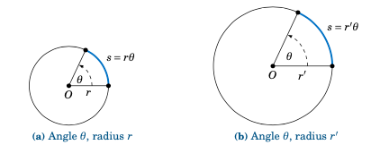

.. _c4:

Chapter 4 Radian Measure
============================

Radians and Degrees
---------------------

So far we have been using degrees as our unit of measurement for angles. However, there is another way of measuring angles that is often more convenient. The idea is simple: associate a central angle of a circle with the arc that it intercepts.

Consider a circle of radius $r>0$, as in Figure :ref:`4.1.1 <fig:radians>`. In geometry you learned that the circumference $C$ of the circle is :math:`C = 2\;\pi\;r`, where :math:`\pi = 3.14159265...`.

.. _fig:radians:

.. _Figure 4.1.1:

    **Figure 4.1.1 Angle** :math:`\theta` **and intercepted arc** :math:`\stackrel\frown{AB}` **on circle of circumference** :math:`C=2\pi r`

In Figure :ref:`4.1.1 <fig:radians>` we see that a central angle of :math:`90^\circ` cuts off an arc of length :math:`\tfrac{\pi}{2}\,r`, a central angle of :math:`180^\circ` cuts off an arc of length :math:`\pi\,r`, and a central angle of :math:`360^\circ` cuts off an arc of length :math:`2\pi\,r`, which is the same as the circumference of the circle. So associating the central angle with its intercepted arc, we could say, for example, that

.. math::

    360^\circ \quad\text{"equals"}\quad 2\pi\,r \quad\text{(or 2}\pi\text{ 'radiuses').}

The radius $r$ was arbitrary, but the :math:`2\pi` in front of it stays the same. So instead of using the awkward "radiuses" or "radii", we use the term **radians**:

.. _equation 4.1:

.. math::
    :label: eqn:deg360rad2pi

    \boxed{360^\circ = 2\pi \text{radians}}

The above relation gives us any easy way to convert between degrees and radians:

.. _equation 4.2:

.. math::
    :label: eqn:deg2rad

    \text{Degrees to radians:}\quad
    x~~\text{degrees}\quad=\quad \left( \frac{\pi}{180} \;\cdot\; x \right)
    ~~\text{radians}

.. _equation 4.3:

.. math::
    :label: eqn:rad2deg

    \begin{align}
    \text{Radians to degrees:}&\quad
    x~~\text{radians}\quad&=\quad \left( \frac{180}{\pi} \;\cdot\; x \right)
    ~~\text{degrees}
    \end{align}

Formula :eq:`4.2 <eqn:deg2rad>` follows by dividing both sides of equation :eq:`4.1 <eqn:deg360rad2pi>` by $360$, so that :math:`1^\circ = \frac{2\pi}{360} = \frac{\pi}{180}` radians, then multiplying both sides by $x$. Formula :eq:`4.3 <eqn:rad2deg>` is similarly derived by dividing both sides of equation :eq:`4.1 <eqn:deg360rad2pi>` by :math:`2\pi` then multiplying both sides by $x$.

The statement :math:`\theta = 2\pi` radians is usually abbreviated as :math:`\theta = 2\pi` rad, or just :math:`\theta = 2\pi` when it is clear that we are using radians. When an angle is given as some multiple of :math:`\pi`, you can assume that the units being used are radians.

.. _Example 4.1:

.. admonition:: Example 4.1

    Convert :math:`18^\circ` to radians.

    **Solution:** Using the conversion formula :eq:`4.2 <eqn:deg2rad>` for degrees to radians, we get
    
    .. math::

        18^\circ ~=~ \frac{\pi}{180} \;\cdot\; 18 ~=~ \boxed{\frac{\pi}{10} ~~\text{rad}} ~.

.. _Example 4.2:

.. admonition:: Example 4.2

    Convert :math:`\frac{\pi}{9}` radians to degrees.

    **Solution:** Using the conversion formula :eq:`4.3 <eqn:rad2deg>` for radians to degrees, we get
 
    .. math::
    
        \frac{\pi}{9} ~~\text{rad} ~=~ \frac{180}{\pi} \;\cdot\; \frac{\pi}{9} ~=~ \boxed{20^\circ} ~.

.. _tbl:radians:

.. _Table 4.1:

**Table 4.1 Commonly used angles in radians**

.. list-table::

    * - **Degrees**
      - **Radians**
      - **Degrees**
      - **Radians**
      - **Degrees**
      - **Radians**
      - **Degrees**
      - **Radians**
    * - :math:`0^\circ`
      - :math:`0`
      - :math:`90^\circ`
      - :math:`\dfrac{\pi}{2}`
      - :math:`180^\circ`
      - :math:`\pi`
      - :math:`270^\circ`
      - :math:`\dfrac{3\pi}{2}`
    * - :math:`30^\circ`
      - :math:`\dfrac{\pi}{6}`
      - :math:`120^\circ`
      - :math:`\dfrac{2\pi}{3}`
      - :math:`210^\circ`
      - :math:`\dfrac{7\pi}{6}`
      - :math:`300^\circ`
      - :math:`\dfrac{5\pi}{3}`
    * - :math:`45^\circ`
      - :math:`\dfrac{\pi}{4}`
      - :math:`135^\circ`
      - :math:`\dfrac{3\pi}{4}`
      - :math:`225^\circ`
      - :math:`\dfrac{5\pi}{4}`
      - :math:`315^\circ`
      - :math:`\dfrac{7\pi}{4}`
    * - :math:`60^\circ`
      - :math:`\dfrac{\pi}{3}`
      - :math:`150^\circ`
      - :math:`\dfrac{5\pi}{6}`
      - :math:`240^\circ`
      - :math:`\dfrac{4\pi}{3}`
      - :math:`330^\circ`
      - :math:`\dfrac{11\pi}{6}`

.. _fig:raddefn:

.. _Figure 4.1.2:

    **Figure 4.1.2**

Table :ref:`4.1 <tbl:radians>` shows the conversion between degrees and radians for some common angles. Using the conversion formula :eq:`4.3 <eqn:rad2deg>` for radians to degrees, we see that

.. math::

    1 ~~\text{radian} ~~=~~ \frac{180}{\pi}~~\text{degrees} ~~\approx~~ 57.3^\circ ~.

Formally, a radian is defined as the central angle in a circle of radius $r$ which intercepts an arc of length $r$, as in Figure :ref:`4.1.2 <fig:raddefn>`. This definition does not depend on the choice of $r$ (imagine resizing Figure :ref:`4.1.2 <fig:raddefn>`).

One reason why radians are used is that the scale is smaller than for degrees. One revolution in radians is :math:`2\pi \approx 6.283185307`, which is much smaller than $360$, the number of degrees in one revolution. The smaller scale makes the graphs of trigonometric functions (which we will discuss in :ref:`Chapter 5 <c5>`) have similar scales for the horizontal and vertical axes. Another reason is that often in physical applications the variables being used are in terms of arc length, which makes radians a natural choice.

The default mode in most scientific calculators is to use degrees for entering angles. On many calculators there is a button labeled :math:`\boxed{\text{DRG}}` for switching between degree mode (D), radian mode (R), and *gradian* mode (G). [1]_ On some graphing calculators, such as the the TI-83, there is a :math:`\boxed{\text{MODE}}` button for changing between degrees and radians. Make sure that your calculator is in the correct angle mode *before* entering angles, or your answers will likely be way off. For example,

.. math::

    \begin{align*}
    \sin\;4^\circ ~&=~ \phantom{-}0.0698 ~,\\
    \sin\;(4~\text{rad}) ~&=~ -0.7568 ~,
    \end{align*}

.. [1] A gradian is defined as :math:`\tfrac{1}{400}` of a circle, i.e. there are $400$ gradians in one revolution. Compared to the more common :math:`360^\circ` in one revolution, gradians appear to be easier to work with, since a right angle is $100$ gradians (thus making integer multiples of a right angle easier to remember). Outside of a few specialized areas (e.g. artillery calculations), gradians are nevertheless not widely used today.

so the values are not only off in magnitude, but do not even have the same sign. Using your calculator's :math:`\boxed{\sin^{-1}}`, :math:`\boxed{\cos^{-1}}`, and :math:`\boxed{\tan^{-1}}` buttons in radian mode will of course give you the angle as a decimal, not an expression in terms of :math:`\pi`.

You should also be aware that the math functions in many computer programming languages use
radians, so you would have to write your own angle conversions. [2]_

.. [2] One exception is Matlab (or its free clone Octave), which has functions ``cosd()``, ``sind()``, ``tand()`` that take angles in degrees as parameters, in addition to the usual ``cos()``, ``sin()``, ``tan()`` functions which use radians.

.. _sec4dot1:

Exercises
~~~~~~~~~~~~~~

For Exercises 1-5, convert the given angle to radians.

1. :math:`4^\circ`
2. :math:`15^\circ`
3. :math:`130^\circ`
4. :math:`275^\circ`
5. :math:`-108^\circ`

For Exercises 6-10, convert the given angle to degrees.

6. :math:`4` rad
7. :math:`\dfrac{\pi}{5}` rad
8. :math:`\dfrac{11\pi}{9}` rad
9. :math:`\dfrac{29\pi}{30}` rad
10. :math:`35` rad

.. _exer:cosxeqx:

11. Put your calculator in radian mode and take the cosine of $0$. Whatever the answer is, take its cosine. Then take the cosine of the new answer. Keep repeating this. On most calculators after about $50$-$60$ iterations you should start to see the same answer repeating. What is that number? Try starting with a number different from $0$. Do you get the same answer repeating after roughly the same number of iterations as before? Try the same procedure in degree mode, starting with :math:`0^\circ`. Does the same thing happen? If so, does it take fewer iterations for the answer to start repeating than in radian mode, or more?

Arc Length
--------------

In Section 4.1 we saw that one revolution has a radian measure of :math:`2\pi` rad. Note that :math:`2\pi` is the ratio of the circumference (i.e. total arc length) $C$ of a circle to its radius $r$:

.. math::

    \text{Radian measure of 1 revolution} ~=~ 2\pi ~=~ \frac{2\pi\,r}{r} ~=~
      \frac{C}{r} ~=~ \frac{\text{total arc length}}{\text{radius}}

Clearly, that ratio is independent of $r$. In general, the radian measure of an angle is the ratio of the arc length cut off by the corresponding central angle in a circle to the radius of the circle, independent of the radius.

To see this, recall our formal definition of a radian: the central angle in a circle of radius $r$ which intercepts an arc of length $r$. So suppose that we have a circle of radius $r$ and we place a central angle with radian measure $1$ on top of another central angle with radian measure $1$, as in Figure :ref:`4.2.1 <fig:arclendef>` (a). Clearly, the combined central angle of the two angles has radian measure $1+1=2$, and the combined arc length is $r+r=2r$.

.. _fig:arclendef:

.. _Figure 4.2.1:

.. figure:: ./img/f4.2.1.png 
    :align: center

    **Figure 4.2.1 Radian measure and arc length**

Now suppose that we cut the angle with radian measure $1$ in half, as in Figure :ref:`4.2.1 <fig:arclendef>` (b).

Clearly, this cuts the arc length $r$ in half as well. Thus, we see that

.. math::

    \begin{align*}
    \text{Angle} ~&=~ 1~\text{radian} \quad&\Rightarrow\quad \text{arc length} ~&=~ r ~,\\
    \text{Angle} ~&=~ 2~\text{radians} \quad&\Rightarrow\quad \text{arc length} ~&=~ 2\,r ~,\\
    \text{Angle} ~&=~ \tfrac{1}{2}~\text{radian} \quad&\Rightarrow\quad \text{arc length} ~&=~
      \tfrac{1}{2}\,r ~,\\
    \text{and in general, for any $\theta \ge 0$,}
    \text{Angle} ~&=~ \theta~\text{radians} \quad&\Rightarrow\quad \text{arc length} ~&=~ \theta\,r ~,
    \end{align*}

so that

.. math::

    \theta ~=~ \frac{\text{arc length}}{\text{radius}} ~~.

Intuitively, it is obvious that shrinking or magnifying a circle preserves the measure of a central angle even as the radius changes. The above discussion says more, namely that the ratio of the length $s$ of an intercepted arc to the radius $r$ is preserved, precisely because that ratio is the measure of the central angle in radians (see Figure :ref:`4.2.2 <fig:radianratio>`).

.. _fig:radianratio:

.. _Figure 4.2.2:

    **Figure 4.2.1 Circles with the same central angle, different radii**

We thus get a simple formula for the length of an arc:

In a circle of radius $r$, let $s$ be the length of an arc intercepted by a central angle with radian measure :math:`\theta \ge 0`. Then the arc length $s$ is:

.. _equation 4.4:

.. math::
    :label: eqn:arclen

    s ~=~ r\,\theta

.. _Example 4.3:

.. admonition:: Example 4.3

    In a circle of radius $r=2$ cm, what is the length $s$ of the arc intercepted by a central angle of measure :math:`\theta = 1.2` rad ?

    **Solution:** Using formula :eq:`4.4 <eqn:arclen>`, we get:

    .. math::

        s ~=~ r\,\theta ~=~ (2)\,(1.2) ~=~ \boxed{2.4~\text{cm}}

.. _Example 4.4:

.. admonition:: Example 4.4

    In a circle of radius $r=10$ ft, what is the length $s$ of the arc intercepted by a central angle of measure :math:`\theta = 41^\circ\;`?

    **Solution:** Using formula :eq:`4.4 <eqn:arclen>` blindly with :math:`\theta = 41^\circ`, we would get :math:`\;s = r\,\theta = (10)\,(41) = 410` ft. But this impossible, since a circle of radius $10$ ft has a circumference of only :math:`2\pi\,(10) \approx 62.83` ft! Our error was in using the angle :math:`\theta` measured in *degrees*, not *radians*. So first convert :math:`\theta = 41^\circ` to radians, then use :math:`s=r\,\theta`:

    .. math::

        \theta = 41^\circ ~=~ \frac{\pi}{180} \;\cdot\; 41 ~=~ 0.716~\text{rad}
        \quad\Rightarrow\quad s ~=~ r\,\theta ~=~ (10)\,(0.716) ~=~ \boxed{7.16~\text{ft}}

Note that since the arc length $s$ and radius $r$ are usually given in the same units, radian measure is really unitless, since you can think of the units canceling in the ratio :math:`\frac{s}{r}`, which is just :math:`\theta`. This is another reason why radians are so widely used.

.. _Example 4.5:

.. admonition:: Example 4.5

    A central angle in a circle of radius $5$ m cuts off an arc of length $2$ m. What is the measure of the angle in radians? What is the measure in degrees?

    **Solution:** Letting $r=5$ and $s=2$ in formula :eq:`4.4 <eqn:arclen>`, we get:

    .. math::

        \theta ~=~ \frac{s}{r} ~=~ \frac{2}{5} ~=~ \boxed{0.4~\text{rad}}

    In degrees, the angle is:

    .. math::

        \theta = 0.4~\text{rad} ~=~ \frac{180}{\pi} \;\cdot\; 0.4 ~=~ \boxed{22.92^\circ}

For central angles :math:`\theta > 2\pi` rad, i.e. :math:`\theta > 360^\circ`, it may not be clear what is meant by the intercepted arc, since the angle is larger than one revolution and hence "wraps around" the circle more than once. We will take the approach that such an arc consists of the full circumference plus any additional arc length determined by the angle. In other words, formula :eq:`4.4 <eqn:arclen>` is still valid for angles :math:`\theta > 2\pi` rad.

What about negative angles? In this case using :math:`s=r\,\theta` would mean that the arc length is negative, which violates the usual concept of length. So we will adopt the convention of only using nonnegative central angles when discussing arc length.

.. _Example 4.6:

.. admonition:: Example 4.6

    .. _fig:rope:

    .. _Figure 4.2.3:

    .. figure:: ./img/f4.2.3.png 
        :align: right

        **Fiugre 4.2.3**

    A rope is fastened to a wall in two places $8$ ft apart at the same height. A cylindrical container with a radius of $2$ ft is pushed away from the wall as far as it can go while being held in by the rope, as in Figure :ref:`4.2.3 <fig:rope>` which shows the top view. If the center of the container is $3$ feet away from the point on the wall midway between the ends of the rope, what is the length $L$ of the rope?

    **Solution:** We see that, by symmetry, the total length of the rope is :math:`\;L = 2\;(AB + \stackrel\frown{BC})`.

    Also, notice that :math:`\triangle\,ADE` is a right triangle, so the hypotenuse has length :math:`AE = \sqrt{DE^2 + DA^2} = \sqrt{3^2 + 4^2} = 5` ft,  by the Pythagorean Theorem.

    Now since :math:`\overline{AB}` is tangent to the circular container, we know that :math:`\angle\,ABE` is a right angle. So by the Pythagorean Theorem we have

    .. math::

        AB ~=~ \sqrt{AE^2 - BE^2} ~=~ \sqrt{5^2 - 2^2} ~=~ \sqrt{21} ~\text{ft}.

    By formula :eq:`4.4 <eqn:arclen>` the arc :math:`\stackrel\frown{BC}` has length :math:`BE \cdot \theta`,
    where :math:`\theta = \angle\,BEC` is the supplement of :math:`\angle\,AED + \angle\,AEB`. So since

    .. math::

        \tan\,\angle\,AED ~=~ \frac{4}{3} ~\Rightarrow~ \angle\,AED ~=~ 53.1^\circ \quad\text{and}\quad
        \cos\,\angle\,AEB ~=~ \frac{BE}{AE} ~=~ \frac{2}{5} ~\Rightarrow~ \angle\,AEB ~=~ 66.4^\circ ~,

    we have

    .. math::

        \theta ~=~ \angle\,BEC ~=~ 180^\circ \;-\; (\angle\,AED + \angle\,AEB) ~=~ 180^\circ \;-\;
        (53.1^\circ + 66.4^\circ) ~=~ 60.5^\circ ~.

    Converting to radians, we get $\;\theta = \frac{\pi}{180} \;\cdot\; 60.5 = 1.06$ rad. Thus,

    .. math::

        L ~=~ 2\,(AB \;+\; \cdot \stackrel\frown{BC}) ~=~ 2\,(\sqrt{21} \;+\; BE \cdot \theta) ~=~
        2\,(\sqrt{21} \;+\; (2)\,( 1.06)) ~=~ \boxed{13.4 ~\text{ft}} ~.

.. _Example 4.7:

.. _exmp:pulleys:

.. admonition:: Example 4.7

    The centers of two belt pulleys, with radii of $5$ cm and $8$ cm, respectively, are $15$ cm apart.
    Find the total length $L$ of the belt around the pulleys.

    **Solution:** In Figure :ref:`4.2.4 <fig:pulley>` we see that, by symmetry, :math:`\;L = 2\;(\stackrel\frown{DE} + EF + \stackrel\frown{FG})`.

    .. _Figure 4.2.4:

    .. _fig:pulley:

    .. figure:: ./img/f4.2.4.png 
        :align: center

        **Fiugre 4.2.4 Belt pulleys with radii $5$ cm and** $8$ **cm**

    First, at the center $B$ of the pulley with radius $8$, draw a circle of radius $3$, which is the difference in the radii of the two pulleys. Let $C$ be the point where this circle intersects :math:`\overline{BF}`. Then we know that the tangent line :math:`\overline{AC}` to this smaller circle is perpendicular to the line segment  :math:`\overline{BF}`. Thus, :math:`\angle\,ACB` is a right angle, and so the length of :math:`\overline{AC}` is

    .. math::

        AC ~=~ \sqrt{AB^2 - BC^2} ~=~ \sqrt{15^2 - 3^2} ~=~ \sqrt{216} ~=~ 6\,\sqrt{6}

    by the Pythagorean Theorem. Now since :math:`\overline{AE} \perp \overline{EF}` and :math:`\overline{EF} \perp \overline{CF}` and :math:`\overline{CF} \perp \overline{AC}`, the quadrilateral $AEFC$ must be a rectangle. In particular, $EF = AC$, so :math:`EF = 6\,\sqrt{6}`.

    By formula :ref:`4.4 <eqn:arclen>` we know that :math:`\;\stackrel\frown{DE} = EA \cdot \angle\,DAE\;` and :math:`\;\stackrel\frown{FG} = BF \cdot \angle\,GBF`, where the angles are measured in radians. So thinking of angles in radians (using :math:`\pi$ rad $= 180^\circ`), we see from Figure \ref{fig:pulley} that 

    .. math::

        \angle\,DAE ~=~ \pi \;-\; \angle\,EAC \;-\; \angle\,BAC ~=~ \pi \;-\; \frac{\pi}{2} \;-\;
          \angle\,BAC ~=~ \frac{\pi}{2} \;-\; \angle\,BAC ~,

    where

    .. math::

        \sin\;\angle\,BAC ~=~ \frac{BC}{AB} ~=~ \frac{3}{15} ~=~ 0.2 \quad\Rightarrow\quad
        \angle\,BAC ~=~ 0.201~\text{rad.}

    Thus, :math:`\;\angle\,DAE = \frac{\pi}{2} \,-\, 0.201 = 1.37` rad. So since :math:`\overline{AE}` and :math:`\overline{BF}` are parallel, we have :math:`\;\angle\,ABC = \angle\,DAE = 1.37` rad. Thus, :math:`\;\angle\,GBF = \pi \,-\, \angle\,ABC = \pi \,-\, 1.37 = 1.77` rad. Hence,

    .. math::
          
        L ~=~ 2\;(\stackrel\frown{DE} \;+\; EF \;+\; \stackrel\frown{FG}) ~=~ 2\;(5\;(1.37) \;+\; 6\,\sqrt{6} \;+\;
          8\;(1.77)) ~=~ \boxed{71.41~\text{cm}} ~.

.. _sec4dot2:

Exercises
~~~~~~~~~~~~~~

For Exercises 1-4, find the length of the arc cut off by the given central angle :math:`\theta` in a circle of radius $r$.

1. :math:`\theta=0.8` rad, $r=12$ cm
2. :math:`\theta=171^\circ`, $r=8$ m
3. :math:`\theta=\pi` rad, $r=11$ in

4. A central angle in a circle of radius $2$ cm cuts off an arc of length $4.6$ cm. What is the measure of the angle in radians? What is the measure of the angle in degrees?
5. The centers of two belt pulleys, with radii of $3$ inches and $6$ inches, respectively, are $13$ inches apart. Find the total length $L$ of the belt around the pulleys.

.. _exer:wallpulley1:

6. In Figure :ref:`4.2.5 <fig:exerwallpulley1>` one end of a $4$ ft iron rod is attached to the center of a pulley with radius $0.5$ ft. The other end is attached at a :math:`40^\circ` angle to a wall, at a spot $6$ ft above the lower end of a steel wire supporting a box. The other end of the wire comes out of the wall straight across from the top of the pulley. Find the length $L$ of the wire from the wall to the box.

.. _fig:exerwallpulley1:

.. _Figure 4.2.5:

.. figure:: ./img/f4.2.5.png 
    :align: left 

    **Fiugre 4.2.5** Exercise :ref:`6 <exer:wallpulley1>`

.. _fig:exerwallpulley2:

.. _Figure 4.2.6:

.. figure:: ./img/f4.2.5.png 
    :align: center 

    **Fiugre 4.2.5** Exercise :ref:`7 <exer:wallpulley2>`

.. _exer:wallpulley2:

7. Figure :ref:`4.2.6 <fig:exerwallpulley2>` shows the same setup as in Exercise :ref:`6 <exer:wallpulley1>` but now the wire comes out of the wall $2$ ft above where the
rod is attached. Find the length $L$ of the wire from the wall to the box.

.. _fig:figure8:

.. _Figure 4.2.7:

.. figure:: ./img/f4.2.7.png 
    :align: right

    **Figure 4.2.7**

.. _exer:figure8len:

8. Find the total length $L$ of the figure eight shape in Figure :ref:`4.2.7 <fig:figure8>`.
9. Repeat Exercise :ref:`8 <exer:figure8len>` but with the circle at $A$ having a radius of $3$ instead of $2$. (*Hint: Draw a circle of radius* $5$ *centered at* $A$, *then draw a tangent line to that circle from* $B$.)

10. Suppose that in Figure :ref:`4.2.7 <fig:figure8>` the lines do not criss-cross but instead go straight across, as in a belt pulley system. Find the total length $L$ of the resulting shape.
11. Find the lengths of the two arcs cut off by a chord of length $3$ in a circle of radius $2$.
12. Find the perimeter of a *regular dodecagon* (i.e. a $12$-sided polygon with sides of equal length) inscribed inside a circle of radius :math:`\frac{1}{2}`. Compare it to the circumference of the circle.

Area of a Sector
------------------

.. _Figure 4.3.1

.. _fig:sector:

.. figure:: ./img/f4.3.1.png 
    :align: right

    **Figure 4.3.1**

In geometry you learned that the area of a circle of radius $r$ is :math:`\pi r^2`. We will now learn how to find the area of a **sector** of a circle. A sector is the region bounded by a central angle and its intercepted arc, such as the shaded region in Figure :ref:`4.3.1 <fig:sector>`.

Let :math:`\theta` be a central angle in a circle of radius $r$ and let $A$ be the area of its sector. Similar to arc length, the ratio of $A$ to the area of the entire circle is the same as the ratio of :math:`\theta` to one revolution. In other words, again using radian measure,

.. math::

    \frac{\text{area of sector}}{\text{area of entire circle}} ~=~
    \frac{\text{sector angle}}{\text{one revolution}} \quad\Rightarrow\quad
    \frac{A}{\pi\,r^2} ~=~ \frac{\theta}{2\pi} ~.

Solving for $A$ in the above equation, we get the following formula:

  In a circle of radius $r$, the area $A$ of the sector inside a central angle :math:`\theta` is

  .. _equation 4.5:

  .. math::
      :label: eqn:sectorarea

      A ~=~ \tfrac{1}{2}\,r^2 \;\theta ~,
  
  where :math:`\theta` is measured in radians.

.. _Example 4.8:

.. admonition:: Example 4.8

    Find the area of a sector whose angle is :math:`\frac{\pi}{5}` rad in a circle of radius $4$ cm.

    **Solution:** Using :math:`\theta=\frac{\pi}{5}` and $r=4$ in formula :eq:`4.5 <eqn:sectorarea>`, the area $A$ of the sector is

    .. math::

        A ~=~ \tfrac{1}{2}\,r^2 \;\theta ~= \tfrac{1}{2}\,(4)^2 \;\cdot\;\tfrac{\pi}{5}
          ~=~ \boxed{\tfrac{8\pi}{5}~\text{cm}^2} ~.

.. _Example 4.9:

.. admonition:: Example 4.9

    Find the area of a sector whose angle is :math:`117^\circ` in a circle of radius $3.5$ m.

    **Solution:** As with arc length, we have to make sure that the angle is measured in radians or else the answer will be way off. So converting $\theta=117^\circ$ to radians and using $r=3.5$ in formula :ref:`4.5 <eqn:sectorarea>` for the area $A$ of the sector, we get

    .. math::

        \theta ~=~ 117^\circ ~=~ \frac{\pi}{180} \;\cdot\; 117 ~=~ 2.042~\text{rad}
        \quad\Rightarrow\quad
        A ~=~ \tfrac{1}{2}\,r^2 \;\theta ~= \tfrac{1}{2}\,(3.5)^2 \;(2.042)
          ~=~ \boxed{12.51~\text{m}^2} ~.

For a sector whose angle is :math:`\theta` in a circle of radius $r$, the length of the arc cut off by
that angle is :math:`s=r\,\theta`. Thus, by formula :ref:`4.5 <eqn:sectorarea>` the area $A$ of the sector
can be written as: [3]_

.. [3] In some texts this formula is taken as a result from elementary geometry and then used to prove formula :ref:`4.5 <eqn:sectorarea>`.

.. _equation 4.6:

.. math::
    :label: eqn:sectorarc

    \boxed{ A ~=~ \tfrac{1}{2}\,rs}

Note: The central angle :math:`\theta` that intercepts an arc is sometimes called the angle **subtended** by the arc.

.. _Example 4.10:

.. admonition:: Example 4.10

    Find the area of a sector whose arc is $6$ cm in a circle of radius $9$ cm.

    **Solution:** Using $s=6$ and $r=9$ in formula :ref:`4.6 <eqn:sectorarc>` for the area $A$, we get

    .. math::

        A ~=~ \tfrac{1}{2}\,rs ~=~ ~=~ \tfrac{1}{2}\,(9)\,(6) ~=~ \boxed{27~\text{cm}^2} ~.

    Note that the angle subtended by the arc is :math:`\theta = \frac{s}{r} = \frac{2}{3}` rad.

.. _Example 4.11:

.. _exmp:pulleyarea:

.. admonition:: Example 4.11

    Find the area $K$ inside the belt pulley system from Example :ref:`4.7 <exmp:pulleys>` in Section 4.2.

    **Solution:** Recall that the belt pulleys have radii of $5$ cm and $8$ cm, and their centers are $15$ cm apart. We showed in Example :ref:`4.7 <exmp:pulleys>` that :math:`EF=AC=6\,\sqrt{6}`, :math:`\angle\,DAE=1.37` rad, and :math:`\angle\,GBF=1.77` rad. We see from Figure :ref:`4.3.2 <fig:pulleyarea>` that, by symmetry, the total area $K$ enclosed by the belt is twice the area above the line :math:`\overline{DG}`, that is,

    .. math::

        \begin{align*}
        K ~=~ 2\,( (&\text{Area of sector $DAE$}) ~+~ (\text{Area of rectangle $AEFC$})\\
        &+~ (\text{Area of triangle $\triangle\,ABC$}) ~+~ (\text{Area of sector $GBF$}) )~.
        \end{align*}

    .. _fig:pulleyarea:

    .. _Figure 4.3.2:

    .. figure:: ./img/f4.3.2.png 
        :align: center 

        **Figure 4.3.2 Belt pulleys with radii $5$ cm and** $8$ **cm**

    Since $AEFC$ is a rectangle with sides $5$ and :math:`6\,\sqrt{6}`, its area is :math:`30\,\sqrt{6}`. And since :math:`\triangle\,ABC` is a right triangle whose legs have lengths $3$ and :math:`6\,\sqrt{6}`, its area is :math:`\frac{1}{2}\,(3)\,(6\,\sqrt{6}) = 9\,\sqrt{6}`. Thus, using formula :eq:`4.5 <eqn:sectorarea>` for the areas of sectors $DAE$ and $GBF$, we have

    .. math::

        \begin{align*}
        K ~&=~ 2\,\left( (\text{Area of sector $DAE$}) \;+\; 30\,\sqrt{6} \;+\; 9\,\sqrt{6} \;+\;
          (\text{Area of sector $GBF$}) \right)\\
        &=~ 2\,\left( \tfrac{1}{2}\,(5)^2 \,(1.37) ~+~ 30\,\sqrt{6} ~+~ 9\,\sqrt{6} ~+~
          \tfrac{1}{2}\,(8)^2 \,(1.77) \right)\\
        &=~ \boxed{338.59~\text{cm}^2}~.
        \end{align*}

.. _fig:insector:

.. _Figure 4.3.3:

    **Figure 4.3.3**

So far we have dealt with the area cut off by a central angle. How would you find the area of a region cut off by an inscribed angle, such as the shaded region in Figure :ref:`4.3.3 <fig:insector>` ? In this picture, the center of the circle is inside the inscribed angle, and the lengths $a$ and $b$ of the two chords are given, as is the radius $r$ of the circle. Drawing line segments from the center of the circle to the endpoints of the chords indicates how to solve this problem: add up the areas of the two triangles and the sector formed by the central angle. The areas and angles of the two triangles can be determined (since all three sides are known) using methods from :ref:`Chapter 2 <c2>`. Also, recall (Theorem :ref:`2.4 <thm:centralangle>` in Section 2.5) that a central angle has twice the measure of any inscribed angle which intercepts the same arc. In the exercises you will be asked to solve problems like this (including the cases where the center of the circle is outside or on the inscribed angle).

.. _fig:segment:

.. _Figure 4.3.4:

    **Figure 4.3.4**

Another type of region we can consider is a **segment** of a circle, which is the region between a chord and the arc it cuts off. In Figure :ref:`4.3.4 <fig:segment>` the segment formed by the chord :math:`\overline{AB}` is the shaded region between the arc :math:`\stackrel\frown{AB}` and the triangle :math:`\triangle\,OAB`. By formula :ref:`2.23 <eqn:areacase1a>` in Section 2.4 for the area of a triangle given two sides and their included angle, we know that

.. math::

  \text{area of } \triangle\,OAB ~=~ \tfrac{1}{2}\,(r)\,(r)\,\sin\;\theta ~=~
    \tfrac{1}{2}\,r^2 \,\sin\;\theta ~.

Thus, since the area $K$ of the segment is the area of the sector $AOB$ minus the area of the triangle :math:`\triangle\,OAB`, we have

.. _equation 4.7:

.. math::
    :label: eqn:segment

    \text{area $K$ of segment } AB ~=~ \tfrac{1}{2}\,r^2 \;\theta ~-~ \tfrac{1}{2}\,r^2 \,\sin\;\theta
      ~=~ \boxed{\tfrac{1}{2}\,r^2 \,(\theta - \sin\;\theta)} ~.

Note that as a consequence of formula :ref:`4.7 <eqn:segment>` we must have :math:`\;\theta > \sin\;\theta` for :math:`0 < \theta \le \pi` (measured in radians), since the area of a segment is positive for those angles.

.. _Example 4.12:

.. admonition:: Example 4.12:

    .. _fig:exmpseg:

    .. _Figure 4.3.5:

    .. figure:: ./img/f4.3.5.png
        :align: right

        **Figure 4.3.5**

    Find the area of the segment formed by a chord of length $3$ in a circle of radius $2$.

    **Solution:** Figure :ref:`4.3.5 <fig:exmpseg>` shows the segment formed by a chord of length $3$ in a circle of radius $r=2$. We can use the Law of Cosines to find the subtended central angle :math:`\theta`:

    .. math::

        \cos\;\theta ~=~ \frac{2^2 + 2^2 - 3^2}{2\,(2)\,(2)} ~=~ -0.125 \quad\Rightarrow\quad
          \theta ~=~ 1.696~\text{rad}

    Thus, by formula :eq:`4.7 <eqn:segment>` the area $K$ of the segment is:

    .. math::

        K ~=~ \tfrac{1}{2}\,r^2 \,(\theta - \sin\;\theta) ~=~ \tfrac{1}{2}\,(2)^2 \,
        (1.696 - \sin\;1.696) ~=~ \boxed{1.408}

.. _Example 4.13:

.. admonition:: Example 4.13:

    The centers of two circles are $7$ cm apart, with one circle having a radius of $5$ cm and the other a radius of $4$ cm. Find the area $K$ of their intersection.

    **Solution:** In Figure :ref:`4.3.6 <fig:circintersect>` (a), we see that the intersection of the two circles is the union of the segments formed by the chord :math:`\overline{CD}` in each circle. Thus, once we determine the angles :math:`\angle\,CAD` and :math:`\angle\,CBD` we can calculate the area of each segment and add those areas together to get $K$.

    .. _fig:circintersect:

    .. _Figure 4.3.6:

    .. figure:: ./img/f4.3.6.png
        :align: right

        **Figure 4.3.6**

    By symmetry, we see that :math:`\angle\,BAC = \frac{1}{2}\,\angle\,CAD` and :math:`\angle\,ABC = \frac{1}{2}\,\angle\,CBD`. So let :math:`\alpha = \angle\,BAC$ and $\beta = \angle\,ABC`, as in Figure :ref:`4.3.6 <fig:circintersect>` (b). By the Law of Cosines, we have

    .. math::

        \begin{align}
        \cos\;\alpha ~&=~ \frac{7^2 + 5^2 - 4^2}{2\,(7)\,(5)} ~&=~ 0.8286 \quad&\Rightarrow\quad
        \alpha ~&=~ 0.594~\text{rad} \quad&\Rightarrow\quad \angle\,CAD ~&=~2\,(0.594) = 1.188~\text{rad}\\
        \cos\;\beta ~&=~ \frac{7^2 + 4^2 - 5^2}{2\,(7)\,(4)} ~&=~ 0.7143 \quad&\Rightarrow\quad
        \beta ~&=~ 0.775~\text{rad} \quad&\Rightarrow\quad \angle\,CBD ~&=~ 2\,(0.775) = 1.550~\text{rad}
        \end{align}

    Thus, the area $K$ is

    .. math::

        \begin{align*}
        K ~&=~ (\text{Area of segment $CD$ in circle at $A$}) ~+~
        (\text{Area of segment $CD$ in circle at $B$})\\
        &=~ \tfrac{1}{2}\,(5)^2 \,(1.188 - \sin\;1.188) ~+~ \tfrac{1}{2}\,(4)^2 \,(1.550 - \sin\;1.550)\\
        &=~ \boxed{7.656~\text{cm}^2} ~.
        \end{align*}

.. _sec4dot3:

Exercises
~~~~~~~~~~~~

For Exercises 1-3, find the area of the sector for the given angle :math:`\theta` and radius $r$.

1. :math:`\theta = 2.1` rad, $r = 1.2$ cm
2. :math:`\theta = \frac{3\pi}{7}` rad, $r = 3.5$ ft
3. :math:`\theta = 78^\circ`, $r = 6$ m

4. The centers of two belt pulleys, with radii of $3$ cm and $6$ cm, respectively, are $13$ cm apart. Find the total area $K$ enclosed by the belt.
5. In Exercise 4 suppose that both belt pulleys have the same radius of $6$ cm. Find the total area $K$ enclosed by the belt.
6. Find the area enclosed by the figure eight in Exercise :ref:`8 <exer:figure8len>` from Section 4.2.

For Exercises :ref:`7 <exer:secstart>`-:ref:`9 <exer:secend>`, find the area of the sector for the given radius $r$ and arc length $s$.

.. _exer:secstart:

7. $r = 5$ cm, $s = 2$ cm
8. $r = a$, $s = a$

.. _exer:secend:

9. $r = 1$ cm, :math:`s = \pi` cm

For Exercises :ref:`10 <exer:segstart>`-:ref:`12 <exer:segend>`, find the area of the segment formed by a chord of length $a$ in a circle of radius $r$.

.. _exer:segstart:

10. $a = 4$ cm, $r = 4$ cm
11. $a = 1$ cm, $r = 5$ cm

.. _exer:segend:

12. $a = 2$ cm, $r = 5$ cm

.. _exer:insareain:

13. Find the area of the shaded region in Figure :ref:`4.3.7 <fig:exerinsareain>`.

.. _Figure 4.3.7:

.. _fig:exerinsareain:

.. figure:: ./img/f4.3.7.png 
    :align: left

    **Figure 4.3.7** Exercise :ref:`13 <exer:insareain>`

.. _Figure 4.3.8:

.. _fig:exerinsareaout:

.. figure:: ./img/f4.3.8.png 
    :align: left

    **Figure 4.3.8** Exercise :ref:`14 <exer:insareaout>`

.. _Figure 4.3.9:

.. _fig:exerinsareaon:

    **Figure 4.3.9** Exercise :ref:`15 <exer:insareaon>`

.. _exer:insareaout:

14. Find the area of the shaded region in Figure :ref:`4.3.8 <fig:exerinsareaout>`. (*Hint: Draw two central angles.*)

.. _exer:insareaon:

15. Find the area of the shaded region in Figure :ref:`4.3.9 <fig:exerinsareaon>`.
16. The centers of two circles are $4$ cm apart, with one circle having a radius of $3$ cm and the other a radius of $2$ cm. Find the area of their intersection.

.. _exer:circ421:

17. Three circles with radii of $4$ m, $2$ m, and $1$ m are externally tangent to each other. Find the area of the curved region between the circles, as in Figure :ref:`4.3.10 <fig:exercirc421>`. (*Hint: Connect the centers of the circles.*)

.. _Figure 4.3.10:

.. _fig:exercirc421:

    **Figure 4.3.10** Exercise :ref:`17 <exer:circ421>`

.. _Figure 4.3.11:

.. _fig:exer3circloop:

    **Figure 4.3.11** Exercise :ref:`18 <exer:3circloop>`

.. _exer:3circloop:

18.  Show that the total area enclosed by the loop around the three circles of radius $r$ in Figure :ref:`4.3.11 <fig:exer3circloop>` is :math:`\;(\pi + 6 + \sqrt{3})\,r^2`.
19.  For a fixed central angle :math:`\theta`, how much does the area of its sector increase when the radius of the circle is doubled? How much does the length of its intercepted arc increase?

Circular Motion: Linear and Angular Speed
--------------------------------------------

\piccaption[]{\label{fig:circmotion}}pic[r]{\begin{tikzpicture}[every node/.style={font=\small}]
 \draw [line width=1pt] (40:1.5) arc (40:340:1.5);
 \node [right] at (10:1.5) {distance $s$};
 \draw [dashed] (0,0) -- (-20:1.5) node[black,midway,below] {$r$};
 \draw [dashed] (0,0) -- (40:1.5);
 \draw [-latex,dashed] (-20:0.7) arc (-20:40:0.7);
 \draw [linecolor,-latex,line width=1.5pt] (-20:1.5) arc (-20:39:1.5);
 \fill (0,0) circle (2pt);
 \fill (-20:1.5) circle (2pt);
 \fill (40:1.5) circle (2pt);
 \node at (10:0.5) {:math:`\theta`};
 \node [below right] at (-20:1.5) {time $t=0$};
 \node [above right] at (40:1.5) {time $t>0$};
\end{tikzpicture}}
Radian measure and arc length can be applied to the study of \emph{circular
motion}\index{circular motion}. In physics the \emph{average speed} of an object
is defined as:\index{average speed}
\begin{displaymath}
 \text{average speed} ~=~ \frac{\text{distance traveled}}{\text{time elapsed}}
\end{displaymath}
So suppose that an object moves along a circle of radius $r$, traveling
a distance $s$ over a period of time $t$, as in Figure \ref{fig:circmotion}. Then it makes sense to
define the (average) \textbf{linear speed}\index{linear speed} $\nu$ of the object as:

\begin{center}\statecomment{\begin{equation}
 \nu ~=~ \frac{s}{t}\label{eqn:linspeed}
\end{equation}}\end{center}

Let :math:`\theta` be the angle swept out by the object in that period of time. Then we define the
(average) \textbf{angular speed}\index{angular speed} $\omega$ of the object as:

\begin{center}\statecomment{\begin{equation}
 \omega ~=~ \frac{\theta}{t}\label{eqn:angspeed}
\end{equation}}\end{center}

Angular speed gives the rate at which the central angle swept out by the object changes as the
object moves around the circle, and it is thus measured in radians per unit time. Linear speed is
measured in distance units per unit time (e.g. feet per second). The word linear is used because
straightening out the arc traveled by the object along the circle results in a line of the same
length, so that the usual definition of speed as distance over time can be used. We will usually
omit the word average when discussing linear and angular speed here.\footnote{Many trigonometry
texts assume \emph{uniform} motion, i.e. constant speeds. We do not make that assumption. Also, many
texts use the word \emph{velocity} instead of speed. Technically they are not the same; velocity has
a direction and a magnitude, whereas speed is just a magnitude.}

Since the length $s$ of the arc cut off by a central angle :math:`\theta` in a circle of radius $r$ is
$s=r\,\theta$, we see that
\begin{displaymath}
 \nu ~=~ \frac{s}{t} ~=~ \frac{r\,\theta}{t} ~=~ \frac{\theta}{t} \;\cdot\; r ~,
\end{displaymath}
so that we get the following relation between linear and angular speed:

\begin{center}\statecomment{\begin{equation}
 \nu ~=~ \omega\,r\label{eqn:linang}
\end{equation}}\end{center}
\newpage
\begin{exmp}\label{exmp:linang}
 An object sweeps out a central angle of $\frac{\pi}{3}$ radians in $0.5$ seconds as it moves along
 a circle of radius $3$ m. Find its linear and angular speed over that time period.
 **Solution:} Here we have $t=0.5$ sec, $r=3$ m, and $\theta = \frac{\pi}{3}$ rad.
 So the angular speed $\omega$ is
 \begin{displaymath}
  \omega ~=~ \frac{\theta}{t} ~=~ \frac{\dfrac{\pi}{3}~\text{rad}}{0.5~\text{sec}}
   \quad\Rightarrow\quad \boxed{\omega ~=~ \frac{2\pi}{3}~\text{rad/sec}} ~,
 \end{displaymath}
 and thus the linear speed $\nu$ is
 \begin{displaymath}
  \nu ~=~ \omega\,r ~=~ \left( \frac{2\pi}{3}~\text{rad/sec} \right) \,(3~\text{m})
   \quad\Rightarrow\quad \boxed{\nu ~=~ 2\pi~\text{m/sec}} ~.
 \end{displaymath}
 Note that the units for $\omega$ are rad/sec and the units of $\nu$ are m/sec. Recall that radians
 are actually unitless, which is why in the formula $\nu=\omega\,r$ the radian units disappear.
\end{exmp}
\begin{exmp}
 An object travels a distance of $35$ ft in $2.7$ seconds as it moves along
 a circle of radius $2$ ft. Find its linear and angular speed over that time period.
 **Solution:} Here we have $t=2.7$ sec, $r=2$ ft, and $s=35$ ft. So the linear
 speed $\nu$ is
 \begin{displaymath}
  \nu ~=~ \frac{s}{t} ~=~ \frac{35~\text{feet}}{2.7~\text{sec}} \quad\Rightarrow\quad
   \boxed{\nu ~=~ 12.96~\text{ft/sec}} ~,
 \end{displaymath}
 and thus the angular speed $\omega$ is given by
 \begin{displaymath}
  \nu ~=~ \omega\,r \quad\Rightarrow\quad 12.96~\text{ft/sec} ~=~ \omega\,(2~\text{ft})
   \quad\Rightarrow\quad \boxed{\omega ~=~ 6.48~\text{rad/sec}} ~.
 \end{displaymath} 
\end{exmp}
\begin{exmp}
 An object moves at a constant linear speed of $10$ m/sec around a circle of radius $4$ m. How large
 of a central angle does it sweep out in $3.1$ seconds?
 **Solution:} Here we have $t=3.1$ sec, $\nu=10$ m/sec, and $r=4$ m. Thus, the
 angle :math:`\theta` is given by
 \begin{displaymath}
  s ~=~ r\,\theta \quad\Rightarrow\quad \theta ~=~ \frac{s}{r} ~=~ \frac{\nu\,t}{r} ~=~
   \frac{(10~\text{m/sec})\,(3.1~\text{sec})}{4~\text{m}} ~=~ \boxed{7.75~\text{rad}} ~.
 \end{displaymath}
\end{exmp}
\divider

In many physical applications angular speed is given in \emph{revolutions per minute}, abbreviated
as \emph{rpm}.\index{rpm} To convert from rpm to, say, radians per second, notice that since there
are :math:`2\pi` radians in one revolution and $60$ seconds in one minute, we can convert $N$ rpm to
radians per second by ``canceling the units'' as follows:
\begin{displaymath}
 N~\text{rpm} ~=~ N~\frac{\cancel{\text{rev}}}{\cancel{\text{min}}} \;\cdot\;
  \frac{2\pi~\text{rad}}{1~\cancel{\text{rev}}}
  \;\cdot\; \frac{1~\cancel{\text{min}}}{60~\text{sec}} ~=~ \frac{N \cdot 2\pi}{60}~\text{rad/sec}
\end{displaymath}
This works because all we did was multiply by $1$ twice. Converting to other units for angular
speed works in a similar way. Going in the opposite direction, say, from rad/sec to rpm, gives:
\begin{displaymath}
 N~\text{rad/sec} ~=~ \frac{N \cdot 60}{2\pi}~\text{rpm}
\end{displaymath}
\newpage
\begin{exmp}\label{exmp:gears}
 A gear with an outer radius of $r_1 = 5$ cm moves in the clockwise direction, causing an
 interlocking gear with an outer radius of $r_2 = 4$ cm to move in the counterclockwise direction
 at an angular speed of $\omega_2 = 25$ rpm. What is the angular speed $\omega_1$ of the larger
 gear?\index{gears}

\piccaption[]{\label{fig:gears}}pic[r]{\begin{tikzpicture}[every node/.style={font=\small}]
 \foreach \i in {1,...,10}
  \draw [fill=black,rounded corners=0.25ex,rotate around={18*\i:(0,0)}]
   (-10ex,-0.6ex) -- (10ex,-0.6ex) -- (10ex,0.6ex) -- (-10ex,0.6ex) -- cycle;
 \draw [fill=black] (0,0) circle (8ex);
 \draw [fill=white] (0,0) circle (6ex);
 \foreach \j in {1,...,4}
  \draw [fill=black,rotate around={90*\j:(0,0)}] (-6ex,0.8ex) .. controls (-4ex,0.2ex) ..
  (0ex,0.8ex) -- (0ex,-0.8ex) .. controls (-4ex,-0.2ex) .. (-6ex,-0.8ex) -- (-6ex,0.8ex);
 \draw [fill=black] (0,0) circle (2ex);
 \draw [fill=white] (0,0) circle (0.8ex);
 \draw [-latex] (135:12ex) arc (135:70:12ex);
 \node [above] at (90:12.5ex) {$r_1 = 5$ cm};
 \begin{scope}[scale=0.8,shift={(3.32,-0.9)}]
  \foreach \i in {1,...,8}
   \draw [fill=black,rounded corners=0.25ex,rotate around={22.5*\i:(0,0)}]
   (-10ex,-0.6ex) -- (10ex,-0.6ex) -- (10ex,0.6ex) -- (-10ex,0.6ex) -- cycle;
  \draw [fill=black] (0,0) circle (8ex);
  \draw [fill=white] (0,0) circle (6ex);
  \foreach \j in {1,...,4}
   \draw [fill=black,rotate around={90*\j:(0,0)}] (-6ex,0.8ex) .. controls (-4ex,0.2ex) ..
    (0ex,0.8ex) -- (0ex,-0.8ex) .. controls (-4ex,-0.2ex) .. (-6ex,-0.8ex) -- (-6ex,0.8ex);
  \draw [fill=black] (0,0) circle (2ex);
  \draw [fill=white] (0,0) circle (0.8ex);
  \draw [-latex] (45:12ex) arc (45:110:12ex);
  \node [above] at (90:12.5ex) {$r_2 = 4$ cm};
  \node [above] at (90:15ex) {$\omega_2 = 25$ rpm};
 \end{scope}
\end{tikzpicture}}
 **Solution:} Imagine a particle on the outer radius of each gear. After the gears
 have rotated for a period of time $t>0$, the circular displacement of each particle will be the
 same. In other words, $s_1 = s_2$, where $s_1$ and $s_2$ are the distances traveled by the particles
 on the gears with radii $r_1$ and $r_2$, respectively.

 But $s_1 = \nu_1 \,t$ and $s_2 = \nu_2 \,t$, where $\nu_1$ and $\nu_2$ are the linear speeds of the
 gears with radii $r_1$ and $r_2$, respectively. Thus,
 \begin{displaymath}
  \nu_1 \,t = \nu_2 \,t \quad\Rightarrow\quad \nu_1 = \nu_2 ~, 
 \end{displaymath}
 so by formula (\ref{eqn:linang}) we get the fundamental relation between the two gears:
 \begin{equation}
  \boxed{\omega_1 \,r_1 ~=~ \omega_2 \,r_2}\label{eqn:gears}
 \end{equation}
 Note that this holds for any two gears. So in our case, we have
 \begin{displaymath}
  \omega_1 \,(5) ~=~ (25) \,(4) \quad\Rightarrow\quad \boxed{\omega_1 ~=~ 20~\text{rpm}} ~.
 \end{displaymath}
\end{exmp}
\divider
\vspace{2mm}

.. _sec4dot4:

Exercises
~~~~~~~~~~~

For Exercises 1-6, assume that a particle moves along a circle of radius $r$ for a period of time $t$. Given either the arc length $s$ or the central angle :math:`\theta` swept out by the particle, find the linear and angular speed of the particle.

1. $r=4$ m, $t=2$ sec, :math:`\theta=3` rad
2. $r=8$ m, $t=2$ sec, :math:`\theta=3` rad
3. $r=7$ m, $t=3.2$ sec, :math:`\theta=172^\circ`
4. $r=1$ m, $t=1.6$ sec, $s=3$ m
5. $r=2$ m, $t=1.6$ sec, $s=6$ m
6. $r=1.5$ ft, $t=0.3$ sec, $s=4$ in

7. An object moves at a constant linear speed of $6$ m/sec around a circle of radius $3.2$ m.

   How large of a central angle does it sweep out in $1.8$ seconds?

8. Two interlocking gears have outer radii of $6$ cm and $9$ cm, respectively. If the smaller gear rotates at $40$ rpm, how fast does the larger gear rotate?
9. Three interlocking gears have outer radii of $2$ cm, $3$ cm, and $4$ cm, respectively. If the largest gear rotates at $16$ rpm, how fast do the other gears rotate?
10. In Example :ref:`4.7 <exmp:gears>`, does equation :eq:`4.11 <eqn:gears>` still hold if the radii $r_1$ and $r_2$ are replaced by the number of teeth  $N_1$ and $N_2$, respectively, of the two gears as shown in Figure :ref:`4.4.2 <fig:gears>`?
11. A $78$ rpm music record has a diameter of $10$ inches. What is the linear speed of a speck of dust on the outer edge of the record in inches per second?
12. The *centripetal acceleration* :math:`\alpha` of an object moving along a circle of radius $r$ with a linear speed :math:`\nu` is defined as :math:`\;\alpha = \frac{\nu^2}{r}`. Show that :math:`\;\alpha = \omega^2 \,r`, where :math:`\omega` is the angular speed.

