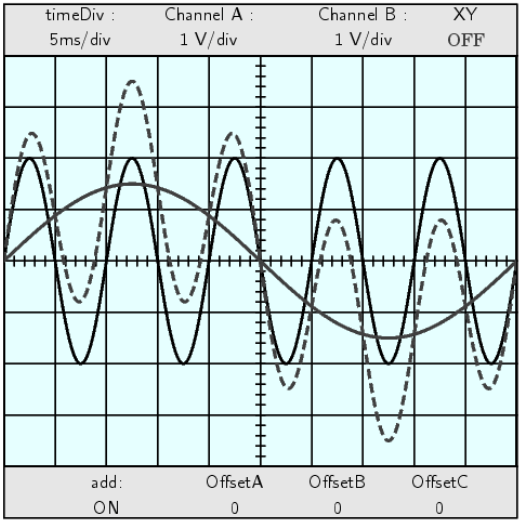

.. python地理空间开发 documentation master file, created by
   sphinx-quickstart on Sat Mar 22 17:52:46 2025.
   You can adapt this file completely to your liking, but it should at least
   contain the root `toctree` directive.

三角学(TRIGONOMETRY)
=================================================

|

.. toctree::
   :maxdepth: 2
   :caption: 内容

   ./about_author
   ./preface

   ./c1
   ./c2
   ./c3
   ./c4
   ./c5
   ./c6